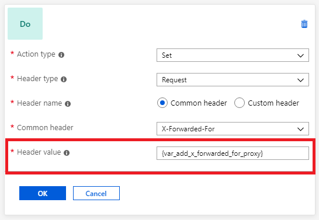
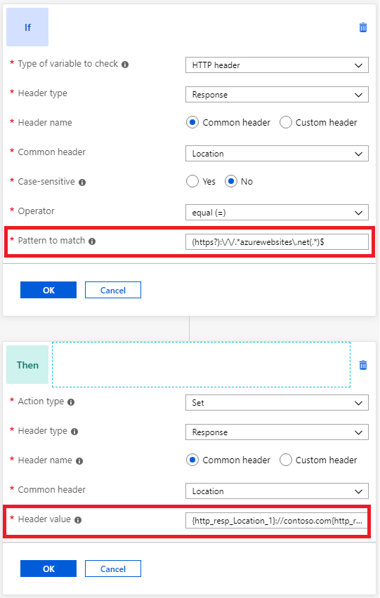
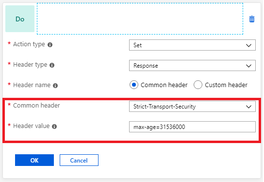
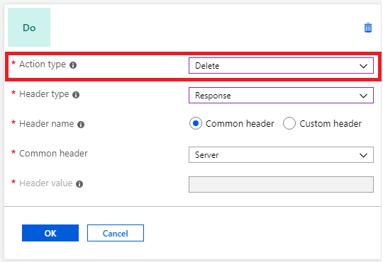
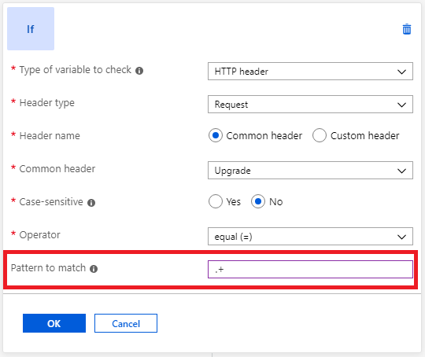

# Rewrite HTTP headers with Application Gateway

[!INCLUDE [updated-for-az](../../includes/updated-for-az.md)]

HTTP headers allow a client and server to pass additional information with a request or response. By rewriting these headers, you can accomplish important tasks, such as adding security-related header fields like HSTS/ X-XSS-Protection, removing response header fields that might reveal sensitive information, and removing port information from X-Forwarded-For headers.

Application Gateway allows you to add, remove, or update HTTP request and response headers while the request and response packets move between the client and back-end pools. And it allows you to add conditions to ensure that the specified headers are rewritten only when certain conditions are met.

Application Gateway also supports several [server variables](https://docs.microsoft.com/azure/application-gateway/rewrite-http-headers#server-variables) that help you store additional information about requests and responses. This makes it easier for you to create powerful rewrite rules.

> [!NOTE]
>
> The HTTP header rewrite support is only available for the [Standard_V2 and WAF_v2 SKU](application-gateway-autoscaling-zone-redundant.md).

## Supported headers

You can rewrite all headers in requests and responses, except for the Host, Connection, and Upgrade headers. You can also use the application gateway to create custom headers and add them to the requests and responses being routed through it.

## Rewrite conditions

You can use rewrite conditions to evaluate the content of HTTP(S) requests and responses and perform a header rewrite only when one or more conditions are met. The application gateway uses these types of variables to evaluate the content of HTTP(S) requests and responses:

- HTTP headers in the request.
- HTTP headers in the response.
- Application Gateway server variables.

You can use a condition to evaluate whether a specified variable is present, whether a specified variable matches a specific value, or whether a specified variable matches a specific pattern. You use the [Perl Compatible Regular Expressions (PCRE) library](https://www.pcre.org/) to set up regular expression pattern matching in the conditions. To learn about regular expression syntax, see the [Perl regular expressions main page](https://perldoc.perl.org/perlre.html).

## Rewrite actions

You use rewrite actions to specify the request and response headers that you want to rewrite and the new value for the headers. You can either create a new header, modify the value of an existing header, or delete an existing header. The value of a new header or an existing header can be set to these types of values:

- Text.
- Request header. To specify a request header, you need to use the syntax {http_req_*headerName*}.
- Response header. To specify a response header, you need to use the syntax {http_resp_*headerName*}.
- Server variable. To specify a server variable, you need to use the syntax {var_*serverVariable*}.
- A combination of text, a request header, a response header, and a server variable.

## Server variables

Application Gateway uses server variables to store useful information about the server, the connection with the client, and the current request on the connection. Examples of information stored include the client’s IP address and the web browser type. Server variables change dynamically, for example, when a new page loads or when a form is posted. You can use these variables to evaluate rewrite conditions and rewrite headers.

Application gateway supports these server variables:

| Variable name | Description                                                  |
| -------------------------- | :----------------------------------------------------------- |
| add_x_forwarded_for_proxy  | The X-Forwarded-For client request header field with the `client_ip` variable (see explanation later in this table) appended to it in the format IP1, IP2, IP3, and so on. If the X-Forwarded-For field isn't in the client request header, the `add_x_forwarded_for_proxy` variable is equal to the `$client_ip` variable. This variable is particularly useful when you want to rewrite the X-Forwarded-For header set by Application Gateway so that the header contains only the IP address without the port information. |
| ciphers_supported          | A list of the ciphers supported by the client.          |
| ciphers_used               | The string of ciphers used for an established SSL connection. |
| client_ip                  | The IP address of the client from which the application gateway received the request. If there's a reverse proxy before the application gateway and the originating client, *client_ip* will return the IP address of the reverse proxy. |
| client_port                | The client port.                                                  |
| client_tcp_rtt             | Information about the client TCP connection. Available on systems that support the TCP_INFO socket option. |
| client_user                | When HTTP authentication is used, the user name supplied for authentication. |
| host                       | In this order of precedence: the host name from the request line, the host name from the Host request header field, or the server name matching a request. |
| cookie_*name*              | The *name* cookie.                                            |
| http_method                | The method used to make the URL request. For example, GET or POST. |
| http_status                | The session status. For example, 200, 400, or 403.                       |
| http_version               | The request protocol. Usually HTTP/1.0, HTTP/1.1, or HTTP/2.0. |
| query_string               | The list of variable/value pairs that follows the "?" in the requested URL. |
| received_bytes             | The length of the request (including the request line, header, and request body). |
| request_query              | The arguments in the request line.                                |
| request_scheme             | The request scheme: http or https.                            |
| request_uri                | The full original request URI (with arguments).                   |
| sent_bytes                 | The number of bytes sent to a client.                             |
| server_port                | The port of the server that accepted a request.                 |
| ssl_connection_protocol    | The protocol of an established SSL connection.        |
| ssl_enabled                | “On” if the connection operates in SSL mode. Otherwise, an empty string. |

## Rewrite configuration

To configure HTTP header rewrite, you need to complete these steps.

1. Create the objects that are required for HTTP header rewrite:

   - **Rewrite action**: Used to specify the request and request header fields that you want to rewrite and the new value for the headers. You can associate one or more rewrite conditions with a rewrite action.

   - **Rewrite condition**: An optional configuration. Rewrite conditions evaluate the content of the HTTP(S) requests and responses. The rewrite action will occur if the HTTP(S) request or response matches the rewrite condition.

     If you associate more than one condition with an action, the action occurs only when all the conditions are met. In other words, the operation is a logical AND operation.

   - **Rewrite rule**: Contains multiple rewrite action / rewrite condition combinations.

   - **Rule sequence**: Helps determine the order in which the rewrite rules execute. This configuration is helpful when you have multiple rewrite rules in a rewrite set. A rewrite rule that has a lower rule sequence value runs first. If you assign the same rule sequence to two rewrite rules, the order of execution is non-deterministic.

   - **Rewrite set**: Contains multiple rewrite rules that will be associated with a request routing rule.

2. Attach the rewrite set (*rewriteRuleSet*) to a routing rule. The rewrite configuration is attached to the source listener via the routing rule. When you use a basic routing rule, the header rewrite configuration is associated with a source listener and is a global header rewrite. When you use a path-based routing rule, the header rewrite configuration is defined on the URL path map. In that case, it applies only to the specific path area of a site.

You can create multiple HTTP header rewrite sets and apply each rewrite set to multiple listeners. But you can apply only one rewrite set to a specific listener.

## Common scenarios

Here are some common scenarios for using header rewrite.

### Remove port information from the X-Forwarded-For header

Application Gateway inserts an X-Forwarded-For header into all requests before it forwards the requests to the backend. This header is a comma-separated list of IP ports. There might be scenarios in which the back-end servers only need the headers to contain IP addresses. You can use header rewrite to remove the port information from the X-Forwarded-For header. One way to do this is to set the header to the add_x_forwarded_for_proxy server variable:

### Modify a redirection URL

When a back-end application sends a redirection response, you might want to redirect the client to a different URL than the one specified by the back-end application. For example, you might want to do this when an app service is hosted behind an application gateway and requires the client to do a redirection to its relative path. (For example, a redirect from contoso.azurewebsites.net/path1 to contoso.azurewebsites.net/path2.)

Because App Service is a multitenant service, it uses the host header in the request to route the request to the correct endpoint. App services have a default domain name of *.azurewebsites.net (say contoso.azurewebsites.net) that's different from the application gateway's domain name (say contoso.com). Because the original request from the client has the application gateway's domain name (contoso.com) as the hostname, the application gateway changes the hostname to contoso.azurewebsites.net. It makes this change so that the app service can route the request to the correct endpoint.

When the app service sends a redirection response, it uses the same hostname in the location header of its response as the one in the request it receives from the application gateway. So the client will make the request directly to contoso.azurewebsites.net/path2 instead of going through the application gateway (contoso.com/path2). Bypassing the application gateway isn't desirable.

You can resolve this issue by setting the hostname in the location header to the application gateway's domain name.

Here are the steps for replacing the hostname:

1. Create a rewrite rule with a condition that evaluates if the location header in the response contains azurewebsites.net. Enter the pattern `(https?):\/\/.*azurewebsites\.net(.*)$`.
1. Perform an action to rewrite the location header so that it has the application gateway's hostname. Do this by entering `{http_resp_Location_1}://contoso.com{http_resp_Location_2}` as the header value.

### Implement security HTTP headers to prevent vulnerabilities

You can fix several security vulnerabilities by implementing necessary headers in the application response. These security headers include X-XSS-Protection, Strict-Transport-Security, and Content-Security-Policy. You can use Application Gateway to set these headers for all responses.

### Delete unwanted headers

You might want to remove headers that reveal sensitive information from an HTTP response. For example, you might want to remove information like the back-end server name, operating system, or library details. You can use the application gateway to remove these headers:

### Check for the presence of a header

You can evaluate an HTTP request or response header for the presence of a header or server variable. This evaluation is useful when you want to perform a header rewrite only when a certain header is present.

## Limitations

- If a response has more than one headers with the same name, then rewriting the value of one of those headers will result in dropping the other headers in the response. This can usually happen with Set-Cookie header since you can have more than one Set-Cookie header in a response. One such scenario is when you are using an app service with an application gateway and have configured cookie-based session affinity on the application gateway. In this case the response will contain 2 Set-Cookie headers: one used by the app service, i.e., `Set-Cookie: ARRAffinity=ba127f1caf6ac822b2347cc18bba0364d699ca1ad44d20e0ec01ea80cda2a735;Path=/;HttpOnly;Domain=sitename.azurewebsites.net` and another for application gateway affinity, i.e., `Set-Cookie: ApplicationGatewayAffinity=c1a2bd51lfd396387f96bl9cc3d2c516; Path=/`. Rewriting one of the Set-Cookie headers in this scenario can result in removing the other Set-Cookie header from the response.

- Rewriting the Connection, Upgrade, and Host headers isn't currently supported.

- Header names can contain any alphanumeric characters and specific symbols as defined in [RFC 7230](https://tools.ietf.org/html/rfc7230#page-27). We don't currently support the underscore (\_) special character in Header names.

## Next steps

To learn how to rewrite HTTP headers, see:

- [Rewrite HTTP headers using Azure portal](https://docs.microsoft.com/azure/application-gateway/rewrite-http-headers-portal)
- [Rewrite HTTP headers using Azure PowerShell](add-http-header-rewrite-rule-powershell.md)
