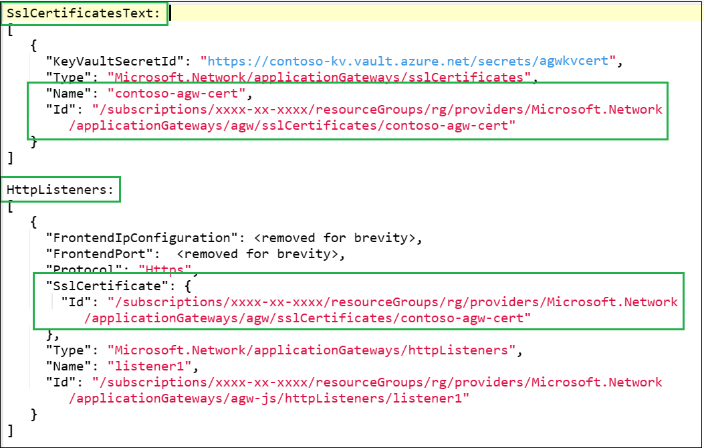
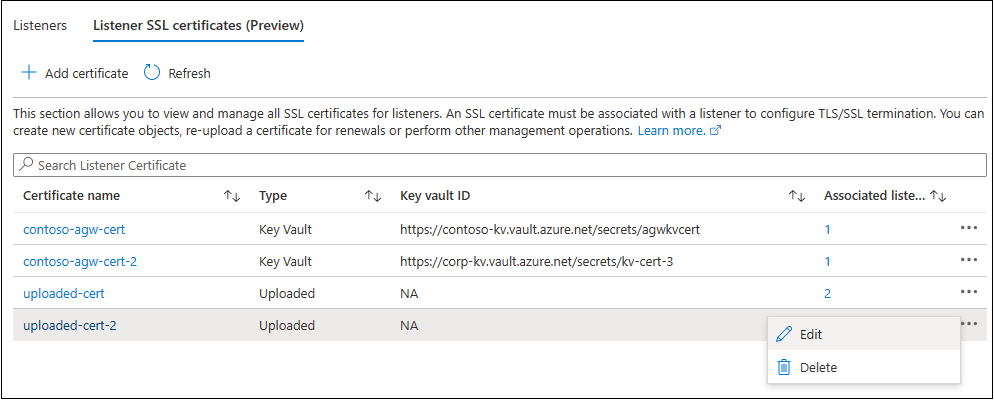

# TLS certificates management for listeners

Listener TLS/SSL certificates in Application Gateway are used for terminating client TLS connection at the gateway. This function is analogous to uploading a certificate on a web server to support TLS/HTTPS connections from clients/browsers. 

## TLS Certificate structure 

The TLS/SSL certificates on application gateway are stored in local certificate objects or containers. This certificate container’s reference is then supplied to listeners to support TLS connections for clients. Refer to this illustration for better understanding.  

Here is a sample application gateway configuration. The SSLCertificates property includes certificate object “contoso-agw-cert" linked to a key vault. The “listener1” references that certificate object.

## Understanding the portal section (Preview)

> [!IMPORTANT]
> The **TLS certificate for Listeners** (TLS termination/End-to-end TLS) is a **Generally available** feature. Only its Portal management experience ([released in March 2023](https://azure.microsoft.com/updates/public-preview-listener-tls-certificates-management-available-in-the-azure-portal/)) is referred to as Preview.

### Listener SSL certificates 

This section allows you to list all the SSL certificate objects that are present on your application gateway. This view is equivalent of running PowerShell command `Get-AzApplicationGatewaySslCertificate -ApplicationGateway $AppGW` or CLI command `az network application-gateway ssl-cert list --gateway-name --resource-group`. 

This page gives you a quick summary of all the certificates, their types and association with listeners. 

#### SSL Certificate types 

1. **Key Vault**: You can store your PFX certificate(s) in Azure Key Vault, which is a managed certificate storage service allowing tight access controls and much more. Learn about [integration with Key Vault](key-vault-certs.md#how-integration-works).

1. **Uploaded**: Provide a PFX certificate directly to your application gateway. Requires certificate password as well. 

### Modifying an SSL certificate 

From the list view, you can select the certificate name or three-dot menu option to navigate to the Edit page. The edit option is helpful for the following use cases. 

* Changing the key vault association of a certificate – You can change a certificate’s reference from one key vault resource to another. When doing so, ensure the User-Assigned Managed Identity of your application gateway has sufficient access controls on the new key vault.  

* Renewal of an uploaded certificate – When an existing uploaded certificate is due for renewal, you can upload a new PFX file to the existing certificate object of your application gateway. 

* Changing the certificate type from "key vault" to "uploaded" (or vice-versa) – You can easily transition your certificate provision from the one stored on your Application Gateway to the purpose-built Key Vault service.

> [!NOTE]
> A change in certificate associated with multiple listeners would reflect on all the listeners. You can view the individual listener information to identify the related listeners.
  
### Deletion of an SSL certificate 

There are two primary scenarios when deleting a certificate from portal: 

1. SSL certificate without any listener association – Such certificates aren't in use by any listener and can be deleted directly.
1. SSL certificate with an associated listener – Based on your application gateway’s configuration, these sub resources could be affected.

| Sub resource | Impact |
| ---------- | ---------- |
| Certificate | The certificate itself gets deleted. |
| Listener | The listener gets deleted if a certificate is associated with it. |
| Rule | If a rule is associated with a listener, the listener and the rule are deleted. | 
| Redirection | If a redirection is configured with a rule, the associated redirection is also removed. | 
| Port | The port associated with the listener gets updated to reflect the new state. | 
| Frontend IP | The frontend IP of the gateway gets updated to reflect the new state. | 

### Bulk update
The bulk operation feature is helpful for large gateways having multiple SSL certificates for separate listeners. Similar to individual certificate management, this option also allows you to change the type from "Uploaded" to "Key Vault" or vice-versa (if required). This utility is also helpful in recovering a gateway when facing misconfigurations for multiple certificate objects simultaneously.

To use the Bulk update option,
1. Choose the certificates to be updated using the checkboxes and select the "Bulk update" menu option.

1. On the next page, you can modify the settings for each certificate as needed. Based on your selection in Step 1, you will see different options for Step 2 and Step 3. Thus, it would be best to go step by step for each certificate row. The certificates you see here will be as per your selection. You may use the three-dot menu option to remove a wrongly selected certificate from the list.

1. Once all the settings are updated, select Save.

> [!NOTE]
> Be aware of the listeners associated with each certificate when making a bulk change. Depending on your configuration, this single operation could update multiple certificates and many more listeners. Refer to the individual certificate information blade to identify the related listeners.

#### Caveats

1. You can't delete a certificate object if its associated listener is a redirection target for another listener. Any attempt to do so will return the following error. You can either remove the redirection or delete the dependent listener first to resolve this problem. 
`The listener associated with this certificate is configured as the redirection target for another listener. You will need to either remove this redirection or delete the redirected listener first to allow deletion of this certificate.`

1. The Application Gateway requires at least one active Listener and Rule combination. You thus cannot delete the certificate of a HTTPS listener, if no other active listener exists. This is also true if there are only HTTPS listeners on your gateway, and all of them are referencing the same certificate. Such operations are prevented because deletion of a certificate leads to deletion of all dependent sub resources. 

## Next steps
Read about
- [Using Key Vault with Application Gateway](../application-gateway/key-vault-certs.md)
