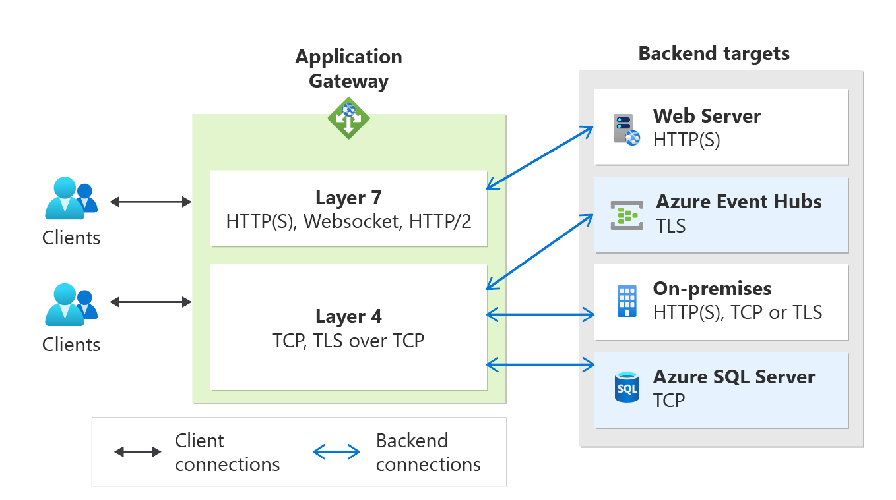

# Application Gateway TCP/TLS proxy overview (Preview)

In addition to the existing Layer 7 capabilities (HTTP, HTTPS, WebSockets and HTTP/2), Azure Application Gateway now also supports Layer 4 (TCP protocol) and TLS (Transport Layer Security) proxying.  This feature is currently in public preview. To preview this feature, see [Register to the preview](how-to-tcp-tls-proxy.md#register-to-the-preview).

## TLS/TCP proxy capabilities on Application Gateway

As a reverse proxy service, the Layer 4 operations of Application Gateway work similar to its Layer 7 proxy operations. A client establishes a TCP connection with Application Gateway, and Application Gateway itself initiates a new TCP connection to a backend server from the backend pool. The following figure shows typical operation.

 

Process flow:

1. A client initiates a TCP or TLS connection with the application gateway using its frontend listener's IP address and port number. This establishes the frontend connection. Once the connection is established, the client sends a request using the required application layer protocol. 
2. The application gateway establishes a new connection with one of the backend targets from the associated backend pool (forming the backend connection) and sends the client request to that backend server. 
3. The response from the backend server is sent back to the client by the application gateway. 
4. The same frontend TCP connection is used for subsequent requests from the client unless the TCP idle timeout closes that connection.

### Comparing Azure Load Balancer with Azure Application Gateway:
| Product | Type |
| ---------- | ---------- |
| [**Azure Load Balancer**](../load-balancer/load-balancer-overview.md) | A pass-through load balancer where a client directly establishes a connection with a backend server selected by the Load Balancer's distribution algorithm. |
| **Azure Application Gateway** | Terminating load balancer where a client directly establishes a connection with Application Gateway and a separate connection is initiated with a backend server selected by Application Gateway's distribution algorithm. |

## Features

- Use a single endpoint (frontend IP) to serve HTTP and non-HTTP workloads. The same application gateway deployment can support Layer 7 and Layer 4 protocols: HTTP(S), TCP, or TLS. All your clients can connect to the same endpoint and access different backend applications.
- Use a custom domain to front any backend service. With the frontend for the Application Gateway V2 SKU as public and private IP addresses, you can configure any custom domain name to point its IP address using an address (A) record. Additionally, with TLS termination and support for certificates from a private certification authority (CA), you can ensure a secure connection on the domain of your choice. 
- Use a backend server from any location (Azure or On-premises). The backends for the application gateway can be: 
    - Azure resources such as IaaS virtual machines, virtual machine scale sets, or PaaS (App Services, Event Hubs, SQL)
    - Remote resources such as on-premises servers accessible via FQDN or IP addresses 
- Supported for a private-only gateway. With TLS and TCP proxy support for private Application Gateway deployments, you can support HTTP and non-HTTP clients in an isolated environment for enhanced security.

## Limitations

- A WAF v2 SKU gateway allows the creation of TLS or TCP listeners and backends to support HTTP and non-HTTP traffic through the same resource. However, it does not inspect traffic on TLS and TCP listeners for exploits and vulnerabilities. 
- The default [draining timeout](configuration-http-settings.md#connection-draining) value for backend servers is 30 seconds. At present, a user-defined draining value is not supported.
- Client IP preservation is currently not supported.

## Next steps

- [Configure Azure Application Gateway TCP/TLS proxy](how-to-tcp-tls-proxy.md)
- Visit [frequently asked questions (FAQs)](application-gateway-faq.yml#configuration---tls-tcp-proxy)
