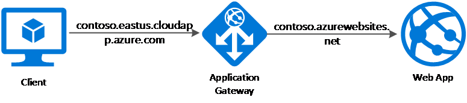

# Troubleshoot App Service issues in Application Gateway

Learn how to diagnose and resolve issues you might encounter when Azure App Service is used as a back-end target with Azure Application Gateway.

## Overview

In this article, you'll learn how to troubleshoot the following issues:

* The app service URL is exposed in the browser when there's a redirection.
* The app service ARRAffinity cookie domain is set to the app service host name, example.azurewebsites.net, instead of the original host.

When a back-end application sends a redirection response, you might want to redirect the client to a different URL than the one specified by the back-end application. You might want to do this when an app service is hosted behind an application gateway and requires the client to do a redirection to its relative path. An example is a redirect from contoso.azurewebsites.net/path1 to contoso.azurewebsites.net/path2. 

When the app service sends a redirection response, it uses the same host name in the location header of its response as the one in the request it receives from the application gateway. For example, the client makes the request directly to contoso.azurewebsites.net/path2 instead of going through the application gateway contoso.com/path2. You don't want to bypass the application gateway.

This issue might happen for the following main reasons:

- You have redirection configured on your app service. Redirection can be as simple as adding a trailing slash to the request.
- You have Azure Active Directory authentication, which causes the redirection.

Also, when you use app services behind an application gateway, the domain name associated with the application gateway (example.com) is different from the domain name of the app service (say, example.azurewebsites.net). The domain value for the ARRAffinity cookie set by the app service carries the example.azurewebsites.net domain name, which isn't desirable. The original host name, example.com, should be the domain name value in the cookie.

## Sample configuration

- HTTP listener: Basic or multi-site
- Back-end address pool: App Service
- HTTP settings: **Pick Hostname from Backend Address** enabled
- Probe: **Pick Hostname from HTTP Settings** enabled

## Cause

App Service is a multitenant service, so it uses the host header in the request to route the request to the correct endpoint. The default domain name of App Services, *.azurewebsites.net (say, contoso.azurewebsites.net), is different from the application gateway's domain name (say, contoso.com). 

The original request from the client has the application gateway's domain name, contoso.com, as the host name. You need to configure the application gateway to change the host name in the original request to the app service's host name when it routes the request to the app service back end. Use the switch **Pick Hostname from Backend Address** in the application gateway's HTTP setting configuration. Use the switch **Pick Hostname from Backend HTTP Settings** in the health probe configuration.




When the app service does a redirection, it uses the overridden host name contoso.azurewebsites.net in the location header instead of the original host name contoso.com, unless configured otherwise. Check the following example request and response headers.
```
## Request headers to Application Gateway:

Request URL: http://www.contoso.com/path

Request Method: GET

Host: www.contoso.com

## Response headers:

Status Code: 301 Moved Permanently

Location: http://contoso.azurewebsites.net/path/

Server: Microsoft-IIS/10.0

Set-Cookie: ARRAffinity=b5b1b14066f35b3e4533a1974cacfbbd969bf1960b6518aa2c2e2619700e4010;Path=/;HttpOnly;Domain=contoso.azurewebsites.net

X-Powered-By: ASP.NET
```
In the previous example, notice that the response header has a status code of 301 for redirection. The location header has the app service's host name instead of the original host name `www.contoso.com`.

## Solution: Rewrite the location header

Set the host name in the location header to the application gateway's domain name. To do this, create a [rewrite rule](./rewrite-http-headers.md) with a condition that evaluates if the location header in the response contains azurewebsites.net. It must also perform an action to rewrite the location header to have the application gateway's host name. For more information, see instructions on [how to rewrite the location header](./rewrite-http-headers.md#modify-a-redirection-url).

> [!NOTE]
> The HTTP header rewrite support is only available for the [Standard_v2 and WAF_v2 SKU](./application-gateway-autoscaling-zone-redundant.md) of Application Gateway. We recommend [migrating to v2](./migrate-v1-v2.md) for Header Rewrite and other [advanced capabilities](./application-gateway-autoscaling-zone-redundant.md#feature-comparison-between-v1-sku-and-v2-sku) that are available with v2 SKU.

## Alternate solution: Use a custom domain name

Using App Service's Custom Domain feature is another solution to always redirect the traffic to Application Gateway's domain name (`www.contoso.com` in our example). This configuration also serves as a solution for the ARR Affinity cookie problem. By default, the ARRAffinity cookie domain is set to the App Service's default host name (example.azurewebsites.net) instead of the Application Gateway's domain name. Therefore, the browser in such cases will reject the cookie due to the difference in the domain names of the request and the cookie.

You can follow the given method for both the Redirection and ARRAffinity's cookie domain mismatch issues. This method will need you to have your custom domain's DNS zone access.

**Step1**: Set a Custom Domain in App Service and verify the domain ownership by adding the [CNAME & TXT DNS records](../app-service/app-service-web-tutorial-custom-domain.md#get-a-domain-verification-id).
The records would look similar to
-  `www.contoso.com` IN CNAME `contoso.azurewebsite.net`
-  `asuid.www.contoso.com` IN TXT "`<verification id string>`"


**Step2**: The CNAME record in the previous step was only needed for the domain verification. Ultimately, we need the traffic to route via Application Gateway. You can thus modify `www.contoso.com`'s CNAME now to point to Application Gateway's FQDN. To set a FQDN for your Application Gateway, navigate to its Public IP address resource and assign a "DNS Name label" for it. The updated CNAME record should now look as 
-  `www.contoso.com` IN CNAME `contoso.eastus.cloudapp.azure.com`


**Step3**: Disable "Pick Hostname from Backend Address" for the associated HTTP Setting.

In PowerShell, don't use the `-PickHostNameFromBackendAddress` switch in the `Set-AzApplicationGatewayBackendHttpSettings` command.


**Step4**: For the probes to determine the backend as healthy and an operational traffic, set a custom Health Probe with Host field as custom or default domain of the App Service.

In PowerShell, don't use the `-PickHostNameFromBackendHttpSettings` switch in the `Set-AzApplicationGatewayProbeConfig` command and use either the custom or default domain of the App Service in the -HostName switch of the probe.

To implement the previous steps using PowerShell for an existing setup, use the sample PowerShell script that follows. Note how we haven't used the **-PickHostname** switches in the probe and HTTP settings configuration.

```azurepowershell-interactive
$gw=Get-AzApplicationGateway -Name AppGw1 -ResourceGroupName AppGwRG
Set-AzApplicationGatewayProbeConfig -ApplicationGateway $gw -Name AppServiceProbe -Protocol Http -HostName "example.azurewebsites.net" -Path "/" -Interval 30 -Timeout 30 -UnhealthyThreshold 3
$probe=Get-AzApplicationGatewayProbeConfig -Name AppServiceProbe -ApplicationGateway $gw
Set-AzApplicationGatewayBackendHttpSettings -Name appgwhttpsettings -ApplicationGateway $gw -Port 80 -Protocol Http -CookieBasedAffinity Disabled -Probe $probe -RequestTimeout 30
Set-AzApplicationGateway -ApplicationGateway $gw
```
  ```
  ## Request headers to Application Gateway:

  Request URL: http://www.contoso.com/path

  Request Method: GET

  Host: www.contoso.com

  ## Response headers:

  Status Code: 301 Moved Permanently

  Location: http://www.contoso.com/path/

  Server: Microsoft-IIS/10.0

  Set-Cookie: ARRAffinity=b5b1b14066f35b3e4533a1974cacfbbd969bf1960b6518aa2c2e2619700e4010;Path=/;HttpOnly;Domain=www.contoso.com

  X-Powered-By: ASP.NET
  ```
  ## Next steps

If the preceding steps didn't resolve the issue, open a [support ticket](https://azure.microsoft.com/support/options/).
