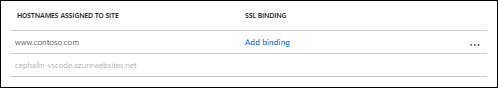

# Troubleshoot Application Gateway with App Service

Learn how to diagnose and resolve issues encountered with Application Gateway and App Service as the backend server.

## Overview

In this article, you will learn how to troubleshoot the following issues:

> [!div class="checklist"]
> * App Service's URL getting exposed in the browser when there is a redirection
> * App Service's ARRAffinity Cookie domain set to App Service hostname (example.azurewebsites.net) instead of original host

When you configure a public facing App Service in the backend pool of Application Gateway and if you have a redirection configured in your Application code, you might see that when you access Application Gateway, you will be redirected by the browser directly to the App Service URL.

This issue may happen due to the following main reasons:

- You have redirection configured on your App Service. Redirection can be as simple as adding a trailing slash to the request.
- You have Azure AD authentication which causes the redirection.
- You have enabled “Pick Host Name from Backend Address” switch in the HTTP settings of Application Gateway.
- You don’t have your custom domain registered with your App Service.

Also, when you are using App Services behind Application Gateway and you are using a custom domain to access Application Gateway, you may see the domain value for the ARRAffinity cookie set by the App Service will carry the "example.azurewebsites.net" domain name. If you want your original hostname to be the cookie domain as well, follow the solution in this article.

## Sample configuration

- HTTP Listener: Basic or Multi-site
- Backend Address Pool: App Service
- HTTP Settings: “Pick Hostname from Backend Address” Enabled
- Probe: “Pick Hostname from HTTP Settings” Enabled

## Cause

An App Service can only be accessed with the configured hostnames in the custom domain settings, by default, it is “example.azurewebsites.net” and if you want to access your App Service using Application Gateway with a hostname not registered in App Service or with Application Gateway’s FQDN, you have to override the hostname in the original request to the App Service’s hostname.

To achieve this with Application Gateway, we use the switch “Pick Hostname from Backend Address” in the HTTP Settings and for the probe to work, we use “Pick Hostname from Backend HTTP Settings” in the probe configuration.


Due to this, when the App Service does a redirection, it uses the hostname “example.azurewebsites.net” in the Location header, instead of the original hostname unless configured otherwise. You can check the example request and response headers below.
```
## Request headers to Application Gateway:

Request URL: http://www.contoso.com/path

Request Method: GET

Host: www.contoso.com

## Response headers:

Status Code: 301 Moved Permanently

Location: http://example.azurewebsites.net/path/

Server: Microsoft-IIS/10.0

Set-Cookie: ARRAffinity=b5b1b14066f35b3e4533a1974cacfbbd969bf1960b6518aa2c2e2619700e4010;Path=/;HttpOnly;Domain=example.azurewebsites.net

X-Powered-By: ASP.NET
```
In the above example, you can notice that the response header has a status code of 301 for redirection and the location header has the App Service’s hostname instead of the original hostname “www.contoso.com”.

## Solution

This issue can be resolved by not having a redirection on the Application side, however, if that’s not possible, we must pass the same host header that Application Gateway receives to the App Service as well instead of doing a host override.

Once we do that, App Service will do the redirection (if any) on the same original host header which points to Application Gateway and not its own.

To achieve this, you must own a custom domain and follow the process mentioned below.

- Register the domain to the custom domain list of the App Service. For this, you must have a CNAME in your custom domain pointing to App Service’s FQDN. For more information, see [Map an existing custom DNS name to Azure App Service](https://docs.microsoft.com//azure/app-service/app-service-web-tutorial-custom-domain).



- Once that is done, your App Service is ready to accept the hostname “www.contoso.com”. Now change your CNAME entry in DNS to point it back to Application Gateway’s FQDN. For example, “appgw.eastus.cloudapp.azure.com”.

- Make sure that your domain “www.contoso.com” resolves to Application Gateway’s FQDN when you do a DNS query.

- Set your custom probe to disable “Pick Hostname from Backend HTTP Settings”. This can be done from the portal by unchecking the checkbox in the probe settings and in PowerShell by not using the -PickHostNameFromBackendHttpSettings switch in the Set-AzApplicationGatewayProbeConfig command. In the hostname field of the probe, enter your App Service's FQDN "example.azurewebsites.net" as the probe requests sent from Application Gateway will carry this in the host header.

  > [!NOTE]
  > While doing the next step, please make sure that your custom probe is not associated to your backend HTTP settings because your HTTP settings still has the "Pick Hostname from Backend Address" switch enabled at this point.

- Set your Application Gateway’s HTTP settings to disable “Pick Hostname from Backend Address”. This can be done from the portal by unchecking the checkbox and in PowerShell by not using the -PickHostNameFromBackendAddress switch in the Set-AzApplicationGatewayBackendHttpSettings command.

- Associate the custom probe back to the backend HTTP settings and verify the backend health if it is healthy.

- Once this is done, Application Gateway should now forward the same hostname “www.contoso.com” to the App Service and the redirection will happen on the same hostname. You can check the example request and response headers below.

To implement the steps mentioned above using PowerShell for an existing setup, follow the sample PowerShell script below. Note how we have not used the -PickHostname switches in the Probe and HTTP Settings configuration.

```azurepowershell-interactive
$gw=Get-AzApplicationGateway -Name AppGw1 -ResourceGroupName AppGwRG
Set-AzApplicationGatewayProbeConfig -ApplicationGateway $gw -Name AppServiceProbe -Protocol Http -HostName "example.azurewebsites.net" -Path "/" -Interval 30 -Timeout 30 -UnhealthyThreshold 3
$probe=Get-AzApplicationGatewayProbeConfig -Name AppServiceProbe -ApplicationGateway $gw
Set-AzApplicationGatewayBackendHttpSettings -Name appgwhttpsettings -ApplicationGateway $gw -Port 80 -Protocol Http -CookieBasedAffinity Disabled -Probe $probe -RequestTimeout 30
Set-AzApplicationGateway -ApplicationGateway $gw
```
  ```
  ## Request headers to Application Gateway:

  Request URL: http://www.contoso.com/path

  Request Method: GET

  Host: www.contoso.com

  ## Response headers:

  Status Code: 301 Moved Permanently

  Location: http://www.contoso.com/path/

  Server: Microsoft-IIS/10.0

  Set-Cookie: ARRAffinity=b5b1b14066f35b3e4533a1974cacfbbd969bf1960b6518aa2c2e2619700e4010;Path=/;HttpOnly;Domain=www.contoso.com

  X-Powered-By: ASP.NET
  ```
  ## Next steps

If the preceding steps do not resolve the issue, open a [support ticket](https://azure.microsoft.com/support/options/).
