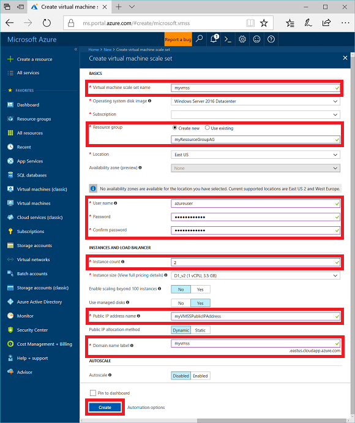
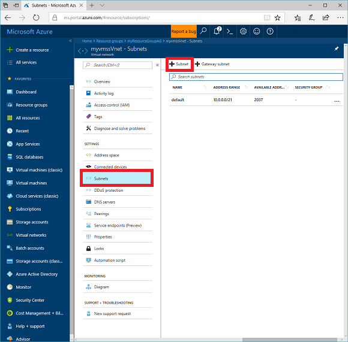
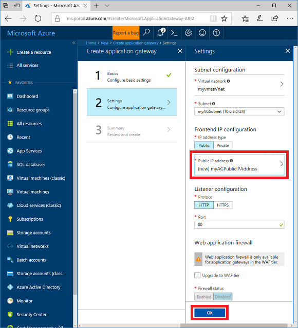
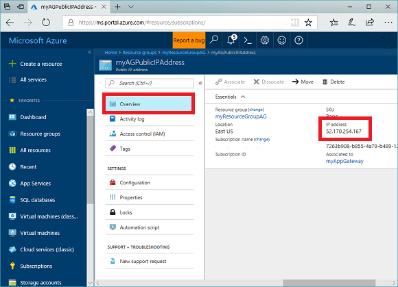

# Create an application gateway and virtual machine scale set using the Azure portal

You can use the Azure portal to create an [application gateway](application-gateway-introduction.md) that uses a [virtual machine scale set](../virtual-machine-scale-sets/virtual-machine-scale-sets-overview.md) for backend servers. In this example, the scale set contains two virtual machine instances that are added to the default backend pool of the application gateway.

In this article, you learn how to

> [!div class="checklist"]
> * Create a virtual machine scale set
> * Create an application gateway
> * Add servers to the default backend pool

If you don't have an Azure subscription, create a [free account](https://azure.microsoft.com/free/?WT.mc_id=A261C142F) before you begin.

## Log in to Azure

Log in to the Azure portal at [http://portal.azure.com](http://portal.azure.com)

## Create a virtual machine scale set

When you create a virtual machine scale set, a virtual network is automatically created for you. In this example, the scale set and the application gateway are in the same virtual network, so you create the scale set first.

1. Click **Create a resource** found on the upper left-hand corner of the Azure portal.
2. Click **Compute** and then select **Virtual machine scale set** in the Featured list.
3. Enter these values for the virtual machine scale set:

    - *myvmss* - for the name of the scale set. The name must be lowercase letters.
    - *myResourceGroupAG* - for the name of new the resource group.
    - *azureuser* - for the user name.
    - *Azure123456!* - for the password.
    - *2* - for the instance count.
    - *myVMSSPublicIPAddress* - for the name of the public IP address associated with the scale set. This resource is required to create the scale set, but is not used in the example.
    - *myvmss* - for the domain name label.

    

4. Accept all other default values and then click **Create**.

### Install IIS

1. Open the interactive shell and make sure that it is set to **PowerShell**.

    

2. Run the following commands to install IIS on the virtual machine instances in the scale set: 

    ```azurepowershell-interactive
    $publicSettings = @{ "fileUris" = (,"https://raw.githubusercontent.com/davidmu1/samplescripts/master/appgatewayurl.ps1"); 
  "commandToExecute" = "powershell -ExecutionPolicy Unrestricted -File appgatewayurl.ps1" }

    $vmss = Get-AzureRmVmss -ResourceGroupName myResourceGroupAG -VMScaleSetName myvmss
    Add-AzureRmVmssExtension -VirtualMachineScaleSet $vmss `
      -Name "customScript" `
      -Publisher "Microsoft.Compute" `
      -Type "CustomScriptExtension" `
      -TypeHandlerVersion 1.8 `
      -Setting $publicSettings

    Update-AzureRmVmss `
      -ResourceGroupName myResourceGroupAG `
      -Name myvmss `
      -VirtualMachineScaleSet $vmss
    ```

3. The previous PowerShell commands only update the model of the scale set. To update the instances, click **All resources**, click **myvmss**, and then click **Instances**.

4. Select all instances and then click **Upgrade**.

    

## Create a subnet

1. Click **All resources** in the left-hand menu, and then click **myvmssVnet** from the resources list.
2. Click **Subnets** and then click **Subnet**.

    

3. Enter *myAGSubnet* for the name of the subnet and then click **OK**.

## Create an application gateway

1. Click **Create a resource**.
2. Click **Networking** and then select **Application Gateway** in the Featured list.
3. Enter these values for the application gateway:

    - *myAppGateway* - for the name of the application gateway.
    - Select **Use existing** and then select *myResourceGroupAG*.

    

4. Accept the default values for the other settings and then click **OK**.
5. Click **Choose a virtual network**, and then click **mymssVnet**.
6. Make sure that the subnet to is set to *myAGSubnet*, click **Choose a public IP address**, and then click **Create new**.
7. Enter the name of the public IP address. In this example, the public IP address is named *myAGPublicIPAddress*. Accept the default values for the other settings and then click **OK**.

    

8. Accept the default values for the Listener configuration, leave the Web application firewall disabled, and then click **OK**.
9. Review the settings on the summary page, and then click **OK** to create the public IP address and application gateway. It may take several minutes for the application gateway to be created, wait until the deployment finishes successfully before moving on to the next section.

## Add servers to the default backend pool

1. Find the IP addresses of the virtual machines in the scale set. Click **All resources**, select **myvmssVnet** in the resources list, and then click **Overview**.
2. Record the IP addresses to use later when you add the scale set instances to the backend pools. In this example, the IP addresses are *10.0.0.4* and *10.0.0.5*.

    

3. Click **All resources** and then click **myAppGateway**.
4. Click **Backend pools**. A default pool was automatically created with the application gateway. Click **appGatewayBackendPool**.
5. Click **Add target** to add the two IP addresses that you recorded to appGatewayBackendPool.

    

6. Click **Save**.

## Test the application gateway

1. Click **All resources**, and then click **myAGPublicIPAddress**.

    

2. Copy the public IP address, and then paste it into the address bar of your browser.

    

## Next steps

In this tutorial, you learned how to:

> [!div class="checklist"]
> * Create a virtual machine scale set
> * Create an application gateway
> * Add servers to the default backend pool