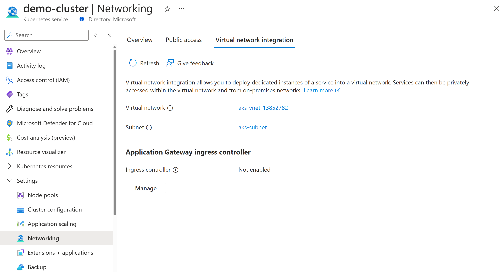

# Tutorial: Enable Application Gateway Ingress Controller add-on for an existing AKS cluster with an existing Application Gateway

You can use Azure CLI or Portal to enable the [Application Gateway Ingress Controller (AGIC)](ingress-controller-overview.md) add-on for an existing [Azure Kubernetes Services (AKS)](https://azure.microsoft.com/services/kubernetes-service/) cluster. In this tutorial, you'll learn how to use AGIC add-on to expose your Kubernetes application in an existing AKS cluster through an existing Application Gateway deployed in separate virtual networks. You'll start by creating an AKS cluster in one virtual network and an Application Gateway in a separate virtual network to simulate existing resources. You'll then enable the AGIC add-on, peer the two virtual networks together, and deploy a sample application that will be exposed through the Application Gateway using the AGIC add-on. If you're enabling the AGIC add-on for an existing Application Gateway and existing AKS cluster in the same virtual network, then you can skip the peering step below. The add-on provides a much faster way of deploying AGIC for your AKS cluster than [previously through Helm](ingress-controller-overview.md#difference-between-helm-deployment-and-aks-add-on) and also offers a fully managed experience.  

In this tutorial, you learn how to:

> [!div class="checklist"]
> * Create a resource group 
> * Create a new AKS cluster 
> * Create a new Application Gateway 
> * Enable the AGIC add-on in the existing AKS cluster through Azure CLI 
> * Enable the AGIC add-on in the existing AKS cluster through Portal 
> * Peer the Application Gateway virtual network with the AKS cluster virtual network
> * Deploy a sample application using AGIC for Ingress on the AKS cluster
> * Check that the application is reachable through Application Gateway

[!INCLUDE [quickstarts-free-trial-note](../../includes/quickstarts-free-trial-note.md)]

[!INCLUDE [azure-cli-prepare-your-environment.md](../../includes/azure-cli-prepare-your-environment.md)]

## Create a resource group

In Azure, you allocate related resources to a resource group. Create a resource group by using [az group create](/cli/azure/group#az_group_create). The following example creates a resource group named *myResourceGroup* in the *canadacentral* location (region). 

```azurecli-interactive
az group create --name myResourceGroup --location canadacentral
```

## Deploy a new AKS cluster

You'll now deploy a new AKS cluster, to simulate having an existing AKS cluster that you want to enable the AGIC add-on for.  

In the following example, you'll be deploying a new AKS cluster named *myCluster* using [Azure CNI](../aks/concepts-network.md#azure-cni-advanced-networking) and [Managed Identities](../aks/use-managed-identity.md) in the resource group you created, *myResourceGroup*.

```azurecli-interactive
az aks create -n myCluster -g myResourceGroup --network-plugin azure --enable-managed-identity 
```

To configure additional parameters for the `az aks create` command, visit references [here](/cli/azure/aks#az_aks_create). 

## Deploy a new Application Gateway 

You'll now deploy a new Application Gateway, to simulate having an existing Application Gateway that you want to use to load balance traffic to your AKS cluster, *myCluster*. The name of the Application Gateway will be *myApplicationGateway*, but you will need to first create a public IP resource, named *myPublicIp*, and a new virtual network called *myVnet* with address space 11.0.0.0/8, and a subnet with address space 11.1.0.0/16 called *mySubnet*, and deploy your Application Gateway in *mySubnet* using *myPublicIp*. 

When using an AKS cluster and Application Gateway in separate virtual networks, the address spaces of the two virtual networks must not overlap. The default address space that an AKS cluster deploys in is 10.0.0.0/8, so we set the Application Gateway virtual network address prefix to 11.0.0.0/8. 

```azurecli-interactive
az network public-ip create -n myPublicIp -g MyResourceGroup --allocation-method Static --sku Standard
az network vnet create -n myVnet -g myResourceGroup --address-prefix 11.0.0.0/8 --subnet-name mySubnet --subnet-prefix 11.1.0.0/16 
az network application-gateway create -n myApplicationGateway -l canadacentral -g myResourceGroup --sku Standard_v2 --public-ip-address myPublicIp --vnet-name myVnet --subnet mySubnet
```

> [!NOTE]
> Application Gateway Ingress Controller (AGIC) add-on **only** supports Application Gateway v2 SKUs (Standard and WAF), and **not** the Application Gateway v1 SKUs. 

## Enable the AGIC add-on in existing AKS cluster through Azure CLI 

If you'd like to continue using Azure CLI, you can continue to enable the AGIC add-on in the AKS cluster you created, *myCluster*, and specify the AGIC add-on to use the existing Application Gateway you created, *myApplicationGateway*.

```azurecli-interactive
appgwId=$(az network application-gateway show -n myApplicationGateway -g myResourceGroup -o tsv --query "id") 
az aks enable-addons -n myCluster -g myResourceGroup -a ingress-appgw --appgw-id $appgwId
```

## Enable the AGIC add-on in existing AKS cluster through Portal 

If you'd like to use Azure portal to enable AGIC add-on, go to [(https://aka.ms/azure/portal/aks/agic)](https://aka.ms/azure/portal/aks/agic) and navigate to your AKS cluster through the Portal link. From there, go to the Networking tab within your AKS cluster. You'll see an Application Gateway ingress controller section, which allows you to enable/disable the ingress controller add-on using the Portal UI. Check the box next to "Enable ingress controller", and select the Application Gateway you created, *myApplicationGateway* from the dropdown menu. 



## Peer the two virtual networks together

Since we deployed the AKS cluster in its own virtual network and the Application Gateway in another virtual network, you'll need to peer the two virtual networks together in order for traffic to flow from the Application Gateway to the pods in the cluster. Peering the two virtual networks requires running the Azure CLI command two separate times, to ensure that the connection is bi-directional. The first command will create a peering connection from the Application Gateway virtual network to the AKS virtual network; the second command will create a peering connection in the other direction.

```azurecli-interactive
nodeResourceGroup=$(az aks show -n myCluster -g myResourceGroup -o tsv --query "nodeResourceGroup")
aksVnetName=$(az network vnet list -g $nodeResourceGroup -o tsv --query "[0].name")

aksVnetId=$(az network vnet show -n $aksVnetName -g $nodeResourceGroup -o tsv --query "id")
az network vnet peering create -n AppGWtoAKSVnetPeering -g myResourceGroup --vnet-name myVnet --remote-vnet $aksVnetId --allow-vnet-access

appGWVnetId=$(az network vnet show -n myVnet -g myResourceGroup -o tsv --query "id")
az network vnet peering create -n AKStoAppGWVnetPeering -g $nodeResourceGroup --vnet-name $aksVnetName --remote-vnet $appGWVnetId --allow-vnet-access
```

## Deploy a sample application using AGIC 

You'll now deploy a sample application to the AKS cluster you created that will use the AGIC add-on for Ingress and connect the Application Gateway to the AKS cluster. First, you'll get credentials to the AKS cluster you deployed by running the `az aks get-credentials` command. 

```azurecli-interactive
az aks get-credentials -n myCluster -g myResourceGroup
```

Once you have the credentials to the cluster you created, run the following command to set up a sample application that uses AGIC for Ingress to the cluster. AGIC will update the Application Gateway you set up earlier with corresponding routing rules to the new sample application you deployed.  

```azurecli-interactive
kubectl apply -f https://raw.githubusercontent.com/Azure/application-gateway-kubernetes-ingress/master/docs/examples/aspnetapp.yaml 
```

## Check that the application is reachable

Now that the Application Gateway is set up to serve traffic to the AKS cluster, let's verify that your application is reachable. You'll first get the IP address of the Ingress. 

```azurecli-interactive
kubectl get ingress
```

Check that the sample application you created is up and running by either visiting the IP address of the Application Gateway that you got from running the above command or check with `curl`. It may take Application Gateway a minute to get the update, so if the Application Gateway is still in an "Updating" state on Portal, then let it finish before trying to reach the IP address. 

## Clean up resources

When no longer needed, remove the resource group, application gateway, and all related resources.

```azurecli-interactive
az group delete --name myResourceGroup 
```

## Next steps

> [!div class="nextstepaction"]
> [Learn more about disabling the AGIC add-on](./ingress-controller-disable-addon.md)
