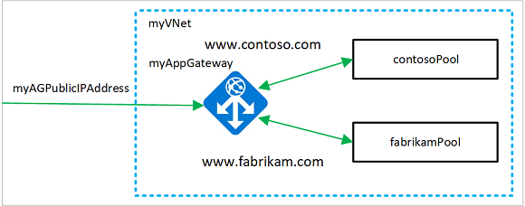

# Create an application gateway that hosts multiple web sites using Azure PowerShell

You can use Azure Powershell to [configure the hosting of multiple web sites](multiple-site-overview.md) when you create an [application gateway](overview.md). In this article, you define backend address pools using virtual machines scale sets. You then configure listeners and rules based on domains that you own to make sure web traffic arrives at the appropriate servers in the pools. This article assumes that you own multiple domains and uses examples of *www.contoso.com* and *www.fabrikam.com*.

In this article, you learn how to:

> [!div class="checklist"]
> * Set up the network
> * Create an application gateway
> * Create backend listeners
> * Create routing rules
> * Create virtual machine scale sets with the backend pools
> * Create a CNAME record in your domain



If you don't have an Azure subscription, create a [free account](https://azure.microsoft.com/free/?WT.mc_id=A261C142F) before you begin.

[!INCLUDE [updated-for-az](../../includes/updated-for-az.md)]

[!INCLUDE [cloud-shell-try-it.md](../../includes/cloud-shell-try-it.md)]

If you choose to install and use the PowerShell locally, this article requires the Azure PowerShell module version 1.0.0 or later. To find the version, run `Get-Module -ListAvailable Az` . If you need to upgrade, see [Install Azure PowerShell module](/powershell/azure/install-az-ps). If you're running PowerShell locally, you also need to run `Login-AzAccount` to create a connection with Azure.

## Create a resource group

A resource group is a logical container into which Azure resources are deployed and managed. Create an Azure resource group using [New-AzResourceGroup](/powershell/module/az.resources/new-azresourcegroup).  

```azurepowershell-interactive
New-AzResourceGroup -Name myResourceGroupAG -Location eastus
```

## Create network resources

Create the subnet configurations using [New-AzVirtualNetworkSubnetConfig](/powershell/module/az.network/new-azvirtualnetworksubnetconfig). Create the virtual network using [New-AzVirtualNetwork](/powershell/module/az.network/new-azvirtualnetwork) with the subnet configurations. And finally, create the public IP address using [New-AzPublicIpAddress](/powershell/module/az.network/new-azpublicipaddress). These resources are used to provide network connectivity to the application gateway and its associated resources.

```azurepowershell-interactive
$backendSubnetConfig = New-AzVirtualNetworkSubnetConfig `
  -Name myBackendSubnet `
  -AddressPrefix 10.0.1.0/24

$agSubnetConfig = New-AzVirtualNetworkSubnetConfig `
  -Name myAGSubnet `
  -AddressPrefix 10.0.2.0/24

$vnet = New-AzVirtualNetwork `
  -ResourceGroupName myResourceGroupAG `
  -Location eastus `
  -Name myVNet `
  -AddressPrefix 10.0.0.0/16 `
  -Subnet $backendSubnetConfig, $agSubnetConfig

$pip = New-AzPublicIpAddress `
  -ResourceGroupName myResourceGroupAG `
  -Location eastus `
  -Name myAGPublicIPAddress `
  -AllocationMethod Dynamic
```

## Create an application gateway

### Create the IP configurations and frontend port

Associate the subnet that you previously created to the application gateway using [New-AzApplicationGatewayIPConfiguration](/powershell/module/az.network/new-azapplicationgatewayipconfiguration). Assign the public IP address to the application gateway using [New-AzApplicationGatewayFrontendIPConfig](/powershell/module/az.network/new-azapplicationgatewayfrontendipconfig).

```azurepowershell-interactive
$vnet = Get-AzVirtualNetwork `
  -ResourceGroupName myResourceGroupAG `
  -Name myVNet

$subnet=$vnet.Subnets[0]

$gipconfig = New-AzApplicationGatewayIPConfiguration `
  -Name myAGIPConfig `
  -Subnet $subnet

$fipconfig = New-AzApplicationGatewayFrontendIPConfig `
  -Name myAGFrontendIPConfig `
  -PublicIPAddress $pip

$frontendport = New-AzApplicationGatewayFrontendPort `
  -Name myFrontendPort `
  -Port 80
```

### Create the backend pools and settings

Create the first backend address pool for the application gateway using [New-AzApplicationGatewayBackendAddressPool](/powershell/module/az.network/new-azapplicationgatewaybackendaddresspool). Configure the settings for the pool using [New-AzApplicationGatewayBackendHttpSettings](/powershell/module/az.network/new-azapplicationgatewaybackendhttpsetting).

```azurepowershell-interactive
$contosoPool = New-AzApplicationGatewayBackendAddressPool `
  -Name contosoPool

$fabrikamPool = New-AzApplicationGatewayBackendAddressPool `
  -Name fabrikamPool

$poolSettings = New-AzApplicationGatewayBackendHttpSettings `
  -Name myPoolSettings `
  -Port 80 `
  -Protocol Http `
  -CookieBasedAffinity Enabled `
  -RequestTimeout 120
```

### Create the listeners and rules

Listeners are required to enable the application gateway to route traffic appropriately to the backend address pools. In this article, you create two listeners for your two domains. Listeners are created for the *contoso.com* and *fabrikam.com* domains.

Create the first listener using [New-AzApplicationGatewayHttpListener](/powershell/module/az.network/new-azapplicationgatewayhttplistener) with the frontend configuration and frontend port that you previously created. A rule is required for the listener to know which backend pool to use for incoming traffic. Create a basic rule named *contosoRule* using [New-AzApplicationGatewayRequestRoutingRule](/powershell/module/az.network/new-azapplicationgatewayrequestroutingrule).

```azurepowershell-interactive
$contosolistener = New-AzApplicationGatewayHttpListener `
  -Name contosoListener `
  -Protocol Http `
  -FrontendIPConfiguration $fipconfig `
  -FrontendPort $frontendport `
  -HostName "www.contoso.com"

$fabrikamlistener = New-AzApplicationGatewayHttpListener `
  -Name fabrikamListener `
  -Protocol Http `
  -FrontendIPConfiguration $fipconfig `
  -FrontendPort $frontendport `
  -HostName "www.fabrikam.com"

$contosoRule = New-AzApplicationGatewayRequestRoutingRule `
  -Name contosoRule `
  -RuleType Basic `
  -HttpListener $contosoListener `
  -BackendAddressPool $contosoPool `
  -BackendHttpSettings $poolSettings

$fabrikamRule = New-AzApplicationGatewayRequestRoutingRule `
  -Name fabrikamRule `
  -RuleType Basic `
  -HttpListener $fabrikamListener `
  -BackendAddressPool $fabrikamPool `
  -BackendHttpSettings $poolSettings
```

### Create the application gateway

Now that you created the necessary supporting resources, specify parameters for the application gateway using [New-AzApplicationGatewaySku](/powershell/module/az.network/new-azapplicationgatewaysku), and then create it using [New-AzApplicationGateway](/powershell/module/az.network/new-azapplicationgateway).

```azurepowershell-interactive
$sku = New-AzApplicationGatewaySku `
  -Name Standard_Medium `
  -Tier Standard `
  -Capacity 2

$appgw = New-AzApplicationGateway `
  -Name myAppGateway `
  -ResourceGroupName myResourceGroupAG `
  -Location eastus `
  -BackendAddressPools $contosoPool, $fabrikamPool `
  -BackendHttpSettingsCollection $poolSettings `
  -FrontendIpConfigurations $fipconfig `
  -GatewayIpConfigurations $gipconfig `
  -FrontendPorts $frontendport `
  -HttpListeners $contosoListener, $fabrikamListener `
  -RequestRoutingRules $contosoRule, $fabrikamRule `
  -Sku $sku
```

## Create virtual machine scale sets

In this example, you create two virtual machine scale sets that support the two backend pools that you created. The scale sets that you create are named *myvmss1* and *myvmss2*. Each scale set contains two virtual machine instances on which you install IIS. You assign the scale set to the backend pool when you configure the IP settings.

```azurepowershell-interactive
$vnet = Get-AzVirtualNetwork `
  -ResourceGroupName myResourceGroupAG `
  -Name myVNet

$appgw = Get-AzApplicationGateway `
  -ResourceGroupName myResourceGroupAG `
  -Name myAppGateway

$contosoPool = Get-AzApplicationGatewayBackendAddressPool `
  -Name contosoPool `
  -ApplicationGateway $appgw

$fabrikamPool = Get-AzApplicationGatewayBackendAddressPool `
  -Name fabrikamPool `
  -ApplicationGateway $appgw

for ($i=1; $i -le 2; $i++)
{
  if ($i -eq 1) 
  {
    $poolId = $contosoPool.Id
  }
  if ($i -eq 2)
  {
    $poolId = $fabrikamPool.Id
  }

  $ipConfig = New-AzVmssIpConfig `
    -Name myVmssIPConfig$i `
    -SubnetId $vnet.Subnets[1].Id `
    -ApplicationGatewayBackendAddressPoolsId $poolId

  $vmssConfig = New-AzVmssConfig `
    -Location eastus `
    -SkuCapacity 2 `
    -SkuName Standard_DS2 `
    -UpgradePolicyMode Automatic

  Set-AzVmssStorageProfile $vmssConfig `
    -ImageReferencePublisher MicrosoftWindowsServer `
    -ImageReferenceOffer WindowsServer `
    -ImageReferenceSku 2016-Datacenter `
    -ImageReferenceVersion latest `
    -OsDiskCreateOption FromImage

  Set-AzVmssOsProfile $vmssConfig `
    -AdminUsername azureuser `
    -AdminPassword "Azure123456!" `
    -ComputerNamePrefix myvmss$i

  Add-AzVmssNetworkInterfaceConfiguration `
    -VirtualMachineScaleSet $vmssConfig `
    -Name myVmssNetConfig$i `
    -Primary $true `
    -IPConfiguration $ipConfig

  New-AzVmss `
    -ResourceGroupName myResourceGroupAG `
    -Name myvmss$i `
    -VirtualMachineScaleSet $vmssConfig
}
```

### Install IIS

```azurepowershell-interactive
$publicSettings = @{ "fileUris" = (,"https://raw.githubusercontent.com/Azure/azure-docs-powershell-samples/master/application-gateway/iis/appgatewayurl.ps1"); 
  "commandToExecute" = "powershell -ExecutionPolicy Unrestricted -File appgatewayurl.ps1" }

for ($i=1; $i -le 2; $i++)
{
  $vmss = Get-AzVmss `
    -ResourceGroupName myResourceGroupAG `
    -VMScaleSetName myvmss$i

  Add-AzVmssExtension -VirtualMachineScaleSet $vmss `
    -Name "customScript" `
    -Publisher "Microsoft.Compute" `
    -Type "CustomScriptExtension" `
    -TypeHandlerVersion 1.8 `
    -Setting $publicSettings

  Update-AzVmss `
    -ResourceGroupName myResourceGroupAG `
    -Name myvmss$i `
    -VirtualMachineScaleSet $vmss
}
```

## Create CNAME record in your domain

After the application gateway is created with its public IP address, you can get the DNS address and use it to create a CNAME record in your domain. You can use [Get-AzPublicIPAddress](/powershell/module/az.network/get-azpublicipaddress) to get the DNS address of the application gateway. Copy the *fqdn* value of the DNSSettings and use it as the value of the CNAME record that you create. Using A-records isn't recommended because the VIP may change when the application gateway is restarted in the V1 SKU.

```azurepowershell-interactive
Get-AzPublicIPAddress -ResourceGroupName myResourceGroupAG -Name myAGPublicIPAddress
```

## Test the application gateway

Enter your domain name into the address bar of your browser. Such as, http:\//www.contoso.com.


Change the address to your other domain and you should see something like the following example:


## Clean up resources

When no longer needed, remove the resource group, application gateway, and all related resources using [Remove-AzResourceGroup](/powershell/module/az.resources/remove-azresourcegroup).

```azurepowershell-interactive
Remove-AzResourceGroup -Name myResourceGroupAG
```

## Next steps

[Create an application gateway with URL path-based routing rules](./tutorial-url-route-powershell.md)
