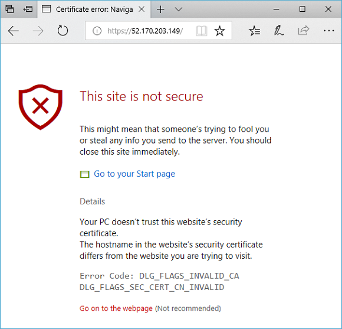

# Create an application gateway with SSL termination using the Azure CLI

You can use the Azure CLI to create an [application gateway](overview.md) with a certificate for [SSL termination](ssl-overview.md) that uses a [virtual machine scale set](../virtual-machine-scale-sets/virtual-machine-scale-sets-overview.md) for backend servers. In this example, the scale set contains two virtual machine instances that are added to the default backend pool of the application gateway.

In this article, you learn how to:

> [!div class="checklist"]
> * Create a self-signed certificate
> * Set up a network
> * Create an application gateway with the certificate
> * Create a virtual machine scale set with the default backend pool

If you prefer, you can complete this procedure using [Azure PowerShell](tutorial-ssl-powershell.md).

If you don't have an Azure subscription, create a [free account](https://azure.microsoft.com/free/?WT.mc_id=A261C142F) before you begin.

[!INCLUDE [cloud-shell-try-it.md](../../includes/cloud-shell-try-it.md)]

If you choose to install and use the CLI locally, this article requires you to run the Azure CLI version 2.0.4 or later. To find the version, run `az --version`. If you need to install or upgrade, see [Install Azure CLI](/cli/azure/install-azure-cli).

## Create a self-signed certificate

For production use, you should import a valid certificate signed by trusted provider. For this article, you create a self-signed certificate and pfx file using the openssl command.

```azurecli-interactive
openssl req -x509 -sha256 -nodes -days 365 -newkey rsa:2048 -keyout privateKey.key -out appgwcert.crt
```

Enter values that make sense for your certificate. You can accept the default values.

```azurecli-interactive
openssl pkcs12 -export -out appgwcert.pfx -inkey privateKey.key -in appgwcert.crt
```

Enter the password for the certificate. In this example, *Azure123456!* is being used.

## Create a resource group

A resource group is a logical container into which Azure resources are deployed and managed. Create a resource group using [az group create](/cli/azure/group).

The following example creates a resource group named *myResourceGroupAG* in the *eastus* location.

```azurecli-interactive 
az group create --name myResourceGroupAG --location eastus
```

## Create network resources

Create the virtual network named *myVNet* and the subnet named *myAGSubnet* using [az network vnet create](/cli/azure/network/vnet). You can then add the subnet named *myBackendSubnet* that's needed by the backend servers using [az network vnet subnet create](/cli/azure/network/vnet/subnet). Create the public IP address named *myAGPublicIPAddress* using [az network public-ip create](/cli/azure/network/public-ip).

```azurecli-interactive
az network vnet create \
  --name myVNet \
  --resource-group myResourceGroupAG \
  --location eastus \
  --address-prefix 10.0.0.0/16 \
  --subnet-name myAGSubnet \
  --subnet-prefix 10.0.1.0/24

az network vnet subnet create \
  --name myBackendSubnet \
  --resource-group myResourceGroupAG \
  --vnet-name myVNet \
  --address-prefix 10.0.2.0/24

az network public-ip create \
  --resource-group myResourceGroupAG \
  --name myAGPublicIPAddress
```

## Create the application gateway

You can use [az network application-gateway create](/cli/azure/network/application-gateway) to create the application gateway. When you create an application gateway using the Azure CLI, you specify configuration information, such as capacity, sku, and HTTP settings. 

The application gateway is assigned to *myAGSubnet* and *myAGPublicIPAddress* that you previously created. In this example, you associate the certificate that you created and its password when you create the application gateway. 

```azurecli-interactive
az network application-gateway create \
  --name myAppGateway \
  --location eastus \
  --resource-group myResourceGroupAG \
  --vnet-name myVNet \
  --subnet myAGsubnet \
  --capacity 2 \
  --sku Standard_Medium \
  --http-settings-cookie-based-affinity Disabled \
  --frontend-port 443 \
  --http-settings-port 80 \
  --http-settings-protocol Http \
  --public-ip-address myAGPublicIPAddress \
  --cert-file appgwcert.pfx \
  --cert-password "Azure123456!"

```

 It may take several minutes for the application gateway to be created. After the application gateway is created, you can see these new features of it:

- *appGatewayBackendPool* - An application gateway must have at least one backend address pool.
- *appGatewayBackendHttpSettings* - Specifies that port 80 and an HTTP protocol is used for communication.
- *appGatewayHttpListener* - The default listener associated with *appGatewayBackendPool*.
- *appGatewayFrontendIP* - Assigns *myAGPublicIPAddress* to *appGatewayHttpListener*.
- *rule1* - The default routing rule that is associated with *appGatewayHttpListener*.

## Create a virtual machine scale set

In this example, you create a virtual machine scale set that provides servers for the default backend pool in the application gateway. The virtual machines in the scale set are associated with *myBackendSubnet* and *appGatewayBackendPool*. To create the scale set, you can use [az vmss create](/cli/azure/vmss#az-vmss-create).

```azurecli-interactive
az vmss create \
  --name myvmss \
  --resource-group myResourceGroupAG \
  --image UbuntuLTS \
  --admin-username azureuser \
  --admin-password Azure123456! \
  --instance-count 2 \
  --vnet-name myVNet \
  --subnet myBackendSubnet \
  --vm-sku Standard_DS2 \
  --upgrade-policy-mode Automatic \
  --app-gateway myAppGateway \
  --backend-pool-name appGatewayBackendPool
```

### Install NGINX

```azurecli-interactive
az vmss extension set \
  --publisher Microsoft.Azure.Extensions \
  --version 2.0 \
  --name CustomScript \
  --resource-group myResourceGroupAG \
  --vmss-name myvmss \
  --settings '{ "fileUris": ["https://raw.githubusercontent.com/Azure/azure-docs-powershell-samples/master/application-gateway/iis/install_nginx.sh"],
  "commandToExecute": "./install_nginx.sh" }'
```

## Test the application gateway

To get the public IP address of the application gateway, you can use [az network public-ip show](/cli/azure/network/public-ip).

```azurecli-interactive
az network public-ip show \
  --resource-group myResourceGroupAG \
  --name myAGPublicIPAddress \
  --query [ipAddress] \
  --output tsv
```

Copy the public IP address, and then paste it into the address bar of your browser. For this example, the URL is: **https://52.170.203.149**.



To accept the security warning if you used a self-signed certificate, select **Details** and then **Go on to the webpage**. Your secured NGINX site is then displayed as in the following example:


## Clean up resources

When no longer needed, remove the resource group, application gateway, and all related resources.

```azurecli-interactive
az group delete --name myResourceGroupAG --location eastus
```

## Next steps

* [Create an application gateway that hosts multiple web sites](./tutorial-multiple-sites-cli.md)
