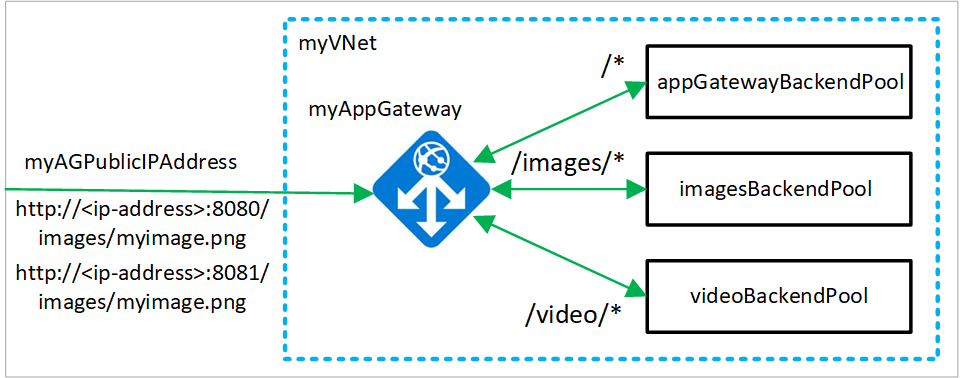

# Create an application gateway with URL path-based redirection using Azure PowerShell

You can use Azure PowerShell to configure [URL-based routing rules](application-gateway-url-route-overview.md) when you create an [application gateway](application-gateway-introduction.md). In this tutorial, you create backend pools using  [virtual machine scale sets](../virtual-machine-scale-sets/virtual-machine-scale-sets-overview.md). You then create URL routing rules that make sure web traffic is redirected to the appropriate backend pool.

In this tutorial, you learn how to:

> [!div class="checklist"]
> * Set up the network
> * Create an application gateway
> * Add listeners and routing rules
> * Create virtual machine scale sets for backend pools

The following example shows site traffic coming from both ports 8080 and 8081 and being directed to the same backend pools:



If you prefer, you can complete this tutorial using [Azure CLI](tutorial-url-redirect-cli.md).

If you don't have an Azure subscription, create a [free account](https://azure.microsoft.com/free/?WT.mc_id=A261C142F) before you begin.

[!INCLUDE [updated-for-az](../../includes/updated-for-az.md)]

[!INCLUDE [cloud-shell-try-it.md](../../includes/cloud-shell-try-it.md)]

If you choose to install and use the PowerShell locally, this tutorial requires the Azure PowerShell module version 1.0.0 or later. To find the version, run `Get-Module -ListAvailable Az` . If you need to upgrade, see [Install Azure PowerShell module](/powershell/azure/install-az-ps). If you are running PowerShell locally, you also need to run `Connect-AzAccount` to create a connection with Azure.

## Create a resource group

A resource group is a logical container into which Azure resources are deployed and managed. Create an Azure resource group using [New-AzResourceGroup](/powershell/module/az.resources/new-azresourcegroup).  

```azurepowershell-interactive
New-AzResourceGroup -Name myResourceGroupAG -Location eastus
```

## Create network resources

Create the subnet configurations for *myBackendSubnet* and *myAGSubnet* using [New-AzVirtualNetworkSubnetConfig](/powershell/module/az.network/new-azvirtualnetworksubnetconfig). Create the virtual network named *myVNet* using [New-AzVirtualNetwork](/powershell/module/az.network/new-azvirtualnetwork) with the subnet configurations. And finally, create the public IP address named *myAGPublicIPAddress* using [New-AzPublicIpAddress](/powershell/module/az.network/new-azpublicipaddress). These resources are used to provide network connectivity to the application gateway and its associated resources.

```azurepowershell-interactive
$backendSubnetConfig = New-AzVirtualNetworkSubnetConfig `
  -Name myBackendSubnet `
  -AddressPrefix 10.0.1.0/24

$agSubnetConfig = New-AzVirtualNetworkSubnetConfig `
  -Name myAGSubnet `
  -AddressPrefix 10.0.2.0/24

New-AzVirtualNetwork `
  -ResourceGroupName myResourceGroupAG `
  -Location eastus `
  -Name myVNet `
  -AddressPrefix 10.0.0.0/16 `
  -Subnet $backendSubnetConfig, $agSubnetConfig

New-AzPublicIpAddress `
  -ResourceGroupName myResourceGroupAG `
  -Location eastus `
  -Name myAGPublicIPAddress `
  -AllocationMethod Dynamic
```

## Create an application gateway

In this section, you create resources that support the application gateway, and then finally create it. The resources that you create include:

- *IP configurations and frontend port* - Associates the subnet that you previously created to the application gateway and assigns a port to use to access it.
- *Default pool* - All application gateways must have at least one backend pool of servers.
- *Default listener and rule* - The default listener listens for traffic on the port that was assigned and the default rule sends traffic to the default pool.

### Create the IP configurations and frontend port

Associate *myAGSubnet* that you previously created to the application gateway using [New-AzApplicationGatewayIPConfiguration](/powershell/module/az.network/new-azapplicationgatewayipconfiguration). Assign *myAGPublicIPAddress* to the application gateway using [New-AzApplicationGatewayFrontendIPConfig](/powershell/module/az.network/new-azapplicationgatewayfrontendipconfig). And then you can create the HTTP port using [New-AzApplicationGatewayFrontendPort](/powershell/module/az.network/new-azapplicationgatewayfrontendport).

```azurepowershell-interactive
$vnet = Get-AzVirtualNetwork `
  -ResourceGroupName myResourceGroupAG `
  -Name myVNet

$subnet=$vnet.Subnets[0]

$pip = Get-AzPublicIpAddress `
  -ResourceGroupName myResourceGroupAG `
  -Name myAGPublicIPAddress

$gipconfig = New-AzApplicationGatewayIPConfiguration `
  -Name myAGIPConfig `
  -Subnet $subnet

$fipconfig = New-AzApplicationGatewayFrontendIPConfig `
  -Name myAGFrontendIPConfig `
  -PublicIPAddress $pip

$frontendport = New-AzApplicationGatewayFrontendPort `
  -Name myFrontendPort `
  -Port 80
```

### Create the default pool and settings

Create the default backend pool named *appGatewayBackendPool* for the application gateway using [New-AzApplicationGatewayBackendAddressPool](/powershell/module/az.network/new-azapplicationgatewaybackendaddresspool). Configure the settings for the backend pool using [New-AzApplicationGatewayBackendHttpSettings](/powershell/module/az.network/new-azapplicationgatewaybackendhttpsetting).

```azurepowershell-interactive
$defaultPool = New-AzApplicationGatewayBackendAddressPool `
  -Name appGatewayBackendPool

$poolSettings = New-AzApplicationGatewayBackendHttpSettings `
  -Name myPoolSettings `
  -Port 80 `
  -Protocol Http `
  -CookieBasedAffinity Enabled `
  -RequestTimeout 120
```

### Create the default listener and rule

A listener is required to enable the application gateway to route traffic appropriately to a backend pool. In this tutorial, you create multiple listeners. The first basic listener expects traffic at the root URL. The other listeners expect traffic at specific URLs, such as `http://52.168.55.24:8080/images/` or `http://52.168.55.24:8081/video/`.

Create a listener named *defaultListener* using [New-AzApplicationGatewayHttpListener](/powershell/module/az.network/new-azapplicationgatewayhttplistener) with the frontend configuration and frontend port that you previously created. A rule is required for the listener to know which backend pool to use for incoming traffic. Create a basic rule named *rule1* using [New-AzApplicationGatewayRequestRoutingRule](/powershell/module/az.network/new-azapplicationgatewayrequestroutingrule).

```azurepowershell-interactive
$defaultlistener = New-AzApplicationGatewayHttpListener `
  -Name defaultListener `
  -Protocol Http `
  -FrontendIPConfiguration $fipconfig `
  -FrontendPort $frontendport

$frontendRule = New-AzApplicationGatewayRequestRoutingRule `
  -Name rule1 `
  -RuleType Basic `
  -HttpListener $defaultlistener `
  -BackendAddressPool $defaultPool `
  -BackendHttpSettings $poolSettings
```

### Create the application gateway

Now that you created the necessary supporting resources, specify parameters for the application gateway named *myAppGateway* using [New-AzApplicationGatewaySku](/powershell/module/az.network/new-azapplicationgatewaysku), and then create it using [New-AzApplicationGateway](/powershell/module/az.network/new-azapplicationgateway).

```azurepowershell-interactive
$sku = New-AzApplicationGatewaySku `
  -Name Standard_Medium `
  -Tier Standard `
  -Capacity 2

New-AzApplicationGateway `
  -Name myAppGateway `
  -ResourceGroupName myResourceGroupAG `
  -Location eastus `
  -BackendAddressPools $defaultPool `
  -BackendHttpSettingsCollection $poolSettings `
  -FrontendIpConfigurations $fipconfig `
  -GatewayIpConfigurations $gipconfig `
  -FrontendPorts $frontendport `
  -HttpListeners $defaultlistener `
  -RequestRoutingRules $frontendRule `
  -Sku $sku
```

### Add backend pools and ports

You can add backend pools to your application gateway by using [Add-AzApplicationGatewayBackendAddressPool](/powershell/module/az.network/add-azapplicationgatewaybackendaddresspool). In this example, *imagesBackendPool* and *videoBackendPool* are created. You add the frontend port for the pools using [Add-AzApplicationGatewayFrontendPort](/powershell/module/az.network/add-azapplicationgatewayfrontendport). You then submit the changes to the application gateway using [Set-AzApplicationGateway](/powershell/module/az.network/set-azapplicationgateway).

```azurepowershell-interactive
$appgw = Get-AzApplicationGateway `
  -ResourceGroupName myResourceGroupAG `
  -Name myAppGateway

Add-AzApplicationGatewayBackendAddressPool `
  -ApplicationGateway $appgw `
  -Name imagesBackendPool

Add-AzApplicationGatewayBackendAddressPool `
  -ApplicationGateway $appgw `
  -Name videoBackendPool

Add-AzApplicationGatewayFrontendPort `
  -ApplicationGateway $appgw `
  -Name bport `
  -Port 8080

Add-AzApplicationGatewayFrontendPort `
  -ApplicationGateway $appgw `
  -Name rport `
  -Port 8081

Set-AzApplicationGateway -ApplicationGateway $appgw
```

## Add listeners and rules

### Add listeners

Add the listeners named *backendListener* and *redirectedListener* that are needed to route traffic using [Add-AzApplicationGatewayHttpListener](/powershell/module/az.network/add-azapplicationgatewayhttplistener).

```azurepowershell-interactive
$appgw = Get-AzApplicationGateway `
  -ResourceGroupName myResourceGroupAG `
  -Name myAppGateway

$backendPort = Get-AzApplicationGatewayFrontendPort `
  -ApplicationGateway $appgw `
  -Name bport

$redirectPort = Get-AzApplicationGatewayFrontendPort `
  -ApplicationGateway $appgw `
  -Name rport

$fipconfig = Get-AzApplicationGatewayFrontendIPConfig `
  -ApplicationGateway $appgw

Add-AzApplicationGatewayHttpListener `
  -ApplicationGateway $appgw `
  -Name backendListener `
  -Protocol Http `
  -FrontendIPConfiguration $fipconfig `
  -FrontendPort $backendPort

Add-AzApplicationGatewayHttpListener `
  -ApplicationGateway $appgw `
  -Name redirectedListener `
  -Protocol Http `
  -FrontendIPConfiguration $fipconfig `
  -FrontendPort $redirectPort

Set-AzApplicationGateway -ApplicationGateway $appgw
```

### Add the default URL path map

URL path maps make sure that specific URLs are routed to specific backend pools. You can create the URL path maps named *imagePathRule* and *videoPathRule* using [New-AzApplicationGatewayPathRuleConfig](/powershell/module/az.network/new-azapplicationgatewaypathruleconfig) and [Add-AzApplicationGatewayUrlPathMapConfig](/powershell/module/az.network/add-azapplicationgatewayurlpathmapconfig).

```azurepowershell-interactive
$appgw = Get-AzApplicationGateway `
  -ResourceGroupName myResourceGroupAG `
  -Name myAppGateway

$poolSettings = Get-AzApplicationGatewayBackendHttpSettings `
  -ApplicationGateway $appgw `
  -Name myPoolSettings

$imagePool = Get-AzApplicationGatewayBackendAddressPool `
  -ApplicationGateway $appgw `
  -Name imagesBackendPool

$videoPool = Get-AzApplicationGatewayBackendAddressPool `
  -ApplicationGateway $appgw `
  -Name videoBackendPool

$defaultPool = Get-AzApplicationGatewayBackendAddressPool `
  -ApplicationGateway $appgw `
  -Name appGatewayBackendPool

$imagePathRule = New-AzApplicationGatewayPathRuleConfig `
  -Name imagePathRule `
  -Paths "/images/*" `
  -BackendAddressPool $imagePool `
  -BackendHttpSettings $poolSettings

$videoPathRule = New-AzApplicationGatewayPathRuleConfig `
  -Name videoPathRule `
  -Paths "/video/*" `
  -BackendAddressPool $videoPool `
  -BackendHttpSettings $poolSettings

Add-AzApplicationGatewayUrlPathMapConfig `
  -ApplicationGateway $appgw `
  -Name urlpathmap `
  -PathRules $imagePathRule, $videoPathRule `
  -DefaultBackendAddressPool $defaultPool `
  -DefaultBackendHttpSettings $poolSettings

Set-AzApplicationGateway -ApplicationGateway $appgw
```

### Add redirection configuration

You can configure redirection for the listener using [Add-AzApplicationGatewayRedirectConfiguration](/powershell/module/az.network/add-azapplicationgatewayredirectconfiguration).

```azurepowershell-interactive
$appgw = Get-AzApplicationGateway `
  -ResourceGroupName myResourceGroupAG `
  -Name myAppGateway

$backendListener = Get-AzApplicationGatewayHttpListener `
  -ApplicationGateway $appgw `
  -Name backendListener

$redirectConfig = Add-AzApplicationGatewayRedirectConfiguration `
  -ApplicationGateway $appgw `
  -Name redirectConfig `
  -RedirectType Found `
  -TargetListener $backendListener `
  -IncludePath $true `
  -IncludeQueryString $true

Set-AzApplicationGateway -ApplicationGateway $appgw
```

### Add the redirection URL path map

```azurepowershell-interactive
$appgw = Get-AzApplicationGateway `
  -ResourceGroupName myResourceGroupAG `
  -Name myAppGateway

$poolSettings = Get-AzApplicationGatewayBackendHttpSettings `
  -ApplicationGateway $appgw `
  -Name myPoolSettings

$defaultPool = Get-AzApplicationGatewayBackendAddressPool `
  -ApplicationGateway $appgw `
  -Name appGatewayBackendPool

$redirectConfig = Get-AzApplicationGatewayRedirectConfiguration `
  -ApplicationGateway $appgw `
  -Name redirectConfig

$redirectPathRule = New-AzApplicationGatewayPathRuleConfig `
  -Name redirectPathRule `
  -Paths "/images/*" `
  -RedirectConfiguration $redirectConfig

Add-AzApplicationGatewayUrlPathMapConfig `
  -ApplicationGateway $appgw `
  -Name redirectpathmap `
  -PathRules $redirectPathRule `
  -DefaultBackendAddressPool $defaultPool `
  -DefaultBackendHttpSettings $poolSettings

Set-AzApplicationGateway -ApplicationGateway $appgw
```

### Add routing rules

The routing rules associate the URL maps with the listeners that you created. You can add the rules named *defaultRule* and *redirectedRule* using [Add-AzApplicationGatewayRequestRoutingRule](/powershell/module/az.network/add-azapplicationgatewayrequestroutingrule).


```azurepowershell-interactive
$appgw = Get-AzApplicationGateway `
  -ResourceGroupName myResourceGroupAG `
  -Name myAppGateway

$backendlistener = Get-AzApplicationGatewayHttpListener `
  -ApplicationGateway $appgw `
  -Name backendListener

$redirectlistener = Get-AzApplicationGatewayHttpListener `
  -ApplicationGateway $appgw `
  -Name redirectedListener

$urlPathMap = Get-AzApplicationGatewayUrlPathMapConfig `
  -ApplicationGateway $appgw `
  -Name urlpathmap

$redirectPathMap = Get-AzApplicationGatewayUrlPathMapConfig `
  -ApplicationGateway $appgw `
  -Name redirectpathmap

Add-AzApplicationGatewayRequestRoutingRule `
  -ApplicationGateway $appgw `
  -Name defaultRule `
  -RuleType PathBasedRouting `
  -HttpListener $backendlistener `
  -UrlPathMap $urlPathMap

Add-AzApplicationGatewayRequestRoutingRule `
  -ApplicationGateway $appgw `
  -Name redirectedRule `
  -RuleType PathBasedRouting `
  -HttpListener $redirectlistener `
  -UrlPathMap $redirectPathMap

Set-AzApplicationGateway -ApplicationGateway $appgw
```

## Create virtual machine scale sets

In this example, you create three virtual machine scale sets that support the three backend pools that you created. The scale sets that you create are named *myvmss1*, *myvmss2*, and *myvmss3*. Each scale set contains two virtual machine instances on which you install IIS. You assign the scale set to the backend pool when you configure the IP settings.

```azurepowershell-interactive
$vnet = Get-AzVirtualNetwork `
  -ResourceGroupName myResourceGroupAG `
  -Name myVNet

$appgw = Get-AzApplicationGateway `
  -ResourceGroupName myResourceGroupAG `
  -Name myAppGateway

$backendPool = Get-AzApplicationGatewayBackendAddressPool `
  -Name appGatewayBackendPool `
  -ApplicationGateway $appgw

$imagesPool = Get-AzApplicationGatewayBackendAddressPool `
  -Name imagesBackendPool `
  -ApplicationGateway $appgw

$videoPool = Get-AzApplicationGatewayBackendAddressPool `
  -Name videoBackendPool `
  -ApplicationGateway $appgw

for ($i=1; $i -le 3; $i++)
{
  if ($i -eq 1)
  {
     $poolId = $backendPool.Id
  }
  if ($i -eq 2) 
  {
    $poolId = $imagesPool.Id
  }
  if ($i -eq 3)
  {
    $poolId = $videoPool.Id
  }

  $ipConfig = New-AzVmssIpConfig `
    -Name myVmssIPConfig$i `
    -SubnetId $vnet.Subnets[1].Id `
    -ApplicationGatewayBackendAddressPoolsId $poolId

  $vmssConfig = New-AzVmssConfig `
    -Location eastus `
    -SkuCapacity 2 `
    -SkuName Standard_DS2 `
    -UpgradePolicyMode Automatic

  Set-AzVmssStorageProfile $vmssConfig `
    -ImageReferencePublisher MicrosoftWindowsServer `
    -ImageReferenceOffer WindowsServer `
    -ImageReferenceSku 2016-Datacenter `
    -ImageReferenceVersion latest `
    -OsDiskCreateOption FromImage

  Set-AzVmssOsProfile $vmssConfig `
    -AdminUsername azureuser `
    -AdminPassword "Azure123456!" `
    -ComputerNamePrefix myvmss$i

  Add-AzVmssNetworkInterfaceConfiguration `
    -VirtualMachineScaleSet $vmssConfig `
    -Name myVmssNetConfig$i `
    -Primary $true `
    -IPConfiguration $ipConfig

  New-AzVmss `
    -ResourceGroupName myResourceGroupAG `
    -Name myvmss$i `
    -VirtualMachineScaleSet $vmssConfig
}
```

### Install IIS

```azurepowershell-interactive
$publicSettings = @{ "fileUris" = (,"https://raw.githubusercontent.com/Azure/azure-docs-powershell-samples/master/application-gateway/iis/appgatewayurl.ps1"); 
  "commandToExecute" = "powershell -ExecutionPolicy Unrestricted -File appgatewayurl.ps1" }

for ($i=1; $i -le 3; $i++)
{
  $vmss = Get-AzVmss -ResourceGroupName myResourceGroupAG -VMScaleSetName myvmss$i

  Add-AzVmssExtension -VirtualMachineScaleSet $vmss `
    -Name "customScript" `
    -Publisher "Microsoft.Compute" `
    -Type "CustomScriptExtension" `
    -TypeHandlerVersion 1.8 `
    -Setting $publicSettings

  Update-AzVmss `
    -ResourceGroupName myResourceGroupAG `
    -Name myvmss$i `
    -VirtualMachineScaleSet $vmss
}
```

## Test the application gateway

You can use [Get-AzPublicIPAddress](/powershell/module/az.network/get-azpublicipaddress) to get the public IP address of the application gateway. Copy the public IP address, and then paste it into the address bar of your browser. Such as, `http://52.168.55.24`, `http://52.168.55.24:8080/images/test.htm`, `http://52.168.55.24:8080/video/test.htm`, or `http://52.168.55.24:8081/images/test.htm`.

```azurepowershell-interactive
Get-AzPublicIPAddress -ResourceGroupName myResourceGroupAG -Name myAGPublicIPAddress
```


Change the URL to http://&lt;ip-address&gt;:8080/images/test.htm, substituting your IP address for &lt;ip-address&gt;, and you should see something like the following example:


Change the URL to http://&lt;ip-address&gt;:8080/video/test.htm, substituting your IP address for &lt;ip-address&gt;, and you should see something like the following example:


Now, change the URL to http://&lt;ip-address&gt;:8081/images/test.htm, substituting your IP address for &lt;ip-address&gt;, and you should see traffic redirected back to the images backend pool at http://&lt;ip-address&gt;:8080/images.

## Clean up resources

When no longer needed, remove the resource group, application gateway, and all related resources using [Remove-AzResourceGroup](/powershell/module/az.resources/remove-azresourcegroup).

```azurepowershell-interactive
Remove-AzResourceGroup -Name myResourceGroupAG
```
## Next steps

> [!div class="nextstepaction"]
> [Learn more about what you can do with application gateway](application-gateway-introduction.md)
