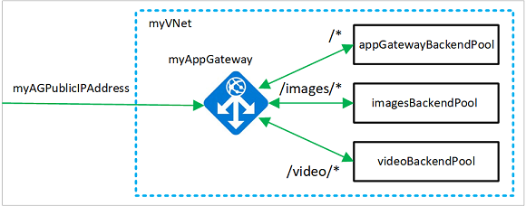

# Route web traffic based on the URL using Azure PowerShell

You can use Azure PowerShell to configure web traffic routing to specific scalable server pools based on the URL that is used to access your application. In this article, you create an [Azure Application Gateway](./overview.md) with three backend pools using [Virtual Machine Scale Sets](../virtual-machine-scale-sets/overview.md). Each of the backend pools serves a specific purpose such as, common data, images, and video.  Routing traffic to separate pools ensures that your customers get the information that they need when they need it.

To enable traffic routing, you create [routing rules](./url-route-overview.md) assigned to listeners that listen on specific ports to ensure web traffic arrives at the appropriate servers in the pools.

In this article, you learn how to:

* Set up the network
* Create listeners, URL path map, and rules
* Create scalable backend pools



If you prefer, you can complete this procedure using [Azure CLI](tutorial-url-route-cli.md) or the [Azure portal](create-url-route-portal.md).

If you don't have an Azure subscription, create a [free account](https://azure.microsoft.com/free/?WT.mc_id=A261C142F) before you begin.

[!INCLUDE [updated-for-az](../../includes/updated-for-az.md)]

[!INCLUDE [cloud-shell-try-it.md](../../includes/cloud-shell-try-it.md)]

If you choose to install and use the PowerShell locally, this article requires the Azure PowerShell module version 1.0.0 or later. To find the version, run `Get-Module -ListAvailable Az` . If you need to upgrade, see [Install Azure PowerShell module](/powershell/azure/install-azure-powershell). If you're running PowerShell locally, you also need to run `Login-AzAccount` to create a connection with Azure.

Because of the time needed to create resources, it can take up to 90 minutes to complete this procedure.

## Create a resource group

Create a resource group that contains all of the resources for your application. 

Create an Azure resource group using [New-AzResourceGroup](/powershell/module/az.resources/new-azresourcegroup).  

```azurepowershell-interactive
New-AzResourceGroup -Name myResourceGroupAG -Location eastus
```

## Create network resources

Whether you have an existing virtual network or create a new one, you need to make sure that it contains a subnet that is only used for application gateways. In this article, you create a subnet for the application gateway and a subnet for the scale sets. You create a public IP address to enable access to the resources in the application gateway.

Create the subnet configurations *myAGSubnet* and *myBackendSubnet* using [New-AzVirtualNetworkSubnetConfig](/powershell/module/az.network/new-azvirtualnetworksubnetconfig). Create the virtual network named *myVNet* using [New-AzVirtualNetwork](/powershell/module/az.network/new-azvirtualnetwork) with the subnet configurations. And finally, create the public IP address named *myAGPublicIPAddress* using [New-AzPublicIpAddress](/powershell/module/az.network/new-azpublicipaddress). These resources are used to provide network connectivity to the application gateway and its associated resources.

```azurepowershell-interactive
$backendSubnetConfig = New-AzVirtualNetworkSubnetConfig `
  -Name myBackendSubnet `
  -AddressPrefix 10.0.1.0/24

$agSubnetConfig = New-AzVirtualNetworkSubnetConfig `
  -Name myAGSubnet `
  -AddressPrefix 10.0.2.0/24

$vnet = New-AzVirtualNetwork `
  -ResourceGroupName myResourceGroupAG `
  -Location eastus `
  -Name myVNet `
  -AddressPrefix 10.0.0.0/16 `
  -Subnet $backendSubnetConfig, $agSubnetConfig
$pip = New-AzPublicIpAddress `
  -ResourceGroupName myResourceGroupAG `
  -Location eastus `
  -Name myAGPublicIPAddress `
  -AllocationMethod Static `
  -Sku Standard
```

## Create an application gateway

In this section, you create resources that support the application gateway, and then finally create it. The resources you create include:

- *IP configurations and frontend port* - Associates the subnet you previously created to the application gateway and assigns a port to use to access it.
- *Default pool* - All application gateways must have at least one backend pool of servers.
- *Default listener and rule* - The default listener listens for traffic on the port that was assigned and the default rule sends traffic to the default pool.

### Create the IP configurations and frontend port

Associate *myAGSubnet* you previously created to the application gateway using [New-AzApplicationGatewayIPConfiguration](/powershell/module/az.network/new-azapplicationgatewayipconfiguration). Assign *myAGPublicIPAddress* to the application gateway using [New-AzApplicationGatewayFrontendIPConfig](/powershell/module/az.network/new-azapplicationgatewayfrontendipconfig).

```azurepowershell-interactive
$vnet = Get-AzVirtualNetwork `
  -ResourceGroupName myResourceGroupAG `
  -Name myVNet

$subnet=$vnet.Subnets[0]

$pip = Get-AzPublicIpAddress `
  -ResourceGroupName myResourceGroupAG `
  -Name myAGPublicIPAddress

$gipconfig = New-AzApplicationGatewayIPConfiguration `
  -Name myAGIPConfig `
  -Subnet $subnet

$fipconfig = New-AzApplicationGatewayFrontendIPConfig `
  -Name myAGFrontendIPConfig `
  -PublicIPAddress $pip

$frontendport = New-AzApplicationGatewayFrontendPort `
  -Name myFrontendPort `
  -Port 80
```

### Create the default pool and settings

Create the default backend pool named *appGatewayBackendPool* for the application gateway using [New-AzApplicationGatewayBackendAddressPool](/powershell/module/az.network/new-azapplicationgatewaybackendaddresspool). Configure the settings for the backend pool using [New-AzApplicationGatewayBackendHttpSetting](/powershell/module/az.network/new-azapplicationgatewaybackendhttpsetting).

```azurepowershell-interactive
$defaultPool = New-AzApplicationGatewayBackendAddressPool `
  -Name appGatewayBackendPool

$poolSettings = New-AzApplicationGatewayBackendHttpSetting `
  -Name myPoolSettings `
  -Port 80 `
  -Protocol Http `
  -CookieBasedAffinity Enabled `
  -RequestTimeout 120
```

### Create the default listener and rule

A listener is required to enable the application gateway to route traffic appropriately to the backend pool. In this article, you create two listeners. The first basic listener that you create listens for traffic at the root URL. The second listener that you create listens for traffic at specific URLs.

Create the default listener named *myDefaultListener* using [New-AzApplicationGatewayHttpListener](/powershell/module/az.network/new-azapplicationgatewayhttplistener) with the frontend configuration and frontend port that you previously created. 

A rule is required for the listener to know which backend pool to use for incoming traffic. Create a basic rule named *rule1* using [New-AzApplicationGatewayRequestRoutingRule](/powershell/module/az.network/new-azapplicationgatewayrequestroutingrule).

```azurepowershell-interactive
$defaultlistener = New-AzApplicationGatewayHttpListener `
  -Name myDefaultListener `
  -Protocol Http `
  -FrontendIPConfiguration $fipconfig `
  -FrontendPort $frontendport

$frontendRule = New-AzApplicationGatewayRequestRoutingRule `
  -Name rule1 `
  -RuleType Basic `
  -HttpListener $defaultlistener `
  -BackendAddressPool $defaultPool `
  -BackendHttpSettings $poolSettings
```

### Create the application gateway

Now that you created the necessary supporting resources, specify parameters for the application gateway named *myAppGateway* using [New-AzApplicationGatewaySku](/powershell/module/az.network/new-azapplicationgatewaysku), and then create it using [New-AzApplicationGateway](/powershell/module/az.network/new-azapplicationgateway).

```azurepowershell-interactive
$sku = New-AzApplicationGatewaySku `
  -Name Standard_v2 `
  -Tier Standard_v2 `
  -Capacity 2

$appgw = New-AzApplicationGateway `
  -Name myAppGateway `
  -ResourceGroupName myResourceGroupAG `
  -Location eastus `
  -BackendAddressPools $defaultPool `
  -BackendHttpSettingsCollection $poolSettings `
  -FrontendIpConfigurations $fipconfig `
  -GatewayIpConfigurations $gipconfig `
  -FrontendPorts $frontendport `
  -HttpListeners $defaultlistener `
  -RequestRoutingRules $frontendRule `
  -Sku $sku
```

It may take up to 30 minutes to create the application gateway. Wait until the deployment finishes successfully before moving on to the next section. 

At this point, you have an application gateway that listens for traffic on port 80 and sends that traffic to a default server pool.

### Add image and video backend pools and port

Add backend pools named *imagesBackendPool* and *videoBackendPool* to your application gateway using [Add-AzApplicationGatewayBackendAddressPool](/powershell/module/az.network/add-azapplicationgatewaybackendaddresspool). Add the frontend port for the pools using [Add-AzApplicationGatewayFrontendPort](/powershell/module/az.network/add-azapplicationgatewayfrontendport). Submit the changes to the application gateway using [Set-AzApplicationGateway](/powershell/module/az.network/set-azapplicationgateway).

```azurepowershell-interactive
$appgw = Get-AzApplicationGateway `
  -ResourceGroupName myResourceGroupAG `
  -Name myAppGateway

Add-AzApplicationGatewayBackendAddressPool `
  -ApplicationGateway $appgw `
  -Name imagesBackendPool

Add-AzApplicationGatewayBackendAddressPool `
  -ApplicationGateway $appgw `
  -Name videoBackendPool

Add-AzApplicationGatewayFrontendPort `
  -ApplicationGateway $appgw `
  -Name bport `
  -Port 8080

Set-AzApplicationGateway -ApplicationGateway $appgw
```

Updating the application gateway can also take up to 20 minutes to finish.

### Add backend listener

Add the backend listener named *backendListener* that's needed to route traffic using [Add-AzApplicationGatewayHttpListener](/powershell/module/az.network/add-azapplicationgatewayhttplistener).

```azurepowershell-interactive
$appgw = Get-AzApplicationGateway `
  -ResourceGroupName myResourceGroupAG `
  -Name myAppGateway

$backendPort = Get-AzApplicationGatewayFrontendPort `
  -ApplicationGateway $appgw `
  -Name bport

$fipconfig = Get-AzApplicationGatewayFrontendIPConfig `
  -ApplicationGateway $appgw

Add-AzApplicationGatewayHttpListener `
  -ApplicationGateway $appgw `
  -Name backendListener `
  -Protocol Http `
  -FrontendIPConfiguration $fipconfig `
  -FrontendPort $backendPort

Set-AzApplicationGateway -ApplicationGateway $appgw
```

### Add URL path map

URL path maps make sure that the URLs sent to your application are routed to specific backend pools. Create URL path maps named *imagePathRule* and *videoPathRule* using [New-AzApplicationGatewayPathRuleConfig](/powershell/module/az.network/new-azapplicationgatewaypathruleconfig) and [Add-AzApplicationGatewayUrlPathMapConfig](/powershell/module/az.network/add-azapplicationgatewayurlpathmapconfig).

```azurepowershell-interactive
$appgw = Get-AzApplicationGateway `
  -ResourceGroupName myResourceGroupAG `
  -Name myAppGateway

$poolSettings = Get-AzApplicationGatewayBackendHttpSetting `
  -ApplicationGateway $appgw `
  -Name myPoolSettings

$imagePool = Get-AzApplicationGatewayBackendAddressPool `
  -ApplicationGateway $appgw `
  -Name imagesBackendPool

$videoPool = Get-AzApplicationGatewayBackendAddressPool `
  -ApplicationGateway $appgw `
  -Name videoBackendPool

$defaultPool = Get-AzApplicationGatewayBackendAddressPool `
  -ApplicationGateway $appgw `
  -Name appGatewayBackendPool

$imagePathRule = New-AzApplicationGatewayPathRuleConfig `
  -Name imagePathRule `
  -Paths "/images/*" `
  -BackendAddressPool $imagePool `
  -BackendHttpSettings $poolSettings

$videoPathRule = New-AzApplicationGatewayPathRuleConfig `
  -Name videoPathRule `
    -Paths "/video/*" `
    -BackendAddressPool $videoPool `
    -BackendHttpSettings $poolSettings

Add-AzApplicationGatewayUrlPathMapConfig `
  -ApplicationGateway $appgw `
  -Name urlpathmap `
  -PathRules $imagePathRule, $videoPathRule `
  -DefaultBackendAddressPool $defaultPool `
  -DefaultBackendHttpSettings $poolSettings

Set-AzApplicationGateway -ApplicationGateway $appgw
```

### Add routing rule

The routing rule associates the URL map with the listener that you created. Add the rule named *rule2* using [Add-AzApplicationGatewayRequestRoutingRule](/powershell/module/az.network/add-azapplicationgatewayrequestroutingrule).

```azurepowershell-interactive
$appgw = Get-AzApplicationGateway `
  -ResourceGroupName myResourceGroupAG `
  -Name myAppGateway

$backendlistener = Get-AzApplicationGatewayHttpListener `
  -ApplicationGateway $appgw `
  -Name backendListener

$urlPathMap = Get-AzApplicationGatewayUrlPathMapConfig `
  -ApplicationGateway $appgw `
  -Name urlpathmap

Add-AzApplicationGatewayRequestRoutingRule `
  -ApplicationGateway $appgw `
  -Name rule2 `
  -RuleType PathBasedRouting `
  -HttpListener $backendlistener `
  -UrlPathMap $urlPathMap

Set-AzApplicationGateway -ApplicationGateway $appgw
```

## Create virtual machine scale sets

In this example, you create three virtual machine scale sets that support the three backend pools that you created. The scale sets that you create are named *myvmss1*, *myvmss2*, and *myvmss3*. You assign the scale set to the backend pool when you configure the IP settings.

```azurepowershell-interactive
$vnet = Get-AzVirtualNetwork `
  -ResourceGroupName myResourceGroupAG `
  -Name myVNet

$appgw = Get-AzApplicationGateway `
  -ResourceGroupName myResourceGroupAG `
  -Name myAppGateway

$backendPool = Get-AzApplicationGatewayBackendAddressPool `
  -Name appGatewayBackendPool `
  -ApplicationGateway $appgw

$imagesPool = Get-AzApplicationGatewayBackendAddressPool `
  -Name imagesBackendPool `
  -ApplicationGateway $appgw

$videoPool = Get-AzApplicationGatewayBackendAddressPool `
  -Name videoBackendPool `
  -ApplicationGateway $appgw

for ($i=1; $i -le 3; $i++)
{
  if ($i -eq 1)
  {
     $poolId = $backendPool.Id
  }
  if ($i -eq 2) 
  {
    $poolId = $imagesPool.Id
  }
  if ($i -eq 3)
  {
    $poolId = $videoPool.Id
  }

  $ipConfig = New-AzVmssIpConfig `
    -Name myVmssIPConfig$i `
    -SubnetId $vnet.Subnets[1].Id `
    -ApplicationGatewayBackendAddressPoolsId $poolId

  $vmssConfig = New-AzVmssConfig `
    -Location eastus `
    -SkuCapacity 2 `
    -SkuName Standard_DS2_v2 `
    -UpgradePolicyMode Automatic

  Set-AzVmssStorageProfile $vmssConfig `
    -ImageReferencePublisher MicrosoftWindowsServer `
    -ImageReferenceOffer WindowsServer `
    -ImageReferenceSku 2016-Datacenter `
    -ImageReferenceVersion latest `
    -OsDiskCreateOption FromImage

  Set-AzVmssOsProfile $vmssConfig `
    -AdminUsername azureuser `
    -AdminPassword "Azure123456!" `
    -ComputerNamePrefix myvmss$i

  Add-AzVmssNetworkInterfaceConfiguration `
    -VirtualMachineScaleSet $vmssConfig `
    -Name myVmssNetConfig$i `
    -Primary $true `
    -IPConfiguration $ipConfig

  New-AzVmss `
    -ResourceGroupName myResourceGroupAG `
    -Name myvmss$i `
    -VirtualMachineScaleSet $vmssConfig
}
```

### Install IIS

Each scale set contains two virtual machine instances on which you install IIS.  A sample page is created to test if the application gateway is working.

```azurepowershell-interactive
$publicSettings = @{ "fileUris" = (,"https://raw.githubusercontent.com/Azure/azure-docs-powershell-samples/master/application-gateway/iis/appgatewayurl.ps1"); 
  "commandToExecute" = "powershell -ExecutionPolicy Unrestricted -File appgatewayurl.ps1" }

for ($i=1; $i -le 3; $i++)
{
  $vmss = Get-AzVmss -ResourceGroupName myResourceGroupAG -VMScaleSetName myvmss$i
  Add-AzVmssExtension -VirtualMachineScaleSet $vmss `
    -Name "customScript" `
    -Publisher "Microsoft.Compute" `
    -Type "CustomScriptExtension" `
    -TypeHandlerVersion 1.8 `
    -Setting $publicSettings

  Update-AzVmss `
    -ResourceGroupName myResourceGroupAG `
    -Name myvmss$i `
    -VirtualMachineScaleSet $vmss
}
```

## Test the application gateway

Use [Get-AzPublicIPAddress](/powershell/module/az.network/get-azpublicipaddress) to get the public IP address of the application gateway. Copy the public IP address, and then paste it into the address bar of your browser. Such as, `http://52.168.55.24`, `http://52.168.55.24:8080/images/test.htm`, or `http://52.168.55.24:8080/video/test.htm`.

```azurepowershell-interactive
Get-AzPublicIPAddress -ResourceGroupName myResourceGroupAG -Name myAGPublicIPAddress
```


Change the URL to http://&lt;ip-address&gt;:8080/images/test.htm, replacing your IP address for &lt;ip-address&gt;, and you should see something like the following example:


Change the URL to http://&lt;ip-address&gt;:8080/video/test.htm, replacing your IP address for &lt;ip-address&gt;, and you should see something like the following example:


## Clean up resources

When no longer needed, remove the resource group, application gateway, and all related resources using [Remove-AzResourceGroup](/powershell/module/az.resources/remove-azresourcegroup).

```azurepowershell-interactive
Remove-AzResourceGroup -Name myResourceGroupAG
```

## Next steps

[Redirect web traffic based on the URL](./tutorial-url-redirect-powershell.md)
