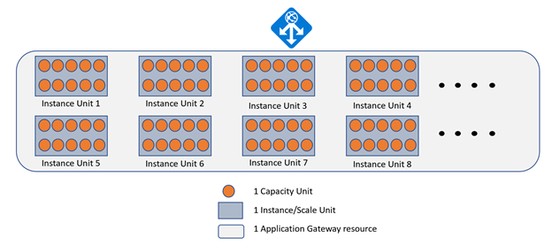
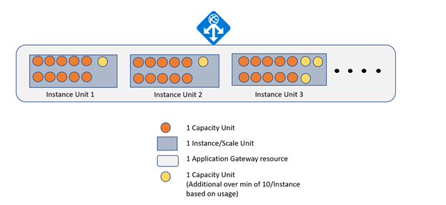
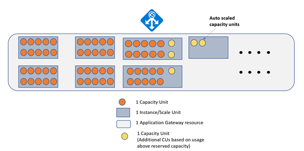
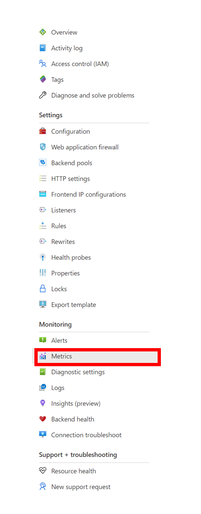

# Understanding Pricing for Azure Application Gateway and Web Application Firewall

> [!NOTE]
> Prices shown in this article are examples and are for illustration purposes only. For pricing information according to your region, see the [Pricing page](https://azure.microsoft.com/pricing/details/application-gateway/).

Azure Application Gateway is a layer 7 load-balancing solution, which enables scalable, highly available, and secure web application delivery on Azure.

There are no upfront costs or termination costs associated with Application Gateway. You're billed only for the resources pre-provisioned and utilized based on actual hourly consumption. Costs associated with Application Gateway are classified into two components: fixed costs and variable costs. Actual costs within each component vary according to the SKU being utilized.

This article describes the costs associated with each SKU and it's recommended that users utilize this document for planning and managing costs associated with the Azure Application Gateway.

## V2 SKUs  

Application Gateway V2 and WAF V2 SKUs support autoscaling and guarantee high availability by default. V2 SKUs are billed based on the consumption and constitute of two parts:

- **Fixed costs**: These costs are based on the time the Application Gateway V2 or WAF V2 is provisioned and available for processing requests. This ensures high availability. There's an associated cost even if zero instances are reserved by specifying `0` in the minimum instance count, as part of autoscaling. 
    - The fixed cost also includes the cost associated with the public IP address attached to the application gateway. 
    - The number of instances running at any point of time isn't considered in calculating fixed costs for V2 SKUs. The fixed costs of running a Standard_V2 (or WAF_V2) are the same per hour, regardless of the number of instances running within the same Azure region.
- **Capacity unit costs**: These costs are based on the number of capacity units that are either reserved or utilized - as required for processing the incoming requests. Consumption based costs are computed hourly.

**Total costs** = **fixed costs** + **capacity unit costs**

> [!NOTE]
> A partial hour is billed as a full hour.

### Capacity Unit 

Capacity Unit is the measure of capacity utilization for an Application Gateway across multiple parameters.

A single Capacity Unit consists of the following parameters:
* 2500 Persistent connections
* 2.22-Mbps throughput
* 1 Compute Unit

The parameter with the highest utilization among these three parameters is used to calculate capacity units for billing purposes.

#### Capacity Unit related to Instance Count
<h4 id="instance-count"></h4>
You can also pre-provision resources by specifying the **Instance Count**. Each instance guarantees a minimum of 10 capacity units in terms of processing capability. The same instance could potentially support more than 10 capacity units for different traffic patterns depending upon the capacity unit parameters.

Manually defined scale and limits set for autoscaling (minimum or maximum) are set in terms of instance count. The manually set scale for instance count and the minimum instance count in autoscale config reserves 10 capacity units/instance. These reserved capacity units are billed as long as the application gateway is active regardless of the actual resource consumption. If actual consumption crosses the 10 capacity units/instance threshold, additional capacity units are billed under the variable component.

#### Total capacity units

Total capacity units are calculated based on the higher of the capacity units by utilization or by instance count.

### Compute unit

**Compute Unit** is the measure of compute capacity consumed. Factors affecting compute unit consumption are TLS connections/second, URL Rewrite computations, and WAF rule processing. The number of requests a compute unit can handle depends on various criteria like TLS certificate key size, key exchange algorithm, header rewrites, and in case of WAF: incoming request size.

Compute unit guidance:
* Basic_v2 (preview) - Each compute unit is capable of approximately 10 connections per second with RSA 2048-bit key TLS certificate.
* Standard_v2 - Each compute unit is capable of approximately 50 connections per second with RSA 2048-bit key TLS certificate.
* WAF_v2 - Each compute unit can support approximately 10 concurrent requests per second for 70-30% mix of traffic with 70% requests less than 2 KB GET/POST and remaining higher. WAF performance isn't affected by response size currently.

The following table shows example prices using Application Gateway Standard v2 SKU. These prices are based on a snapshot of East US pricing and are for illustration purposes only.

#### Fixed Costs (East US region pricing)

|              V2 SKU             |  Costs ($/hr)  |
| ------------------------------- | ---------------|
|            Standard_V2          |     $0.246     |
|              WAF_V2             |     $0.443     |

Monthly price estimates are based on 730 hours of usage per month.

#### Variable Costs (East US region pricing)

|        Capacity Unit         |  Standard_V2 ($/hr)  |  WAF_V2 ($/hr) |
| ---------------------------- | -------------------- | -------------- |
|             1 CU             |        $0.008        |     $0.0144    |

For more pricing information according to your region, see the [pricing page](https://azure.microsoft.com/pricing/details/application-gateway/).

> [!NOTE]
> Outbound data transfers - data going out of Azure data centers from application gateways are charged at standard [data transfer rates](https://azure.microsoft.com/pricing/details/bandwidth/).

### Example 1 (a) – Manual Scaling 
Let’s assume you’ve provisioned a Standard_V2 Application Gateway with manual scaling set to 8 instances for the entire month. During this time, it receives an average of 88.8-Mbps data transfer.

Your Application Gateway costs using the pricing described previously are calculated as follows:

1 CU can handle 2.22-Mbps throughput.

CUs required to handle 88.8 Mbps = 88.8 / 2.22 = 40 CUs 

Pre-provisioned CUs = 8 (Instance count) * 10 = 80 

Since 80 (reserved capacity) > 40 (required capacity), no additional CUs are required. 

Fixed Price = $0.246  * 730 (Hours) =  $179.58

Variable Costs = $0.008 * 8 (Instance Units) * 10 (capacity units) * 730 (Hours) = $467.2

Total Costs = $179.58 + $467.2 = $646.78

### Example 1 (b) – Manual Scaling With traffic going beyond provisioned capacity

Let’s assume you’ve provisioned a Standard_V2 Application Gateway with manual scaling set to 3 instances for the entire month. During this time, it receives an average of 88.8-Mbps data transfer.

Your Application Gateway costs using the pricing described previously are calculated as follows:

1 CU can handle 2.22 Mbps throughput.

CUs required to handle 88.8 Mbps = 88.8 / 2.22 = 40 

Pre-provisioned CUs = 3 (Instance count) * 10 = 30 

Since 40 (required capacity) > 30 (reserved capacity), additional CUs are required.
The number of additional CUs utilized depends on the free capacity available with each instance.

If processing capacity equivalent to 10 additional CUs was available for use within the 3 reserved instances.

Fixed Price = $0.246  * 730 (Hours) =  $179.58

Variable Costs = $0.008 * ( 3 (Instance Units) * 10 (capacity units) + 10 (additional capacity units) ) * 730 (Hours) = $233.6

Total Costs = $179.58 + $233.6 = $413.18

However, if processing capacity equivalent to only say 7 additional CUs was available for use within the 3 reserved instances.
In this scenario the Application Gateway resource is under scaled and could potentially lead to increase in latency or requests getting dropped.

Fixed Price = $0.246  * 730 (Hours) =  $179.58

Variable Costs = $0.008 * ( 3(Instance Units) * 10 (capacity units) + 7 (additional capacity units) ) * 730 (Hours) = $216.08

Total Costs = $179.58 + $216.08 = $395.66

> [!NOTE]
> In case of Manual Scaling, any additional requests exceeding the maximum processing capacity of the reserved instances may cause impact to the availability of your application. In situations of high load, reserved instances may be able to provide more than 10 Capacity units of processing capacity depending upon the configuration and type of incoming requests. But it's recommended to provision the number of instances as per your traffic requirements.

### Example 2 – WAF_V2 instance with Autoscaling

Let’s assume you’ve provisioned a WAF_V2 with autoscaling enabled and set the minimum instance count to 6 for the entire month. The request load caused the WAF instance to scale out and utilize 65 Capacity units (scale out of 5 capacity units, while 60 units were reserved) for the entire month.
Your Application Gateway costs using the pricing described previously are calculated as follows:

Monthly price estimates are based on 730 hours of usage per month.

Fixed Price = $0.443   * 730 (Hours) =  $323.39

Variable Costs = $0.0144  * 65 (capacity units) * 730 (Hours) = $683.28

Total Costs = $323.39 + $683.28 = $1006.67

> [!NOTE]
> Actual Traffic observed for your Application Gateway is unlikely to have such a constant pattern of traffic and the observed load on your Application Gateway fluctuate according to actual usage.

### Example 3 (a) – WAF_V2 instance with Autoscaling and 0 Min scale config

Let’s assume you’ve provisioned a WAF_V2 with autoscaling enabled and set the minimum instance count as 0 for the entire month. The request load on the WAF is minimum but consistently present per hour for the entire month. The load is below the capacity of a single capacity unit.
Your Application Gateway costs using the pricing described previously are calculated as follows:

Monthly price estimates are based on 730 hours of usage per month.

Fixed Price = $0.443   * 730 (Hours) =  $323.39

Variable Costs = $0.0144  * 1 (capacity units) * 730 (Hours) = $10.512

Total Costs = $323.39 + $10.512 = $333.902

### Example 3 (b) – WAF_V2 instance with Autoscaling with 0 Min instance count

Let’s assume you’ve provisioned a WAF_V2 with autoscaling enabled and set the minimum instance count to 0 for the entire month. However, there's 0 traffic directed to the WAF instance for the entire month.
Your Application Gateway costs using the pricing described previously are calculated as follows:

Fixed Price = $0.443   * 730 (Hours) =  $323.39

Variable Costs = $0.0144  * 0 (capacity units) * 730 (Hours) = $0

Total Costs = $323.39 + $0 = $323.39

### Example 3 (c) – WAF_V2 instance with manual scaling set to 1 instance

Let’s assume you’ve provisioned a WAF_V2 and set it to manual scaling with the minimum acceptable value of 1 instance for the entire month. However, there's 0 traffic directed to the WAF for the entire month.
Your Application Gateway costs using the pricing described previously are calculated as follows:

Monthly price estimates are based on 730 hours of usage per month.

Fixed Price = $0.443   * 730 (Hours) =  $323.39

Variable Costs = $0.0144  * 1 (Instance count) * 10 (capacity units) * 730 (Hours) = 
$105.12

Total Costs = $323.39 + $105.12 = $428.51

### Example 4 – WAF_V2 with Autoscaling, capacity unit calculations

Let’s assume you’ve provisioned a WAF_V2 with autoscaling enabled and set the minimum instance count to 0 for the entire month. During this time, it receives 25 new TLS connections/sec with an average of 8.88-Mbps data transfer.
Your Application Gateway costs using the pricing described previously are calculated as follows:

Monthly price estimates are based on 730 hours of usage per month.

Fixed Price = $0.443 * 730 (Hours) =  $323.39

Variable Costs = $0.0144  * 730 (Hours) * {Max (25/50, 8.88/2.22)} = $42.048 (4 Capacity units required to handle 8.88 Mbps)

Total Costs = $323.39 + $42.048 = $365.438

### Example 5 – Standard_V2 with Autoscaling, time-based calculations

Let’s assume you’ve provisioned a standard_V2 with autoscaling enabled and set the minimum instance count to 0 and this application gateway is active for 2 hours.
During the first hour, it receives traffic that can be handled by 10 Capacity Units and during the second hour it receives traffic that required 20 Capacity Units to handle the load.
Your Application Gateway costs using the pricing described previously are calculated as follows:

Fixed Price = $0.246  * 2 (Hours) =  $0.492

Variable Costs = $0.008  * 10 (capacity units) * 1 (Hours)  + $0.008  * 20 (capacity 
units) * 1 (Hours)  = $0.24

Total Costs = $0.492 + $0.24 = $0.732

### Example 6 – WAF_V2 with DDoS Network Protection, and with manual scaling set to 2 instance

Let’s assume you provision a WAF_V2 and set it to manual scaling with 2 instance for the entire month with 2 CUs. Let's also assume that you enable DDoS Network Protection. In this example, since you're paying the monthly fee for DDoS Network Protection, there's no additional charges for WAF; and you're charged at the lower Standard_V2 rates.

Monthly price estimates are based on 730 hours of usage per month.

Fixed Price = $0.246   * 730 (Hours) =  $179.58

Variable Costs = $0.008  * ( 2 (Instance Units) * 10 (capacity units) * 730 (Hours) = $116.8

DDoS Network Protection Cost = $2,944 * 1 (month) = $2,944

Total Costs = $179.58 + $116.8 + $2,944 = $3,240.38

## V1 SKUs

Standard Application Gateway and WAF V1 SKUs are billed as a combination of:

* Fixed Cost

    Cost based on the time a particular type of Application Gateway/WAF is provisioned and running for processing requests.
    The fixed cost component takes in consideration the following factors:
    * Tier - Standard Application Gateway or WAF
    * Size - Small, Medium & Large
    * Instance Count - Number of instances to be deployed

    For N instances, the costs associated are N * cost of one Instance of a particular Tier(Standard & WAF) & Size(Small, Medium & Large) combination.

* Variable Cost

    Cost based on the amount of data processed by the Application Gateway/WAF. Both the request and response bytes processed by the Application Gateway are considered for billing.

Total Cost = Fixed Cost + Variable Cost

### Standard Application Gateway

Fixed Cost & Variable Cost are calculated according to the Application Gateway type.
The following table shows example prices based on a snapshot of East US pricing and are meant for illustration purposes only.

#### Fixed Cost (East US region pricing)

|              Application Gateway Type             |  Costs ($/hr)  |
| ------------------------------------------------- | ---------------|
|                     Small                         |    $0.025      |
|                     Medium                        |    $0.07       |
|                     Large                         |    $0.32       |

Monthly price estimates are based on 730 hours of usage per month.

#### Variable Cost (East US region pricing)

|              Data Processed             |  Small ($/GB)  |  Medium ($/GB) |  Large ($/GB) |
| --------------------------------------- | -------------- | -------------- | ------------- |
| First 10 TB/month                       |     $0.008     |      Free      |     Free      |
| Next 30 TB (10–40 TB)/month             |     $0.008     |     $0.007     |     Free      |
| Over 40 TB/month                        |     $0.008     |     $0.007     |     $0.0035   |

For more pricing information according to your region, see the [pricing page](https://azure.microsoft.com/pricing/details/application-gateway/).

### WAF V1

Fixed Cost & Variable Costs are calculated according to the provisioned Application Gateway type.

The following table shows example prices based on a snapshot of East US pricing and are for illustration purposes only.

#### Fixed Cost (East US region pricing)

|              Application Gateway Type             |  Costs ($/hr)  |
| ------------------------------------------------- | ---------------|
|                     Small                         |       NA       |
|                     Medium                        |     $0.126     |
|                     Large                         |     $0.448     |

Monthly price estimates are based on 730 hours of usage per month.

#### Variable Cost (East US region pricing)

|              Data Processed             |  Small ($/GB)  |  Medium ($/GB) |  Large ($/GB) |
| --------------------------------------- | -------------- | -------------- | ------------- |
| First 10 TB/month                       |     $0.008     |      Free      |     Free      |
| Next 30 TB (10–40 TB)/month             |     $0.008     |     $0.007     |     Free      |
| Over 40 TB/month                        |     $0.008     |     $0.007     |     $0.0035   |

For more pricing information according to your region, see the [pricing page](https://azure.microsoft.com/pricing/details/application-gateway/).

> [!NOTE]
> Outbound data transfers - data going out of Azure data centers from application gateways are charged at standard [data transfer rates](https://azure.microsoft.com/pricing/details/bandwidth/).

### Example 1 (a) – Standard Application Gateway with 1 instance count

Let’s assume you’ve provisioned a standard Application Gateway of medium type with 1 instance and it processes 500 GB in a month. 
Your Application Gateway costs using the pricing described previously are calculated as follows:

Fixed Price = $0.07 * 730 (Hours) =  $51.1
Monthly price estimates are based on 730 hours of usage per month.

Variable Costs = Free (Medium tier has no costs for the first 10 TB processed per month)
Total Costs = $51.1 + 0 = $51.1 

> [!NOTE]
> To support high availability scenarios, it's required to setup a minimum of 2 instances for V1 SKUs. See [SLA for Application Gateway](https://azure.microsoft.com/support/legal/sla/application-gateway/v1_2/)

### Example 1 (b) – Standard Application Gateway with > 1 instance count

Let’s assume you’ve provisioned a standard Application Gateway of medium type with five instances and it processes 500 GB in a month. 
Your Application Gateway costs using the pricing described previously are calculated as follows:

Fixed Price = 5 (Instance count) * $0.07 * 730 (Hours) =  $255.5
Monthly price estimates are based on 730 hours of usage per month.

Variable Costs = Free (Medium tier has no costs for the first 10 TB processed per month)
Total Costs = $255.5 + 0 = $255.5 

### Example 2 – WAF Application Gateway

Let’s assume you’ve provisioned a small type standard Application Gateway and a large type WAF Application Gateway for the first 15 days of the month. The small application gateway processes 15 TB in the duration that it's active and the large WAF application gateway processes 100 TB in the duration that it's active. 
Your Application Gateway costs using the pricing described previously are calculated as follows: 

###### Small instance Standard Application Gateway

24 Hours * 15 Days = 360 Hours

Fixed Price = $0.025 * 360 (Hours) =  $9

Variable Costs = 10 * 1000 *  $0.008/GB + 5 * 1000 * $0.008/GB  = $120

Total Costs = $9 + $120 = $129

###### Large instance WAF Application Gateway
24 Hours * 15 Days = 360 Hours

Fixed Price = $0.448 * 360 (Hours) = $161.28

Variable Costs = 60 * 1000 * $0.0035/GB = $210 (Large tier has no costs for the first 40 TB processed per month)

Total Costs = $161.28 + $210 = $371.28

### Example 3 – WAF Application Gateway with DDoS Network Protection

Let's assume you provision a medium type WAF application Gateway, and you enable DDoS Network Protection. This medium WAF application gateway processes 40 TB in the duration that it's active. Your Application Gateway costs using the pricing method described previously are calculated as follows:

Monthly price estimates are based on 730 hours of usage per month.

Fixed Price = $0.07 * 730 (Hours) = $51.1

Variable Costs = 30 * 1000 * $0.007/GB = $210 (Medium tier has no cost for the first 10 TB processed per month)

DDoS Network Protection Costs = $2,944 * 1 (month) = $2,944

Total Costs = $3,507.08

## Azure DDoS Network Protection 

When Azure DDoS Network Protection is enabled on your application gateway with WAF you're billed at the lower non-WAF rates. Please see [Azure DDoS Protection pricing](https://azure.microsoft.com/pricing/details/ddos-protection/) for more details.

## Monitoring Billed Usage

You can view the amount of consumption for different parameters (compute unit, throughput & persistent connections) as well as the Capacity Units being utilized as part of the Application Gateway metrics under the **Monitoring** section.

### Useful metrics for cost estimation

* Current capacity units

    Count of capacity units consumed to load balance the traffic across the three parameters - Current connections, Throughput and Compute unit

* Fixed Billable Capacity Units

    The minimum number of capacity units kept provisioned as per the minimum instance count setting (one instance translates to 10 capacity units) in the Application Gateway configuration.

* Estimated Billed Capacity units

    The **Estimated Billed Capacity units** metric indicates the number of capacity units estimated for billing. This metric is calculated as the greater value between **Current capacity units** (capacity units required to load balance the traffic) and **Fixed billable capacity units** (minimum capacity units kept provisioned).

More metrics such as throughput, current connections and compute units are also available to understand bottlenecks and estimate the number of capacity units required. Detailed information is available at [Application Gateway Metrics](application-gateway-metrics.md)

#### Example - Estimating Capacity Units being utilized

**Observed Metrics:**

* Compute Units = 17.38
* Throughput = 1.37M Bytes/sec - 10.96 Mbps
* Current Connections = 123.08k
* Capacity Units calculated = max (17.38, 10.96/2.22, 123.08k/2500) = 49.232

Observed Capacity Units in metrics = 49.23

## Next steps

See the following articles to learn more about how pricing works in Azure Application Gateway:

* [Azure Application Gateway pricing page](https://azure.microsoft.com/pricing/details/application-gateway/)
* [Azure Application Gateway pricing calculator](https://azure.microsoft.com/pricing/calculator/?service=application-gateway)
