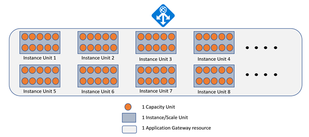
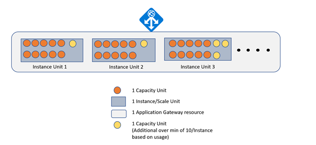
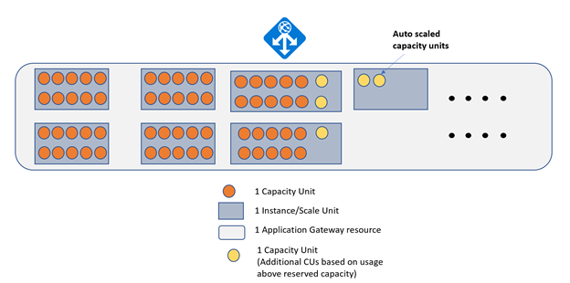
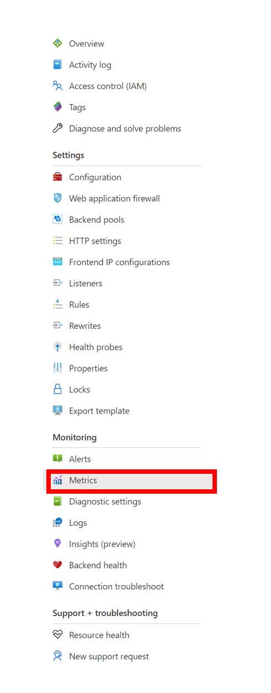

# Understanding Pricing for Azure Application Gateway and Web Application Firewall

> [!NOTE]
> Prices shown in this article are examples and are for illustration purposes only. For pricing information according to your region, see the [Pricing page](https://azure.microsoft.com/pricing/details/application-gateway/).

Azure Application Gateway is a layer 7 load-balancing solution, which enables scalable, highly available, and secure web application delivery on Azure.

There are no upfront costs or termination costs associated with Application Gateway. You're billed only for the resources pre-provisioned and utilized based on actual hourly consumption. Costs associated with Application Gateway are classified into two components: fixed costs and variable costs. Actual costs within each component vary according to the SKU being utilized.

This article describes the costs associated with each SKU and it's recommended that users utilize this document for planning and managing costs associated with the Azure Application Gateway.

## V2 SKUs  

Application Gateway v2 is available in Basic_v2, Standard_v2, and WAF_v2 SKUs. All three SKUs support autoscaling. Standard_v2 and WAF_v2 guarantee high availability by default. V2 SKUs use consumption-based pricing and consist of two parts:

- **Fixed costs**: These costs are based on the time the Basic_v2, Standard_v2, or WAF_v2 application gateway is provisioned and available for processing requests. This provisioning ensures high availability. The fixed cost applies even if you reserve zero instances by specifying `0` in the minimum instance count as part of autoscaling.
    - The fixed cost doesn't include the cost associated with the public IP address attached to the application gateway. 
    - The number of instances running at any point in time isn't considered when calculating fixed costs for v2 SKUs. For each v2 SKU, the fixed hourly cost doesn't change based on the number of instances running within the same Azure region.
- **Capacity unit costs**: These costs are based on the number of capacity units that are either reserved or utilized - as required for processing the incoming requests. Consumption based costs are computed hourly.

**Total costs** = **fixed costs** + **capacity unit costs**

> [!NOTE]
> A partial hour is billed as a full hour.

### Capacity Unit 

Capacity Unit is the measure of capacity utilization for an Application Gateway across multiple parameters.

#### Standard_v2 and WAF_v2 capacity unit

A single Capacity Unit consists of the following parameters:
* 2,500 Persistent connections
* 1 GB per hour (2.22-Mbps) throughput
* 1 Compute Unit

The parameter with the highest utilization among these three parameters is used to calculate capacity units for billing purposes.

#### Capacity Units related to Instance Count
<h4 id="instance-count"></h4>

You can also pre-provision resources by specifying the **Instance Count**. Each instance guarantees a minimum of 10 capacity units in terms of processing capability. The same instance could potentially support more than 10 capacity units for different traffic patterns depending upon the capacity unit parameters.

Manually defined scale and limits set for autoscaling (minimum or maximum) are set in terms of instance count. The manually set scale for instance count and the minimum instance count in autoscale config reserves 10 capacity units/instance. These reserved capacity units are billed as long as the application gateway is active regardless of the actual resource consumption. If actual consumption crosses the 10 capacity units/instance threshold, additional capacity units are billed under the variable component.

#### Total capacity units

Total capacity units are calculated based on the higher of the capacity units by utilization or by instance count.

#### Compute unit

**Compute units** are an entirely different concept from capacity units. Compute units are a measure of compute capacity consumed, while capacity units are a measure of capacity utilization across multiple parameters. Compute units are one of three parameters used to calculate capacity units. Factors affecting compute unit consumption are TLS connections/second, URL Rewrite computations, and WAF rule processing. The number of requests a compute unit can handle depends on various criteria like TLS certificate key size, key exchange algorithm, header rewrites, and in case of WAF: incoming request size.

Compute unit guidance:
* Standard_v2 - Each compute unit is capable of approximately 50 connections per second with RSA 2048-bit key TLS certificate.
* WAF_v2 - Each compute unit can support approximately 10 concurrent requests per second for 70-30% mix of traffic with 70% requests less than 2 KB GET/POST and remaining higher. WAF performance isn't affected by response size currently.

#### Basic_v2 capacity unit

For Application Gateway Basic_v2, measure capacity utilization across connections per second, requests per second, throughput, and persistent connections. The dimension with the highest utilization determines the number of capacity units consumed.


| Capacity-unit dimension | Basic_v2 capacity             |
| ----------------------- | ----------------------------- |
| Connections per second  | 25 connections per CU         |
| Requests per second     | 50 RPS per CU                 |
| Throughput              | 1 GB/hour (~2.22 Mbps per CU) |
| Persistent connections  | 2,500 per CU                  |

Calculate capacity units as follows:

```text
Consumed CUs = MAX(
    Connections/sec / 25,
    Requests/sec / 50,
    Throughput (Mbps) / 2.22,
    Persistent connections / 2,500
)
```

The following tables show example prices for Application Gateway v2 SKUs. These prices are based on a snapshot of East US pricing and are for illustration purposes only.

### How much traffic can an instance handle?

Each instance of Application Gateway Standard_v2 can handle the following traffic:
* 25,000 persistent connections
* 500-Mbps throughput
* 10 compute units

Therefore, in cases where the dominant factor is either compute units or persistent connections, each instance can handle 10 capacity units. In cases where the dominant factor is throughput, each instance can handle approximately 225 capacity units. This data depends on the type of payload.

#### Fixed Costs (East US region pricing)

|              V2 SKU             |  Costs ($/hr)  |
| ------------------------------- | ---------------|
|              Basic_v2           |     $0.0225    |
|            Standard_V2          |     $0.246     |
|              WAF_V2             |     $0.443     |

Monthly price estimates are based on 730 hours of usage per month.

#### Variable Costs (East US region pricing)

| Capacity Unit | Basic_v2 ($/hr) | Standard_V2 ($/hr) | WAF_V2 ($/hr) |
| ------------- | --------------- | ------------------ | ------------- |
| 1 CU          | $0.008          | $0.008             | $0.0144       |

For more pricing information according to your region, see the [pricing page](https://azure.microsoft.com/pricing/details/application-gateway/).

> [!NOTE]
> Outbound data transfers - data going out of Azure data centers from application gateways are charged at standard [data transfer rates](https://azure.microsoft.com/pricing/details/bandwidth/).

### Example 1 (a) – Standard_v2 with manual scaling
Let’s assume you provision a Standard_V2 Application Gateway with manual scaling set to 8 instances for the entire month. During this time, it receives an average of 88.8-Mbps data transfer.

Your Application Gateway costs using the pricing described previously are calculated as follows:

1 CU can handle 2.22-Mbps throughput.

CUs required to handle 88.8 Mbps = 88.8 / 2.22 = 40 CUs 

Pre-provisioned CUs = 8 (Instance count) * 10 = 80 

Since 80 (reserved capacity) > 40 (required capacity), no extra CUs are required. 

Fixed Price = $0.246  * 730 (Hours) =  $179.58

Variable Costs = $0.008 * 8 (Instance Units) * 10 (capacity units) * 730 (Hours) = $467.2

Total Costs = $179.58 + $467.2 = $646.78



### Example 1 (b) – Standard_v2 with manual scaling beyond provisioned capacity

Let’s assume you provision a Standard_V2 Application Gateway with manual scaling set to 3 instances for the entire month. During this time, it receives an average of 88.8-Mbps data transfer.

Your Application Gateway costs using the pricing described previously are calculated as follows:

1 CU can handle 2.22-Mbps throughput.

CUs required to handle 88.8 Mbps = 88.8 / 2.22 = 40 

Pre-provisioned CUs = 3 (Instance count) * 10 = 30 

Since 40 (required capacity) > 30 (reserved capacity), extra CUs are required.
The number of extra CUs utilized depends on the free capacity available with each instance.

If processing capacity equivalent to 10 extra CUs was available for use within the 3 reserved instances.

Fixed Price = $0.246  * 730 (Hours) =  $179.58

Variable Costs = $0.008 * ( 3 (Instance Units) * 10 (capacity units) + 10 (additional capacity units) ) * 730 (Hours) = $233.6

Total Costs = $179.58 + $233.6 = $413.18

However, if processing capacity equivalent to only say 7 extra CUs was available for use within the 3 reserved instances.
In this scenario, the Application Gateway resource is under scaled and could potentially lead to increase in latency or requests getting dropped.

Fixed Price = $0.246  * 730 (Hours) =  $179.58

Variable Costs = $0.008 * ( 3(Instance Units) * 10 (capacity units) + 7 (additional capacity units) ) * 730 (Hours) = $216.08

Total Costs = $179.58 + $216.08 = $395.66




> [!NOTE]
> In case of Manual Scaling, any additional requests exceeding the maximum processing capacity of the reserved instances may cause impact to the availability of your application. In situations of high load, reserved instances may be able to provide more than 10 Capacity units of processing capacity depending upon the configuration and type of incoming requests. But it's recommended to provision the number of instances as per your traffic requirements.

### Example 2 – Standard_v2 with autoscaling

Assume you provision a Standard_V2 with autoscaling enabled and set the minimum instance count to 0. You keep this application gateway active for two hours.  
During the first hour, it receives traffic that 10 capacity units can handle. During the second hour, it receives traffic that requires 20 capacity units to handle the load.  
Calculate your application gateway costs by using the pricing described previously:  

Fixed Price = $0.246 * 2 (hours) = $0.492  

Variable Costs = $0.008  * 10 (capacity units) * 1 (Hours)  + $0.008  * 20 (capacity units) * 1 (Hours)  = $0.24


### Example 3 – WAF_v2 instance with autoscaling

Let’s assume you provision a WAF_V2 with autoscaling enabled and set the minimum instance count to 6 for the entire month. The request load caused the WAF instance to scale out and utilize 65 Capacity units (scale out of 5 capacity units, while 60 units were reserved) for the entire month.
Your Application Gateway costs using the pricing described previously are calculated as follows:

Monthly price estimates are based on 730 hours of usage per month.

Fixed Price = $0.443   * 730 (Hours) =  $323.39

Variable Costs = $0.0144  * 65 (capacity units) * 730 (Hours) = $683.28

Total Costs = $323.39 + $683.28 = $1006.67



> [!NOTE]
> Actual Traffic observed for your Application Gateway is unlikely to have such a constant pattern of traffic and the observed load on your Application Gateway fluctuate according to actual usage.

### Example 4 (a) – WAF_v2 instance with autoscaling and 0 min scale config

Let’s assume you provision a WAF_V2 with autoscaling enabled and set the minimum instance count as 0 for the entire month. The request load on the WAF is minimum but consistently present per hour for the entire month. The load is below the capacity of a single capacity unit.
Your Application Gateway costs using the pricing described previously are calculated as follows:

Monthly price estimates are based on 730 hours of usage per month.

Fixed Price = $0.443   * 730 (Hours) =  $323.39

Variable Costs = $0.0144  * 1 (capacity units) * 730 (Hours) = $10.512

Total Costs = $323.39 + $10.512 = $333.902

### Example 4 (b) – WAF_v2 instance with autoscaling and 0 min instance count

Let’s assume you provision a WAF_V2 with autoscaling enabled and set the minimum instance count to 0 for the entire month. However, there's 0 traffic directed to the WAF instance for the entire month.
Your Application Gateway costs using the pricing described previously are calculated as follows:

Fixed Price = $0.443   * 730 (Hours) =  $323.39

Variable Costs = $0.0144  * 0 (capacity units) * 730 (Hours) = $0

Total Costs = $323.39 + $0 = $323.39

### Example 4 (c) – WAF_v2 instance with manual scaling set to 1 instance

Let’s assume you provision a WAF_V2 and set it to manual scaling with the minimum acceptable value of 1 instance for the entire month. However, there's 0 traffic directed to the WAF for the entire month.
Your Application Gateway costs using the pricing described previously are calculated as follows:

Monthly price estimates are based on 730 hours of usage per month.

Fixed Price = $0.443   * 730 (Hours) =  $323.39

Variable Costs = $0.0144  * 1 (Instance count) * 10 (capacity units) * 730 (Hours) = 
$105.12

Total Costs = $323.39 + $105.12 = $428.51

### Example 5 – WAF_v2 with autoscaling, capacity unit calculations

Let’s assume you provision a WAF_V2 with autoscaling enabled and set the minimum instance count to 0 for the entire month. During this time, it receives 25 new TLS connections/sec with an average of 8.88-Mbps data transfer.
Your Application Gateway costs using the pricing described previously are calculated as follows:

Monthly price estimates are based on 730 hours of usage per month.

Fixed Price = $0.443 * 730 (Hours) =  $323.39

Variable Costs = $0.0144  * 730 (Hours) * {Max (25/50, 8.88/2.22)} = $42.048 (4 Capacity units required to handle 8.88 Mbps)

Total Costs = $323.39 + $42.048 = $365.438

### Example 6 – WAF_v2 with DDoS Network Protection and manual scaling set to 2 instances

Let’s assume you provision a WAF_V2 and set it to manual scaling with 2 instance for the entire month with 2 CUs. Let's also assume that you enable DDoS Network Protection. In this example, since you're paying the monthly fee for DDoS Network Protection, there's no additional charges for WAF; and you're charged at the lower Standard_V2 rates.

Monthly price estimates are based on 730 hours of usage per month.

Fixed Price = $0.246   * 730 (Hours) =  $179.58

Variable Costs = $0.008  * ( 2 (Instance Units) * 10 (capacity units) * 730 (Hours) = $116.8

DDoS Network Protection Cost = $2,944 * 1 (month) = $2,944

Total Costs = $179.58 + $116.8 + $2,944 = $3,240.38

### Example 7 – Basic_v2 with autoscaling

You provision a Basic_v2 application gateway with autoscaling enabled, set the minimum instance count to 0, and keep the application gateway active for two hours. During the first hour, it receives 500 requests per second (RPS). During the second hour, it receives 1,000 RPS. Assume that connections per second, throughput, and persistent connections consume fewer capacity units, so requests per second determines capacity utilization.

At 50 RPS per capacity unit, the first hour requires 10 capacity units and the second hour requires 20 capacity units.

- Fixed price = $0.0225 * 2 hours = $0.045
- Variable costs = $0.008 * 10 capacity units * 1 hour + $0.008 * 20 capacity units * 1 hour = $0.24

## Azure DDoS Network Protection 

When Azure DDoS Network Protection is enabled on your application gateway with WAF you're billed at the lower non-WAF rates. Please see [Azure DDoS Protection pricing](https://azure.microsoft.com/pricing/details/ddos-protection/) for more details.

## Monitoring Billed Usage

You can view the amount of consumption for different parameters (compute unit, throughput & persistent connections) as well as the Capacity Units being utilized as part of the Application Gateway metrics under the **Monitoring** section.



### Useful metrics for cost estimation

* Current capacity units

    Count of capacity units consumed to load balance the traffic across the three parameters - Current connections, Throughput and Compute unit

* Fixed Billable Capacity Units

    The minimum number of capacity units kept provisioned as per the minimum instance count setting (one instance translates to a minimum of 10 capacity units) in the Application Gateway configuration.

* Estimated Billed Capacity units

    The **Estimated Billed Capacity units** metric indicates the number of capacity units estimated for billing. This metric is calculated as the greater value between **Current capacity units** (capacity units required to load balance the traffic) and **Fixed billable capacity units** (minimum capacity units kept provisioned).

More metrics such as throughput, current connections and compute units are also available to understand bottlenecks and estimate the number of capacity units required. Detailed information is available at [Application Gateway Metrics](application-gateway-metrics.md)

#### Example - Estimating Capacity Units being utilized

**Observed Metrics:**

* Compute Units = 17.38
* Throughput = 1.37M Bytes/sec - 10.96 Mbps
* Current Connections = 123.08k
* Capacity Units calculated = max (17.38, 10.96/2.22, 123.08k/2500) = 49.232

Observed Capacity Units in metrics = 49.23

## Next steps

See the following articles to learn more about how pricing works in Azure Application Gateway:

* [Azure Application Gateway pricing page](https://azure.microsoft.com/pricing/details/application-gateway/)
* [Azure Application Gateway pricing calculator](https://azure.microsoft.com/pricing/calculator/?service=application-gateway)
