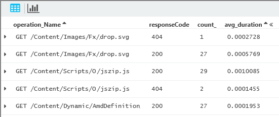
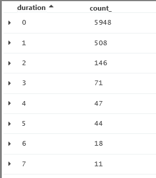
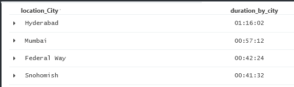
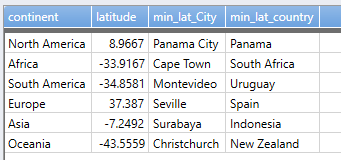
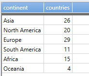
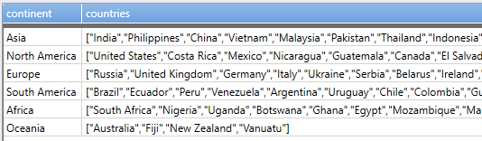
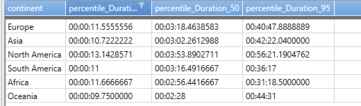

<properties 
	pageTitle="Summarize and aggregation in Analytics in Application Insights" 
	description="Reference for aggregation functions and the summarize statement in Analytics, 
	             the powerful search tool of Application Insights. " 
	services="application-insights" 
    documentationCenter=""
	authors="alancameronwills" 
	manager="douge"/>

<tags 
	ms.service="application-insights" 
	ms.workload="tbd" 
	ms.tgt_pltfrm="ibiza" 
	ms.devlang="na" 
	ms.topic="article" 
	ms.date="03/21/2016" 
	ms.author="awills"/>

# Aggregation in Analytics

[Analytics](app-analytics.md) lets you run powerful queries over the telemetry from your app collected by 
[Application Insights](app-insights-overview.md). These pages describe its query lanquage.

[AZURE.INCLUDE [app-analytics-top-index](../../includes/app-analytics-top-index.md)]


## summarize operator

Produces a table that aggregates the content of the input table.

    purchases
    | summarize avg(Price) 
      by Fruit, Supplier

 

* The input records are collected into groups, so that each group has a specific combination of values in the `by` fields.
* The aggregating expressions are evaluated over the members of each group.
* There's an output row for each distinct combination of values of the 'by' expressions. 
* There's an output column for each aggregate expression and each 'by' expression. All other input columns are dropped.

### Syntax

    T | summarize
         [  [ Column = ] Aggregation [ , ... ]]
         [ by
            [ Column = ] GroupExpression [ , ... ]]

**Arguments**

* *Column:* Optional name for a result column. Defaults to a name derived from the expression.
* *Aggregation:* A call to an aggregation function such as `count()` or `avg()`, with column names as arguments. See the list of aggregation functions below.
* *GroupExpression:* An expression over the columns, that provides a set of distinct values. Typically it's either a column name that already provides a restricted set of values, or `bin()` with a numeric or time column as argument. 

If you provide a numeric or time expression without using `bin()`, Analytics automatically applies it with an interval of `1h` for times, or `1.0` for numbers.

If you don't provide a *GroupExpression,* the whole table is summarized in a single output row.

You must use a simple type, not a dynamic type in the `by` clause. For example, the `tostring` cast here is essential:

    exceptions
	| summarize count()
      by tostring(customDimensions.ClientRequestId)

### Summarize by columns with discrete values

Query to show average response times to different HTTP requests, separating out any requests that had different response codes:

    requests 
    | summarize count(), avg(duration) 
      by operation_Name, resultCode




* The aggregate expressions (like count and avg) have to be formed from aggregate functions documented in this article. Their arguments can be any scalar functions.
* The grouping expressions (after 'by') can be any scalar expressions, but they're more performant if they're just field names.

### Summarize by numeric columns

If we want to group by a continuous scalar such as a number or time, we have to use the `bin` (aka `floor`) function to parcel the continuous range into bins.

    requests
    | summarize count() 
      by bin(duration, 1000)/1000



(The request duration field is a number in milliseconds.)
 
## Tips

* Use `where` to remove all rows you know you don't want before `summarize`.
 * Remove null values. One null value in a group will make the result of the aggregate null. 

```

        requests 
        | where isnotnull(duration) 
        | summarize count(), avg(duration)
          by operation_Name
```

* Although you can provide arbitrary expressions for both the aggregation and grouping expressions, it's more efficient to use simple field names, or apply `bin()` to a numeric field.


## Examples

Find the minimum and maximum timestamp of all records in the Activities table. There is no group-by clause, so there is just one row in the output:

```

requests | summarize Min = min(timestamp), Max = max(timestamp)
```

|`Min`|`Max`
|---|---
|`1975-06-09 09:21:45` | `2015-12-24 23:45:00`


#### Session duration

Sessions in an event log have multiple events. Find the start and end of each session by looking for the earliest and latest events in each session:

```

    requests 
    | where isnotempty(session_Id)
    | summarize start=min(timestamp), stop=max(timestamp) by session_Id 
    | extend duration = bin(stop - start, 1s)
```

The `extend` operation adds the duration column, using `bin` (aka `floor`) to round it to the nearest second.


#### Example: average duration

Now let's find the average session durations for clients in different cities:

```

    requests
    | where isnotempty(session_Id)
    | summarize start=min(timestamp), stop=max(timestamp) 
      by session_Id, client_City 
    | extend duration = stop - start
    | summarize duration_by_city=bin(avg(duration),1s) by client_City
    | top 50 by duration_by_city
```

We added the `client_City` column to the `by` clause so that it will pass through the first summarize operation. Assuming all the events of one client session happen in the same city, it won't add to the number of outputs of the summarize.





#### Example: 

Find the busiest time of day in each client city. By 'busiest' here we mean the time of day at which the maximum number of sessions is begun in an average day.

```
requests  
| summarize start=min(timestamp) by session_Id, city=client_City 
| extend timeofday=start % 1d 
| summarize popularity=dcount(session_Id) by bin(timeofday, 1h), city 
| summarize argmax(popularity, *) by city  
| sort by max_pop_tod asc
```

## AGGREGATIONS

## any 

    any(Expression)

Randomly selects one row of the group and returns the value of the specified expression.

This is useful, for example, when some column has a large number of similar values (e.g., an "error text" column) and you want to sample that column once per a unique value of the compound group key. 

**Example**  

```

traces 
| where timestamp > now(-15min)  
| summarize count(), any(message) by operation_Name 
| top 10 by count_level desc 
```

<a name="argmin"></a>
<a name="argmax"></a>
## argmin, argmax

    argmin(ExprToMinimize, * | ExprToReturn  [ , ... ] )
    argmax(ExprToMaximize, * | ExprToReturn  [ , ... ] ) 

Finds a row in the group that minimizes/maximises *ExprToMaximize*, and returns the value of *ExprToReturn* (or `*` to return the entire row).

**Tip**: The passed-through columns are automatically renamed. To make sure you're using the right names, inspect the results using `take 5` before you pipe the results into another operator.

**Examples**

For each request name, show when the longest request occurred:

    requests | summarize argmax(duration, timestamp) by name

Show all the details of the longest request, not just the timestamp:

    requests | summarize argmax(duration, *) by name


Find the lowest value of each metric, together with its timestamp and other data:

    metrics 
    | summarize minValue=argmin(value, *) 
      by name



 


## avg

    avg(Expression)

Calculates the average of *Expression* across the group.

## buildschema

    buildschema(DynamicExpression)

Returns the minimal schema that admits all values of *DynamicExpression*. 

The parameter column type should be `dynamic` - an array or property bag. 

**Example**

    exceptions | summarize buildschema(details)

Result:

    { "`indexer`":
     {"id":"string",
       "parsedStack":
       { "`indexer`": 
         {  "level":"int",
            "assembly":"string",
            "fileName":"string",
            "method":"string",
            "line":"int"
         }},
      "outerId":"string",
      "message":"string",
      "type":"string",
      "rawStack":"string"
    }}

Notice that `indexer` is used to mark where you should use a numeric index. For this schema, some valid paths would be (assuming these example indexes are in range):

    details[0].parsedStack[2].level
    details[0].message
    arraylength(details)
    arraylength(details[0].parsedStack)

**Example**

Assume the input column has three dynamic values:

| |
|---|
|`{"x":1, "y":3.5}`
|`{"x":"somevalue", "z":[1, 2, 3]}`
|`{"y":{"w":"zzz"}, "t":["aa", "bb"], "z":["foo"]}`


The resulting schema would be:

    { 
      "x":["int", "string"], 
      "y":["double", {"w": "string"}], 
      "z":{"`indexer`": ["int", "string"]}, 
      "t":{"`indexer`": "string"} 
    }

The schema tells us that:

* The root object is a container with four properties named x, y, z and t.
* The property called "x" that could be either of type "int" or of type "string".
* The property called "y" that could of either of type "double", or another container with a property called "w" of type "string".
* The ``indexer`` keyword indicates that "z" and "t" are arrays.
* Each item in the array "z" is either an int or a string.
* "t" is an array of strings.
* Every property is implicitly optional, and any array may be empty.

#### Schema model

The syntax of the returned schema is:

    Container ::= '{' Named-type* '}';
    Named-type ::= (name | '"`indexer`"') ':' Type;
	Type ::= Primitive-type | Union-type | Container;
    Union-type ::= '[' Type* ']';
    Primitive-type ::= "int" | "string" | ...;

They are equivalent to a subset of the TypeScript type annotations, encoded as a dynamic value. In Typescript, the example schema would be:

    var someobject: 
    { 
      x?: (number | string), 
      y?: (number | { w?: string}), 
      z?: { [n:number] : (int | string)},
      t?: { [n:number]: string } 
    }


## count

    count([ Predicate ])

Returns a count of rows for which *Predicate* evaluates to `true`. If no *Predicate* is specified, returns the total number of records in the group. 

**Perf tip**: use `summarize count(filter)` instead of `where filter | summarize count()`
   

## dcount

    dcount( Expression [ ,  Accuracy ])

Returns an estimate of the number of distinct values of *Expr* in the group. (To list the distinct values, use [`makeset`](#makeset).)

*Accuracy*, if specified, controls the balance between speed and accuracy.

 * `0` = the least accurate and fastest calculation.
 * `1` the default, which balances accuracy and calculation time; about 0.8% error.
 * `2` = most accurate and slowest calculation; about 0.4% error.

**Example**

    pageViews 
    | summarize countries=dcount(client_City) 
      by client_CountryOrRegion



## makelist

    makelist(Expr [ ,  MaxListSize ] )

Returns a `dynamic` (JSON) array of all the values of *Expr* in the group. 

* *MaxListSize* is an optional integer limit on the maximum number of elements returned (default is *128*).

## makeset

    makeset(Expression [ , MaxSetSize ] )

Returns a `dynamic` (JSON) array of the set of distinct values that *Expr* takes in the group. (Tip: to just count the distinct values, use [`dcount`](#dcount).)
  
*  *MaxSetSize* is an optional integer limit on the maximum number of elements returned (default is *128*).

**Example**

    pageViews 
    | summarize countries=makeset(client_City) 
      by client_CountryOrRegion



See also the [`mvexpand` operator](app-analytics-queries.md#mvexpand-operator) for the opposite function.


## max, min

    max(Expr)

Calculates the maximum of *Expr*.
    
    min(Expr)

Calculates the minimum of *Expr*.

**Tip**: This gives you the min or max on its own - for example, the highest or lowest price. But if you want other columns in the row - for example, the name of the supplier with the lowest price - use [argmin or argmax](#argmin-argmax).


<a name="percentile"></a>
<a name="percentiles"></a>
## percentile, percentiles

    percentile(Expression, Percentile)

Returns an estimate for *Expression* of the specified percentile in the group. The accuracy depends on the density of population in the region of the percentile.
    
    percentiles(Expression, Percentile1 [ , Percentile2 ] )

Like `percentile()`, but calculates a number of percentile values (which is faster than calculating each percentile individually).

**Examples**


The value of `duration` that is larger than 95% of the sample set and smaller than 5% of the sample set, calculated for each request name:

    request 
    | summarize percentile(duration, 95)
      by name

Omit "by..." to calculate for the whole table.

Simultaneously calculate several percentiles for different request names:

    
    requests 
    | summarize 
        percentiles(duration, 5, 20, 50, 80, 95) 
      by name



The results show that for the request /Events/Index, 5% of requests are responded to in less than 2.44s,  half of them in 3.52s, and 5% are slower than 6.85s.


Calculate multiple statistics:

    requests 
    | summarize 
        count(), 
        avg(Duration),
        percentiles(Duration, 5, 50, 95)
      by name

#### Estimation error in percentiles

The percentiles aggregate provides an approximate value using [T-Digest](https://github.com/tdunning/t-digest/blob/master/docs/t-digest-paper/histo.pdf). 

A few important points: 

* The bounds on the estimation error vary with the value of the requested percentile. The best accuracy is at the ends of [0..100] scale, percentiles 0 and 100 are the exact minimum and maximum values of the distribution. The accuracy gradually decreases towards the middle of the scale. It is worst at the median and is capped at 1%. 
* Error bounds are observed on the rank, not on the value. Suppose percentile(X, 50) returned value of Xm. The estimation guarantees that at least 49% and at most 51% of the values of X are less than Xm. There is no theoretical limit on the difference  between Xm and actual median value of X.

## stdev

     stdev(Expr)

Returns the standard deviation of *Expr* over the group.

## variance

    variance(Expr)

Returns the variance of *Expr* over the group.

## sum

    sum(Expr)

Returns the sum of *Expr* over the group.                      


[AZURE.INCLUDE [app-analytics-footer](../../includes/app-analytics-footer.md)]


