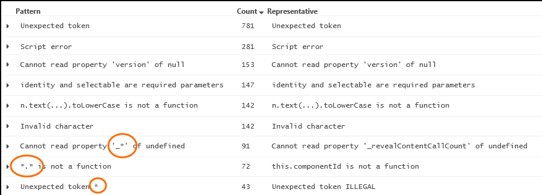

<properties 
	pageTitle="Analytics operators and queries in Application Insights" 
	description="Reference for the operators used to make queries in Analytics, 
	             the powerful search tool of Application Insights." 
	services="application-insights" 
    documentationCenter=""
	authors="alancameronwills" 
	manager="douge"/>

<tags 
	ms.service="application-insights" 
	ms.workload="tbd" 
	ms.tgt_pltfrm="ibiza" 
	ms.devlang="na" 
	ms.topic="article" 
	ms.date="03/21/2016" 
	ms.author="awills"/>

# Queries in Analytics


[Analytics](app-analytics.md) lets you run powerful queries over the telemetry from your app collected by 
[Application Insights](app-insights-overview.md). These pages describe its query lanquage.


[AZURE.INCLUDE [app-analytics-top-index](../../includes/app-analytics-top-index.md)]

A query over your telemetry is made up of a reference to a source stream, followed by a pipeline of filters. For example:


```AIQL
requests
| where client_City == "London" and timestamp > ago(3d)
| count
```
    
Each filter prefixed by the pipe character `|` is an instance of an *operator*, with some parameters. The input to the operator is the table that is the result of the preceding pipeline. In most cases, any parameters are [scalar expressions](app-analytics-scalars.md) over the columns of the input. In a few cases, the parameters are the names of input columns, and in a few cases, the parameter is a second table. The result of a query is always a table, even if it only has one column and one row.

A query may be prefixed by one or more [let clauses](#let-clause), which define scalars, tables, or functions that can be used within the query.

```AIQL

    let interval = 3d ;
    let city = "London" ;
    let req = (city:string) {
      requests
      | where client_City == city and timestamp > ago(interval) };
    req(city) | count
```

> `T` is used in query examples below to denote the preceding pipeline or source table.

## count operator

The `count` operator returns the number of records (rows) in the input record set.

**Syntax**

    T | count

**Arguments**

* *T*: The tabular data whose records are to be counted.

**Returns**

This function returns a table with a single record and column of type
`long`. The value of the only cell is the number of records in *T*. 

**Example**

```AIQL
requests | count
```


## extend operator

     T | extend duration = stopTime - startTime

Append one or more calculated columns to a table. 


**Syntax**

    T | extend ColumnName = Expression [, ...]

**Arguments**

* *T:* The input table.
* *ColumnName:* The name of a columns to add. 
* *Expression:* A calculation over the existing columns.

**Returns**

A copy of the input table, with the specified additional columns.

**Tips**

* Use [`project`](#project-operator) instead, if you also want to drop or rename some columns.
* Don't use `extend` simply to get a shorter name to use in a long expression. `...| extend x = anonymous_user_id_from_client | ... func(x) ...` 

    The native columns of the table have been indexed; your new name defines an additional column that isn't indexed, so the query is likely to run slower.

**Example**

```AIQL
traces
| extend
    Age = now() - timestamp
```


## join operator

    Table1 | join (Table2) on CommonColumn

Merges the rows of two tables by matching values of the specified column.


**Syntax**

    Table1 | join [kind=Kind] (Table2) on CommonColumn [, ...]

**Arguments**

* *Table1* - the 'left side' of the join.
* *Table2* - the 'right side' of the join. It can be a nested query expression that outputs a table.
* *CommonColumn* - a column that has the same name in the two tables.
* *Kind* - specifies how rows from the two tables are to be matched.

**Returns**

A table with:

* A column for every column in each of the two tables, including the matching keys. The columns of the right side will be automatically renamed if there are name clashes.
* A row for every match between the input tables. A match is a row selected from one table that has the same value for all the `on` fields as a row in the other table. 

* `Kind` unspecified

    Only one row from the left side is matched for each value of the `on` key. The output contains a row for each match of this row with rows from the right.

* `Kind=inner`
 
     There's a row in the output for every combination of matching rows from left and right.

* `kind=leftouter` (or `kind=rightouter` or `kind=fullouter`)

     In addition to the inner matches, there's a row for every row on the left (and/or right), even if it has no match. In that case, the unmatched output cells contain nulls.

* `kind=leftanti`

     Returns all the records from the left side that do not have matches from the right. The result table just has the columns from the left side. 
 
If there are several rows with the same values for those fields, you'll get rows for all the combinations.

**Tips**

For best performance:

* Use `where` and `project` to reduce the numbers of rows and columns in the input tables, before the `join`. 
* If one table is always smaller than the other, use it as the left (piped) side of the join.
* The columns for the join match must have the same name. Use the project operator if necessary to rename a column in one of the tables.

**Example**

Get extended activities from a log in which some entries mark the start and end of an activity. 

```AIQL
    let Events = MyLogTable | where type=="Event" ;
    Events
    | where Name == "Start"
    | project Name, City, ActivityId, StartTime=timestamp
    | join (Events
           | where Name == "Stop"
           | project StopTime=timestamp, ActivityId)
        on ActivityId
    | project City, ActivityId, StartTime, StopTime, Duration, StopTime, StartTime

```

[About join flavors](app-analytics-samples.md#join-flavors).

## let clause

**Tabular let - naming a table**

    let recentReqs = requests | where timestamp > ago(3d); 
    recentReqs | count

**Scalar let - naming a value**

    let interval = 3d; 
    requests | where timestamp > ago(interval)

**Lambda let - naming a function**

    let Recent = 
       (interval:timespan) { requests | where timestamp > ago(interval) };
    Recent(3h) | count

A let clause binds a name to a tablular result, scalar value or function. The clause is a prefix to a query, and the scope of the binding is that query. (Let doesn't provide a way to name things that you use later in your session.)

**Syntax**

    let name = scalar_constant_expression ; query

    let name = query ; query

    let name = (parameterName : type [, ...]) { plain_query }; query

* *type:* `bool`, `int`, `long`, `double`, `string`, `timespan`, `datetime`, `guid`, [`dynamic`](app-analytics-scalars.md#dynamic-type)
* *plain_query:* A query not prefixed by a let-clause.

**Examples**


    let rows(n:long) = range steps from 1 to n step 1;
    rows(10) | ...


Self-join:

    let Recent = events | where timestamp > ago(7d);
    Recent | where name contains "session_started" 
    | project start = timestamp, session_id
    | join (Recent 
        | where name contains "session_ended" 
        | project stop = timestamp, session_id)
      on session_id
    | extend duration = stop - start 

## limit operator

     T | limit 5

Returns up to the specified number of rows from the input table. There is no guarantee which records are returned. (To return specific records, use [`top`](#top-operator).)

**Alias** `take`

**Syntax**

    T | limit NumberOfRows


**Tips**

`Take` is a simple and efficient way to see a sample of your results when you're working interactively. Be aware that it doesn't guarantee to produce any particular rows, or to produce them in any particular order.

There's an implicit limit on the number of rows returned to the client, even if you don't use `take`. To lift this limit, use the `notruncation` client request option.


## mvexpand operator

    T | mvexpand listColumn 

Expands an list from a dynamic-typed (JSON) cell so that each entry has a separate row. All the other cells in an expanded row are duplicated. 

(See also [`summarize makelist`](#summarize-operator) which performs the opposite function.)

**Example**

Assume the input table is:

|A:int|B:string|D:dynamic|
|---|---|---|
|1|"hello"|{"key":"value"}|
|2|"world"|[0,1,"k","v"]|

    mvexpand D

Result is:

|A:int|B:string|D:dynamic|
|---|---|---|
|1|"hello"|{"key":"value"}|
|2|"world"|0|
|2|"world"|1|
|2|"world"|"k"|
|2|"world"|"v"|


**Syntax**

    T | mvexpand  [bagexpansion=(bag | array)] ColumnName [limit Rowlimit]

    T | mvexpand  [bagexpansion=(bag | array)] [Name =] ArrayExpression [to typeof(Typename)] [limit Rowlimit]

**Arguments**

* *ColumnName:* In the result, arrays in the named column are expanded to multiple rows. 
* *ArrayExpression:* An expression yielding an array. If this form is used, a new column is added and the existing one is preserved.
* *Name:* A name for the new column.
* *Typename:* Casts the expanded expression to a particular type
* *RowLimit:* The maximum number of rows generated from each original row. The default is 128.

**Returns**

Multiple rows for each of the values in any array in the named column or in the array expression.

The expanded column always has dynamic type. Use a cast such as `todatetime()` or `toint()` if you want to compute or aggregate values.

Two modes of property-bag expansions are supported:

* `bagexpansion=bag`: Property bags are expanded into single-entry property bags. This is the default expansion.
* `bagexpansion=array`: Property bags are expanded into two-element `[`*key*`,`*value*`]` array structures,
  allowing uniform access to keys and values (as well as, for example, running a distinct-count aggregation
  over property names). 

**Examples**


    exceptions | take 1 
    | mvexpand details[0]

Splits an exception record into rows for each item in the details field.

See [Chart count of live activites over time](app-analytics-samples.md#concurrent-activities).


## parse operator

    T | parse "I am 63 next birthday" with "I am" Year:int "next birthday"

    T | parse kind=regex "My 62nd birthday" 
        with "My" Year:regex("[0..9]+") regex("..") "birthday"

Extracts values from a string. Can use simple or regular expression matching.

The elements in the `with` clause are matched against the source string in turn. Each element chews off a chunk of the source text. If it's a plain string, the matching cursor moves along as far as the match. If it's a column with a type name, the cursor moves along far enough to parse the specified type. (String matches move along until a match to the next element is found.) If it's a regex, the regular expression is matched (and the resulting column always has string type).

**Syntax**

    T | parse StringExpression with [SimpleMatch | Column:Type] ...

    T | parse kind=regex StringExpression 
        with [SimpleMatch | Column : regex("Regex")] ...

**Arguments**

* *T:* The input table.
* *kind:* simple or regex. The default is simple.
* *StringExpression:* An expression that evaluates to or can be converted to a string.
* *SimpleMatch:* A string that matches the next part of the text.
* *Column:* Specifies the new column to assign a match to.
* *Type:* Specifies how to parse the next part of the source string.
* *Regex:* A regular expression to match the next part of the string. 

**Returns**

The input table, extended according to the list of Columns.


**Examples**

The `parse` operator provides a streamlined way to `extend` a table
by using multiple `extract` applications on the same `string` expression.
This is most useful when the table has a `string` column that contains
several values that you want to break into individual columns, such as a
column that was produced by a developer trace ("`printf`"/"`Console.WriteLine`")
statement.

In the example below, assume that the column `EventNarrative` of table `StormEvents` contains
strings of the form `{0} at {1} crested at {2} feet around {3} on {4} {5}`. The operation
below will extend the table with two columns: `SwathSize`, and `FellLocation`.


|EventNarrative|
|---|
|The Green River at Brownsville crested at 18.8 feet around 0930EST on December 12. Flood stage at Brownsville is 18 feet. Minor flooding occurs at this level. The river overflows lock walls and some of the lower banks, along with some agricultural bottom land.|
|The Rolling Fork River at Boston crested at 39.3 feet around 1700EST on December 12. Flood stage at Boston is 35 feet. Minor flooding occurs at this level, with some agricultural bottom land covered.|
|The Green River at Woodbury crested at 36.7 feet around 0600EST on December 16. Flood stage at Woodbury is 33 feet. Minor flooding occurs at this level, with some lowlands around the town of Woodbury covered with water.|
|The Ohio River at Tell City crested at 39.0 feet around 7 AM EST on December 18. Flood stage at Tell City is 38 feet. At this level, the river begins to overflow its banks above the gage. Indiana Highway 66 floods between Rome and Derby.|

```AIQL

StormEvents 
|  parse EventNarrative 
   with RiverName:string 
        "at" 
        Location:string 
        "crested at" 
        Height:double  
        "feet around" 
        Time:string 
        "on" 
        Month:string 
        " " 
        Day:long 
        "." 
        notImportant:string
| project RiverName , Location , Height , Time , Month , Day

```

|RiverName|Location|Height|Time|Month|Day|
|---|---|---|---|---|---|
|The Green River | Woodbury |36.7| 0600EST | December|16|
|The Rolling Fork River | Boston |39.3| 1700EST | December|12|
|The Green River | Brownsville |18.8| 0930EST | December|12|
|The Ohio River | Tell City |39| 7 AM EST | December|18|

It is also possible to match using regular expressions. This produces the same result but all the result columns have string type:

```AIQL

StormEvents
| parse kind=regex EventNarrative 
  with RiverName:regex("(\\s?[a-zA-Z]+\\s?)+") 
  "at" Location:regex(".*") 
  "crested at " Height:regex("\\d+\\.\\d+") 
  " feet around" Time:regex(".*") 
  "on " Month:regex("(December|November|October)") 
   " " Day:regex("\\d+") 
   "." notImportant:regex(".*")
| project RiverName , Location , Height , Time , Month , Day
```


## project operator

    T | project cost=price*quantity, price

Select the columns to include, rename or drop, and insert new computed columns. The order of the columns in the result is specified by the order of the arguments. Only the columns specified in the arguments are included in the result: any others in the input are dropped.  (See also `extend`.)


**Syntax**

    T | project ColumnName [= Expression] [, ...]

**Arguments**

* *T:* The input table.
* *ColumnName:* The name of a column to appear in the output. If there is no *Expression*, a column of that name must appear in the input. 
* *Expression:* Optional scalar expression referencing the input columns. 

    It is legal to return a new calculated column with the same name as an existing column in the input.

**Returns**

A table that has the columns named as arguments, and as many rows as the input table.

**Example**

The following example shows several kinds of manipulations that can be done
using the `project` operator. The input table `T` has three columns of type `int`: `A`, `B`, and `C`. 

```AIQL
T
| project
    X=C,                       // Rename column C to X
    A=2*B,                     // Calculate a new column A from the old B
    C=strcat("-",tostring(C)), // Calculate a new column C from the old C
    B=2*B                      // Calculate a new column B from the old B
```


[More examples](app-analytics-samples.md#activities).


## range operator

    range LastWeek from ago(7d) to now() step 1d

Generates a single-column table of values. Notice that it doesn't have a pipeline input. 

|LastWeek|
|---|
|2015-12-05 09:10:04.627|
|2015-12-06 09:10:04.627|
|...|
|2015-12-12 09:10:04.627|


**Syntax**

    range ColumnName from Start to Stop step Step

**Arguments**

* *ColumnName:* The name of the single column in the output table.
* *Start:* The smallest value in the output.
* *Stop:* The highest value being generated in the output (or a bound
on the highest value, if *step* steps over this value).
* *Step:* The difference between two consecutive values. 

The arguments must be numeric, date or timespan values. They can't reference the columns of any table. (If you want to compute the range based on an input table, use the [range *function*](app-analytics-scalars.md#range), maybe with the [mvexpand operator](#mvexpand-operator).) 

**Returns**

A table with a single column called *ColumnName*,
whose values are *Start*, *Start* + *Step*, ... up to and including *Stop*.

**Example**  

```AIQL
range Steps from 1 to 8 step 3
```

A table with a single column called `Steps`
whose type is `long` and whose values are `1`, `4`, and `7`.

**Example**

    range LastWeek from bin(ago(7d),1d) to now() step 1d

A table of midnight at the past seven days. The bin (floor) function reduces each time to the start of the day.

**Example**  

```AIQL
range timestamp from ago(4h) to now() step 1m
| join kind=fullouter
  (traces
      | where timestamp > ago(4h)
      | summarize Count=count() by bin(timestamp, 1m)
  ) on timestamp
| project Count=iff(isnull(Count), 0, Count), timestamp
| render timechart  
```

Shows how the `range` operator can be used to create
a small, ad-hoc, dimension table which is then used to introduce zeros where the source data has no values.

## reduce operator

    exceptions | reduce by outerMessage

Tries to group together similar records. For each group, the operator outputs the `Pattern` it thinks best describes that group, and the `Count` of records in that group.




**Syntax**

    T | reduce by  ColumnName [ with threshold=Threshold ]

**Arguments**

* *ColumnName:* The column to examine. It must be of string type.
* *Threshold:* A value in the range {0..1}. Default is 0.001. For large inputs, threshold should be small. 

**Returns**

Two columns, `Pattern` and `Count`. In many cases, Pattern will be a complete value from the column. In some cases, it can identify common terms and replace the variable parts with '*'.

For example, the result of `reduce by city` might include: 

|Pattern | Count |
|---|---|
| San * | 5182 |
| Saint * | 2846 |
| Moscow | 3726 |
| \* -on- \* | 2730 |
| Paris | 27163 |


## render directive

    T | render [ table | timechart  | barchart | piechart ]

Render directs the presentation layer how to show the table. It should be the last element of the pipe. It's a convenient alternative to using the controls on the display, allowing you to save a query with a particular presentation method.


## sort operator 

    T | sort by country asc, price desc

Sort the rows of the input table into order by one or more columns.

**Alias** `order`

**Syntax**

    T  | sort by Column [ asc | desc ] [ `,` ... ]

**Arguments**

* *T:* The table input to sort.
* *Column:* Column of *T* by which to sort. The type of the values must be numeric, date, time or string.
* `asc` Sort by into ascending order, low to high. The default is `desc`, descending high to low.

**Example**

```AIQL
Traces
| where ActivityId == "479671d99b7b"
| sort by Timestamp asc
```
All rows in table Traces that have a specific `ActivityId`, sorted by their timestamp.

## summarize operator

Produces a table that aggregates the content of the input table.
 
    requests
	| summarize count(), avg(duration), makeset(client_City) 
      by client_CountryOrRegion

A table that shows the number, average request duration and set of cities in each country. There's a row in the output for each distinct country. The output columns show the count, average duration, cities and country. All other input columns are ignored.


    T | summarize count() by price_range=bin(price, 10.0)

A table that shows how many items have prices in each interval  [0,10.0], [10.0,20.0], and so on. This example has a column for the count and one for the price range. All other input columns are ignored.

[More examples](app-analytics-aggregations.md).


**Syntax**

    T | summarize
         [  [ Column = ] Aggregation [ `,` ... ] ]
         [ by
            [ Column = ] GroupExpression [ `,` ... ] ]

**Arguments**

* *Column:* Optional name for a result column. Defaults to a name derived from the expression.
* *Aggregation:* A call to an [aggregation function](app-analytics-aggregations.md) such as `count()` or `avg()`, with column names as arguments. See the [list of aggregation functions](app-analytics-aggregations.md).
* *GroupExpression:* An expression over the columns, that provides a set of distinct values. Typically it's either a column name that already provides a restricted set of values, or `bin()` with a numeric or time column as argument. 

If you provide a numeric or time expression without using `bin()`, Analytics automatically applies it with an interval of `1h` for times, or `1.0` for numbers.

If you don't provide a *GroupExpression,* the whole table is summarized in a single output row.


**Returns**

The input rows are arranged into groups having the same values of the `by` expressions. Then the specified aggregation functions are computed over each group, producing a row for each group. The result contains the `by` columns and also at least one column for each computed aggregate. (Some aggregation functions return multiple columns.)

The result has as many rows as there are distinct combinations of `by` values. If you want to summarize over ranges of numeric values, use `bin()` to reduce ranges to discrete values.

**Note**

Although you can provide arbitrary expressions for both the aggregation and grouping expressions, it's more efficient to use simple column names, or apply `bin()` to a numeric column.


## take operator

Alias of [limit](#limit-operator)


## top operator

    T | top 5 by Name desc

Returns the first *N* records sorted by the specified columns.


**Syntax**

    T | top NumberOfRows by Sort_expression [ `asc` | `desc` ] [, ... ]

**Arguments**

* *NumberOfRows:* The number of rows of *T* to return.
* *Sort_expression:* An expression by which to sort the rows. It's typically just a column name. You can specify more than one sort_expression.
* `asc` or `desc` (the default) may appear to control whether
selection is actually from the "bottom" or "top" of the range.


**Tips**

`top 5 by name` is superficially equivalent to `sort by name | take 5`. However, it runs faster and always returns sorted results, whereas `take` makes no such guarantee.


## union operator

     Table1 | union Table2, Table3

Takes two or more tables and returns the rows of all of them. 

**Syntax**

    T | union [ kind= inner | outer ] [ withsource = ColumnName ] Table2 [ , ...]  

    union [ kind= inner | outer ] [ withsource = ColumnName ] Table1, Table2 [ , ...]  

**Arguments**

* *Table1*, *Table2* ...
 *  The name of a table, such as `events`; or
 *  A query expression, such as `(events | where id==42)`
 *  A set of tables specified with a wildcard. For example, `E*` would form the union of all the tables in the database whose names begin `E`.
* `kind`: 
 * `inner` - The result has the subset of columns that are common to all of the input tables.
 * `outer` - The result has all the columns that occur in any of the inputs. Cells that were not defined by an input row are set to `null`.
* `withsource=`*ColumnName:* If specified, the output will include a column
called *ColumnName* whose value indicates which source table has contributed each row.

**Returns**

A table with as many rows as there are in all the input tables.

**Example**

```AIQL

let ttrr = requests | where timestamp > ago(1h);
let ttee = exceptions | where timestamp > ago(1h);
union tt* | count
```
Union of all tables whose names begin "tt".


**Example**

```AIQL

union withsource=SourceTable kind=outer Query, Command
| where Timestamp > ago(1d)
| summarize dcount(UserId)
```
The number of distinct users that have produced
either a `exceptions` event or a `traces` event over the past day. In the result, the 'SourceTable' column will indicate either "Query" or "Command".

```AIQL
exceptions
| where Timestamp > ago(1d)
| union withsource=SourceTable kind=outer 
   (Command | where Timestamp > ago(1d))
| summarize dcount(UserId)
```

This more efficient version produces the same result. It filters each table before creating the union.

## where operator

     T | where fruit=="apple"

Filters a table to the subset of rows that satisfy a predicate.

**Alias** `filter`

**Syntax**

    T | where Predicate

**Arguments**

* *T:* The tabular input whose records are to be filtered.
* *Predicate:* A `boolean` [expression](app-analytics-scalars.md#boolean) over the columns of *T*. It is evaluated for each row in *T*.

**Returns**

Rows in *T* for which *Predicate* is `true`.

**Tips**

To get the fastest performance:

* **Use simple comparisons** between column names and constants. ('Constant' means constant over the table - so `now()` and `ago()` are OK, and so are scalar values assigned using a [`let` statement](app-analytics-syntax.md#let-statements).)

    For example, prefer `where Timestamp >= ago(1d)` to `where floor(Timestamp, 1d) == ago(1d)`.

* **Simplest terms first**: If you have multiple clauses conjoined with `and`, put first the clauses that involve just one column. So `Timestamp > ago(1d) and OpId == EventId` is better than the other way around.


**Example**

```AIQL
Traces
| where Timestamp > ago(1h)
    and Source == "Kuskus"
    and ActivityId == SubActivityIt 
```

Records that are no older than 1 hour,
and come from the Source called "Kuskus", and have two columns of the same value. 

Notice that we put the comparison between two columns last, as it can't utilize the index and forces a scan.


[AZURE.INCLUDE [app-analytics-footer](../../includes/app-analytics-footer.md)]


