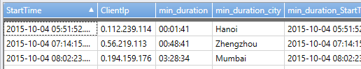
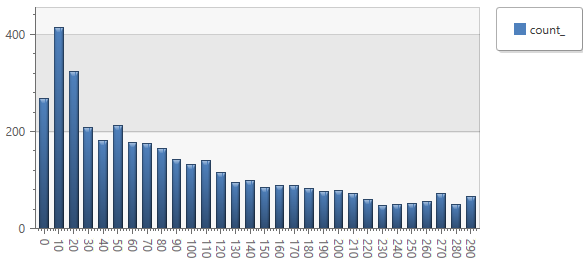

<properties 
	pageTitle="Samples of queries in Application Insights - Analytics" 
	description="Samples of queries in Application Insights - Analytics, 
	             the powerful search tool for Application Insights. " 
	services="application-insights" 
    documentationCenter=""
	authors="alancameronwills" 
	manager="douge"/>

<tags 
	ms.service="application-insights" 
	ms.workload="tbd" 
	ms.tgt_pltfrm="ibiza" 
	ms.devlang="na" 
	ms.topic="article" 
	ms.date="03/21/2016" 
	ms.author="awills"/>

# Analytics samples for Application Insights

[Analytics](app-analytics.md) lets you run powerful queries over the telemetry from your app collected by 
[Application Insights](app-insights-overview.md). These pages describe its query lanquage.
There's also 
a [tour of the language](app-analytics-tour.md), which is recommended for getting started.


[AZURE.INCLUDE [app-analytics-top-index](../../includes/app-analytics-top-index.md)]

## Query best practices 

There are several do's and don'ts you can follow to make your query run faster.

DO:

-	Use time filters first. Application Insights - Analytics is highly optimized to utilize time filters.
-	Put filters that are expected to get rid most of the data in the beginning of the query (right after time filters)
-	Check that most of your filters are appearing in the beginning of the query (before you start using 'extend') 
-	Prefer 'has' keyword over 'contains' when looking for full tokens. 'has' is more performant as it doesn't have to look-up for substrings.
-	Prefer looking in specific column rather than using '*' (full text search across all columns)
-	When using join - project only needed columns from both sides of the join (this will reduce payload pulled from one machine to another)

AVOID: 

-	Trying new queries without 'limit [small number]' or 'count' at the end. 
    Running unbound queries over unknown data set may yield GBs of results to be returned to the client, resulting in slow response and cluster being busy.
-	If you find that you're applying conversions (JSON, string, etc) over 1B+ records - reshape your query to reduce amount of data fed into the conversion


<a name="activities"></a>
## Get sessions from start and stop events

Let's suppose we have a log of events, in which some events mark the start or end of an extended activity or session. 

|Name|City|SessionId|Timestamp|
|---|---|---|---|
|Start|London|2817330|2015-12-09T10:12:02.32|
|Game|London|2817330|2015-12-09T10:12:52.45|
|Start|Manchester|4267667|2015-12-09T10:14:02.23|
|Stop|London|2817330|2015-12-09T10:23:43.18|
|Cancel|Manchester|4267667|2015-12-09T10:27:26.29|
|Stop|Manchester|4267667|2015-12-09T10:28:31.72|

Every event has an SessionId, so the problem is to match up the start and stop events with the same id.

```AIQL
let Events = MyLogTable | where ... ;

Events
| where Name == "Start"
| project Name, City, SessionId, StartTime=timestamp
| join (Events 
        | where Name="Stop"
        | project StopTime=timestamp, SessionId) 
    on activityId
| project City, SessionId, StartTime, StopTime, Duration = StopTime - StartTime
```

Use [`let`](app-analytics-syntax.md#let-statements) to name a projection of the table that is pared down as far as possible before going into the join.
[`Project`](app-analytics-queries.md#project-operator) is used to change the names of the timestamps so that both the start and stop times can appear in the result. It also selects the other columns we want to see in the result. [`join`](app-analytics-queries.md#join-operator)  matches up the start and stop entries for the same activity, creating a  row for each activity. Finally, `project` again adds a column to show the duration of the activity.


|City|SessionId|StartTime|StopTime|Duration|
|---|---|---|---|---|
|London|2817330|2015-12-09T10:12:02.32|2015-12-09T10:23:43.18|00:11:40.46|
|Manchester|4267667|2015-12-09T10:14:02.23|2015-12-09T10:28:31.72|00:14:29.49|

### Get sessions, without session id

Now let's suppose that the start and stop events don't conveniently have a session id that we can match on. But we do have an IP address of the client where the session took place. Assuming each client address only conducts one session at a time, we can match each start event to the next stop event from the same IP address.

```AIQL
Events 
| where Name == "Start" 
| project City, ClientIp, StartTime = timestamp
| join  kind=inner
    (Events
    | where Name == "Stop" 
    | project StopTime = timestamp, ClientIp)
    on ClientIp
| extend duration = StopTime - StartTime 
    // Remove matches with earlier stops:
| where  duration > 0  
    // Pick out the earliest stop for each start and client:
| summarize argmin(duration, *) by bin(StartTime,1s), ClientIp
```

The join will match every start time with all the stop times from the same client IP address. So we first remove matches with earlier stop times.

Then we group by start time and ip to get a group for each session. We must supply a `bin` function for the StartTime parameter: if we don't, Analytics will automatically use 1-hour bins, which will match some start times with the wrong stop times.

`argmin` picks out the row with the smallest duration in each group, and the `*` parameter passes through all the other columns, though it prefixes "min_" to each column name. 


 

Then we can add some code to count the durations in conveniently-sized bins. We've a slight preference for a bar chart, so we divide by `1s` to convert the timespans to numbers. 


      // Count the frequency of each duration:
    | summarize count() by duration=bin(min_duration/1s, 10) 
      // Cut off the long tail:
    | where duration < 300
      // Prepare for display in a bar chart:
    | sort by duration asc 


 


### Real example

```AIQL

Logs  
| filter ActivityId == "ActivityId with Blablabla" 
| summarize max(Timestamp), min(Timestamp)  
| extend Duration = max_Timestamp - min_Timestamp 
 
wabitrace  
| filter Timestamp >= datetime(2015-01-12 11:00:00Z)  
| filter Timestamp < datetime(2015-01-12 13:00:00Z)  
| filter EventText like "NotifyHadoopApplicationJobPerformanceCounters"  	 
| extend Tenant = extract("tenantName=([^,]+),", 1, EventText) 
| extend Environment = extract("environmentName=([^,]+),", 1, EventText)  
| extend UnitOfWorkId = extract("unitOfWorkId=([^,]+),", 1, EventText)  
| extend TotalLaunchedMaps = extract("totalLaunchedMaps=([^,]+),", 1, EventText, typeof(real))  
| extend MapsSeconds = extract("mapsMilliseconds=([^,]+),", 1, EventText, typeof(real)) / 1000 
| extend TotalMapsSeconds = MapsSeconds  / TotalLaunchedMaps 
| filter Tenant == 'DevDiv' and Environment == 'RollupDev2'  
| filter TotalLaunchedMaps > 0 
| summarize sum(TotalMapsSeconds) by UnitOfWorkId  
| extend JobMapsSeconds = sum_TotalMapsSeconds * 1 
| project UnitOfWorkId, JobMapsSeconds 
| join ( 
wabitrace  
| filter Timestamp >= datetime(2015-01-12 11:00:00Z)  
| filter Timestamp < datetime(2015-01-12 13:00:00Z)  
| filter EventText like "NotifyHadoopApplicationJobPerformanceCounters"  
| extend Tenant = extract("tenantName=([^,]+),", 1, EventText) 
| extend Environment = extract("environmentName=([^,]+),", 1, EventText)  
| extend UnitOfWorkId = extract("unitOfWorkId=([^,]+),", 1, EventText)   
| extend TotalLaunchedReducers = extract("totalLaunchedReducers=([^,]+),", 1, EventText, typeof(real)) 
| extend ReducesSeconds = extract("reducesMilliseconds=([^,]+)", 1, EventText, typeof(real)) / 1000 
| extend TotalReducesSeconds = ReducesSeconds / TotalLaunchedReducers 
| filter Tenant == 'DevDiv' and Environment == 'RollupDev2'  
| filter TotalLaunchedReducers > 0 
| summarize sum(TotalReducesSeconds) by UnitOfWorkId  
| extend JobReducesSeconds = sum_TotalReducesSeconds * 1 
| project UnitOfWorkId, JobReducesSeconds ) 
on UnitOfWorkId 
| join ( 
wabitrace  
| filter Timestamp >= datetime(2015-01-12 11:00:00Z)  
| filter Timestamp < datetime(2015-01-12 13:00:00Z)  
| filter EventText like "NotifyHadoopApplicationJobPerformanceCounters"  
| extend Tenant = extract("tenantName=([^,]+),", 1, EventText) 
| extend Environment = extract("environmentName=([^,]+),", 1, EventText)  
| extend JobName = extract("jobName=([^,]+),", 1, EventText)  
| extend StepName = extract("stepName=([^,]+),", 1, EventText)  
| extend UnitOfWorkId = extract("unitOfWorkId=([^,]+),", 1, EventText)  
| extend LaunchTime = extract("launchTime=([^,]+),", 1, EventText, typeof(datetime))  
| extend FinishTime = extract("finishTime=([^,]+),", 1, EventText, typeof(datetime)) 
| extend TotalLaunchedMaps = extract("totalLaunchedMaps=([^,]+),", 1, EventText, typeof(real))  
| extend TotalLaunchedReducers = extract("totalLaunchedReducers=([^,]+),", 1, EventText, typeof(real)) 
| extend MapsSeconds = extract("mapsMilliseconds=([^,]+),", 1, EventText, typeof(real)) / 1000 
| extend ReducesSeconds = extract("reducesMilliseconds=([^,]+)", 1, EventText, typeof(real)) / 1000 
| extend TotalMapsSeconds = MapsSeconds  / TotalLaunchedMaps  
| extend TotalReducesSeconds = (ReducesSeconds / TotalLaunchedReducers / ReducesSeconds) * ReducesSeconds  
| extend CalculatedDuration = (TotalMapsSeconds + TotalReducesSeconds) * time(1s) 
| filter Tenant == 'DevDiv' and Environment == 'RollupDev2') 
on UnitOfWorkId 
| extend MapsFactor = TotalMapsSeconds / JobMapsSeconds 
| extend ReducesFactor = TotalReducesSeconds / JobReducesSeconds 
| extend CurrentLoad = 1536 + (768 * TotalLaunchedMaps) + (1536 * TotalLaunchedMaps) 
| extend NormalizedLoad = 1536 + (768 * TotalLaunchedMaps * MapsFactor) + (1536 * TotalLaunchedMaps * ReducesFactor) 
| summarize sum(CurrentLoad), sum(NormalizedLoad) by  JobName  
| extend SaveFactor = sum_NormalizedLoad / sum_CurrentLoad 
```

<a name="concurrent-activities"><a/>
## Chart concurrent sessions over time

Suppose we have a table of activities with their start and end times.  We'd like to see a chart over time that shows how many are running concurrently at any time.

Here's an example input, which we'll call `X`:

|SessionId | StartTime | StopTime |
|---|---|---|
| a | 10:01:03 | 10:10:08 |
| b | 10:01:29 | 10:03:10 |
| c | 10:03:02 | 10:05:20 |

We want a chart in 1-minute bins, so we want to create something that, at each 1m interval, we can count for each running activity.

Here's an intermediate result:

     X | extend samples = range(bin(StartTime, 1m), Stop, 1m)

`range` generates an array of values at the specified intervals:

|SessionId | StartTime | StopTime  | samples|
|---|---|---|---|
| a | 10:03:33 | 10:06:31 | [10:01:00,10:02:00,...10:06:00]|
| b | 10:02:29 | 10:03:45 |          [10:02:00,10:03:00]|
| c | 10:03:12 | 10:04:30 |                   [10:03:00,10:04:00]|

But instead of keeping those arrays, we'll [expand them](app-analytics-queries.md#mvexpand-operator):

    X | mvexpand samples = range(bin(StartTime, 1m), StopTime , 1m)


|SessionId | StartTime | StopTime  | samples|
|---|---|---|---|
| a | 10:03:33 | 10:06:31 | 10:01:00|
| a | 10:03:33 | 10:06:31 | 10:02:00|
| b | 10:02:29 | 10:03:45 | 10:02:00|
| a | 10:03:33 | 10:06:31 | 10:03:00|
| b | 10:02:29 | 10:03:45 | 10:03:00|
| c | 10:03:12 | 10:04:30 | 10:03:00|
| a | 10:03:33 | 10:06:31 | 10:04:00|
| c | 10:03:12 | 10:04:30 | 10:04:00|
|...||||

We can now group these by sample time, counting the occurrences of each activity:

```
X
| mvexpand samples = range(bin(StartTime, 1m), StopTime , 1m)
| summarize count(SessionId) by bin(todatetime(samples),1m)
```

* We need todatetime() because `mvexpand` yields a column of dynamic type.
* We need bin() because, for numeric values and dates, summarize always applies a bin function with a default interval if you don't supply one. 


| count_SessionId | samples|
|---|---|
| 1 | 10:01:00|
| 2 | 10:02:00|
| 3 | 10:03:00|
| 2 | 10:04:00|
| 1 | 10:05:00|

This can be rendered as a bar chart or time chart.


## Join flavors

The exact flavor of the join operator is specified with the kind keyword. As of today, Analytics supports six flavors of the join operator: inner join with left side deduplication (the default), standard inner join, left outer, right outer, full outer and left anti join. 
 
Default join flavor (no kind specified) 
Let's use two sample tables to explain the operation of the join: 
 
Table X 


|Key |Value1 
|---|---
|a |1 
|b |2 
|b |3 
|c |4 

Table Y 

|Key |Value2 
|---|---
|b |10 
|c |20 
|c |30 
|d |40 

 
The default join performs an inner join after de-duplicating the left side on the join key (deduplication retains the first record). 
Given this statement: 

    X | join Y on Key 

the effective left side of the join (table X after de-duplication) would be: 

|Key |Value1 
|---|---
|a |1 
|b |2 
|c |4 

and the result of the join would be: 

|Key |Value1 |Key |Value2 
|---|---|---|---
|b |2 |b |10 
|c |4 |c |20 
|c |4 |c |30 

(Note that the keys 'a' and 'd' do not appear in the output, since there were no matching keys on both left and right sides). 
 
(Historically, this was the first implementation of the join supported by the initial version of Analytics; it is useful in the typical log/trace analysis scenarios where we want to correlate two events (each matching some filtering criterion) under the same correlation ID, and get back all appearances of the phenomenon we're looking for, ignoring multiple appearances of the contributing trace records.)
 
### Inner join (kind=inner) 

This is the standard inner join as known from the SQL world. Output record is produced whenever a record on the left side has the same join key as the record on the right side. 
 
    X | join kind=inner Y on Key 

results in: 

|Key |Value1 |Key |Value2 
|---|---|---|---
|b |2 |b |10 
|b |3 |b |10 
|c |4 |c |20 
|c |4 |c |30 

Note that (b,10) coming from the right side was joined twice: with both (b,2) and (b,3) on the left; also (c,4) on the left was joined twice: with both (c,20) and (c,30) on the right. 

### Left outer join (kind=leftouter) 

The result of a left outer join for tables X and Y always contains all records of the left table (X), even if the join condition does not find any matching record in the right table (Y). 
 
Given: 

    X | join kind=leftouter Y on Key 

Result: 

|Key |Value1 |Key |Value2 
|---|---|---|---
|a |1 |null |null 
|b |2 |b |10 
|b |3 |b |10 
|c |4 |c |20 
|c |4 |c |30 
 
### Right outer join (kind=rightouter) 

Resembles the left outer join, but the treatment of the tables is reversed. 
 
Given: 

    X | join kind=rightouter Y on Key 

Result: 


|Key |Value1 |Key |Value2 
|---|---|---|---
|b |2 |b |10 
|b |3 |b |10 
|c |4 |c |20 
|c |4 |c |30 
|null |null |d |40 
 
### Full outer join (kind=fullouter) 

Conceptually, a full outer join combines the effect of applying both left and right outer joins. Where records in the joined tables do not match, the result set will have NULL values for every column of the table that lacks a matching row. For those records that do match, a single row will be produced in the result set (containing fields populated from both tables). 
 
Given: 

    X | join kind=fullouter Y on Key 

Result: 

|Key |Value1 |Key |Value2 
|---|---|---|---
|a |1 |null |null 
|b |2 |b |10 
|b |3 |b |10 
|c |4 |c |20 
|c |4 |c |30 
|null |null |d |40 
 
### Left anti join (kind=leftanti) 

Left anti join returns all records from the left side that do not match any record from the right side. 
 
    X | join kind=leftanti Y on Key 
 
Result: 

|Key |Value1 
|---|---
|a |1 
 
Anti-join models the "NOT IN" query. 


## Join with inline dictionary mapping

```AIQL

let TeamFoundationJobResult = range i from 1 to 1 step 1 
  | extend recordsJson = "[ 
    { 'key': -1, 'value': 'None'}, 
    { 'key': 0, 'value': 'Succeeded'}, 
    { 'key': 1, 'value': 'PartiallySucceeded'}, 
    { 'key': 2, 'value': 'Failed'}, 
    { 'key': 3, 'value': 'Stopped'}, 
    { 'key': 4, 'value': 'Killed'}, 
    { 'key': 5, 'value': 'Blocked'}, 
    { 'key': 6, 'value': 'ExtensionNotFound'}, 
    { 'key': 7, 'value': 'Inactive'}, 
    { 'key': 8, 'value': 'Disabled'}, 
    { 'key': 9, 'value': 'JobInitializationError'} 
  ]" 
  | mvexpand record = parsejson(replace("'", "\"", recordsJson)) 
  | project Result = toint(record.key), ResultString = tostring(record.value); 
JobHistory 
  | where PreciseTimeStamp > ago(1h)  
  | where Service  <> "AX" 
  | where Plugin has "Analytics"  
  | sort by PreciseTimeStamp desc 
  | join kind=leftouter TeamFoundationJobResult on Result 
  | extend ExecutionTimeSpan = totimespan(ExecutionTime) 
  | project JobName, StartTime, ExecutionTimeSpan, ResultString, ResultMessage  
```


[AZURE.INCLUDE [app-analytics-footer](../../includes/app-analytics-footer.md)]
