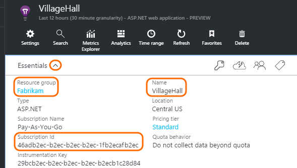

<properties 
	pageTitle="A tour through Application Analytics" 
	description="Short samples of all the main queries in Application Analytics, 
	             the powerful search tool for Application Insights." 
	services="application-insights" 
    documentationCenter=""
	authors="alancameronwills" 
	manager="douge"/>

<tags 
	ms.service="application-insights" 
	ms.workload="tbd" 
	ms.tgt_pltfrm="ibiza" 
	ms.devlang="na" 
	ms.topic="article" 
	ms.date="03/01/2016" 
	ms.author="awills"/>


 
# A tour through Application Analytics


Application Analytics is a powerful diagnostic search engine for your [Application Insights](app-insights-overview.md) telemetry.


[AZURE.INCLUDE [app-analytics-top-index](../../includes/app-analytics-top-index.md)]
 
Let's take a walk through some basic queries to get you started.

## Connect to your Application Insights data

For now, open Application Analytics by navigating to a URL in this form:

`https://loganalytics.applicationinsights.io/subscriptions/{subscription-id}/resourcegroups/{resource-group}/components/{app-insights-name}`

You can copy the parameters from the Essentials tab on your Application Insights overview blade: 



Sign in with the same credentials.

## Count rows

Metrics such as performance counters are stored in a table called metrics. Each row is a telemetry data point received from the Application Insights SDK in an app. To find out how big the table is, we'll pipe its content into an operator that simply counts the rows:

```CSL
	
    metrics | count
```

> [AZURE.NOTE] Put the cursor somewhere in the statement before you click Go. You can split a statement over more than one line, but don't leave a blank line between different parts of a statement.

Here's the result:


	
[Query reference page](app-analytics-queries.md).
	
## Take: show me n rows


Let's see some data - what's in a sample 10 rows?

```CSL

	metrics | take 10
```

And here's what we get:


Choose columns and adjust their positions:


Expand any item to see the detail:
 


## Sort and top

`take` is useful to get a quick sample of a result, but it shows rows from the table in no particular order. To get an ordered view, use `top` (for a sample) or `sort` (over the whole table).

Show me the first n rows, ordered by a particular column:

```CSL

	metrics | top 10 by timestamp desc 
```

* *Syntax:* Most operators have keyword parameters such as `by`.
* `desc` = descending order, `asc` = ascending.


`top...` is a more performant way of saying `sort ... | take...`. We could have written:

```CSL

	metrics | sort by timestamp desc | take 10
```

The result would be the same, but it would run a bit more slowly. (You could also write `order`, which is an alias of `sort`.)

The column headers in the table view can also be used to sort the results on the screen. But of course, if you've used `take` or `top` to display just part of a table, you'll only re-order that part.


## Project: select, rename and compute columns

Use `project` to pick out just the columns you want:

```CSL

    metrics | top 10 by timestamp desc
            | project timestamp, metricName, value
```


You can also rename columns and define new ones:

```CSL

    metrics 
    | top 10 by timestamp desc 
    | project timestamp, 
               timeOfDay = floor(timestamp % 1d, 1s), 
               metric = metricName, 
               value
```


In the scalar expression:

* `%` is the usual modulo operator. 
* `1d` (that's a digit one, then a 'd') is a timespan literal meaning one day. Here are some more timespan literals: `12h`, `30m`, `10s`, `0.01s`.
* `floor` (alias `bin`) rounds a value down to the nearest multiple of the base value you provide. So `floor(aTime, 1s)` rounds a time down to the nearest second.

[Expressions](app-analytics-scalars.md) can include all the usual operators (`+`, `-`, ...), and there's a range of useful functions.

## Extend: compute columns

If you just want to add columns to the existing ones, use `extend`:

```CSL

    metrics 
    | top 10 by timestamp desc
    | extend timeOfDay = floor(timestamp % 1d, 1s)
```

Using `extend` is less verbose than `project` if you want to keep all the existing columns.

## Summarize: aggregate groups of rows

By looking at a sample of a table, we can see the fields where the different telemetry data are reported. For example, `exception | take 20` quickly shows us that exception messages are reported in a field called `outerExceptionType`. 

But instead of plowing through individual instances, let's ask how many exceptions have been reported, of each type:

```CSL

	exceptions 
    | summarize count() by outerExceptionType
```


`Summarize` groups together rows that have the same values in the fields named in the `by` clause, yielding a single result row for each group. So in this case, there's a row for each exception type. The aggregation function `count()` counts up the rows in each group, providing a column in the result.


There's a range of [aggregation functions](app-analytics-aggregations.md), and you can use several of them in one summarize operator to produce several computed columns. 

For example, let's list the HTTP requests for which these exceptions occur. Again by inspecting a sample of  the exception table, you'll notice that the HTTP request paths are reported in a column named `operation_Name`. 

```CSL

    exceptions 
    | summarize count(), makeset(operation_Name)
      by outerExceptionType	      
```


The aggregation function `makeset()` creates a set of all the specified values in each group. As it happens in this example, there's only one operation that gives rise to each exception.


The result of a summarize has:

* each column named in `by`;
* plus a column for each aggregation expression;
* a row for each combination of `by` values.


## Summarize by scalar values


You can use scalar (numeric, time, or interval) values in the by clause. But numbers usually fill a continuous range. To group the data points, you'll want to assign them to bins of discrete values. The `bin` function is useful for this:

```CSL

    exceptions 
       | summarize count()  
         by bin(timestamp, 1d)
```


`bin` reduces all the timestamps to intervals of 1 day. It's an alias of `floor`, a function familiar from most languages. It simply reduces every value to the nearest multiple of the modulus that you specify, so that `summarize` can assign the rows to groups of a sensible size. (Without it, we'd have a result row for every separate fraction of a second, which wouldn't summarize the data at all.) 

We can do better than the table view here. Let's look at the results in the chart view with the vertical bar option:


## Where: filtering on a condition

If you've set up Application Insights monitoring for both the [client](app-insights-javascript.md) and server sides of your app, some of the telemetry in the database comes from browsers.

Let's see just exceptions reported from browsers:

```CSL

    exceptions 
    | where device_Id == "browser" 
    |  summarize count() 
       by device_BrowserVersion, outerExceptionMessage 
```


The `where` operator takes a Boolean expression. Here are some key points about them:

 * `and`, `or`: Boolean operators
 * `==`, `<>` : equal and not equal
 * `=~`, `!=` : case-insensitive string equal and not equal. There are lots more string comparison operators.

Read all about [scalar expressions](app-analytics-scalars.md).

### Filtering events

Find unsuccessful requests:

```CSL

    requests 
    | where responseCode >= 400
```

Summarize the different responses. Notice that we must always cast any value that comes out of a property bag or array when using it in a `by` clause:

```CSL

    requests
    | summarize count() 
      by responseCode
```

## Timecharts

Show how many events there are each day:

```CSL

    requests
      | summarize event_count=count()
        by bin(timestamp, 1d)
```

Select the Chart display option:


The x axis for line charts has to be of type DateTime. (But you can make vertical bar charts with any type of x-axis).

## Multiple series 

Use multiple values in a `summarize by` clause to create a separate row for each combination of values:

```CSL

    requests 
      | summarize event_count=count()   
        by bin(timestamp, 1d), location_StateOrProvince
```


To display multiple lines on a chart, click **Split by** and choose a column.


## Daily average cycle

How does usage vary over the average day?

Count requests by the time modulo one day, binned into hours:

```CSL

    requests
    | extend hour = floor(timestamp % 1d , 1h) 
          + datetime("2016-01-01")
    | summarize event_count=count() by hour
```


>[AZURE.NOTE] Notice we currently have to convert time durations to datetimes in order to display on the a chart.


## Compare multiple daily series

How does usage vary over the time of day in different states?

```CSL
    requests
     | extend hour= floor( timestamp % 1d , 1h)
           + datetime("2001-01-01")
     | summarize event_count=count() 
       by hour, location_StateOrProvince
```

Split the chart by state:


## Plot a distribution

How many sessions are there of different lengths?

```CSL

    requests 
    | where isnotnull(session_Id) and isnotempty(session_Id) 
    | summarize min(timestamp), max(timestamp) 
      by session_Id 
    | extend duration = max_timestamp - min_timestamp 
    | where duration > 0 and duration < 3m 
    | summarize count() by floor(duration, 3s) 
    | project d = duration + datetime("2016-01-01"), count_
```

The last line is required to convert to datetime so that we can display the results on a chart.

The `where` clause excludes one-shot sessions (duration==0) and sets the length of the x-axis.


## Percentiles

What ranges of durations cover different percentages of sessions?

Use the above query, but replace the last line:

```CSL

    requests 
    | where isnotnull(session_Id) and isnotempty(session_Id) 
    | summarize min(timestamp), max(timestamp) 
      by session_Id 
    | extend duration = max_timestamp - min_timestamp 
    | where duration > 0 
    | summarize count() by floor(duration, 3s) 
    | summarize percentiles(duration, 5, 20, 50, 80, 95)
```

We also removed the upper limit in the where clause, so as to get correct figures including all sessions with more than one request:


From which we can see that:

* 5% of sessions have a duration of less than 3s; 
* 50% of sessions last less than 1m 3s;
* 5% of sessions last at least 2m 48s.

To get a separate breakdown for each city, we just have to bring the location_City column separately through both summarize operators:

```CSL

    requests 
    | where isnotnull(session_Id) and isnotempty(session_Id) 
    | summarize min(timestamp), max(timestamp) 
      by session_Id, location_City 
    | extend duration = max_timestamp - min_timestamp 
    | where duration > 0
    | summarize count() 
      by floor(duration, 3s), location_City 
      
    | summarize percentiles (duration, 5, 20, 50, 80, 95) 
      by continent
```


## Join

We have access to three tables: metric, exceptions, and event. `event` contains request reports, page views, custom events, and so on.

To find the exceptions related to a request that returned a failure response, we can join the tables on `session_Id`:

```CSL

    requests 
    | where toint(responseCode) >= 500 
    | join (exceptions) on operation_Id 
    | take 30
```


It's good practice to use `project` to select just the columns we need before performing the join.
In the same clauses, we rename the timestamp column.


## Let: Assign a result to a variable

Use [let](./app-analytics-syntax.md#let-statements) to separate out the parts of the previous expression. The results are unchanged:

```CSL

    let bad_requests = 
      requests
        | where  toint(responseCode) >= 500  ;
    bad_requests
    | join (exceptions) on session_Id 
    | take 30
```

> Tip: In the Application Analytics client, don't put blank lines between the parts of this. Make sure to execute all of it.


[AZURE.INCLUDE [app-analytics-footer](../../includes/app-analytics-footer.md)]


