<properties 
	pageTitle="A tour through Analytics in Application Insights" 
	description="Short samples of all the main queries in Analytics, 
	             the powerful search tool of Application Insights." 
	services="application-insights" 
    documentationCenter=""
	authors="alancameronwills" 
	manager="douge"/>

<tags 
	ms.service="application-insights" 
	ms.workload="tbd" 
	ms.tgt_pltfrm="ibiza" 
	ms.devlang="na" 
	ms.topic="article" 
	ms.date="03/24/2016" 
	ms.author="awills"/>


 
# A tour of Analytics in Application Insights

[Analytics](app-analytics.md) lets you run powerful queries over the telemetry from your app collected by 
[Application Insights](app-insights-overview.md). These pages describe its query lanquage.


[AZURE.INCLUDE [app-analytics-top-index](../../includes/app-analytics-top-index.md)]
 
Let's take a walk through some basic queries to get you started.

## Connect to your Application Insights data

Open Analytics from your app's [overview blade](app-insights-dashboards.md) in Application Insights:


## [Count](app-analytics-aggregations.md#count) rows

Metrics such as performance counters are stored in a table called metrics. Each row is a telemetry data point received from the Application Insights SDK in an app. To find out how big the table is, we'll pipe its content into an operator that simply counts the rows:

```AIQL
	
    requests | count
```

> [AZURE.NOTE] Put the cursor somewhere in the statement before you click Go. You can split a statement over more than one line, but don't put blank lines in one statement. To keep several queries in the window, separate them with blank lines.

Here's the result:


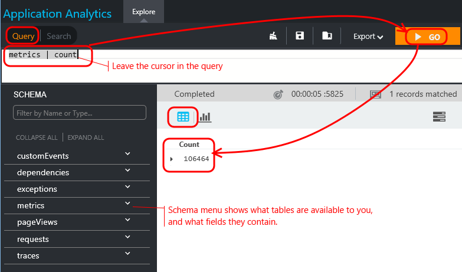

	
[`Count`](app-analytics-aggregations.md#count) is one of many [Query operators](app-analytics-queries.md) that we can arrange in a pipe, filtering, reshaping and joining the data in multiple stages.
	
## [Take](app-analytics-aggregations.md#take): show me n rows


Let's see some data - what's in a sample 5 rows?

```AIQL

	requests | take 5
```

And here's what we get:

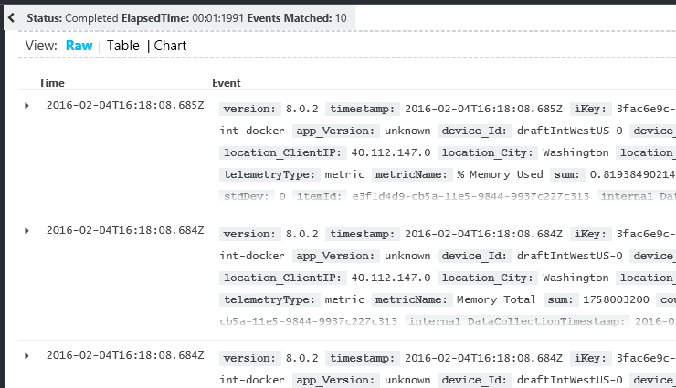

Choose columns and adjust their positions:

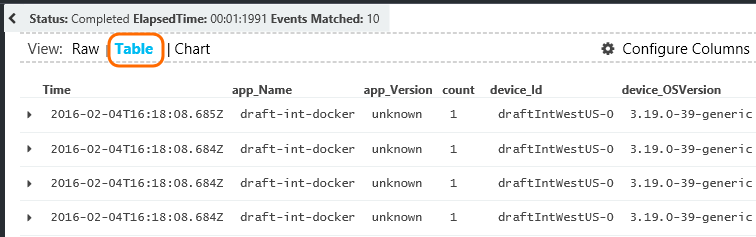


Expand any item to see the detail:
 
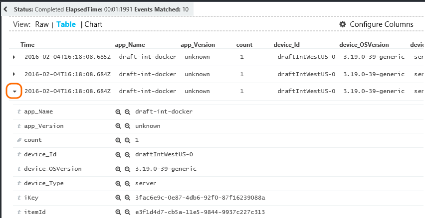

> [AZURE.NOTE] Click the head of a column to re-order the results available in the web browser. But be aware that for a large result set, the number of rows downloaded to the browser is limited. Be aware that sorting this way doesn't always show you the actual highest or lowest items. For that, you should use the `top` or `sort` operator. 

## [Top](app-analytics-aggregations.md#top) and [sort](app-analytics-aggregations.md#sort)

`take` is useful to get a quick sample of a result, but it shows rows from the table in no particular order. To get an ordered view, use `top` (for a sample) or `sort` (over the whole table).

Show me the first n rows, ordered by a particular column:

```AIQL

	requests | top 10 by timestamp desc 
```

* *Syntax:* Most operators have keyword parameters such as `by`.
* `desc` = descending order, `asc` = ascending.

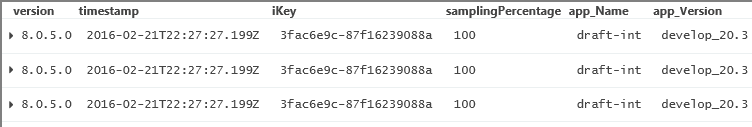

`top...` is a more performant way of saying `sort ... | take...`. We could have written:

```AIQL

	requests | sort by timestamp desc | take 10
```

The result would be the same, but it would run a bit more slowly. (You could also write `order`, which is an alias of `sort`.)

The column headers in the table view can also be used to sort the results on the screen. But of course, if you've used `take` or `top` to retrieve just part of a table, you'll only re-order the records you've retrieved.


## [Project](app-analytics-aggregations.md#project): select, rename and compute columns

Use [`project`](app-analytics-aggregations.md#project) to pick out just the columns you want:

```AIQL

    requests | top 10 by timestamp desc
             | project timestamp, name, resultCode
```

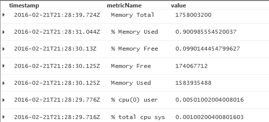


You can also rename columns and define new ones:

```AIQL

    requests 
    | top 10 by timestamp desc 
    | project timestamp, 
               timeOfDay = floor(timestamp % 1d, 1s), 
               name, 
               response = resultCode
```

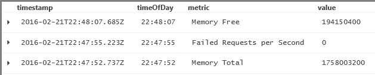

In the scalar expression:

* `%` is the usual modulo operator. 
* `1d` (that's a digit one, then a 'd') is a timespan literal meaning one day. Here are some more timespan literals: `12h`, `30m`, `10s`, `0.01s`.
* `floor` (alias `bin`) rounds a value down to the nearest multiple of the base value you provide. So `floor(aTime, 1s)` rounds a time down to the nearest second.

[Expressions](app-analytics-scalars.md) can include all the usual operators (`+`, `-`, ...), and there's a range of useful functions.

## [Extend](app-analytics-aggregations.md#extend): compute columns

If you just want to add columns to the existing ones, use [`extend`](app-analytics-aggregations.md#extend):

```AIQL

    requests 
    | top 10 by timestamp desc
    | extend timeOfDay = floor(timestamp % 1d, 1s)
```

Using [`extend`](app-analytics-aggregations.md#extend) is less verbose than [`project`](app-analytics-aggregations.md#project) if you want to keep all the existing columns.

## [Summarize](app-analytics-aggregations.md#summarize): aggregate groups of rows

By looking at a sample of a table, we can see the fields where the different telemetry data are reported. For example, `exception | take 20` quickly shows us that exception messages are reported in a field called `outerExceptionType`. 

But instead of plowing through individual instances, let's ask how many exceptions have been reported, of each type:

```AIQL

	exceptions 
    | summarize count() by outerExceptionType
```


`Summarize` groups together rows that have the same values in the fields named in the `by` clause, yielding a single result row for each group. So in this case, there's a row for each exception type. The aggregation function `count()` counts up the rows in each group, providing a column in the result.


There's a range of [aggregation functions](app-analytics-aggregations.md), and you can use several of them in one summarize operator to produce several computed columns. 

For example, let's list the HTTP requests for which these exceptions occur. Again by inspecting a sample of  the exception table, you'll notice that the HTTP request paths are reported in a column named `operation_Name`. 

```AIQL

    exceptions 
    | summarize count(), makeset(operation_Name)
      by outerExceptionType	      
```

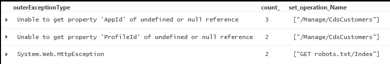

The aggregation function `makeset()` creates a set of all the specified values in each group. As it happens in this example, there's only one operation that gives rise to each exception.


The result of a summarize has:

* each column named in `by`;
* plus a column for each aggregation expression;
* a row for each combination of `by` values.


## Summarize by scalar values


You can use scalar (numeric, time, or interval) values in the by clause. But numbers usually fill a continuous range. To group the data points, you'll want to assign them to bins of discrete values. The `bin` function is useful for this:

```AIQL

    exceptions 
       | summarize count()  
         by bin(timestamp, 1d)
```

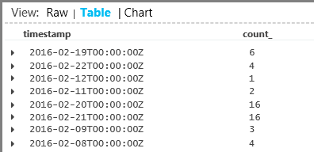

`bin` reduces all the timestamps to intervals of 1 day. It's an alias of `floor`, a function familiar from most languages. It simply reduces every value to the nearest multiple of the modulus that you specify, so that `summarize` can assign the rows to groups of a sensible size. (Without it, we'd have a result row for every separate fraction of a second, which wouldn't summarize the data at all.) 

We can do better than the table view here. Let's look at the results in the chart view with the vertical bar option:

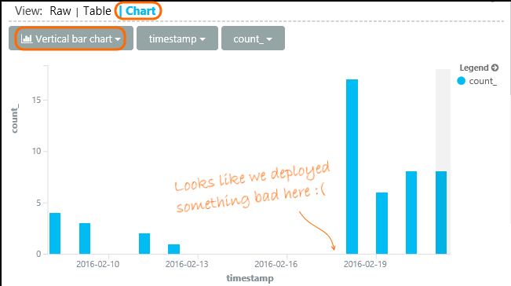

Notice that although we didn't sort the results by time (as you can see in the table display), the chart display always shows datetimes in correct order.


## [Where](app-analytics-aggregations.md#where): filtering on a condition

If you've set up Application Insights monitoring for both the [client](app-insights-javascript.md) and server sides of your app, some of the telemetry in the database comes from browsers.

Let's see just exceptions reported from browsers:

```AIQL

    exceptions 
    | where device_Id == "browser" 
    |  summarize count() 
       by device_BrowserVersion, outerExceptionMessage 
```


The `where` operator takes a Boolean expression. Here are some key points about them:

 * `and`, `or`: Boolean operators
 * `==`, `<>` : equal and not equal
 * `=~`, `!=` : case-insensitive string equal and not equal. There are lots more string comparison operators.

Read all about [scalar expressions](app-analytics-scalars.md).

### Filtering events

Find unsuccessful requests:

```AIQL

    requests 
    | where isnotempty(resultCode) and toint(resultCode) >= 400
```

`responseCode` has type string, so we must [cast it](app-analytics-scalars.md#casts) for a numeric comparison.

Summarize the different responses:

```AIQL

    requests
    | where isnotempty(resultCode) and toint(resultCode) >= 400
    | summarize count() 
      by resultCode
```

## Timecharts

Show how many events there are each day:

```AIQL

    requests
      | summarize event_count=count()
        by bin(timestamp, 1d)
```

Select the Chart display option:

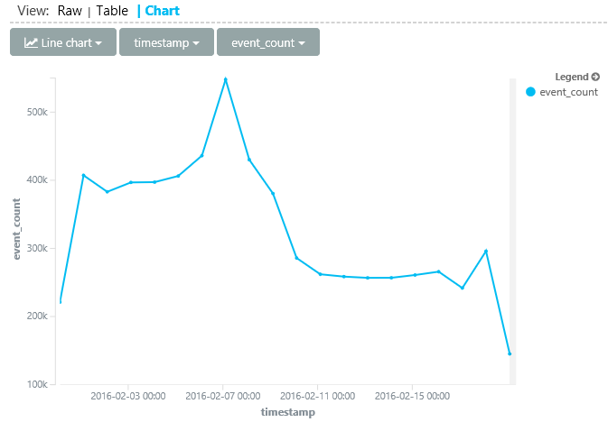

The x axis for line charts has to be of type DateTime. 

## Multiple series 

Use multiple values in a `summarize by` clause to create a separate row for each combination of values:

```AIQL

    requests 
      | summarize event_count=count()   
        by bin(timestamp, 1d), client_StateOrProvince
```


To display multiple lines on a chart, click **Split by** and choose a column.

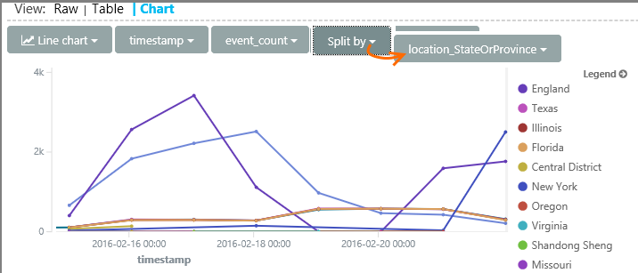


## Daily average cycle

How does usage vary over the average day?

Count requests by the time modulo one day, binned into hours:

```AIQL

    requests
    | extend hour = floor(timestamp % 1d , 1h) 
          + datetime("2016-01-01")
    | summarize event_count=count() by hour
```


>[AZURE.NOTE] Notice we currently have to convert time durations to datetimes in order to display on the a chart.


## Compare multiple daily series

How does usage vary over the time of day in different states?

```AIQL
    requests
     | extend hour= floor( timestamp % 1d , 1h)
           + datetime("2001-01-01")
     | summarize event_count=count() 
       by hour, client_StateOrProvince
```

Split the chart by state:


## Plot a distribution

How many sessions are there of different lengths?

```AIQL

    requests 
    | where isnotnull(session_Id) and isnotempty(session_Id) 
    | summarize min(timestamp), max(timestamp) 
      by session_Id 
    | extend sessionDuration = max_timestamp - min_timestamp 
    | where sessionDuration > 1s and sessionDuration < 3m 
    | summarize count() by floor(sessionDuration, 3s) 
    | project d = sessionDuration + datetime("2016-01-01"), count_
```

The last line is required to convert to datetime - currently the x axis of a line chart can only be a datetime.

The `where` clause excludes one-shot sessions (sessionDuration==0) and sets the length of the x-axis.


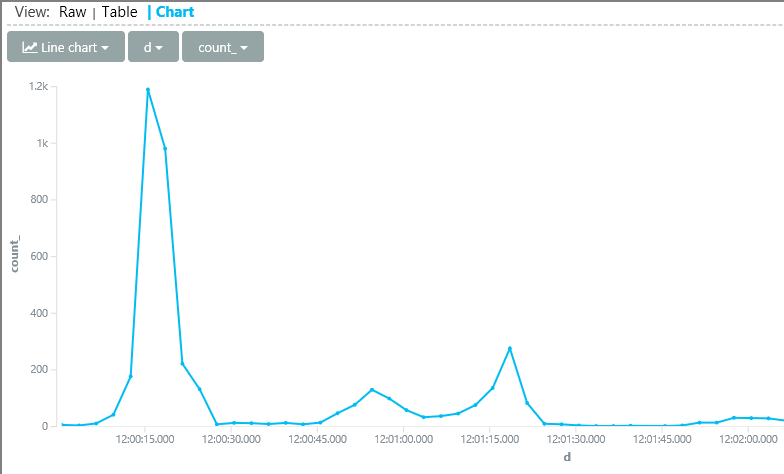


## [Percentiles](app-analytics-aggregations.md#percentiles)

What ranges of durations cover different percentages of sessions?

Use the above query, but replace the last line:

```AIQL

    requests 
    | where isnotnull(session_Id) and isnotempty(session_Id) 
    | summarize min(timestamp), max(timestamp) 
      by session_Id 
    | extend sesh = max_timestamp - min_timestamp 
    | where sesh > 1s
    | summarize count() by floor(sesh, 3s) 
    | summarize percentiles(sesh, 5, 20, 50, 80, 95)
```

We also removed the upper limit in the where clause, so as to get correct figures including all sessions with more than one request:

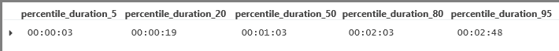

From which we can see that:

* 5% of sessions have a duration of less than 3 minutes 34s; 
* 50% of sessions last less than 36 minnutes;
* 5% of sessions last more than 7 days

To get a separate breakdown for each country, we just have to bring the client_CountryOrRegion column separately through both summarize operators:

```AIQL

    requests 
    | where isnotnull(session_Id) and isnotempty(session_Id) 
    | summarize min(timestamp), max(timestamp) 
      by session_Id, client_CountryOrRegion
    | extend sesh = max_timestamp - min_timestamp 
    | where sesh > 1s
    | summarize count() by floor(sesh, 3s), client_CountryOrRegion
    | summarize percentiles(sesh, 5, 20, 50, 80, 95)
	  by client_CountryOrRegion
```

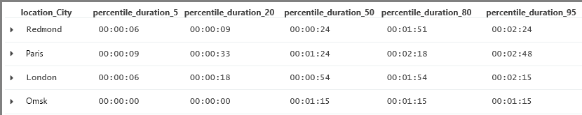


## [Join](app-analytics-aggregations.md#join)

We have access to several tables, including requests and exceptions.

To find the exceptions related to a request that returned a failure response, we can join the tables on `session_Id`:

```AIQL

    requests 
    | where toint(responseCode) >= 500 
    | join (exceptions) on operation_Id 
    | take 30
```


It's good practice to use `project` to select just the columns we need before performing the join.
In the same clauses, we rename the timestamp column.


## [Let](app-analytics-aggregations.md#let): Assign a result to a variable

Use [let](./app-analytics-syntax.md#let-statements) to separate out the parts of the previous expression. The results are unchanged:

```AIQL

    let bad_requests = 
      requests
        | where  toint(resultCode) >= 500  ;
    bad_requests
    | join (exceptions) on session_Id 
    | take 30
```

> Tip: In the Analytics client, don't put blank lines between the parts of this. Make sure to execute all of it.


[AZURE.INCLUDE [app-analytics-footer](../../includes/app-analytics-footer.md)]


