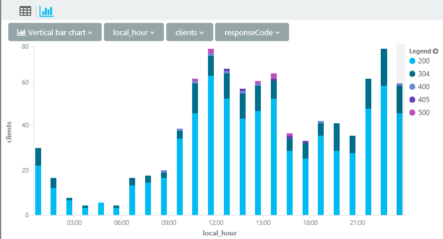

<properties 
	pageTitle="Analytics - the powerful search tool of Application Insights" 
	description="Overview of Analytics, 
	             the powerful diagnostic search tool of Application Insights. " 
	services="application-insights" 
    documentationCenter=""
	authors="alancameronwills" 
	manager="douge"/>

<tags 
	ms.service="application-insights" 
	ms.workload="tbd" 
	ms.tgt_pltfrm="ibiza" 
	ms.devlang="na" 
	ms.topic="article" 
	ms.date="03/21/2016" 
	ms.author="awills"/>


# Analytics in Application Insights


[Analytics](app-analytics.md) lets you run powerful queries over the telemetry from your app collected by 
[Application Insights](app-insights-overview.md). These pages describe its query lanquage.

[AZURE.INCLUDE [app-analytics-top-index](../../includes/app-analytics-top-index.md)]

 
A typical query is a *source* table followed by a series of *operators* separated by `|`. 

For example, let's find out what time of day the citizens of Hyderabad try our web app. And while we're there, let's see what result codes are returned to their HTTP requests. 

```AIQL

    requests 
    | where timestamp > ago(30d) and client_City == "Hyderabad"
    | summarize clients = dcount(client_IP) 
      by tod_UTC=bin(timestamp % 1d, 1h), resultCode
    | extend local_hour = (tod_UTC + 5h + 30min) % 24h + datetime("2001-01-01") 
```

We count distinct client IP addresses, grouping them by the hour of the day over the past 30 days. 

Let's display the results with the bar chart presentation, choosing to stack the results from different response codes:



Looks like our app is most popular at lunchtime and bed-time in Hyderabad. (And we should investigate those 500 codes.)


There are also powerful statistical operations:


The language has many attractive features:

* [Filter](app-analytics-queries.md) your raw app telemetry by any fields, including your custom properties and metrics.
* [Join](app-analytics-queries.md#join-operator) multiple tables – correlate requests with page views, dependency calls, exceptions and log traces.
* Powerful statistical [aggregations](app-analytics-aggregations.md).
* Just as powerful as SQL, but much easier for complex queries: instead of nesting statements, you pipe the data from one elementary operation to the next.
* Immediate and powerful visualizations.


>[AZURE.NOTE] We recommend starting with the [language tour](app-analytics-tour.md).


## Connect to your Application Insights data


Open Analytics from your app's [overview blade](app-insights-dashboards.md) in Application Insights: 


## Limits

At present, query results are limited to just over a week of past data.


[AZURE.INCLUDE [app-analytics-footer](../../includes/app-analytics-footer.md)]

