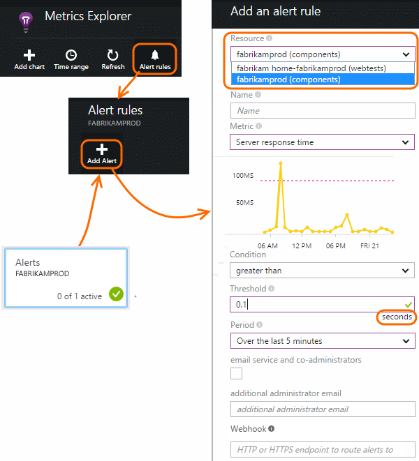
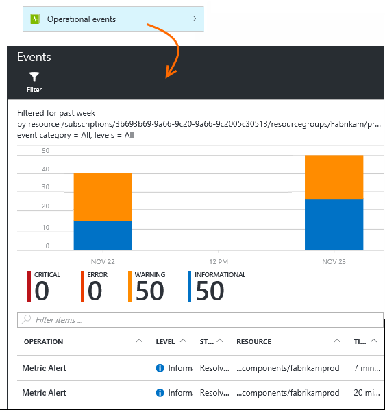

---
title: Set Alerts in Azure Application Insights | Microsoft Docs
description: Get notified about slow response times, exceptions, and other performance or usage changes in your web app.
services: application-insights
documentationcenter: ''
author: mrbullwinkle
manager: carmonm
ms.reviewer: lagayhar
ms.assetid: f8ebde72-f819-4ba5-afa2-31dbd49509a5
ms.service: application-insights
ms.workload: tbd
ms.tgt_pltfrm: ibiza
ms.devlang: na
ms.topic: conceptual
ms.date: 03/14/2017
ms.author: mbullwin

---
# Set Alerts in Application Insights
[Azure Application Insights][start] can alert you to changes in performance or usage metrics in your web app. 

Application Insights monitors your live app on a [wide variety of platforms][platforms] to help you diagnose performance issues and understand usage patterns.

There are three kinds of alerts:

* **Metric alerts** tell you when a metric crosses a threshold value for some period - such as response times, exception counts, CPU usage, or page views. 
* [**Web tests**][availability] tell you when your site is unavailable on the internet, or responding slowly. [Learn more][availability].
* [**Proactive diagnostics**](app-insights-proactive-diagnostics.md) are configured automatically to notify you about unusual performance patterns.

We focus on metric alerts in this article.

## Set a Metric alert
Open the Alert rules blade, and then use the add button. 

* Set the resource before the other properties. **Choose the "(components)" resource** if you want to set alerts on performance or usage metrics.
* The name that you give to the alert must be unique within the resource group (not just your application).
* Be careful to note the units in which you're asked to enter the threshold value.
* If you check the box "Email owners...", alerts are sent by email to everyone who has access to this resource group. To expand this set of people, add them to the [resource group or subscription](app-insights-resources-roles-access-control.md) (not the resource).
* If you specify "Additional emails", alerts are sent to those individuals or groups (whether or not you checked the "email owners..." box). 
* Set a [webhook address](../monitoring-and-diagnostics/insights-webhooks-alerts.md) if you have set up a web app that responds to alerts. It is called both when the alert is Activated and when it is Resolved. (But note that at present, query parameters are not passed through as webhook properties.)
* You can Disable or Enable the alert: see the buttons at the top of the blade.

*I don't see the Add Alert button.* 

* Are you using an organizational account? You can set alerts if you have owner or contributor access to this application resource. Take a look at the Access Control blade. [Learn about access control][roles].

> [!NOTE]
> In the alerts blade, you see that there's already an alert set up: [Proactive Diagnostics](app-insights-proactive-failure-diagnostics.md). The automatic alert monitors one particular metric, request failure rate. Unless you decide to disable the proactive alert, you don't need to set your own alert on request failure rate. 
> 
> 

## See your alerts
You get an email when an alert changes state between inactive and active. 

The current state of each alert is shown in the Alert rules blade.

There's a summary of recent activity in the alerts drop-down:

The history of state changes is in the Activity Log:

## How alerts work
* An alert has three states: "Never activated", "Activated", and "Resolved." Activated means the condition you specified was true, when it was last evaluated.
* A notification is generated when an alert changes state. (If the alert condition was already true when you created the alert, you might not get a notification until the condition goes false.)
* Each notification generates an email if you checked the emails box, or provided email addresses. You can also look at the Notifications drop-down list.
* An alert is evaluated each time a metric arrives, but not otherwise.
* The evaluation aggregates the metric over the preceding period, and then compares it to the threshold to determine the new state.
* The period that you choose specifies the interval over which metrics are aggregated. It doesn't affect how often the alert is evaluated: that depends on the frequency of arrival of metrics.
* If no data arrives for a particular metric for some time, the gap has different effects on alert evaluation and on the charts in metric explorer. In metric explorer, if no data is seen for longer than the chart's sampling interval, the chart shows a value of 0. But an alert based on the same metric is not be reevaluated, and the alert's state remains unchanged. 
  
    When data eventually arrives, the chart jumps back to a non-zero value. The alert evaluates based on the data available for the period you specified. If the new data point is the only one available in the period, the aggregate is based just on that data point.
* An alert can flicker frequently between alert and healthy states, even if you set a long period. This can happen if the metric value hovers around the threshold. There is no hysteresis in the threshold: the transition to alert happens at the same value as the transition to healthy.

## What are good alerts to set?
It depends on your application. To start with, it's best not to set too many metrics. Spend some time looking at your metric charts while your app is running, to get a feel for how it behaves normally. This practice helps you find ways to improve its performance. Then set up alerts to tell you when the metrics go outside the normal zone. 

Popular alerts include:

* [Browser metrics][client], especially Browser **page load times**, are good for web applications. If your page has many scripts, you should look for **browser exceptions**. In order to get these metrics and alerts, you have to set up [web page monitoring][client].
* **Server response time** for the server side of web applications. As well as setting up alerts, keep an eye on this metric to see if it varies disproportionately with high request rates: variation might indicate that your app is running out of resources. 
* **Server exceptions** - to see them, you have to do some [additional setup](app-insights-asp-net-exceptions.md).

Don't forget that [proactive failure rate diagnostics](app-insights-proactive-failure-diagnostics.md) automatically monitor the rate at which your app responds to requests with failure codes. 

## Automation
* [Use PowerShell to automate setting up alerts](app-insights-powershell-alerts.md)
* [Use webhooks to automate responding to alerts](../monitoring-and-diagnostics/insights-webhooks-alerts.md)

## Video

> [!VIDEO https://channel9.msdn.com/events/Connect/2016/112/player]

## See also
* [Availability web tests](app-insights-monitor-web-app-availability.md)
* [Automate setting up alerts](app-insights-powershell-alerts.md)
* [Proactive diagnostics](app-insights-proactive-diagnostics.md) 

<!--Link references-->

[availability]: app-insights-monitor-web-app-availability.md
[client]: app-insights-javascript.md
[platforms]: app-insights-platforms.md
[roles]: app-insights-resources-roles-access-control.md
[start]: app-insights-overview.md

