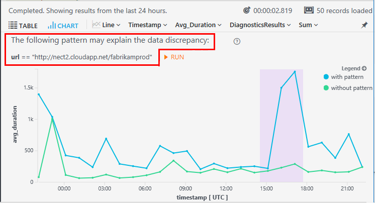
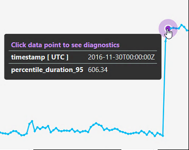
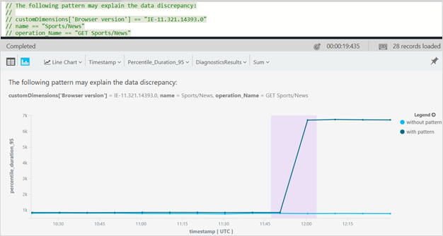
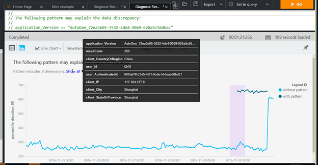

# Diagnose sudden changes in your app telemetry

*This feature is in preview.*

Diagnose sudden changes in your web app’s performance or usage with a single click! The Smart Diagnostics feature is available whenever you create a time chart in [Analytics](app-insights-analytics.md) in [Application Insights](app-insights-overview.md). Wherever there is an unusual change from the trend of your results, such as a spike or a dip, Smart Diagnostics identifies a pattern of dimensions and related values that might explain the change. This helps you diagnose the problem quickly. 

In this example, Smart Diagnostics has identified a pattern of property values associated with the change, and highlights the difference between results with and without that pattern:

 

## Diagnose data changes

1.	Run a query in Analytics, and render it as a time chart. 
2.	Click any highlighted peak point, if there is one.
 
    

    Diagnostics takes a few seconds to discover a pattern.

3. The Diagnostics Results tab shows a pattern which may explain your data discontinuity.

    
 
    The text shows the dimension values that appear to correlate with the shift. In this example, it’s associated with a particular request and a particular browser version.

    Notice also the two components of the chart, with the filter true and false. The false component shows an unchanged trend. In other words, there is no change in the telemetry results, if we exclude the problematic combination of dimensions that Diagnostics has identified. By contrast, the results within that combination do show a dramatic change within the highlighted area of investigation. This shows that Diagnostics has found a combination of properties that explains the change.

4.	If the pattern is complex, you need to hover over **Show all** to see the dimensions.

    
 
5.	In case Diagnostics finds no significant pattern to notify about, the ‘no results’ page will be presented. At this point, you may change your query. For example, you could narrow the time range and binning in Analytics query, for a further analysis and potentially better results.

Armed with the knowledge that a particular page of your website has a problem on a particular browser, you can now go straight to the problem page, and investigate recent changes.

## Try the demo

[Click here to see a demonstration](https://analytics.applicationinsights.io/demo?q=H4sIAAAAAAAAA3VSTY%2FTQAy991dYPXWlLf0QIO2KIiGWA3duiMPsxEnMzhe2p6WIH48nVUsuGylRNPOe3%2FOzN5vFZgPfRhL4VZHPIGM%2BCdgHdESgpMjOKx0RnsgNKYuSF%2BjRaWUE7xKMGIoBgTpMSv2Z0jBxOWc1QBWEPjM4EMUCP2uc0A3x8E5HKMi%2BEQNC7oHRbIgKdJWdUk5vmr9PvdkArildit%2Fcrk0lBDjnyhBzk%2FKVxdTy0QhNY6RhDPYqdlCy9XMV96NjBZc68IH8y6Tzuf01iZxeIZ%2FI5DqMOYmaQQRXNUdz6qGb5WOdSKEXnOozHtEFK%2Bh0qnq5YQzGF9DcoinoqbcigkO0NOZRNGOZaaBkMuat5xznFOtULKhG%2BdrGlVDhy%2B8SMlsETV8dD6gTd0YrbsBrFq6U1v%2Filv4C%2FsJpRJuwUrQTZ0P7eIDOHLeD1X67e7%2Fe7dbbB9htH%2Ffbu4vQDfvhFez%2B8a1h%2F1f3VSy%2BJ4Ol1oN8X4qN0qMZWv44HJanzKFLeJIltKcRpcbomP7gbHNkdV2Xe1uqO3g%2BwzOl1c3PvbmMlC7KjKlry2GX0w4s%2FgFoo5%2BhBAMAAA%3D%3D&timespan=PT24H) on sample data.

## How it works

Smart Diagnostics uses an advanced unsupervised machine learning algorithm based on the [DiffPatterns](app-insights-analytics-reference.md#evaluate-diffpatterns_v2) operation. It looks for candidate patterns that might explain the data change. It analyses the impact of each candidate on the metric, and shows the pattern that best correlates with the change.

## No diagnostic points?

Smart Diagnostics only works when the following criteria are satisfied:

 * Smart Diagnostics setting is switched on. Look under the Settings icon in Analytics.
 * The Smart Diagnostics option in Analytics settings is selected. 
 * Time axis: The X-axis of the chart must be of type `datetime`.
 * Line or area chart: Diagnostics only works these types of chart. Use `| render timechart` or `| render areachart` at the end of your query; or select Line or Area Chart from the drop-down selector.
 * Discontinuity: There must be a significant discontinuity in the data.
 * Sufficient points to analyze.
 * No more than one summarize clause in the query.
 * No project clause that contains a name definition before the summarize clause.

 
 ## Related articles

 * [Analytics tutorial](app-insights-analytics-tour.md)
 * [Smart detection](app-insights-proactive-diagnostics.md) automatically alerts you to performance issues.