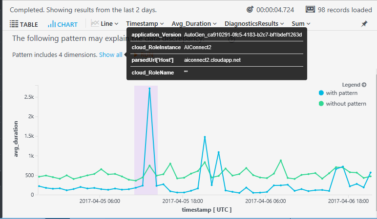

# Analytics diagnoses sudden changes in your data

*This feature is in preview.*

Diagnose sudden changes in your web app’s performance or usage with a single click! The Diagnostics feature is available whenever you create a time chart in [Analytics](https://docs.microsoft.com/azure/application-insights/app-insights-analytics) in [Application Insights](https://docs.microsoft.com/azure/application-insights). Anywhere it finds an unusual change from the trend of your results, such as a spike or a dip, it identifies a pattern of dimensions that might explain the change. This helps you diagnose the problem quickly. 

In this example, Diagnostics has successfully identified a pattern of property values associated with the change, and highlights the difference between results with and without that pattern:

 
This feature is currently in preview. 

## Diagnose discontinuities

1.	Run a query in Analytics, and render it as a time chart. 
2.	Check the Diagnostics checkbox.

 * *No Diagnostics checkbox?*

    The results must be rendered as a line chart to enable Diagnostics. You can either use `| render timechart` or select Line Chart from the drop-down selector.

 * *Diagnostics is disabled?* This happens if:

  * The x axis of the line chart has no explicit datetime type (Diagnostics can be applied on a time based chart only). 
  * There is no significant discontinuity in the data, or has a small number of points to analyze. Try another query, such as a longer time span, or a smaller time bin in the `summarize` clause.
  * Your query is not eligible for Diagnostics: has more than one summarize clause, or has a project clause containing a definition.

3. Click one of the highlighted peak points.
 
    

    Diagnostics takes a few seconds to discover a pattern.

3. The Diagnostics Results tab shows a pattern which may explain your data discontinuity.

    
 
    The text shows the dimension values that appear to correlate with the shift. In this example, it’s associated with a particular request and a particular browser version.

    Notice also the two components of the chart, with the filter true and false. The false component shows an unchanged trend. In other words, there is no change in the telemetry results, if we exclude the problematic combination of dimensions that Diagnostics has identified. By contrast, the results within that combination do show a dramatic change within the highlighted area of investigation. This shows that Diagnostics has found a combination of properties that explains the change.

4.	If the pattern is complex, you need to hover over **Show all** to see the dimensions.

    
 
5.	In case Diagnostics finds no significant pattern to notify about, the ‘no results’ page will be presented. At this point, you may change your query. For example, you could change the time binning in Analytics query, for a further analysis and potentially better results.

Armed with the knowledge that a particular page of your website has a problem on a particular browser, you can now go straight to the problem page, and investigate recent changes.

## How it works

Diagnostics uses an advanced algorithm based on the DiffPattern operation.

## Feedback please!

We’re very keen to know how you like this feature. How could we make it better? Can you tell us some stories about where it was useful? 

Click the smiley face icon in the Diagnostics results tab, or at top right of the Analytics window.

Thank you!

