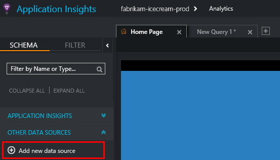
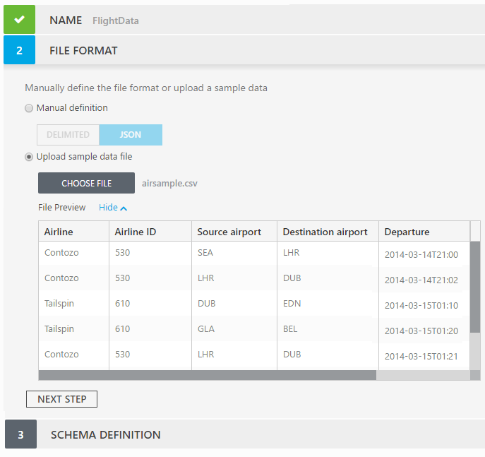
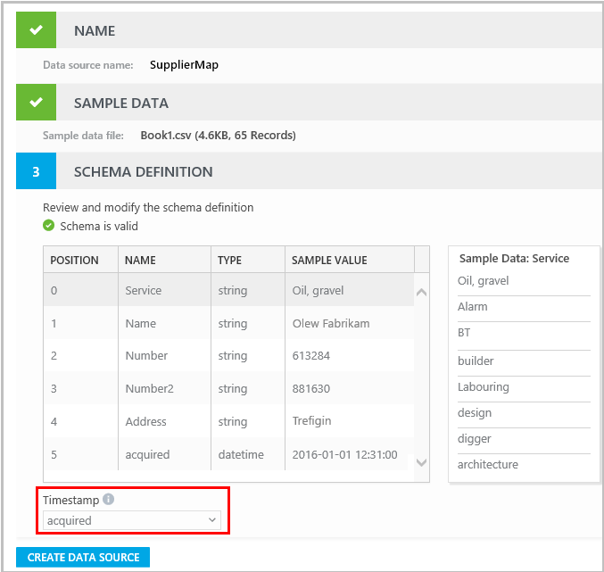
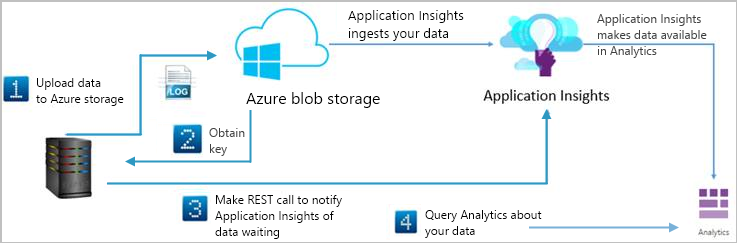

---
title: Import your data to Analytics in Azure Application Insights | Microsoft Docs
description: Import static data to join with app telemetry, or import a separate data stream to query with Analytics.
services: application-insights
keywords: "open schema, data import"
documentationcenter: ''
author: mrbullwinkle
manager: carmonm

ms.service: application-insights
ms.workload: tbd
ms.tgt_pltfrm: ibiza
ms.devlang: na
ms.topic: conceptual
ms.date: 08/14/2018
ms.author: mbullwin

---
# Import data into Analytics

Import any tabular data into [Analytics](app-insights-analytics.md), either to join it with [Application Insights](app-insights-overview.md) telemetry from your app, or so that you can analyze it as a separate stream. Analytics is a powerful query language well-suited to analyzing high-volume timestamped streams of telemetry.
You can import data into Analytics using your own schema. It doesn't have to use the standard Application Insights schemas such as request or trace.

You can import JSON or DSV (delimiter-separated values - comma, semicolon or tab) files.

> [!IMPORTANT]
> This article has been **deprecated**. The recommended method of getting data into Log Analytics is via the [Log Analytics data collector API.](https://docs.microsoft.com/azure/log-analytics/log-analytics-data-collector-api)

There are three situations where importing to Analytics is useful:

* **Join with app telemetry.** For example, you could import a table that maps URLs from your website to more readable page titles. In Analytics, you can create a dashboard chart report that shows the ten most popular pages in your website. Now it can show the page titles instead of the URLs.
* **Correlate your application telemetry** with other sources such as network traffic, server data, or CDN log files.
* **Apply Analytics to a separate data stream.** Application Insights Analytics is a powerful tool, that works well with sparse, timestamped streams - much better than SQL in many cases. If you have such a stream from some other source, you can analyze it with Analytics.

Sending data to your data source is easy. 

1. (One time) Define the schema of your data in a 'data source'.
2. (Periodically) Upload your data to Azure storage, and call the REST API to notify us that new data is waiting for ingestion. Within a few minutes, the data is available for query in Analytics.

The frequency of the upload is defined by you and how fast would you like your data to be available for queries. It is more efficient to upload data in larger chunks, but not larger than 1GB.

> [!NOTE]
> *Got lots of data sources to analyze?* [*Consider using* logstash *to ship your data into Application Insights.*](https://github.com/Microsoft/logstash-output-application-insights)
> 

## Before you start

You need:

1. An Application Insights resource in Microsoft Azure.

 * If you want to analyze your data separately from any other telemetry, [create a new Application Insights resource](app-insights-create-new-resource.md).
 * If you're joining or comparing your data with telemetry from an app that is already set up with Application Insights, then you can use the resource for that app.
 * Contributor or owner access to that resource.
 
2. Azure storage. You upload to Azure storage, and Analytics gets your data from there. 

 * We recommend you create a dedicated storage account for your blobs. If your blobs are shared with other processes, it takes longer for our processes to read your blobs.


## Define your schema

Before you can import data, you must define a *data source,* which specifies the schema of your data.
You can have up to 50 data sources in a single Application Insights resource

1. Start the data source wizard. Use "Add new data source" button. Alternatively - click on settings button in right upper corner and choose "Data Sources" in dropdown menu.

    

    Provide a name for your new data source.

2. Define format of the files that you will upload.

    You can either define the format manually, or upload a sample file.

    If the data is in CSV format, the first row of the sample can be column headers. You can change the field names in the next step.

    The sample should include at least 10 rows or records of data.

    Column or field names should have alphanumeric names (without spaces or punctuation).

    


3. Review the schema that the wizard has got. If it inferred the types from a sample, you might need to adjust the inferred types of the columns.

    

 * (Optional.) Upload a schema definition. See the format below.

 * Select a Timestamp. All data in Analytics must have a timestamp field. It must have type `datetime`, but it doesn't have to be named 'timestamp'. If your data has a column containing a date and time in ISO format, choose this as the timestamp column. Otherwise, choose "as data arrived", and the import process will add a timestamp field.

5. Create the data source.

### Schema definition file format

Instead of editing the schema in UI, you can load the schema definition from a file. The schema definition format is as follows: 

Delimited format 
```
[ 
    {"location": "0", "name": "RequestName", "type": "string"}, 
    {"location": "1", "name": "timestamp", "type": "datetime"}, 
    {"location": "2", "name": "IPAddress", "type": "string"} 
] 
```

JSON format 
```
[ 
    {"location": "$.name", "name": "name", "type": "string"}, 
    {"location": "$.alias", "name": "alias", "type": "string"}, 
    {"location": "$.room", "name": "room", "type": "long"} 
]
```
 
Each column is identified by the location, name and type.

* Location – For delimited file format it is the position of the mapped value. For JSON format, it is the jpath of the mapped key.
* Name – the displayed name of the column.
* Type – the data type of that column.
 
> [!NOTE]
> In case sample data was used and the file format is delimited, the schema definition must map all columns and add new columns at the end.
> 
> JSON allows partial mapping of the data, therefore the schema definition with a JSON format doesn’t have to map every key which is found in the sample data. It can also map columns which are not part of the sample data. 

## Import data

To import data, you upload it to Azure storage, create an access key for it, and then make a REST API call.



You can perform the following process manually, or set up an automated system to do it at regular intervals. You need to follow these steps for each block of data you want to import.

1. Upload the data to [Azure blob storage](../storage/blobs/storage-dotnet-how-to-use-blobs.md). 

 * Blobs can be any size up to 1GB uncompressed. Large blobs of hundreds of MB are ideal from a performance perspective.
 * You can compress it with Gzip to improve upload time and latency for the data to be available for query. Use the `.gz` filename extension.
 * It's best to use a separate storage account for this purpose, to avoid calls from different services slowing performance.
 * When sending data in high frequency, every few seconds, it is recommended to use more than one storage account, for performance reasons.

 
2. [Create a Shared Access Signature key for the blob](../storage/blobs/storage-dotnet-shared-access-signature-part-2.md). The key should have an expiration period of one day and provide read access.
3. Make a REST call to notify Application Insights that data is waiting.

 * Endpoint: `https://dc.services.visualstudio.com/v2/track`
 * HTTP method: POST
 * Payload:

```JSON

    {
       "data": {
            "baseType":"OpenSchemaData",
            "baseData":{
               "ver":"2",
               "blobSasUri":"<Blob URI with Shared Access Key>",
               "sourceName":"<Schema ID>",
               "sourceVersion":"1.0"
             }
       },
       "ver":1,
       "name":"Microsoft.ApplicationInsights.OpenSchema",
       "time":"<DateTime>",
       "iKey":"<instrumentation key>"
    }
```

The placeholders are:

* `Blob URI with Shared Access Key`: You get this from the procedure for creating a key. It is specific to the blob.
* `Schema ID`: The schema ID generated for your defined schema. The data in this blob should conform to the schema.
* `DateTime`: The time at which the request is submitted, UTC. We accept these formats: ISO8601 (like "2016-01-01 13:45:01"); RFC822 ("Wed, 14 Dec 16 14:57:01 +0000"); RFC850 ("Wednesday, 14-Dec-16 14:57:00 UTC"); RFC1123 ("Wed, 14 Dec 2016 14:57:00 +0000").
* `Instrumentation key` of your Application Insights resource.

The data is available in Analytics after a few minutes.

## Error responses

* **400 bad request**: indicates that the request payload is invalid. Check:
 * Correct instrumentation key.
 * Valid time value. It should be the time now in UTC.
 * JSON of the event conforms to the schema.
* **403 Forbidden**: The blob you've sent is not accessible. Make sure that the shared access key is valid and has not expired.
* **404 Not Found**:
 * The blob doesn't exist.
 * The sourceId is wrong.

More detailed information is available in the response error message.


## Sample code

This code uses the [Newtonsoft.Json](https://www.nuget.org/packages/Newtonsoft.Json/9.0.1) NuGet package.

### Classes

```csharp
namespace IngestionClient 
{ 
    using System; 
    using Newtonsoft.Json; 

    public class AnalyticsDataSourceIngestionRequest 
    { 
        #region Members 
        private const string BaseDataRequiredVersion = "2"; 
        private const string RequestName = "Microsoft.ApplicationInsights.OpenSchema"; 
        #endregion Members 

        public AnalyticsDataSourceIngestionRequest(string ikey, string schemaId, string blobSasUri, int version = 1) 
        { 
            Ver = version; 
            IKey = ikey; 
            Data = new Data 
            { 
                BaseData = new BaseData 
                { 
                    Ver = BaseDataRequiredVersion, 
                    BlobSasUri = blobSasUri, 
                    SourceName = schemaId, 
                    SourceVersion = version.ToString() 
                } 
            }; 
        } 


        [JsonProperty("data")] 
        public Data Data { get; set; } 

        [JsonProperty("ver")] 
        public int Ver { get; set; } 

        [JsonProperty("name")] 
        public string Name { get { return RequestName; } } 

        [JsonProperty("time")] 
        public DateTime Time { get { return DateTime.UtcNow; } } 

        [JsonProperty("iKey")] 
        public string IKey { get; set; } 
    } 

    #region Internal Classes 

    public class Data 
    { 
        private const string DataBaseType = "OpenSchemaData"; 

        [JsonProperty("baseType")] 
        public string BaseType 
        { 
            get { return DataBaseType; } 
        } 

        [JsonProperty("baseData")] 
        public BaseData BaseData { get; set; } 
    } 


    public class BaseData 
    { 
        [JsonProperty("ver")] 
        public string Ver { get; set; } 

        [JsonProperty("blobSasUri")] 
        public string BlobSasUri { get; set; } 

        [JsonProperty("sourceName")] 
        public string SourceName { get; set; } 

        [JsonProperty("sourceVersion")] 
        public string SourceVersion { get; set; } 
    } 

    #endregion Internal Classes 
} 


namespace IngestionClient 
{ 
    using System; 
    using System.IO; 
    using System.Net; 
    using System.Text; 
    using System.Threading.Tasks; 
    using Newtonsoft.Json; 

    public class AnalyticsDataSourceClient 
    { 
        #region Members 
        private readonly Uri endpoint = new Uri("https://dc.services.visualstudio.com/v2/track"); 
        private const string RequestContentType = "application/json; charset=UTF-8"; 
        private const string RequestAccess = "application/json"; 
        #endregion Members 

        #region Public 

        public async Task<bool> RequestBlobIngestion(AnalyticsDataSourceIngestionRequest ingestionRequest) 
        { 
            HttpWebRequest request = WebRequest.CreateHttp(endpoint); 
            request.Method = WebRequestMethods.Http.Post; 
            request.ContentType = RequestContentType; 
            request.Accept = RequestAccess; 

            string notificationJson = Serialize(ingestionRequest); 
            byte[] notificationBytes = GetContentBytes(notificationJson); 
            request.ContentLength = notificationBytes.Length; 

            Stream requestStream = request.GetRequestStream(); 
            requestStream.Write(notificationBytes, 0, notificationBytes.Length); 
            requestStream.Close(); 

            try 
            { 
                using (var response = (HttpWebResponse)await request.GetResponseAsync())
                {
                    return response.StatusCode == HttpStatusCode.OK;
                }
            } 
            catch (WebException e) 
            { 
                HttpWebResponse httpResponse = e.Response as HttpWebResponse; 
                if (httpResponse != null) 
                { 
                    Console.WriteLine( 
                        "Ingestion request failed with status code: {0}. Error: {1}", 
                        httpResponse.StatusCode, 
                        httpResponse.StatusDescription); 
                    return false; 
                }
                throw; 
            } 
        } 
        #endregion Public 

        #region Private 
        private byte[] GetContentBytes(string content) 
        { 
            return Encoding.UTF8.GetBytes(content);
        } 


        private string Serialize(AnalyticsDataSourceIngestionRequest ingestionRequest) 
        { 
            return JsonConvert.SerializeObject(ingestionRequest); 
        } 
        #endregion Private 
    } 
} 
```

### Ingest data

Use this code for each blob. 

```csharp
   AnalyticsDataSourceClient client = new AnalyticsDataSourceClient(); 

   var ingestionRequest = new AnalyticsDataSourceIngestionRequest("iKey", "sourceId", "blobUrlWithSas"); 

   bool success = await client.RequestBlobIngestion(ingestionRequest);
```

## Next steps

* [Tour of the Log Analytics query language](app-insights-analytics-tour.md)
* If you're using Logstash, use the [Logstash plugin to send data to Application Insights](https://github.com/Microsoft/logstash-output-application-insights)
