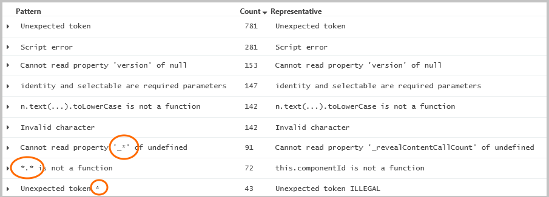
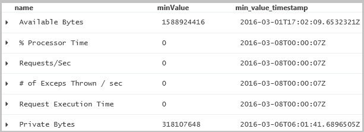
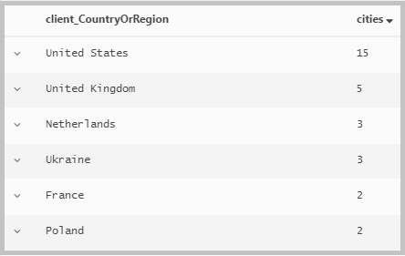
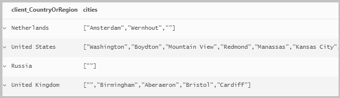
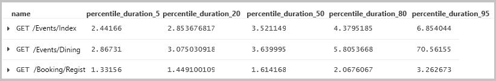
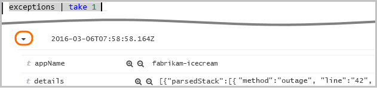
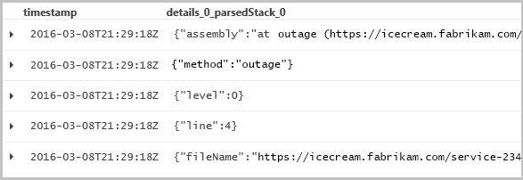
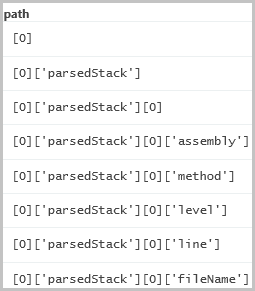

<properties 
	pageTitle="Reference in Analytics in Application Insights | Microsoft Azure" 
	description="Reference for statements in Analytics, 
	             the powerful search tool of Application Insights. " 
	services="application-insights" 
    documentationCenter=""
	authors="alancameronwills" 
	manager="douge"/>

<tags 
	ms.service="application-insights" 
	ms.workload="tbd" 
	ms.tgt_pltfrm="ibiza" 
	ms.devlang="na" 
	ms.topic="article" 
	ms.date="08/09/2016" 
	ms.author="awills"/>

# Reference for Analytics

[Analytics](app-insights-analytics.md) is the powerful search feature of 
[Application Insights](app-insights-overview.md). These pages describe the
 Analytics query lanquage.

> [AZURE.NOTE] [Test drive Analytics on our simulated data](https://analytics.applicationinsights.io/demo) if your app isn't sending data to Application Insights yet.

## Index


**Let and set** [let](#let-clause) | [set](#set-clause)


**Queries and operators** [count](#count-operator) | [evaluate](#evaluate-operator) | [extend](#extend-operator) | [join](#join-operator) | [limit](#limit-operator) | [mvexpand](#mvexpand-operator) | [parse](#parse-operator) | [project](#project-operator) | [project-away](#project-away-operator) | [range](#range-operator) | [reduce](#reduce-operator) | [render directive](#render-directive) | [restrict clause](#restrict-clause) | [sort](#sort-operator) | [summarize](#summarize-operator) | [take](#take-operator) | [top](#top-operator) | [top-nested](#top-nested-operator) | [union](#union-operator) | [where](#where-operator)

**Aggregations** [any](#any) | [argmax](#argmax) | [argmin](#argmin) | [avg](#avg) | [buildschema](#buildschema) | [count](#count) | [countif](#countif) | [dcount](#dcount) | [dcountif](#dcountif) | [makelist](#makelist) | [makeset](#makeset) | [max](#max) | [min](#min) | [percentile](#percentile) | [percentiles](#percentiles) | [percentilesw](#percentilesw) | [percentilew](#percentilew) | [stdev](#stdev) | [sum](#sum) | [variance](#variance)

**Scalars** [Boolean Literals](#boolean-literals) | [Boolean operators](#boolean-operators) | [Casts](#casts) | [Scalar comparisons](#scalar-comparisons) | [gettype](#gettype) | [hash](#hash) | [iff](#iff) | [isnotnull](#isnotnull) | [isnull](#isnull) | [notnull](#notnull) | [toscalar](#toscalar)

**Numbers** [Arithmetic operators](#arithmetic-operators) | [Numeric literals](#numeric-literals) | [abs](#abs) | [bin](#bin) | [exp](#exp) | [floor](#floor) | [log](#log) | [rand](#rand) | [sqrt](#sqrt) | [todouble](#todouble) | [toint](#toint) | [tolong](#tolong)

**Date and time** [Date and time expressions](#date-and-time-expressions) | [Date and time literals](#date-and-time-literals) | [ago](#ago) | [datepart](#datepart) | [dayofmonth](#dayofmonth) | [dayofweek](#dayofweek) | [dayofyear](#dayofyear) | [endofday](#endofday) | [endofmonth](#endofmonth) | [endofweek](#endofweek) | [endofyear](#endofyear) | [getmonth](#getmonth) | [getyear](#getyear) | [now](#now) | [startofday](#startofday) | [startofmonth](#startofmonth) | [startofweek](#startofweek) | [startofyear](#startofyear) | [todatetime](#todatetime) | [totimespan](#totimespan) | [weekofyear](#weekofyear)

**String** [GUIDs](#guids) | [Obfuscated String Literals](#obfuscated-string-literals) | [String Literals](#string-literals) | [String comparisons](#string-comparisons) | [countof](#countof) | [extract](#extract) | [isempty](#isempty) | [isnotempty](#isnotempty) | [notempty](#notempty) | [replace](#replace) | [split](#split) | [strcat](#strcat) | [strlen](#strlen) | [substring](#substring) | [tolower](#tolower) | [toupper](#toupper)

**Arrays, objects and dynamic** [Array and object literals](#array-and-object-literals) | [Dynamic object functions](#dynamic-object-functions) | [Dynamic objects in let clauses](#dynamic-objects-in-let-clauses) | [JSON Path expressions](#json-path-expressions) | [Names](#names) | [arraylength](#arraylength) | [extractjson](#extractjson) | [parsejson](#parsejson) | [range](#range) | [todynamic](#todynamic) | [treepath](#treepath)


## Let and set

### let clause

**Tabular let - naming a table**

    let recentReqs = requests | where timestamp > ago(3d); 
    recentReqs | count

**Scalar let - naming a value**

    let interval = 3d; 
    requests | where timestamp > ago(interval)

**Lambda let - naming a function**

    let Recent = 
       (interval:timespan) { requests | where timestamp > ago(interval) };
    Recent(3h) | count

    let us_date = (t:datetime) { strcat(getmonth(t),'/',dayofmonth(t),'/',getyear(t)) }; 
    requests | summarize count() by bin(timestamp, 1d) | project count_, day=us_date(timestamp)

A let clause binds a [name](#names) to a tabular result, scalar value or function. The clause is a prefix to a query, and the scope of the binding is that query. (Let doesn't provide a way to name things that you use later in your session.)

**Syntax**

    let name = scalar_constant_expression ; query

    let name = query ; query

    let name = (parameterName : type [, ...]) { plain_query }; query

    let name = (parameterName : type [, ...]) { scalar_expression }; query

* *type:* `bool`, `int`, `long`, `double`, `string`, `timespan`, `datetime`, `guid`, [`dynamic`](#dynamic-type)
* *plain_query:* A query not prefixed by a let-clause.

**Examples**

    let rows = (n:long) { range steps from 1 to n step 1 };
    rows(10) | ...


Self-join:

    let Recent = events | where timestamp > ago(7d);
    Recent | where name contains "session_started" 
    | project start = timestamp, session_id
    | join (Recent 
        | where name contains "session_ended" 
        | project stop = timestamp, session_id)
      on session_id
    | extend duration = stop - start 

### Set clause

The set clause sets an option for the duration of the query. Query options control how a query executes and returns results. They can be Boolean flags (off by default), or have some integer value. A query may contain zero, one, or more set statements. Set statements affect only the tabular expression statements that trail them in program order.

    set OptionName [= OptionValue] ; query


|Name | Implication if set to true
|---|---
|querytrace| Increases the level of debug traces generated by a query. 
|noexecute| Disables the actual execution of the query (just query planning phase is run). 
|perftrace| Enables performance tracing. 
|notruncation| Disables result-set truncation. 
|truncationmaxsize| Limit query result data size (In Bytes). 
|truncationmaxrecords| Limit query result record number. 
|nostreaming |Disables result-set streaming. 

**Example**

```

    set querytrace;
    requests | take 100
```

## Queries and operators

A query over your telemetry is made up of a reference to a source stream, followed by a pipeline of filters. For example:


```AIQL
requests // The request table starts this pipeline.
| where client_City == "London" // filter the records
   and timestamp > ago(3d)
| count 
```
    
Each filter prefixed by the pipe character `|` is an instance of an *operator*, with some parameters. The input to the operator is the table that is the result of the preceding pipeline. In most cases, any parameters are [scalar expressions](#scalars) over the columns of the input. In a few cases, the parameters are the names of input columns, and in a few cases, the parameter is a second table. The result of a query is always a table, even if it only has one column and one row.

Queries may contain single line breaks, but are terminated by a blank line. They may contain comments between `//` and end of line.

A query may be prefixed by one or more [let clauses](#let-clause), which define scalars, tables, or functions that can be used within the query.

```AIQL

    let interval = 3d ;
    let city = "London" ;
    let req = (city:string) {
      requests
      | where client_City == city and timestamp > ago(interval) };
    req(city) | count
```

> `T` is used in query examples below to denote the preceding pipeline or source table.
> 

### count operator

The `count` operator returns the number of records (rows) in the input record set.

**Syntax**

    T | count

**Arguments**

* *T*: The tabular data whose records are to be counted.

**Returns**

This function returns a table with a single record and column of type
`long`. The value of the only cell is the number of records in *T*. 

**Example**

```AIQL
requests | count
```

### evaluate operator

`evaluate` is an extension mechanism that allows specialized algorithms to be appended to queries.

`evaluate` must be the last operator in the query pipeline (except for a possible `render`). It must not appear in a function body.

[evaluate autocluster](#evaluate-autocluster) | [evaluate basket](#evaluate-basket) | [evaluate diffpatterns](#evaluate-diffpatterns) | [evaluate extractcolumns](#evaluate-extractcolumns)

#### evaluate autocluster

     T | evaluate autocluster()

AutoCluster finds common patterns of discrete attributes (dimensions) in the data and will reduce the results of the original query (whether it's 100 or 100k rows) to a small number of patterns. AutoCluster was developed to help analyze failures (e.g. exceptions, crashes) but can potentially work on any filtered data set. 

**Syntax**

    T | evaluate autocluster( arguments )

**Returns**

AutoCluster returns a (usually small) set of patterns that capture portions of the data with shared common values across multiple discrete attributes. Each pattern is represented by a row in the results. 

The first two columns are the count and percentage of rows out of the original query that are captured by the pattern. The remaining columns are from the original query and their value is either a specific value from the column or '*' meaning variable values. 

Note that the patterns are not disjoint: they may be overlapping, and usually do not cover all the original rows. Some rows may not fall under any pattern.

**Tips**

* Use `where` and `project` in the input pipe to reduce the data to just what you're interested in.
* When you find an interesting row, you might want to drill into it further by adding its specific values to your `where` filter.

**Arguments (all optional)**

* `output=all | values | minimal` 

    The format of the results. The Count and Percent columns always appear in the results. 

 * `all` - all the columns from the input are output
 * `values` - filters out columns with only '*' in the results
 * `minimal` - also filters out columns that are identical for all the rows in the original query. 


* `min_percent=`*double* (default: 1)

    The minimum percentage coverage of the generated rows.

    Example: `T | evaluate autocluster("min_percent=5.5")`


* `num_seeds=` *int* (default: 25) 

    The number of seeds determines the number of initial local search points of the algorithm. In some cases, depending on the structure of the data, increasing the number of seeds increases the number (or quality) of the results through increased search space at slower query tradeoff. The num_seeds argument has diminishing results in both directions so decreasing it below 5 will achieve negligible performance improvements and increasing above 50 will rarely generate additional patterns.

    Example: `T | evaluate autocluster("num_seeds=50")`


* `size_weight=` *0<double<1*+ (default: 0.5)

    Gives you some control over the balance between generic (high coverage) and informative (many shared values). Increasing size_weight usually reduces the number of patterns, and each pattern tends to cover a larger percentage. Decreasing size_weight usually produces more specific patterns with more shared values and smaller percentage coverage. The under the hood formula is a weighted geometric mean between the normalized generic score and informative score with size_weight and 1-size_weight as the weights. 

    Example: `T | evaluate autocluster("size_weight=0.8")`


* `weight_column=` *column_name*

    Considers each row in the input according to the specified weight (by default each row has a weight of '1'), common usage of a weight column is to take into account sampling or bucketing/aggregation of the data that is already embedded into each row.

    Example: `T | evaluate autocluster("weight_column=sample_Count")` 


#### evaluate basket

     T | evaluate basket()

Basket finds all frequent patterns of discrete attributes (dimensions) in the data and will return all frequent patterns that passed the frequency threshold in the original query. Basket is guaranteed to find all frequent patterns in the data but is not guaranteed to have polynomial run-time. The run-time of the query is linear in the number of rows but in some cases might be exponential in the number of columns (dimensions). Basket is based on the Apriori algorithm originally developed for basket analysis data mining. 

**Returns**

All patterns appearing in more than a specified fraction (default 0.05) of the events.

**Arguments (all optional)**


* `threshold=` *0.015<double<1* (default: 0.05) 

    Sets the minimal ratio of the rows to be considered frequent (patterns with smaller ratio will not be returned).

    Example: `T | evaluate basket("threshold=0.02")`


* `weight_column=` *column_name*

    Considers each row in the input according to the specified weight (by default each row has a weight of '1'), common usage of a weight column is to take into account sampling or bucketing/aggregation of the data that is already embedded into each row.

    Example: T | evaluate basket("weight_column=sample_Count")


* `max_dims=` *1<int* (default: 5)

    Sets the maximal number of uncorrelated dimensions per basket, limited by default to decrease the query runtime.


* `output=minimize` | `all` 

    The format of the results. The Count and Percent columns always appear in the results.

 * `minimize` - filters out columns with only '*' in the results.
 * `all` - all the columns from the input are output.


#### evaluate diffpatterns

     requests | evaluate diffpatterns("split=success")

Diffpatterns compares two data sets of the same structure and finds patterns of discrete attributes (dimensions) that characterize differences between the two data sets. Diffpatterns was developed to help analyze failures (e.g. by comparing failures to non-failures in a given time frame) but can potentially find differences between any two data sets of the same structure. 

**Syntax**

`T | evaluate diffpatterns("split=` *BinaryColumn* `" [, arguments] )`

**Returns**

Diffpatterns returns a (usually small) set of patterns that capture different portions of the data in the two sets (i.e. a pattern capturing a large percentage of the rows in the first data set and low percentage of the rows in the second set). Each pattern is represented by a row in the results.

The first four columns are the count and percentage of rows out of the original query that are captured by the pattern in each set, the fifth column is the difference (in absolute percentage points) between the two sets. The remaining columns are from the original query and their value is either a specific value from the column or * meaning variable values. 

Note that the patterns are not distinct: they may be overlapping, and usually do not cover all the original rows. Some rows may not fall under any pattern.

**Tips**

* Use where and project in the input pipe to reduce the data to just what you're interested in.

* When you find an interesting row, you might want to drill into it further by adding its specific values to your where filter.

**Arguments**

* `split=` *column name* (required)

    The column must have precisely two values. If necessary, create such a column:

    `requests | extend fault = toint(resultCode) >= 500` <br/>
    `| evaluate diffpatterns("split=fault")`

* `target=` *string*

    Tells the algorithm to only look for patterns which have higher percentage in the target data set, the target must be one of the two values of the split column.

    `requests | evaluate diffpatterns("split=success", "target=false")`

* `threshold=` *0.015<double<1* (default: 0.05) 

    Sets the minimal pattern (ratio) difference between the two sets.

    `requests | evaluate diffpatterns("split=success", "threshold=0.04")`

* `output=minimize | all`

    The format of the results. The Count and Percent columns always appear in the results. 

 * `minimize` - filters out columns with only '*' in the results
 * `all` - all the columns from the input are output

* `weight_column=` *column_name*

    Considers each row in the input according to the specified weight (by default each row has a weight of '1'). A common use of a weight column is to take into account sampling or bucketing/aggregation of the data that is already embedded into each row.

    `requests | evaluate autocluster("weight_column=itemCount")`


#### evaluate extractcolumns

     exceptions | take 1000 | evaluate extractcolumns("details=json") 

Extractcolumns is used to enrich a table with multiple simple columns that are dynamically extracted out of (semi) structured column(s) based on their type. Currently it supports json columns only, both dynamic and string serialization of jsons.


* `max_columns=` *int* (default: 10) 

    The number of new added columns is dynamic and it can be very big (actually it’s the number of distinct keys in all json records) so we must limit it. The new columns are sorted in descending order based on their frequency and up to max_columns are added to the table.

    `T | evaluate extractcolumns("json_column_name=json", "max_columns=30")`


* `min_percent=` *double* (default: 10.0) 

    Another way to limit new columns by ignoring columns whose frequency is lower than min_percent.

    `T | evaluate extractcolumns("json_column_name=json", "min_percent=60")`


* `add_prefix=` *bool* (default: true) 

    If true the name of the complex column will be added as a prefix to the extracted columns names.


* `prefix_delimiter=` *string* (default: "_") 

    If add_prefix=true this parameter defines the delimiter that will be used to concatenate the names of the new columns.

    `T | evaluate extractcolumns("json_column_name=json",` <br/>
    `"add_prefix=true", "prefix_delimiter=@")`


* `keep_original=` *bool* (default: false) 

    If true the original (json) columns will be kept in the output table.


* `output=query | table` 

    The format of the results. 

 * `table` - The output is the same table as received minus the specified input columns plus new columns that were extracted from the input columns.
 * `query` - The output is a string representing the query you would make to get the result as table. 


### extend operator

     T | extend duration = stopTime - startTime

Append one or more calculated columns to a table. 


**Syntax**

    T | extend ColumnName = Expression [, ...]

**Arguments**

* *T:* The input table.
* *ColumnName:* The name of a columns to add. [Names](#names) are case-sensitive and can contain alphabetic, numeric or '_' characters. Use `['...']` or `["..."]` to quote keywords or names with other characters.
* *Expression:* A calculation over the existing columns.

**Returns**

A copy of the input table, with the specified additional columns.

**Tips**

* Use [`project`](#project-operator) instead, if you also want to drop or rename some columns.
* Don't use `extend` simply to get a shorter name to use in a long expression. `...| extend x = anonymous_user_id_from_client | ... func(x) ...` 

    The native columns of the table have been indexed; your new name defines an additional column that isn't indexed, so the query is likely to run slower.

**Example**

```AIQL
traces
| extend
    Age = now() - timestamp
```


### join operator

    Table1 | join (Table2) on CommonColumn

Merges the rows of two tables by matching values of the specified column.


**Syntax**

    Table1 | join [kind=Kind] (Table2) on CommonColumn [, ...]

**Arguments**

* *Table1* - the 'left side' of the join.
* *Table2* - the 'right side' of the join. It can be a nested query expression that outputs a table.
* *CommonColumn* - a column that has the same name in the two tables.
* *Kind* - specifies how rows from the two tables are to be matched.

**Returns**

A table with:

* A column for every column in each of the two tables, including the matching keys. The columns of the right side will be automatically renamed if there are name clashes.
* A row for every match between the input tables. A match is a row selected from one table that has the same value for all the `on` fields as a row in the other table. 

* `Kind` unspecified

    Only one row from the left side is matched for each value of the `on` key. The output contains a row for each match of this row with rows from the right.

* `Kind=inner`
 
     There's a row in the output for every combination of matching rows from left and right.

* `kind=leftouter` (or `kind=rightouter` or `kind=fullouter`)

     In addition to the inner matches, there's a row for every row on the left (and/or right), even if it has no match. In that case, the unmatched output cells contain nulls.

* `kind=leftanti`

     Returns all the records from the left side that do not have matches from the right. The result table just has the columns from the left side. 
 
If there are several rows with the same values for those fields, you'll get rows for all the combinations.

**Tips**

For best performance:

* Use `where` and `project` to reduce the numbers of rows and columns in the input tables, before the `join`. 
* If one table is always smaller than the other, use it as the left (piped) side of the join.
* The columns for the join match must have the same name. Use the project operator if necessary to rename a column in one of the tables.

**Example**

Get extended activities from a log in which some entries mark the start and end of an activity. 

```AIQL
    let Events = MyLogTable | where type=="Event" ;
    Events
    | where Name == "Start"
    | project Name, City, ActivityId, StartTime=timestamp
    | join (Events
           | where Name == "Stop"
           | project StopTime=timestamp, ActivityId)
        on ActivityId
    | project City, ActivityId, StartTime, StopTime, Duration, StopTime, StartTime

```


### limit operator

     T | limit 5

Returns up to the specified number of rows from the input table. There is no guarantee which records are returned. (To return specific records, use [`top`](#top-operator).)

**Alias** `take`

**Syntax**

    T | limit NumberOfRows


**Tips**

`Take` is a simple and efficient way to see a sample of your results when you're working interactively. Be aware that it doesn't guarantee to produce any particular rows, or to produce them in any particular order.

There's an implicit limit on the number of rows returned to the client, even if you don't use `take`. To lift this limit, use the `notruncation` client request option.


### mvexpand operator

    T | mvexpand listColumn 

Expands an list from a dynamic-typed (JSON) cell so that each entry has a separate row. All the other cells in an expanded row are duplicated. 

(See also [`summarize makelist`](#summarize-operator) which performs the opposite function.)

**Example**

Assume the input table is:

|A:int|B:string|D:dynamic|
|---|---|---|
|1|"hello"|{"key":"value"}|
|2|"world"|[0,1,"k","v"]|

    mvexpand D

Result is:

|A:int|B:string|D:dynamic|
|---|---|---|
|1|"hello"|{"key":"value"}|
|2|"world"|0|
|2|"world"|1|
|2|"world"|"k"|
|2|"world"|"v"|


**Syntax**

    T | mvexpand  [bagexpansion=(bag | array)] ColumnName [limit Rowlimit]

    T | mvexpand  [bagexpansion=(bag | array)] [Name =] ArrayExpression [to typeof(Typename)] [limit Rowlimit]

**Arguments**

* *ColumnName:* In the result, arrays in the named column are expanded to multiple rows. 
* *ArrayExpression:* An expression yielding an array. If this form is used, a new column is added and the existing one is preserved.
* *Name:* A name for the new column.
* *Typename:* Casts the expanded expression to a particular type
* *RowLimit:* The maximum number of rows generated from each original row. The default is 128.

**Returns**

Multiple rows for each of the values in any array in the named column or in the array expression.

The expanded column always has dynamic type. Use a cast such as `todatetime()` or `toint()` if you want to compute or aggregate values.

Two modes of property-bag expansions are supported:

* `bagexpansion=bag`: Property bags are expanded into single-entry property bags. This is the default expansion.
* `bagexpansion=array`: Property bags are expanded into two-element `[`*key*`,`*value*`]` array structures,
  allowing uniform access to keys and values (as well as, for example, running a distinct-count aggregation
  over property names). 

**Examples**


    exceptions | take 1 
    | mvexpand details[0]

Splits an exception record into rows for each item in the details field.


### parse operator

    T | parse "I got 2 socks for my birthday when I was 63 years old" 
    with * "got" counter:long " " present "for" * "was" year:long *


    T | parse kind=relaxed
          "I got no socks for my birthday when I was 63 years old" 
    with * "got" counter:long " " present "for" * "was" year:long * 

    T |  parse kind=regex "I got socks for my 63rd birthday" 
    with "(I|She) got" present "for .*?" year:long * 

Extracts values from a string. Can use simple or regular expression matching.

**Syntax**

    T | parse [kind=regex|relaxed] SourceText 
        with [Match | Column [: Type [*]] ]  ...

**Arguments**

* `T`: The input table.
* `kind`: 
 * `simple` (default): the `Match` strings are plain strings.
 * `relaxed`: if the text doesn't parse as the type of a column, the column is set to null and the parse continues 
 * `regex`: the `Match` strings are regular expressions.
* `Text`: A column or other expression that evaluates to or can be converted to a string.
* *Match:* Match the next part of the string, and discard it.
* *Column:* Assign the next part of the string to this column. The column is created if it does not exist.
* *Type:* Parse the next part of the string as the specified type, such as int, date, double. 


**Returns**

The input table, extended according to the list of Columns.

The elements in the `with` clause are matched against the source text in turn. Each element chews off a chunk of the source text: 

* A literal string or regular expression moves the matching cursor by the length of the match.
* In a regex parse, a regular expression can use the minimization operator '?' to move as soon as possible to the following match.
* A column name with a type parses the text as the specified type. Unless kind=relaxed, an unsuccessful parse invalidates matching the whole pattern.
* A column name without a type, or with the type 'string', copies the minimum number of characters to get to the following match.
* ' * ' Skips the minimum number of characters to get to the following match. You can use '*' at the start and end of the pattern, or after a type other than string, or between string matches.

All of the elements in a parse pattern must match correctly; otherwise, no results will be produced. The exception to this rule is that when kind=relaxed, if parsing a typed variable fails, the rest of the parse continues.

**Examples**

*Simple:*

```AIQL

// Test without reading a table:
 range x from 1 to 1 step 1 
 | parse "I got 2 socks for my birthday when I was 63 years old" 
    with 
     *   // skip until next match
     "got" 
     counter: long // read a number
     " " // separate fields
     present // copy string up to next match
     "for" 
     *  // skip until next match
     "was" 
     year:long // parse number
     *  // skip rest of string
```

x | counter | present | Year
---|---|---|---
1 | 2 | socks | 63

*Relaxed:*

When the input contains a correct match for every typed column, a relaxed parse produces the same results as a simple parse. But if one of the typed columns doesn't parse correctly, a relaxed parse continues to process the rest of the pattern, whereas a simple parse stops and fails to generate any result.


```AIQL

// Test without reading a table:
 range x from 1 to 1 step 1 
 | parse kind="relaxed"
        "I got several socks for my birthday when I was 63 years old" 
    with 
     *   // skip until next match
     "got" 
     counter: long // read a number
     " " // separate fields
     present // copy string up to next match
     "for" 
     *  // skip until next match
     "was" 
     year:long // parse number
     *  // skip rest of string
```


x  | present | Year
---|---|---
1 |  socks | 63


*Regex:*

```AIQL

// Run a test without reading a table:
range x from 1 to 1 step 1 
// Test string:
| extend s = "Event: NotifySliceRelease (resourceName=Scheduler, totalSlices=27, sliceNumber=16, lockTime=02/17/2016 08:41, releaseTime=02/17/2016 08:41:00, previousLockTime=02/17/2016 08:40:00)" 
// Parse it:
| parse kind=regex s 
  with ".*?[a-zA-Z]*=" resource 
       ", total.*?sliceNumber=" slice:long *
       "lockTime=" lock
       ",.*?releaseTime=" release 
       ",.*?previousLockTime=" previous:date 
       ".*\\)"
| project-away x, s
```

resource | slice | lock | release | previous
---|---|---|---|---
Scheduler | 16 | 02/17/2016 08:41:00 | 02/17/2016 08:41 | 2016-02-17T08:40:00Z

### project operator

    T | project cost=price*quantity, price

Select the columns to include, rename or drop, and insert new computed columns. The order of the columns in the result is specified by the order of the arguments. Only the columns specified in the arguments are included in the result: any others in the input are dropped.  (See also `extend`.)


**Syntax**

    T | project ColumnName [= Expression] [, ...]

**Arguments**

* *T:* The input table.
* *ColumnName:* The name of a column to appear in the output. If there is no *Expression*, a column of that name must appear in the input. [Names](#names) are case-sensitive and can contain alphabetic, numeric or '_' characters. Use `['...']` or `["..."]` to quote keywords or names with other characters.
* *Expression:* Optional scalar expression referencing the input columns. 

    It is legal to return a new calculated column with the same name as an existing column in the input.

**Returns**

A table that has the columns named as arguments, and as many rows as the input table.

**Example**

The following example shows several kinds of manipulations that can be done
using the `project` operator. The input table `T` has three columns of type `int`: `A`, `B`, and `C`. 

```AIQL
T
| project
    X=C,               // Rename column C to X
    A=2*B,             // Calculate a new column A from the old B
    C=strcat("-",tostring(C)), // Calculate a new column C from the old C
    B=2*B,              // Calculate a new column B from the old B
    ['where'] = client_City // rename, using a keyword as a column name
```

### project-away operator

    T | project-away column1, column2, ...

Exclude specified columns. The result contains all the input columns except those you name.

### range operator

    range LastWeek from ago(7d) to now() step 1d

Generates a single-column table of values. Notice that it doesn't have a pipeline input. 

|LastWeek|
|---|
|2015-12-05 09:10:04.627|
|2015-12-06 09:10:04.627|
|...|
|2015-12-12 09:10:04.627|


**Syntax**

    range ColumnName from Start to Stop step Step

**Arguments**

* *ColumnName:* The name of the single column in the output table.
* *Start:* The smallest value in the output.
* *Stop:* The highest value being generated in the output (or a bound
on the highest value, if *step* steps over this value).
* *Step:* The difference between two consecutive values. 

The arguments must be numeric, date or timespan values. They can't reference the columns of any table. (If you want to compute the range based on an input table, use the [range *function*](#range), maybe with the [mvexpand operator](#mvexpand-operator).) 

**Returns**

A table with a single column called *ColumnName*,
whose values are *Start*, *Start* + *Step*, ... up to and including *Stop*.

**Example**  

```AIQL
range Steps from 1 to 8 step 3
```

A table with a single column called `Steps`
whose type is `long` and whose values are `1`, `4`, and `7`.

**Example**

    range LastWeek from bin(ago(7d),1d) to now() step 1d

A table of midnight at the past seven days. The bin (floor) function reduces each time to the start of the day.

**Example**  

```AIQL
range timestamp from ago(4h) to now() step 1m
| join kind=fullouter
  (traces
      | where timestamp > ago(4h)
      | summarize Count=count() by bin(timestamp, 1m)
  ) on timestamp
| project Count=iff(isnull(Count), 0, Count), timestamp
| render timechart  
```

Shows how the `range` operator can be used to create
a small, ad-hoc, dimension table which is then used to introduce zeros where the source data has no values.

### reduce operator

    exceptions | reduce by outerMessage

Tries to group together similar records. For each group, the operator outputs the `Pattern` it thinks best describes that group, and the `Count` of records in that group.




**Syntax**

    T | reduce by  ColumnName [ with threshold=Threshold ]

**Arguments**

* *ColumnName:* The column to examine. It must be of string type.
* *Threshold:* A value in the range {0..1}. Default is 0.001. For large inputs, threshold should be small. 

**Returns**

Two columns, `Pattern` and `Count`. In many cases, Pattern will be a complete value from the column. In some cases, it can identify common terms and replace the variable parts with '*'.

For example, the result of `reduce by city` might include: 

|Pattern | Count |
|---|---|
| San * | 5182 |
| Saint * | 2846 |
| Moscow | 3726 |
| \* -on- \* | 2730 |
| Paris | 27163 |


### render directive

    T | render [ table | timechart  | barchart | piechart ]

Render directs the presentation layer how to show the table. It should be the last element of the pipe. It's a convenient alternative to using the controls on the display, allowing you to save a query with a particular presentation method.

### restrict clause 

Specifies the set of table names available to operators that follow. For example:

    let e1 = requests | project name, client_City;
    let e2 =  requests | project name, success;
    // Exclude predefined tables from the union:
    restrict access to (e1, e2);
    union * |  take 10 

### sort operator 

    T | sort by country asc, price desc

Sort the rows of the input table into order by one or more columns.

**Alias** `order`

**Syntax**

    T  | sort by Column [ asc | desc ] [ `,` ... ]

**Arguments**

* *T:* The table input to sort.
* *Column:* Column of *T* by which to sort. The type of the values must be numeric, date, time or string.
* `asc` Sort by into ascending order, low to high. The default is `desc`, descending high to low.

**Example**

```AIQL
Traces
| where ActivityId == "479671d99b7b"
| sort by Timestamp asc
```
All rows in table Traces that have a specific `ActivityId`, sorted by their timestamp.

### summarize operator

Produces a table that aggregates the content of the input table.
 
    requests
	| summarize count(), avg(duration), makeset(client_City) 
      by client_CountryOrRegion

A table that shows the number, average request duration and set of cities in each country. There's a row in the output for each distinct country. The output columns show the count, average duration, cities and country. All other input columns are ignored.


    T | summarize count() by price_range=bin(price, 10.0)

A table that shows how many items have prices in each interval  [0,10.0], [10.0,20.0], and so on. This example has a column for the count and one for the price range. All other input columns are ignored.


**Syntax**

    T | summarize
         [  [ Column = ] Aggregation [ `,` ... ] ]
         [ by
            [ Column = ] GroupExpression [ `,` ... ] ]

**Arguments**

* *Column:* Optional name for a result column. Defaults to a name derived from the expression. [Names](#names) are case-sensitive and can contain alphabetic, numeric or '_' characters. Use `['...']` or `["..."]` to quote keywords or names with other characters.
* *Aggregation:* A call to an aggregation function such as `count()` or `avg()`, with column names as arguments. See [aggregations](#aggregations).
* *GroupExpression:* An expression over the columns, that provides a set of distinct values. Typically it's either a column name that already provides a restricted set of values, or `bin()` with a numeric or time column as argument. 

If you provide a numeric or time expression without using `bin()`, Analytics automatically applies it with an interval of `1h` for times, or `1.0` for numbers.

If you don't provide a *GroupExpression,* the whole table is summarized in a single output row.


**Returns**

The input rows are arranged into groups having the same values of the `by` expressions. Then the specified aggregation functions are computed over each group, producing a row for each group. The result contains the `by` columns and also at least one column for each computed aggregate. (Some aggregation functions return multiple columns.)

The result has as many rows as there are distinct combinations of `by` values. If you want to summarize over ranges of numeric values, use `bin()` to reduce ranges to discrete values.

**Note**

Although you can provide arbitrary expressions for both the aggregation and grouping expressions, it's more efficient to use simple column names, or apply `bin()` to a numeric column.


### take operator

Alias of [limit](#limit-operator)


### top operator

    T | top 5 by Name desc nulls first

Returns the first *N* records sorted by the specified columns.


**Syntax**

    T | top NumberOfRows by Sort_expression [ `asc` | `desc` ] [`nulls first`|`nulls last`] [, ... ]

**Arguments**

* *NumberOfRows:* The number of rows of *T* to return.
* *Sort_expression:* An expression by which to sort the rows. It's typically just a column name. You can specify more than one sort_expression.
* `asc` or `desc` (the default) may appear to control whether
selection is actually from the "bottom" or "top" of the range.
* `nulls first` or `nulls last` controls where null values appear. `First` is the default for `asc`, `last` is the default for `desc`.


**Tips**

`top 5 by name` is superficially equivalent to `sort by name | take 5`. However, it runs faster and always returns sorted results, whereas `take` makes no such guarantee.

### top-nested operator

    requests 
    | top-nested 5 of name by count()  
    , top-nested 3 of performanceBucket by count() 
    , top-nested 3 of client_CountryOrRegion by count()
    | render barchart 

Produces hierarchical results, where each level is a drill-down from the previous level. It's useful for answering questions that sound like "What are the top 5 requests, and for each of them, what are the top 3 performance buckets, and for each of them, which are the top 3 countries the requests come from?"

**Syntax**

   T | top-nested N of COLUMN by AGGREGATION [, ...]

**Arguments**

* N:int - number of rows to return or pass to the next level. In a query with three levels where N is 5, 3, and 3, the total number of rows will be 45.
* COLUMN - A column to group by for aggregation. 
* AGGREGATION - An [aggregation function](#aggregations) to apply to each group of rows. The results of these aggregations will determine the top groups to be displayed.


### union operator

     Table1 | union Table2, Table3

Takes two or more tables and returns the rows of all of them. 

**Syntax**

    T | union [ kind= inner | outer ] [ withsource = ColumnName ] Table2 [ , ...]  

    union [ kind= inner | outer ] [ withsource = ColumnName ] Table1, Table2 [ , ...]  

**Arguments**

* *Table1*, *Table2* ...
 *  The name of a table, such as `requests`, or a table defined in a [let clause](#let-clause); or
 *  A query expression, such as `(requests | where success=="True")`
 *  A set of tables specified with a wildcard. For example, `e*` would form the union of all the tables defined in previous let clauses whose name began with 'e', together with the 'exceptions' table.
* `kind`: 
 * `inner` - The result has the subset of columns that are common to all of the input tables.
 * `outer` - The result has all the columns that occur in any of the inputs. Cells that were not defined by an input row are set to `null`.
* `withsource=`*ColumnName:* If specified, the output will include a column
called *ColumnName* whose value indicates which source table has contributed each row.

**Returns**

A table with as many rows as there are in all the input tables, and as many columns as there are unique column names in the inputs.

**Example**

```AIQL

let ttrr = requests | where timestamp > ago(1h);
let ttee = exceptions | where timestamp > ago(1h);
union tt* | count
```
Union of all tables whose names begin "tt".


**Example**

```AIQL

union withsource=SourceTable kind=outer Query, Command
| where Timestamp > ago(1d)
| summarize dcount(UserId)
```
The number of distinct users that have produced
either a `exceptions` event or a `traces` event over the past day. In the result, the 'SourceTable' column will indicate either "Query" or "Command".

```AIQL
exceptions
| where Timestamp > ago(1d)
| union withsource=SourceTable kind=outer 
   (Command | where Timestamp > ago(1d))
| summarize dcount(UserId)
```

This more efficient version produces the same result. It filters each table before creating the union.

### where operator

     T | where fruit=="apple"

Filters a table to the subset of rows that satisfy a predicate.

**Alias** `filter`

**Syntax**

    T | where Predicate

**Arguments**

* *T:* The tabular input whose records are to be filtered.
* *Predicate:* A `boolean` [expression](#boolean) over the columns of *T*. It is evaluated for each row in *T*.

**Returns**

Rows in *T* for which *Predicate* is `true`.

**Tips**

To get the fastest performance:

* **Use simple comparisons** between column names and constants. ('Constant' means constant over the table - so `now()` and `ago()` are OK, and so are scalar values assigned using a [`let` clause](#let-clause).)

    For example, prefer `where Timestamp >= ago(1d)` to `where floor(Timestamp, 1d) == ago(1d)`.

* **Simplest terms first**: If you have multiple clauses conjoined with `and`, put first the clauses that involve just one column. So `Timestamp > ago(1d) and OpId == EventId` is better than the other way around.


**Example**

```AIQL
Traces
| where Timestamp > ago(1h)
    and Source == "Kuskus"
    and ActivityId == SubActivityIt 
```

Records that are no older than 1 hour,
and come from the Source called "Kuskus", and have two columns of the same value. 

Notice that we put the comparison between two columns last, as it can't utilize the index and forces a scan.


## Aggregations

Aggregations are functions used to combine values in groups created in the [summarize operation](#summarize-operator). For example, in this query, dcount() is an aggregation function:

    requests | summarize dcount(name) by success

### any 

    any(Expression)

Randomly selects one row of the group and returns the value of the specified expression.

This is useful, for example, when some column has a large number of similar values (e.g., an "error text" column) and you want to sample that column once per a unique value of the compound group key. 

**Example**  

```

traces 
| where timestamp > now(-15min)  
| summarize count(), any(message) by operation_Name 
| top 10 by count_level desc 
```

<a name="argmin"></a>
<a name="argmax"></a>
### argmin, argmax

    argmin(ExprToMinimize, * | ExprToReturn  [ , ... ] )
    argmax(ExprToMaximize, * | ExprToReturn  [ , ... ] ) 

Finds a row in the group that minimizes/maximises *ExprToMaximize*, and returns the value of *ExprToReturn* (or `*` to return the entire row).

**Tip**: The passed-through columns are automatically renamed. To make sure you're using the right names, inspect the results using `take 5` before you pipe the results into another operator.

**Examples**

For each request name, show when the longest request occurred:

    requests | summarize argmax(duration, timestamp) by name

Show all the details of the longest request, not just the timestamp:

    requests | summarize argmax(duration, *) by name


Find the lowest value of each metric, together with its timestamp and other data:

    metrics 
    | summarize minValue=argmin(value, *) 
      by name



 


### avg

    avg(Expression)

Calculates the average of *Expression* across the group.

### buildschema

    buildschema(DynamicExpression)

Returns the minimal schema that admits all values of *DynamicExpression*. 

The parameter column type should be `dynamic` - an array or property bag. 

**Example**

    exceptions | summarize buildschema(details)

Result:

    { "`indexer`":
     {"id":"string",
       "parsedStack":
       { "`indexer`": 
         {  "level":"int",
            "assembly":"string",
            "fileName":"string",
            "method":"string",
            "line":"int"
         }},
      "outerId":"string",
      "message":"string",
      "type":"string",
      "rawStack":"string"
    }}

Notice that `indexer` is used to mark where you should use a numeric index. For this schema, some valid paths would be (assuming these example indexes are in range):

    details[0].parsedStack[2].level
    details[0].message
    arraylength(details)
    arraylength(details[0].parsedStack)

**Example**

Assume the input column has three dynamic values:

| |
|---|
|`{"x":1, "y":3.5}`
|`{"x":"somevalue", "z":[1, 2, 3]}`
|`{"y":{"w":"zzz"}, "t":["aa", "bb"], "z":["foo"]}`


The resulting schema would be:

    { 
      "x":["int", "string"], 
      "y":["double", {"w": "string"}], 
      "z":{"`indexer`": ["int", "string"]}, 
      "t":{"`indexer`": "string"} 
    }

The schema tells us that:

* The root object is a container with four properties named x, y, z and t.
* The property called "x" that could be either of type "int" or of type "string".
* The property called "y" that could of either of type "double", or another container with a property called "w" of type "string".
* The ``indexer`` keyword indicates that "z" and "t" are arrays.
* Each item in the array "z" is either an int or a string.
* "t" is an array of strings.
* Every property is implicitly optional, and any array may be empty.

##### Schema model

The syntax of the returned schema is:

    Container ::= '{' Named-type* '}';
    Named-type ::= (name | '"`indexer`"') ':' Type;
	Type ::= Primitive-type | Union-type | Container;
    Union-type ::= '[' Type* ']';
    Primitive-type ::= "int" | "string" | ...;

They are equivalent to a subset of the TypeScript type annotations, encoded as a dynamic value. In Typescript, the example schema would be:

    var someobject: 
    { 
      x?: (number | string), 
      y?: (number | { w?: string}), 
      z?: { [n:number] : (int | string)},
      t?: { [n:number]: string } 
    }


### count

    count([ Predicate ])

Returns a count of rows for which *Predicate* evaluates to `true`. If no *Predicate* is specified, returns the total number of records in the group. 

**Perf tip**: use `summarize count(filter)` instead of `where filter | summarize count()`

> [AZURE.NOTE] Avoid using count() to find the number of requests, exceptions or other events that have occurred. When [sampling](app-insights-sampling.md) is in operation, the number of data points retained in Application Insights will be less than the number of original events. Instead, use `summarize sum(itemCount)...`. The itemCount property reflects the number of original events that are represented by each retained data point.

### countif

    countif(Predicate)

Returns a count of rows for which *Predicate* evaluates to `true`.

**Perf tip**: use `summarize countif(filter)` instead of `where filter | summarize count()`

> [AZURE.NOTE] Avoid using countif() to find the number of requests, exceptions or other events that have occurred. When [sampling](app-insights-sampling.md) is in operation, the number of data points will be less than the number of actual events. Instead, use `summarize sum(itemCount)...`. The itemCount property reflects the number of original events that are represented by each retained data point.

### dcount

    dcount( Expression [ ,  Accuracy ])

Returns an estimate of the number of distinct values of *Expr* in the group. (To list the distinct values, use [`makeset`](#makeset).)

*Accuracy*, if specified, controls the balance between speed and accuracy.

 * `0` = the least accurate and fastest calculation.
 * `1` the default, which balances accuracy and calculation time; about 0.8% error.
 * `2` = most accurate and slowest calculation; about 0.4% error.

**Example**

    pageViews 
    | summarize cities=dcount(client_City) 
      by client_CountryOrRegion




### dcountif

    dcountif( Expression, Predicate [ ,  Accuracy ])

Returns an estimate of the number of distinct values of *Expr* of rows in the group for which *Predicate* is true. (To list the distinct values, use [`makeset`](#makeset).)

*Accuracy*, if specified, controls the balance between speed and accuracy.

 * `0` = the least accurate and fastest calculation.
 * `1` the default, which balances accuracy and calculation time; about 0.8% error.
 * `2` = most accurate and slowest calculation; about 0.4% error.

**Example**

    pageViews 
    | summarize cities=dcountif(client_City, client_City startswith "St") 
      by client_CountryOrRegion


### makelist

    makelist(Expr [ ,  MaxListSize ] )

Returns a `dynamic` (JSON) array of all the values of *Expr* in the group. 

* *MaxListSize* is an optional integer limit on the maximum number of elements returned (default is *128*).

### makeset

    makeset(Expression [ , MaxSetSize ] )

Returns a `dynamic` (JSON) array of the set of distinct values that *Expr* takes in the group. (Tip: to just count the distinct values, use [`dcount`](#dcount).)
  
*  *MaxSetSize* is an optional integer limit on the maximum number of elements returned (default is *128*).

**Example**

    pageViews 
    | summarize cities=makeset(client_City) 
      by client_CountryOrRegion



See also the [`mvexpand` operator](#mvexpand-operator) for the opposite function.


### max, min

    max(Expr)

Calculates the maximum of *Expr*.
    
    min(Expr)

Calculates the minimum of *Expr*.

**Tip**: This gives you the min or max on its own - for example, the highest or lowest price. But if you want other columns in the row - for example, the name of the supplier with the lowest price - use [argmin or argmax](#argmin-argmax).


<a name="percentile"></a>
<a name="percentiles"></a>
<a name="percentilew"></a>
<a name="percentilesw"></a>
### percentile, percentiles, percentilew, percentilesw

    percentile(Expression, Percentile)

Returns an estimate for *Expression* of the specified percentile in the group. The accuracy depends on the density of population in the region of the percentile.
    
    percentiles(Expression, Percentile1 [ , Percentile2 ...] )

Like `percentile()`, but calculates a number of percentile values (which is faster than calculating each percentile individually).

    percentilew(Expression, WeightExpression, Percentile)

Weighted percentile. Use this for pre-aggregated data.  `WeightExpression` is an integer that indicates how many original rows are represented by each aggregated row.

    percentilesw(Expression, WeightExpression, Percentile1, [, Percentile2 ...])

Like `percentilew()`, but calculates a number of percentile values.

**Examples**


The value of `duration` that is larger than 95% of the sample set and smaller than 5% of the sample set, calculated for each request name:

    request 
    | summarize percentile(duration, 95)
      by name

Omit "by..." to calculate for the whole table.

Simultaneously calculate several percentiles for different request names:

    
    requests 
    | summarize 
        percentiles(duration, 5, 20, 50, 80, 95) 
      by name



The results show that for the request /Events/Index, 5% of requests are responded to in less than 2.44s,  half of them in 3.52s, and 5% are slower than 6.85s.

Calculate multiple statistics:

    requests 
    | summarize 
        count(), 
        avg(Duration),
        percentiles(Duration, 5, 50, 95)
      by name

#### Weighted percentiles

Use the weighted percentile functions in cases where the data has been pre-aggregated. 

For example, suppose your app performs many thousands of operations per second, and you want to know their latency. The simple solution would be to generate an Application Insights request or custom event for each operation. This would create a lot of traffic, although adaptive sampling would take effect to reduce it. But you decide to implement an even better solution: you will write some code in your app to aggregate the data before sending it to Application Insights. The aggregated summary will be sent at regular intervals, reducing the data rate perhaps to a few points per minute.

Your code takes a stream of latency measurements in milliseconds. For example:
    
     { 15, 12, 2, 21, 2, 5, 35, 7, 12, 22, 1, 15, 18, 12, 26, 7 }

It counts the measurements in the following bins: `{ 10, 20, 30, 40, 50, 100 }`

Periodically, it makes a series of TrackEvent calls, one for each bucket, with custom measurements in each call: 

    foreach (var latency in bins.Keys)
    { telemetry.TrackEvent("latency", null, 
         new Dictionary<string, double>
         ({"latency", latency}, {"opCount", bins[latency]}}); }

In Analytics, you see one such group of events like this:

`opCount` | `latency`| meaning
---|---|---
8 | 10 | = 8 operations in the 10ms bin
6 | 20 | = 6 operations in the 20ms bin
3 | 30 | = 3 operations in the 30ms bin
1 | 40 | = 1 operations in the 40ms bin

To get an accurate picture of the original distribution of event latencies, we use `percentilesw`:

    customEvents | summarize percentilesw(latency, opCount, 20, 50, 80)

The results are the same as if we had used plain `percentiles` on the original set of measurements.

> [AZURE.NOTE] Weighted percentiles are not applicable to [sampled data](app-insights-sampling.md), where each sampled row represents a random sample of original rows, rather than a bin. The plain percentile functions are appropriate for sampled data.

#### Estimation error in percentiles

The percentiles aggregate provides an approximate value using [T-Digest](https://github.com/tdunning/t-digest/blob/master/docs/t-digest-paper/histo.pdf). 

A few important points: 

* The bounds on the estimation error vary with the value of the requested percentile. The best accuracy is at the ends of [0..100] scale, percentiles 0 and 100 are the exact minimum and maximum values of the distribution. The accuracy gradually decreases towards the middle of the scale. It is worst at the median and is capped at 1%. 
* Error bounds are observed on the rank, not on the value. Suppose percentile(X, 50) returned value of Xm. The estimation guarantees that at least 49% and at most 51% of the values of X are less than Xm. There is no theoretical limit on the difference  between Xm and actual median value of X.

### stdev

     stdev(Expr)

Returns the standard deviation of *Expr* over the group.

### variance

    variance(Expr)

Returns the variance of *Expr* over the group.

### sum

    sum(Expr)

Returns the sum of *Expr* over the group.                      


## Scalars

[casts](#casts) | [comparisons](#scalar-comparisons)
<br/>
[gettype](#gettype) | [hash](#hash) | [iff](#iff) |  [isnull](#isnull) | [isnotnull](#isnotnull) | [notnull](#notnull) | [toscalar](#toscalar)

The supported types are:

| Type      | Additional name(s)   | Equivalent .NET type |
| --------- | -------------------- | -------------------- |
| `bool`    | `boolean`            | `System.Boolean`     |
| `datetime`| `date`               | `System.DateTime`    |
| `dynamic` |                      | `System.Object`      |
| `guid`    | `uuid`, `uniqueid`   | `System.Guid`        |
| `int`     |                      | `System.Int32`       |
| `long`    |                      | `System.Int64`       |
| `double`  | `real`               | `System.Double`      |
| `string`  |                      | `System.String`      |
| `timespan`| `time`               | `System.TimeSpan`    |

### Casts

You can cast from one type to another. In general, if the conversion makes sense, it will work:

    todouble(10), todouble("10.6")
    toint(10.6) == 11
    floor(10.6) == 10
	toint("200")
    todatetime("2016-04-28 13:02")
    totimespan("1.5d"), totimespan("1.12:00:00")
    toguid("00000000-0000-0000-0000-000000000000")
    tostring(42.5)
    todynamic("{a:10, b:20}")

Check whether a string can be converted to a specific type:

    iff(notnull(todouble(customDimensions.myValue)),
       ..., ...)

### Scalar comparisons

||
---|---
`<` |Less
`<=`|Less or Equals
`>` |Greater
`>=`|Greater or Equals
`<>`|Not Equals
`!=`|Not Equals 
`in`| Right operand is a (dynamic) array and left operand is equal to one of its elements.
`!in`| Right operand is a (dynamic) array and left operand is not equal to any of its elements.


### gettype

**Returns**

A string representing the underlying storage type of its single argument. This is particularly useful when you have values of kind `dynamic`: in this case `gettype()` will reveal how a value is encoded.

**Examples**

|||
---|---
`gettype("a")` |`"string" `
`gettype(111)` |`"long" `
`gettype(1==1)` |`"int8"`
`gettype(now())` |`"datetime" `
`gettype(1s)` |`"timespan" `
`gettype(parsejson('1'))` |`"int" `
`gettype(parsejson(' "abc" '))` |`"string" `
`gettype(parsejson(' {"abc":1} '))` |`"dictionary"` 
`gettype(parsejson(' [1, 2, 3] '))` |`"array"` 
`gettype(123.45)` |`"real" `
`gettype(guid(12e8b78d-55b4-46ae-b068-26d7a0080254))` |`"guid"` 
`gettype(parsejson(''))` |`"null"`
`gettype(1.2)==real` | `true`

### hash

**Syntax**

    hash(source [, mod])

**Arguments**

* *source*: The source scalar the hash is calculated on.
* *mod*: The modulo value to be applied on the hash result.

**Returns**

The xxhash (long)value of the given scalar, modulo the given mod value (if specified).

**Examples**

```
hash("World")                   // 1846988464401551951
hash("World", 100)              // 51 (1846988464401551951 % 100)
hash(datetime("2015-01-01"))    // 1380966698541616202
```
### iff

The `iff()` function evaluates the first argument (the predicate), and returns either
the value of either the second or third arguments depending on whether the predicate
is `true` or `false`. The second and third arguments must be of the same type.

**Syntax**

    iff(predicate, ifTrue, ifFalse)


**Arguments**

* *predicate:* An expression that evaluates to a `boolean` value.
* *ifTrue:* An expression that gets evaluated and its value returned from the function if *predicate* evaluates to `true`.
* *ifFalse:* An expression that gets evaluated and its value returned from the function if *predicate* evaluates to `false`.

**Returns**

This function returns the value of *ifTrue* if *predicate* evaluates to `true`,
or the value of *ifFalse* otherwise.

**Example**

```
iff(floor(timestamp, 1d)==floor(now(), 1d), "today", "anotherday")
```

<a name="isnull"/></a>
<a name="isnotnull"/></a>
<a name="notnull"/></a>
### isnull, isnotnull, notnull

    isnull(parsejson("")) == true

Takes a single argument and tells whether it is null.

**Syntax**


    isnull([value])


    isnotnull([value])


    notnull([value])  // alias for isnotnull

**Returns**

True or false depending on the whether the value is null or not null.


|x|isnull(x)
|---|---
| "" | false
|"x" | false
|parsejson("")|true
|parsejson("[]")|false
|parsejson("{}")|false

**Example**

    T | where isnotnull(PossiblyNull) | count

Notice that there are other ways of achieving this effect:

    T | summarize count(PossiblyNull)

### toscalar

Evaluates a query or an expression and returns the result as a single value. This function is useful for staged calculations; for example, calculating a total count of events and then using that as a baseline.

**Syntax**

    toscalar(query)
    toscalar(scalar)

**Returns**

The evaluated argument. If the argument is a table, returns the first column of the first row. (Good practice is to arrange that the argument has only one column and row.)

**Example**

```AIQL

    // Get the count of requests 5 days ago:
    let baseline = toscalar(requests  
        | where floor(timestamp, 1d) == floor(ago(5d),1d) | count);
    // List the counts relative to that baseline:
    requests | summarize daycount = count() by floor(timestamp, 1d)  
    | extend relative = daycount - baseline
```


### Boolean Literals

	true == 1
    false == 0
    gettype(true) == "int8"
    typeof(bool) == typeof(int8)

### Boolean operators

	and 
    or 

    

## Numbers

[abs](#abs) | [bin](#bin) | [exp](#exp) | [floor](#floor) |[log](#log) | [rand](#rand) | [range](#range) | [sqrt](#sqrt) 
| [todouble](#todouble) | [toint](#toint) | [tolong](#tolong)

### Numeric literals

|||
|---|---
|`42`|`long`
|`42.0`|`real`

### Arithmetic operators

|| |
|---|-------------|
| + | Add         |
| - | Subtract    |
| * | Multiply    |
| / | Divide      |
| % | Modulo      |
||
|`<` |Less
|`<=`|Less or Equals
|`>` |Greater
|`>=`|Greater or Equals
|`<>`|Not Equals
|`!=`|Not Equals 


### abs

**Syntax**

	abs(x)

**Arguments**

* x - an integer, real or timespan

**Returns**

    iff(x>0, x, -x)

<a name="bin"></a><a name="floor"></a>
### bin, floor

Rounds values down to an integer multiple of a given bin size. Used a lot in the [`summarize by`](#summarize-operator) query. If you have a scattered set of values, they will be grouped into a smaller set of specific values.

Alias `floor`.

**Syntax**

     bin(value, roundTo)
     floor(value, roundTo)

**Arguments**

* *value:* A number, date, or timespan. 
* *roundTo:* The "bin size". A number, date or timespan that divides *value*. 

**Returns**

The nearest multiple of *roundTo* below *value*.  
 
    (toint((value/roundTo)-0.5)) * roundTo

**Examples**

Expression | Result
---|---
`bin(4.5, 1)` | `4.0`
`bin(time(16d), 7d)` | `14d`
`bin(datetime(1953-04-15 22:25:07), 1d)`|  `datetime(1953-04-15)`


The following expression calculates a histogram of durations,
with a bucket size of 1 second:

```AIQL

    T | summarize Hits=count() by bin(Duration, 1s)
```

### exp

    exp(v)   // e raised to the power v
    exp2(v)  // 2 raised to the power v
    exp10(v) // 10 raised to the power v


### floor

An alias for [`bin()`](#bin).


### log

    log(v)    // Natural logarithm of v
    log2(v)   // Logarithm base 2 of v
    log10(v)  // Logarithm base 10 of v


`v` should be a real number > 0. Otherwise, null is returned.

### rand

A random number generator.

* `rand()` - a real number between 0.0 and 1.0
* `rand(n)` - an integer between 0 and n-1


### sqrt

The square root function.  

**Syntax**

    sqrt(x)

**Arguments**

* *x:* A real number >= 0.

**Returns**

* A positive number such that `sqrt(x) * sqrt(x) == x`
* `null` if the argument is negative or cannot be converted to a `real` value. 


### toint

    toint(100)        // cast from long
    toint(20.7) == 21 // nearest int from double
    toint(20.4) == 20 // nearest int from double
    toint("  123  ")  // parse string
    toint(a[0])       // cast from dynamic
    toint(b.c)        // cast from dynamic

### tolong

    tolong(20.7) == 21 // conversion from double
    tolong(20.4) == 20 // conversion from double
    tolong("  123  ")  // parse string
    tolong(a[0])       // cast from dynamic
    tolong(b.c)        // cast from dynamic


### todouble

    todouble(20) == 20.0 // conversion from long or int
    todouble(" 12.34 ")  // parse string
    todouble(a[0])       // cast from dynamic
    todouble(b.c)        // cast from dynamic


## Date and time


[ago](#ago) | [dayofmonth](#dayofmonth) | [dayofweek](#dayofweek) |  [dayofyear](#dayofyear) |[datepart](#datepart) | [endofday](#endofday) | [endofmonth](#endofmonth) | [endofweek](#endofweek) | [endofyear](#endofyear) | [getmonth](#getmonth)|  [getyear](#getyear) | [now](#now) | [startofday](#startofday) | [startofmonth](#startofmonth) | [startofweek](#startofweek) | [startofyear](#startofyear) | [todatetime](#todatetime) | [totimespan](#totimespan) | [weekofyear](#weekofyear)

### Date and time literals

|||
---|---
**datetime**|
`datetime("2015-12-31 23:59:59.9")`<br/>`datetime("2015-12-31")`|Times are always in UTC. Omitting the date gives a time today.
`now()`|The current time.
`now(`-*timespan*`)`|`now()-`*timespan*
`ago(`*timespan*`)`|`now()-`*timespan*
**timespan**|
`2d`|2 days
`1.5h`|1.5 hour 
`30m`|30 minutes
`10s`|10 seconds
`0.1s`|0.1 second
`100ms`| 100 millisecond
`10microsecond`|
`1tick`|100ns
`time("15 seconds")`|
`time("2")`| 2 days
`time("0.12:34:56.7")`|`0d+12h+34m+56.7s`

### Date and time expressions

Expression |Result
---|---
`datetime("2015-01-02") - datetime("2015-01-01")`| `1d`
`datetime("2015-01-01") + 1d`| `datetime("2015-01-02")`
`datetime("2015-01-01") - 1d`| `datetime("2014-12-31")`
`2h * 24` | `2d`
`2d` / `2h` | `24`
`datetime("2015-04-15T22:33") % 1d` | `timespan("22:33")`
`bin(datetime("2015-04-15T22:33"), 1d)` | `datetime("2015-04-15T00:00")`
||
`<` |Less
`<=`|Less or Equals
`>` |Greater
`>=`|Greater or Equals
`<>`|Not Equals
`!=`|Not Equals 


### ago

Subtracts the given timespan from the current
UTC clock time. Like `now()`, this function can be used multiple times
in a statement and the UTC clock time being referenced will be the same
for all instantiations.

**Syntax**

    ago(a_timespan)

**Arguments**

* *a_timespan*: Interval to subtract from the current UTC clock time
(`now()`).

**Returns**

    now() - a_timespan

**Example**

All rows with a timestamp in the past hour:

```AIQL

    T | where timestamp > ago(1h)
```

### datepart

    datepart("Day", datetime(2015-12-14)) == 14

Extracts a specified part of a date as an integer.

**Syntax**

    datepart(part, datetime)

**Arguments**

* `part:String` - {"Year", "Month", "Day", "Hour", "Minute", "Second", "Millisecond", "Microsecond", "Nanosecond"}
* `datetime`

**Returns**

Long representing the specified part.


### dayofmonth

    dayofmonth(datetime("2016-05-15")) == 15 

The ordinal number of the day in the month.

**Syntax**

    dayofmonth(a_date)

**Arguments**

* `a_date`: A `datetime`.


### dayofweek

    dayofweek(datetime("2015-12-14")) == 1d  // Monday

The integer number of days since the preceding Sunday, as a `timespan`.

**Syntax**

    dayofweek(a_date)

**Arguments**

* `a_date`: A `datetime`.

**Returns**

The `timespan` since midnight at the beginning of the preceding Sunday, rounded down to an integer number of days.

**Examples**

```AIQL
dayofweek(1947-11-29 10:00:05)  // time(6.00:00:00), indicating Saturday
dayofweek(1970-05-11)           // time(1.00:00:00), indicating Monday
```

### dayofyear

    dayofyear(datetime("2016-05-31")) == 152 
    dayofyear(datetime("2016-01-01")) == 1 

The ordinal number of the day in the year.

**Syntax**

    dayofyear(a_date)

**Arguments**

* `a_date`: A `datetime`.

<a name="endofday"></a><a name="endofweek"></a><a name="endofmonth"></a><a name="endofyear"></a>
### endofday, endofweek, endofmonth, endofyear

    dt = datetime("2016-05-23 12:34")

    endofday(dt) == 2016-05-23T23:59:59.999
    endofweek(dt) == 2016-05-28T23:59:59.999 // Saturday
    endofmonth(dt) == 2016-05-31T23:59:59.999 
    endofyear(dt) == 2016-12-31T23:59:59.999 


### getmonth

Get the month number (1-12) from a datetime.

**Example**

    ... | extend month = getmonth(datetime(2015-10-12))

    --> month == 10

### getyear

Get the year from a datetime.

**Example**

    ... | extend year = getyear(datetime(2015-10-12))

    --> year == 2015

### now

    now()
    now(-2d)

The current UTC clock time, optionally offset by a given timespan. This function can be used multiple times in a statement and the clock time being referenced will be the same for all instances.

**Syntax**

    now([offset])

**Arguments**

* *offset:* A `timespan`, added to the current UTC clock time. Default: 0.

**Returns**

The current UTC clock time as a `datetime`.

    now() + offset

**Example**

Determines the interval since the event identified by the predicate:

```AIQL
T | where ... | extend Elapsed=now() - timestamp
```

<a name="startofday"></a><a name="startofweek"></a><a name="startofmonth"></a><a name="startofyear"></a>
### startofday, startofweek, startofmonth, startofyear

    date=datetime("2016-05-23 12:34:56")

    startofday(date) == datetime("2016-05-23")
    startofweek(date) == datetime("2016-05-22") // Sunday
    startofmonth(date) == datetime("2016-05-01")
    startofyear(date) == datetime("2016-01-01")


### todatetime

Alias `datetime()`.

     todatetime("2016-03-28")
     todatetime("03/28/2016")
     todatetime("2016-03-28 14:34:00")
     todatetime("03/28/2016 2:34pm")
     todatetime("2016-03-28T14:34.5Z")
     todatetime(a[0]) 
     todatetime(b.c) 

Check whether a string is a valid date:

     iff(notnull(todatetime(customDimensions.myDate)),
         ..., ...)


### totimespan

Alias `timespan()`.

    totimespan("21d")
    totimespan("21h")
    totimespan(request.duration)

### weekofyear

    weekofyear(datetime("2016-05-14")) == 21
    weekofyear(datetime("2016-01-03")) == 1
    weekofyear(datetime("2016-12-31")) == 53

The integer result represents the week number by the ISO 8601 standard. The first day of a week is Sunday, and the first week of the year is the week that contains that year's first Thursday. (The last days of a year can therefore contain some of the days of week 1 of the next year, or the first days can contain some of week 52 or 53 of the previous year.)


## String

[countof](#countof) | [extract](#extract) | [extractjson](#extractjson)  | [isempty](#isempty) | [isnotempty](#isnotempty) | [notempty](#notempty) | [replace](#replace) | [split](#split) | [strcat](#strcat) | [strlen](#strlen) | [substring](#substring) | [tolower](#tolower) | [tostring](#tostring) | [toupper](#toupper)


### String Literals

The rules are the same as in JavaScript.

Strings may be enclosed either in single or double quote characters. 

Backslash (`\`) is used to escape characters such as `\t` (tab), `\n` (newline) and instances of the enclosing quote character.

* `'this is a "string" literal in single \' quotes'`
* `"this is a 'string' literal in double \" quotes"`
* `@"C:\backslash\not\escaped\with @ prefix"`

### Obfuscated String Literals

Obfuscated string literals are strings that Analytics will obscure when outputting the string (for example, when tracing). The obfuscation process replaces all obfuscated characters by a start (`*`) character.

To form an obfuscated string literal, prepend `h` or 'H'. For example:

```
h'hello'
h@'world' 
h"hello"
```

### String comparisons

Operator|Description|Case-Sensitive|True example
---|---|---|---
`==`|Equals |Yes| `"aBc" == "aBc"`
`<>` `!=`|Not equals|Yes| `"abc" <> "ABC"`
`=~`|Equals |No| `"abc" =~ "ABC"`
`!~`|Not equals |No| `"aBc" !~ "xyz"`
`has`|Right-hand-side (RHS) is a whole term in left-hand-side (LHS)|No| `"North America" has "america"`
`!has`|RHS is not a full term in LHS|No|`"North America" !has "amer"` 
`hasprefix`|RHS is a prefix of a term in LHS|No|`"North America" hasprefix "ame"`
`!hasprefix`|RHS is not a prefix of any term in LHS|No|`"North America" !hasprefix "mer"`
`hassuffix`|RHS is a suffix of a term in LHS|No|`"North America" hassuffix "rth"`
`!hassuffix`|RHS is not a suffix of any term in LHS|No|`"North America" !hassuffix "mer"`
`contains` | RHS occurs as a substring of LHS|No| `"FabriKam" contains "BRik"`
`!contains`| RHS does not occur in LHS|No| `"Fabrikam" !contains "xyz"`
`containscs` | RHS occurs as a substring of LHS|Yes| `"FabriKam" contains "Kam"`
`!containscs`| RHS does not occur in LHS|Yes| `"Fabrikam" !contains "Kam"`
`startswith`|RHS is an initial substring of LHS.|No|`"Fabrikam" startswith "fab"`
`!startswith`|RHS is not an initial substring of LHS.|No|`"Fabrikam" !startswith "abr"`
`endswith`|RHS is a terminal substring of LHS.|No|`"Fabrikam" endswith "kam"`
`!endswith`|RHS is not a terminal substring of LHS.|No|`"Fabrikam" !endswith "ka"`
`matches regex`|LHS contains a match for RHS|Yes| `"Fabrikam" matches regex "b.*k"`
`in`|Equal to any of the elements|Yes|`"abc" in ("123", "345", "abc")`
`!in`|Not equal to any of the elements|Yes|`"bc" !in ("123", "345", "abc")`

Use `has` or `in` if you're testing for the presence of a whole lexical term - that is, a symbol or an alphanumeric word bounded by non-alphanumeric characters or start or end of field. `has` performs faster than `contains`, `startswith` or `endswith`. The first of these queries runs faster:

    EventLog | where continent has "North" | count;
	EventLog | where continent contains "nor" | count


### countof

    countof("The cat sat on the mat", "at") == 3
    countof("The cat sat on the mat", @"\b.at\b", "regex") == 3

Counts occurrences of a substring in a string. Plain string matches may overlap; regex matches do not.

**Syntax**

    countof(text, search [, kind])

**Arguments**

* *text:* A string.
* *search:* The plain string or regular expression to match inside *text*.
* *kind:* `"normal"|"regex"` Default `normal`. 

**Returns**

The number of times that the search string can be matched in the container. Plain string matches may overlap; regex matches do not.

**Examples**

|||
|---|---
|`countof("aaa", "a")`| 3 
|`countof("aaaa", "aa")`| 3 (not 2!)
|`countof("ababa", "ab", "normal")`| 2
|`countof("ababa", "aba")`| 2
|`countof("ababa", "aba", "regex")`| 1
|`countof("abcabc", "a.c", "regex")`| 2
    


### extract

    extract("x=([0-9.]+)", 1, "hello x=45.6|wo") == "45.6"

Get a match for a [regular expression](#regular-expressions) from a text string. Optionally, it then converts the extracted substring to the indicated type.

**Syntax**

    extract(regex, captureGroup, text [, typeLiteral])

**Arguments**

* *regex:* A [regular expression](#regular-expressions).
* *captureGroup:* A positive `int` constant indicating the
capture group to extract. 0 stands for the entire match, 1 for the value matched by the first '('parenthesis')' in the regular expression, 2 or more for subsequent parentheses.
* *text:* A `string` to search.
* *typeLiteral:* An optional type literal (e.g., `typeof(long)`). If provided, the extracted substring is converted to this type. 

**Returns**

If *regex* finds a match in *text*: the substring matched against the indicated capture group *captureGroup*, optionally converted to *typeLiteral*.

If there's no match, or the type conversion fails: `null`. 

**Examples**

The example string `Trace` is searched for a definition for `Duration`. 
The match is converted to `real`, then multiplied it by a time constant (`1s`) so that `Duration` is of type `timespan`. In this example, it is equal to 123.45 seconds:

```AIQL
...
| extend Trace="A=1, B=2, Duration=123.45, ..."
| extend Duration = extract("Duration=([0-9.]+)", 1, Trace, typeof(real)) * time(1s) 
```

This example is equivalent to `substring(Text, 2, 4)`:

```AIQL
extract("^.{2,2}(.{4,4})", 1, Text)
```

<a name="notempty"></a>
<a name="isnotempty"></a>
<a name="isempty"></a>
### isempty, isnotempty, notempty

    isempty("") == true

True if the argument is an empty string or is null.
See also [isnull](#isnull).


**Syntax**

    isempty([value])


    isnotempty([value])


    notempty([value]) // alias of isnotempty

**Returns**

Indicates whether the argument is an empty string or isnull.

|x|isempty(x)
|---|---
| "" | true
|"x" | false
|parsejson("")|true
|parsejson("[]")|false
|parsejson("{}")|false


**Example**


    T | where isempty(fieldName) | count


### replace

Replace all regex matches with another string.

**Syntax**

    replace(regex, rewrite, text)

**Arguments**

* *regex:* The [regular expression](https://github.com/google/re2/wiki/Syntax) to search *text*. It can contain capture groups in '('parentheses')'. 
* *rewrite:* The replacement regex for any match made by *matchingRegex*. Use `\0` to refer to the whole match, `\1` for the first capture group, `\2` and so on for subsequent capture groups.
* *text:* A string.

**Returns**

*text* after replacing all matches of *regex* with evaluations of *rewrite*. Matches do not overlap.

**Example**

This statement:

```AIQL
range x from 1 to 5 step 1
| extend str=strcat('Number is ', tostring(x))
| extend replaced=replace(@'is (\d+)', @'was: \1', str)
```

Has the following results:

| x    | str | replaced|
|---|---|---|
| 1    | Number is 1.000000  | Number was: 1.000000|
| 2    | Number is 2.000000  | Number was: 2.000000|
| 3    | Number is 3.000000  | Number was: 3.000000|
| 4    | Number is 4.000000  | Number was: 4.000000|
| 5    | Number is 5.000000  | Number was: 5.000000|
 


### split

    split("aaa_bbb_ccc", "_") == ["aaa","bbb","ccc"]

Splits a given string according to a given delimiter and returns a string array with the conatined substrings. Optionally, a specific substring can be returned if exists.

**Syntax**

    split(source, delimiter [, requestedIndex])

**Arguments**

* *source*: The source string that will be splitted according to the given delimiter.
* *delimiter*: The delimiter that will be used in order to split the source string.
* *requestedIndex*: An optional zero-based index `int`. If provided, the returned string array will contain the requested substring if exists. 

**Returns**

A string array that contains the substrings of the given source string that are delimited by the given delimiter.

**Examples**

```
split("aa_bb", "_")           // ["aa","bb"]
split("aaa_bbb_ccc", "_", 1)  // ["bbb"]
split("", "_")                // [""]
split("a__b")                 // ["a","","b"]
split("aabbcc", "bb")         // ["aa","cc"]
```


### strcat

    strcat("hello", " ", "world")

Concatenates between 1 and 16 arguments, which must be strings.

### strlen

    strlen("hello") == 5

Length of a string.

### substring

    substring("abcdefg", 1, 2) == "bc"

Extract a substring from a given source string starting from a given index. Optionally, the length of the requested substring can be specified.

**Syntax**

    substring(source, startingIndex [, length])

**Arguments**

* *source:* The source string that the substring will be taken from.
* *startingIndex:* The zero-based starting character position of the requested substring.
* *length:* An optional parameter that can be used to specify the requested number of characters in the substring. 

**Returns**

A substring from the given string. The substring starts at startingIndex (zero-based) character position and continues to the end of the string or length characters if specified.

**Examples**

```
substring("123456", 1)        // 23456
substring("123456", 2, 2)     // 34
substring("ABCD", 0, 2)       // AB
```

### tolower

    tolower("HELLO") == "hello"

Converts a string to lower case.

### toupper

    toupper("hello") == "HELLO"

Converts a string to upper case.


### GUIDs

    guid(00000000-1111-2222-3333-055567f333de)


## Arrays, objects and dynamic

[literals](#dynamic-literals) | [casting](#casting-dynamic-objects) | [operators](#operators) | [let clauses](#dynamic-objects-in-let-clauses)
<br/>
[arraylength](#arraylength) | [extractjson](#extractjson) | [parsejson](#parsejson) | [range](#range) | [treepath](#treepath) | [todynamic](#todynamic)


Here's the result of a query on an Application Insights exception. The value in `details` is an array.



**Indexing:** Index arrays and objects just as in JavaScript:

    exceptions | take 1
    | extend 
        line = details[0].parsedStack[0].line,
        stackdepth = arraylength(details[0].parsedStack)

* But use `arraylength` and other Analytics functions (not ".length"!)

**Casting** In some cases it's necessary to cast an element that you extract from an object, because its type could vary. For example, `summarize...to` needs a specific type:

    exceptions 
    | summarize count() 
      by toint(details[0].parsedStack[0].line)

    exceptions 
    | summarize count() 
      by tostring(details[0].parsedStack[0].assembly)

**Literals** To create an explicit array or property-bag object, write it as a JSON string and cast:

    todynamic('[{"x":"1", "y":"32"}, {"x":"6", "y":"44"}]')


**mvexpand:** To pull apart the properties of an object into separate rows, use mvexpand:

    exceptions | take 1 
    | mvexpand details[0].parsedStack[0]





**treepath:** To find all the paths in a complex object:

    exceptions | take 1 | project timestamp, details 
    | extend path = treepath(details) 
    | mvexpand path




**buildschema:** To find the minimum schema that admits all values of the expression in the table:

    exceptions | summarize buildschema(details)

Result:

    { "`indexer`":
     {"id":"string",
       "parsedStack":
       { "`indexer`": 
         {  "level":"int",
            "assembly":"string",
            "fileName":"string",
            "method":"string",
            "line":"int"
         }},
      "outerId":"string",
      "message":"string",
      "type":"string",
      "rawStack":"string"
    }}

Notice that `indexer` is used to mark where you should use a numeric index. For this schema, some valid paths would be (assuming these example indexes are in range):

    details[0].parsedStack[2].level
    details[0].message
    arraylength(details)
    arraylength(details[0].parsedStack)


### Array and object literals

To create a dynamic literal, use `parsejson` (alias `todynamic`) with a JSON string argument:

* `parsejson('[43, 21, 65]')` - an array of numbers
* `parsejson('{"name":"Alan", "age":21, "address":{"street":432,"postcode":"JLK32P"}}')` 
* `parsejson('21')` - a single value of dynamic type containing a number
* `parsejson('"21"')` - a single value of dynamic type containing a string

Note that, unlike JavaScript, JSON mandates the use of double-quotes (`"`) around strings. Therefore, it is generally easier to quote a JSON-encoded string literals using single-quotes (`'`).

This example creates a dynamic value and then uses its fields:

```

T
| extend person = parsejson('{"name":"Alan", "age":21, "address":{"street":432,"postcode":"JLK32P"}}')
| extend n = person.name, add = person.address.street
```


### Dynamic object functions

|||
|---|---|
| *value* `in` *array*| True if there is an element of *array* that == *value*<br/>`where City in ('London', 'Paris', 'Rome')`
| *value* `!in` *array*| True if there is no element of *array* that == *value*
|[`arraylength(`array`)`](#arraylength)| Null if it isn't an array
|[`extractjson(`path,object`)`](#extractjson)|Uses path to navigate into object.
|[`parsejson(`source`)`](#parsejson)| Turns a JSON string into a dynamic object.
|[`range(`from,to,step`)`](#range)| An array of values
|[`mvexpand` listColumn](#mvexpand-operator) | Replicates a row for each value in a list in a specified cell.
|[`summarize buildschema(`column`)`](#buildschema) |Infers the type schema from column content
|[`summarize makelist(`column`)` ](#makelist)| Flattens groups of rows and puts the values of the column in an array.
|[`summarize makeset(`column`)`](#makeset) | Flattens groups of rows and puts the values of the column in an array, without duplication.

### Dynamic objects in let clauses


[Let clauses](#let-clause) store dynamic values as strings, so these two clauses are equivalent, and both need the `parsejson` (or `todynamic`) before being used:

    let list1 = '{"a" : "somevalue"}';
    let list2 = parsejson('{"a" : "somevalue"}');

    T | project parsejson(list1).a, parsejson(list2).a


### arraylength

The number of elements in a dynamic array.

**Syntax**

    arraylength(array)

**Arguments**

* *array:* A `dynamic` value.

**Returns**

The number of elements in *array*, or `null` if *array* is not an array.

**Examples**

```
arraylength(parsejson('[1, 2, 3, "four"]')) == 4
arraylength(parsejson('[8]')) == 1
arraylength(parsejson('[{}]')) == 1
arraylength(parsejson('[]')) == 0
arraylength(parsejson('{}')) == null
arraylength(parsejson('21')) == null
```


### extractjson

    extractjson("$.hosts[1].AvailableMB", EventText, typeof(int))

Get a specified element out of a JSON text using a path expression. Optionally convert the extracted string to a specific type.


**Syntax**

```

    string extractjson(jsonPath, dataSource)​​ 
    resulttype extractjson(jsonPath, dataSource, typeof(resulttype))​​
```


**Returns**

This function performs a JsonPath query into dataSource which contains a valid JSON string, optionally converting that value to another type depending on the third argument.


**Example**

The [bracket] notation and dot notation are equivalent:

    ... | extend AvailableMB = extractjson("$.hosts[1].AvailableMB", EventText, typeof(int)) | ...

    ... | extend AvailableMD = extractjson("$['hosts'][1]['AvailableMB']", EventText, typeof(int)) | ...


**Performance tips**

* Apply where-clauses before using `extractjson()`
* Consider using a regular expression match with [extract](#extract) instead. This can run very much faster, and is effective if the JSON is produced from a template.
* Use `parsejson()` if you need to extract more than one value from the JSON.
* Consider having the JSON parsed at ingestion by declaring the type of the column to be dynamic.

### JSON Path expressions

|||
|---|---|
|`$`|Root object|
|`@`|Current object|
|`[0]`|Array subscript|
|`.` or `[0]` | Child|

*(We don't currently implement wildcards, recursion, union, or slices.)*


### parsejson

Interprets a `string` as a [JSON value](http://json.org/)) and returns the value as `dynamic`. It is superior to using `extractjson()` when you need to extract more than one element of a JSON compound object.

**Syntax**

    parsejson(json)

**Arguments**

* *json:* A JSON document.

**Returns**

An object of type `dynamic` specified by *json*.

**Example**

In the following example, when `context_custom_metrics` is a `string`
that looks like this: 

```
{"duration":{"value":118.0,"count":5.0,"min":100.0,"max":150.0,"stdDev":0.0,"sampledValue":118.0,"sum":118.0}}
```

then the following fragment retrieves the value of the `duration` slot
in the object, and from that it retrieves two slots, `duration.value` and
 `duration.min` (`118.0` and `110.0`, respectively).

```AIQL
T
| ...
| extend d=parsejson(context_custom_metrics) 
| extend duration_value=d.duration.value, duration_min=d["duration"]["min"]
```


### range

The `range()` function (not to be confused with the `range` operator)
generates a dynamic array holding a series of equally-spaced values.

**Syntax**

    range(start, stop, step)

**Arguments**

* *start:* The value of the first element in the resulting array. 
* *stop:* The value of the last element in the resulting array,
or the least value that is greater than the last element in the resulting
array and within an integer multiple of *step* from *start*.
* *step:* The difference between two consecutive elements of
the array.

**Examples**

The following example returns `[1, 4, 7]`:

```AIQL
range(1, 8, 3)
```

The following example returns an array holding all days
in the year 2015:

```AIQL

    range(datetime(2015-01-01), datetime(2015-12-31), 1d)
```

### todynamic

    todynamic('{"a":"a1", "b":["b1", "b2"]}')

Converts a string to a dynamic value.

### treepath

    treepath(dynamic_object)

Enumerates all the path expressions that identify leaves in a dynamic object. 

**Returns**

An array of path expressions.

**Examples**

    treepath(parsejson('{"a":"b", "c":123}')) 
    =>       ["['a']","['c']"]
    treepath(parsejson('{"prop1":[1,2,3,4], "prop2":"value2"}'))
    =>       ["['prop1']","['prop1'][0]","['prop2']"]
    treepath(parsejson('{"listProperty":[100,200,300,"abcde",{"x":"y"}]}'))
    =>       ["['listProperty']","['listProperty'][0]","['listProperty'][0]['x']"]

Note that "[0]" indicates the presence of an array, but does not specify the index used by a specific path.

### Names

Names can be up to 1024 characters long. They are case-sensitive and may contain letters, digits and underscores (`_`). 

Quote a name using [' ... '] or [" ... "] to include other characters or use a keyword as a name. For example:

```AIQL

    requests | 
    summarize  ["distinct urls"] = dcount(name) // non-alphanumerics
    by  ['where'] = client_City, // using a keyword as a name
        ['outcome!'] = success // non-alphanumerics
```


|||
|---|---|
|['path\\file\n\'x\''] | Use \ to escape characters|
|["d-e.=/f#\n"] | |
|[@'path\file'] | No escapes - \ is literal|
|[@"\now & then\"] | |
|[where] | Using a language keyword as a name|

[AZURE.INCLUDE [app-insights-analytics-footer](../../includes/app-insights-analytics-footer.md)]


