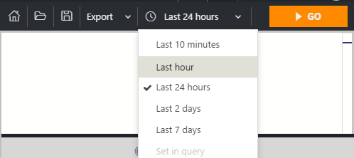
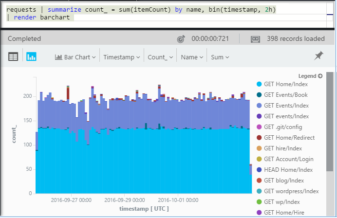
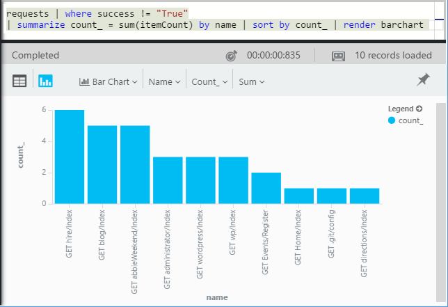
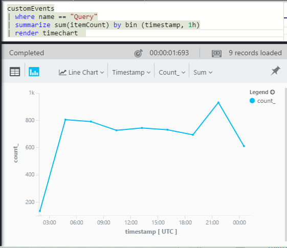
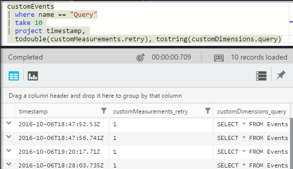
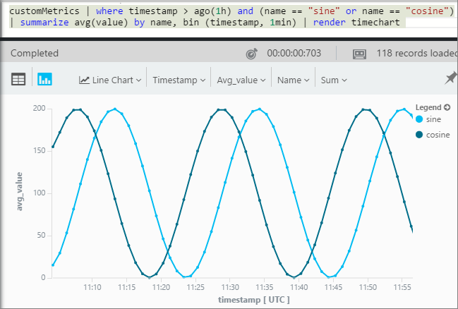
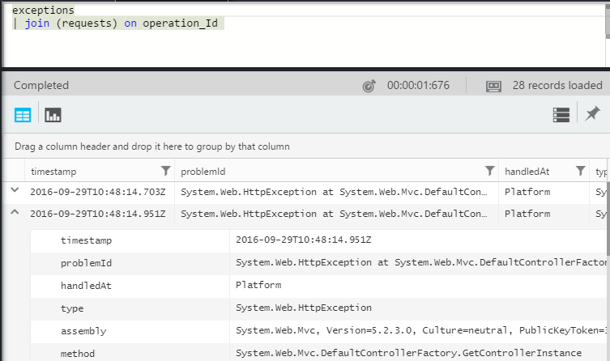
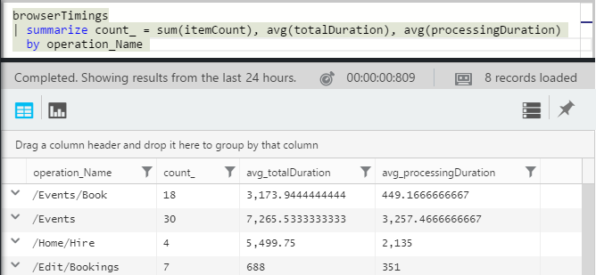
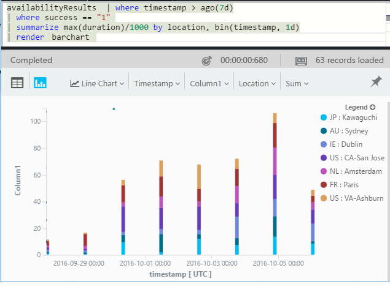

# A tour of Analytics in Application Insights
[Analytics](app-insights-analytics.md) is the powerful search feature of
[Application Insights](app-insights-overview.md). These pages describe the
 Analytics query language.

* **[Watch the introductory video](https://applicationanalytics-media.azureedge.net/home_page_video.mp4)**.
* **[Test drive Analytics on our simulated data](https://analytics.applicationinsights.io/demo)** if your app isn't sending data to Application Insights yet.
* **[SQL-users' cheat sheet](https://aka.ms/sql-analytics)** translates the most common idioms.

Let's take a walk through some basic queries to get you started.

## Connect to your Application Insights data
Open Analytics from your app's [overview blade](app-insights-dashboards.md) in Application Insights:


## [Take](app-insights-analytics-reference.md#take-operator): show me n rows
Data points that log user operations (typically HTTP requests received by your web app) are stored in a table called `requests`. Each row is a telemetry data point received from the Application Insights SDK in your app.

Let's start by examining a few sample rows of the table:


> [!NOTE]
> Put the cursor somewhere in the statement before you click Go. You can split a statement over more than one line, but don't put blank lines in a statement. Blank lines are a convenient way to keep several separate queries in the window.
>
>

Choose columns, drag them, group by columns, and filter:


Expand any item to see the detail:


> [!NOTE]
> Click the head of a column to re-order the results available in the web browser. But be aware that for a large result set, the number of rows downloaded to the browser is limited. Sorting this way doesn't always show you the actual highest or lowest items. To sort items reliably, use the `top` or `sort` operator.
>
>

## [Top](app-insights-analytics-reference.md#top-operator) and [sort](app-insights-analytics-reference.md#sort-operator)
`take` is useful to get a quick sample of a result, but it shows rows from the table in no particular order. To get an ordered view, use `top` (for a sample) or `sort` (over the whole table).

Show me the first n rows, ordered by a particular column:

```AIQL

    requests | top 10 by timestamp desc
```

* *Syntax:* Most operators have keyword parameters such as `by`.
* `desc` = descending order, `asc` = ascending.


`top...` is a more performant way of saying `sort ... | take...`. We could have written:

```AIQL

    requests | sort by timestamp desc | take 10
```

The result would be the same, but it would run a bit more slowly. (You could also write `order`, which is an alias of `sort`.)

The column headers in the table view can also be used to sort the results on the screen. But of course, if you've used `take` or `top` to retrieve just part of a table, you'll only re-order the records you've retrieved.

## [Where](app-insights-analytics-reference.md#where-operator): filtering on a condition

Let's see just requests that returned a particular result code:

```AIQL

    requests
    | where resultCode  == "404"
    | take 10
```


The `where` operator takes a Boolean expression. Here are some key points about them:

* `and`, `or`: Boolean operators
* `==`, `<>`, `!=` : equal and not equal
* `=~`, `!~` : case-insensitive string equal and not equal. There are lots more string comparison operators.

Read all about [scalar expressions](app-insights-analytics-reference.md#scalars).

### Getting the right type
Find unsuccessful requests:

```AIQL

    requests
    | where isnotempty(resultCode) and toint(resultCode) >= 400
```

`resultCode` has type string, so we must [cast it](app-insights-analytics-reference.md#casts) for a numeric comparison.

## Time range

By default, your queries are restricted to the last 24 hours. But you can change this range:



Override the time range by writing any query that mentions `timestamp` in a where-clause. For example:

```AIQL

    // What were the slowest requests over the past 3 days?
    requests
    | where timestamp > ago(3d)  // Override the time range
    | top 5 by duration
```

The time range feature is equivalent to a 'where' clause inserted after each mention of one of the source tables.

`ago(3d)` means 'three days ago'. Other units of time include hours (`2h`, `2.5h`), minutes (`25m`), and seconds (`10s`).

Other examples:

```AIQL

    // Last calendar week:
    requests
    | where timestamp > startofweek(now()-7d)
        and timestamp < startofweek(now())
    | top 5 by duration

    // First hour of every day in past seven days:
    requests
    | where timestamp > ago(7d) and timestamp % 1d < 1h
    | top 5 by duration

    // Specific dates:
    requests
    | where timestamp > datetime(2016-11-19) and timestamp < datetime(2016-11-21)
    | top 5 by duration

```

[Dates and times reference](app-insights-analytics-reference.md#date-and-time).


## [Project](app-insights-analytics-reference.md#project-operator): select, rename, and compute columns
Use [`project`](app-insights-analytics-reference.md#project-operator) to pick out just the columns you want:

```AIQL

    requests | top 10 by timestamp desc
             | project timestamp, name, resultCode
```


You can also rename columns and define new ones:

```AIQL

    requests
    | top 10 by timestamp desc
    | project  
            name,
            response = resultCode,
            timestamp,
            ['time of day'] = floor(timestamp % 1d, 1s)
```


* [Column names](app-insights-analytics-reference.md#names) can include spaces or symbols if they are bracketed like this: `['...']` or `["..."]`
* `%` is the usual modulo operator.
* `1d` (that's a digit one, then a 'd') is a timespan literal meaning one day. Here are some more timespan literals: `12h`, `30m`, `10s`, `0.01s`.
* `floor` (alias `bin`) rounds a value down to the nearest multiple of the base value you provide. So `floor(aTime, 1s)` rounds a time down to the nearest second.

[Expressions](app-insights-analytics-reference.md#scalars) can include all the usual operators (`+`, `-`, ...), and there's a range of useful functions.

## [Extend](app-insights-analytics-reference.md#extend-operator): compute columns
If you just want to add columns to the existing ones, use [`extend`](app-insights-analytics-reference.md#extend-operator):

```AIQL

    requests
    | top 10 by timestamp desc
    | extend timeOfDay = floor(timestamp % 1d, 1s)
```

Using [`extend`](app-insights-analytics-reference.md#extend-operator) is less verbose than [`project`](app-insights-analytics-reference.md#project-operator) if you want to keep all the existing columns.

### Convert to local time

Timestamps are always in UTC. So if you're on the US Pacific coast and it's winter, you might like this:

```AIQL

    requests
    | top 10 by timestamp desc
    | extend localTime = timestamp - 8h
```


## [Summarize](app-insights-analytics-reference.md#summarize-operator): aggregate groups of rows
`Summarize` applies a specified *aggregation function* over groups of rows.

For example, the time your web app takes to respond to a request is reported in the field `duration`. Let's see the average response time to all requests:


Or we could separate the result into requests of different names:


`Summarize` collects the data points in the stream into groups for which the `by` clause evaluates equally. Each value in the `by` expression - each operation name in the above example - results in a row in the result table.

Or we could group results by time of day:


Notice how we're using the `bin` function (aka `floor`). If we just used `by timestamp`, every input row would end up in its own little group. For any continuous scalar like times or numbers, we have to break the continuous range into a manageable number of discrete values. `bin` - which is just the familiar rounding-down `floor` function - is the easiest way to do that.

We can use the same technique to reduce ranges of strings:


Notice that you can use `name=` to set the name of a result column, either in the aggregation expressions or the by-clause.

## Counting sampled data
`sum(itemCount)` is the recommended aggregation to count events. In many cases, itemCount==1, so the function simply counts up the number of rows in the group. But when [sampling](app-insights-sampling.md) is in operation, only a fraction of the original events are retained as data points in Application Insights, so that for each data point you see, there are `itemCount` events.

For example, if sampling discards 75% of the original events, then itemCount==4 in the retained records - that is, for every retained record, there were four original records.

Adaptive sampling causes itemCount to be higher during periods when your application is being heavily used.

Summing up itemCount therefore gives a good estimate of the original number of events.


There's also a `count()` aggregation (and a count operation), for cases where you really do want to count the number of rows in a group.

There's a range of [aggregation functions](app-insights-analytics-reference.md#aggregations).

## Charting the results
```AIQL

    exceptions
       | summarize count=sum(itemCount)  
         by bin(timestamp, 1h)
```

By default, results display as a table:


We can do better than the table view. Let's look at the results in the chart view with the vertical bar option:


Notice that although we didn't sort the results by time (as you can see in the table display), the chart display always shows datetimes in correct order.


## Timecharts
Show how many events there are each hour:

```AIQL

    requests
      | summarize event_count=sum(itemCount)
        by bin(timestamp, 1h)
```

Select the Chart display option:


## Multiple series
Multiple expressions in the `summarize` clause creates multiple columns.

Multiple expressions in the `by` clause creates multiple rows, one for each combination of values.

```AIQL

    requests
    | summarize count_=sum(itemCount), avg(duration)
      by bin(timestamp, 1h), client_StateOrProvince, client_City
    | order by timestamp asc, client_StateOrProvince, client_City
```


### Segment a chart by dimensions
If you chart a table that has a string column and a numeric column, the string can be used to split the numeric data into separate series of points. If there's more than one string column, you can choose which column to use as the discriminator.


#### Bounce rate

Convert a boolean to a string to use it as a discriminator:

```AIQL

    // Bounce rate: sessions with only one page view
    requests
    | where notempty(session_Id)
    | where tostring(operation_SyntheticSource) == "" // real users
    | summarize pagesInSession=sum(itemCount), sessionEnd=max(timestamp)
               by session_Id
    | extend isbounce= pagesInSession == 1
    | summarize count()
               by tostring(isbounce), bin (sessionEnd, 1h)
    | render timechart
```

### Display multiple metrics
If you chart a table that has more than one numeric column, in addition to the timestamp, you can display any combination of them.


You must select **Don't Split** before you can select multiple numeric columns. You can't split by a string column at the same time as displaying more than one numeric column.

## Daily average cycle
How does usage vary over the average day?

Count requests by the time modulo one day, binned into hours:

```AIQL

    requests
    | where timestamp > ago(30d)  // Override "Last 24h"
    | where tostring(operation_SyntheticSource) == "" // real users
    | extend hour = bin(timestamp % 1d , 1h)
          + datetime("2016-01-01") // Allow render on line chart
    | summarize event_count=sum(itemCount) by hour
```


> [!NOTE]
> Notice that we currently have to convert time durations to datetimes in order to display on a line chart.
>
>

## Compare multiple daily series
How does usage vary over the time of day in different countries?

```AIQL

     requests  
     | where timestamp > ago(30d)  // Override "Last 24h"
     | where tostring(operation_SyntheticSource) == "" // real users
     | extend hour= floor( timestamp % 1d , 1h)
           + datetime("2001-01-01")
     | summarize event_count=sum(itemCount)
       by hour, client_CountryOrRegion
     | render timechart
```


## Plot a distribution
How many sessions are there of different lengths?

```AIQL

    requests
    | where timestamp > ago(30d) // override "Last 24h"
    | where isnotnull(session_Id) and isnotempty(session_Id)
    | summarize min(timestamp), max(timestamp)
      by session_Id
    | extend sessionDuration = max_timestamp - min_timestamp
    | where sessionDuration > 1s and sessionDuration < 3m
    | summarize count() by floor(sessionDuration, 3s)
    | project d = sessionDuration + datetime("2016-01-01"), count_
```

The last line is required to convert to datetime. Currently the x axis of a chart is displayed as a scalar only if it is a datetime.

The `where` clause excludes one-shot sessions (sessionDuration==0) and sets the length of the x-axis.


## [Percentiles](app-insights-analytics-reference.md#percentiles)
What ranges of durations cover different percentages of sessions?

Use the above query, but replace the last line:

```AIQL

    requests
    | where isnotnull(session_Id) and isnotempty(session_Id)
    | summarize min(timestamp), max(timestamp)
      by session_Id
    | extend sesh = max_timestamp - min_timestamp
    | where sesh > 1s
    | summarize count() by floor(sesh, 3s)
    | summarize percentiles(sesh, 5, 20, 50, 80, 95)
```

We also removed the upper limit in the where clause, in order to get correct figures including all sessions with more than one request:


From which we can see that:

* 5% of sessions have a duration of less than 3 minutes 34s;
* 50% of sessions last less than 36 minutes;
* 5% of sessions last more than 7 days

To get a separate breakdown for each country, we just have to bring the client_CountryOrRegion column separately through both summarize operators:

```AIQL

    requests
    | where isnotnull(session_Id) and isnotempty(session_Id)
    | summarize min(timestamp), max(timestamp)
      by session_Id, client_CountryOrRegion
    | extend sesh = max_timestamp - min_timestamp
    | where sesh > 1s
    | summarize count() by floor(sesh, 3s), client_CountryOrRegion
    | summarize percentiles(sesh, 5, 20, 50, 80, 95)
      by client_CountryOrRegion
```


## Join
We have access to several tables, including requests and exceptions.

To find the exceptions related to a request that returned a failure response, we can join the tables on `session_Id`:

```AIQL

    requests
    | where toint(resultCode) >= 500
    | join (exceptions) on operation_Id
    | take 30
```


It's good practice to use `project` to select just the columns we need before performing the join.
In the same clauses, we rename the timestamp column.

## [Let](app-insights-analytics-reference.md#let-clause): Assign a result to a variable

Use `let` to separate out the parts of the previous expression. The results are unchanged:

```AIQL

    let bad_requests =
      requests
        | where  toint(resultCode) >= 500  ;
    bad_requests
    | join (exceptions) on session_Id
    | take 30
```

> [!Tip] 
> In the Analytics client, don't put blank lines between the parts of the query. Make sure to execute all of it.
>

Use `toscalar` to convert a single table cell to a value:

```AIQL
let topCities =  toscalar (
   requests
   | summarize count() by client_City 
   | top n by count_ 
   | summarize makeset(client_City));
requests
| where client_City in (topCities(3)) 
| summarize count() by client_City;
```


### Functions

Use *Let* to define a function:

```AIQL

    let usdate = (t:datetime)
    {
      strcat(getmonth(t), "/", dayofmonth(t),"/", getyear(t), " ",
      bin((t-1h)%12h+1h,1s), iff(t%24h<12h, "AM", "PM"))
    };
    requests  
    | extend PST = usdate(timestamp-8h)
```

## Accessing nested objects
Nested objects can be accessed easily. For example, in the exceptions stream you can see structured objects like this:


You can flatten it by choosing the properties you're interested in:

```AIQL

    exceptions | take 10
    | extend method1 = tostring(details[0].parsedStack[1].method)
```

Note that you need to use a [cast](app-insights-analytics-reference.md#casts) to the appropriate type.


## Custom properties and measurements
If your application attaches [custom dimensions (properties) and custom measurements](app-insights-api-custom-events-metrics.md#properties) to events, then you will see them in the `customDimensions` and `customMeasurements` objects.

For example, if your app includes:

```C#

    var dimensions = new Dictionary<string, string>
                     {{"p1", "v1"},{"p2", "v2"}};
    var measurements = new Dictionary<string, double>
                     {{"m1", 42.0}, {"m2", 43.2}};
    telemetryClient.TrackEvent("myEvent", dimensions, measurements);
```

To extract these values in Analytics:

```AIQL

    customEvents
    | extend p1 = customDimensions.p1,
      m1 = todouble(customMeasurements.m1) // cast to expected type

```

To verify whether a custom dimension is of a particular type:

```AIQL

    customEvents
    | extend p1 = customDimensions.p1,
      iff(notnull(todouble(customMeasurements.m1)), ...
```

## Dashboards
You can pin your results to a dashboard in order to bring together all your most important charts and tables.

* [Azure shared dashboard](app-insights-dashboards.md#share-dashboards): Click the pin icon. Before you do this, you must have a shared dashboard. In the Azure portal, open or create a dashboard and click Share.
* [Power BI dashboard](app-insights-export-power-bi.md): Click Export, Power BI Query. An advantage of this alternative is that you can display your query alongside other results from a wide range of sources.

## Combine with imported data

Analytics reports look great on the dashboard, but sometimes you want to translate the data to a more digestible form. For example, suppose your authenticated users are identified in the telemetry by an alias. You'd like to show their real names in your results. To do this, you need a CSV file that maps from the aliases to the real names.

You can import a data file and use it just like any of the standard tables (requests, exceptions, and so on). Either query it on its own, or join it with other tables. For example, if you have a table named usermap, and it has columns `realName` and `userId`, then you can use it to translate the `user_AuthenticatedId` field in the request telemetry:

```AIQL

    requests
    | where notempty(user_AuthenticatedId)
    | project userId = user_AuthenticatedId
      // get the realName field from the usermap table:
    | join kind=leftouter ( usermap ) on userId
      // count transactions by name:
    | summarize count() by realName
```

To import a table, in the Schema blade, under **Other Data Sources**, follow the instructions to add a new data source, by uploading a sample of your data. Then you can use this definition to upload tables.

The import feature is currently in preview, so you will initially see a "Contact us" link under "Other data sources." Use this to sign up to the preview program, and the link will then be replaced by an "Add new data source" button.


## Tables
The stream of telemetry received from your app is accessible through several tables. The schema of properties available for each table is visible at the left of the window.

### Requests table
Count HTTP requests to your web app and segment by page name:



Find the requests that fail most:



### Custom events table
If you use [TrackEvent()](app-insights-api-custom-events-metrics.md#trackevent) to send your own events, you can read them from this table.

Let's take an example where your app code contains these lines:

```C#

    telemetry.TrackEvent("Query",
       new Dictionary<string,string> {{"query", sqlCmd}},
       new Dictionary<string,double> {
           {"retry", retryCount},
           {"querytime", totalTime}})
```

Display the frequency of these events:



Extract measurements and dimensions from the events:



### Custom metrics table
If you are using [TrackMetric()](app-insights-api-custom-events-metrics.md#trackmetric) to send your own metric values, you’ll find its results in the **customMetrics** stream. For example:  



> [!NOTE]
> In [Metrics Explorer](app-insights-metrics-explorer.md), all custom measurements attached to any type of telemetry appear together in the metrics blade along with metrics sent using `TrackMetric()`. But in Analytics, custom measurements are still attached to whichever type of telemetry they were carried on - events or requests, and so on - while metrics sent by TrackMetric appear in their own stream.
>
>

### Performance counters table
[Performance counters](app-insights-performance-counters.md) show you basic system metrics for your app, such as CPU, memory, and network utilization. You can configure the SDK to send additional counters, including your own custom counters.

The **performanceCounters** schema exposes the `category`, `counter` name, and `instance` name of each performance counter. Counter instance names are only applicable to some performance counters, and typically indicate the name of the process to which the count relates. In the telemetry for each application, you’ll see only the counters for that application. For example, to see what counters are available:


To get a chart of available memory over the selected period:


Like other telemetry, **performanceCounters** also has a column `cloud_RoleInstance` that indicates the identity of the host machine on which your app is running. For example, to compare the performance of your app on the different machines:


### Exceptions table
[Exceptions reported by your app](app-insights-asp-net-exceptions.md) are available in this table.

To find the HTTP request that your app was handling when the exception was raised, join on operation_Id:



### Browser timings table
`browserTimings` shows page load data collected in your users' browsers.

[Set up your app for client-side telemetry](app-insights-javascript.md) in order to see these metrics.

The schema includes [metrics indicating the lengths of different stages of the page loading process](app-insights-javascript.md#page-load-performance). (They don’t indicate the length of time your users read a page.)  

Show the popularities of different pages, and load times for each page:



### Availability results table
`availabilityResults` shows the results of your [web tests](app-insights-monitor-web-app-availability.md). Each run of your tests from each test location is reported separately.



### Dependencies table
Contains results of calls that your app makes to databases and REST APIs, and other calls to TrackDependency(). Also includes AJAX calls made from the browser.

AJAX calls from the browser:

```AIQL

    dependencies | where client_Type == "Browser"
    | take 10
```

Dependency calls from the server:

```AIQL

    dependencies | where client_Type == "PC"
    | take 10
```

Server-side dependency results always show `success==False` if the Application Insights Agent is not installed. However, the other data are correct.

### Traces table
Contains the telemetry sent by your app using TrackTrace(), or [other logging frameworks](app-insights-asp-net-trace-logs.md).

## Video 

> [!VIDEO https://channel9.msdn.com/events/Connect/2016/123/player] 

Advanced queries:

> [!VIDEO https://channel9.msdn.com/Events/Build/2016/P591/player]


## Next steps
* [Analytics language reference](app-insights-analytics-reference.md)
* [SQL-users' cheat sheet](https://aka.ms/sql-analytics) translates the most common idioms.

[!INCLUDE [app-insights-analytics-footer](../../includes/app-insights-analytics-footer.md)]
