<properties 
	pageTitle="A tour through Analytics in Application Insights | Microsoft Azure" 
	description="Short samples of all the main queries in Analytics, 
	             the powerful search tool of Application Insights." 
	services="application-insights" 
    documentationCenter=""
	authors="alancameronwills" 
	manager="douge"/>

<tags 
	ms.service="application-insights" 
	ms.workload="tbd" 
	ms.tgt_pltfrm="ibiza" 
	ms.devlang="na" 
	ms.topic="article" 
	ms.date="07/20/2016" 
	ms.author="awills"/>


 
# A tour of Analytics in Application Insights


[Analytics](app-insights-analytics.md) is the powerful search feature of 
[Application Insights](app-insights-overview.md). These pages describe the
 Analytics query lanquage.

Let's take a walk through some basic queries to get you started.

> [AZURE.NOTE] If your app isn't sending data to Application Insights yet, you can [test Analytics using our simulated data](https://analytics.applicationinsights.io/demo).


## Connect to your Application Insights data

Open Analytics from your app's [overview blade](app-insights-dashboards.md) in Application Insights:

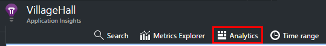

	
## [Take](app-insights-analytics-reference.md#take-operator): show me n rows

Data points that log user operations (typically HTTP requests received by your web app) are stored in a table called `requests`. Each row is a telemetry data point received from the Application Insights SDK in your app.

Let's start by examining a few sample rows of the table:

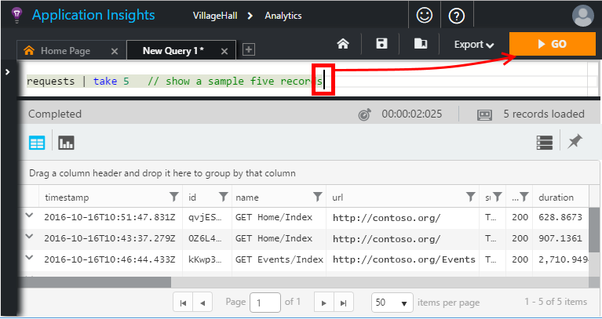

> [AZURE.NOTE] Put the cursor somewhere in the statement before you click Go. You can split a statement over more than one line, but don't put blank lines in a statement. Blank lines are a convenient way to keep several separate queries in the window.


Choose columns and adjust their positions:

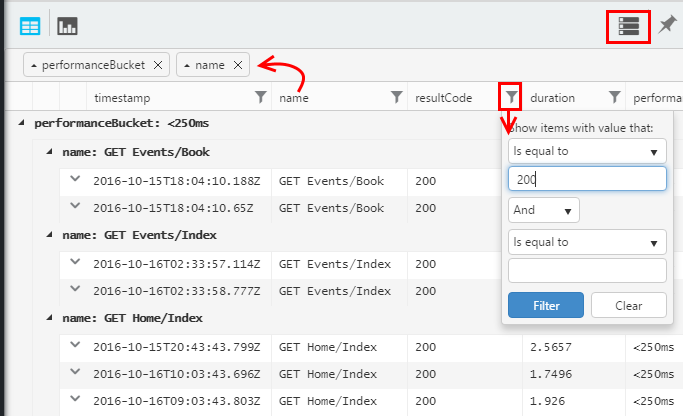


Expand any item to see the detail:
 
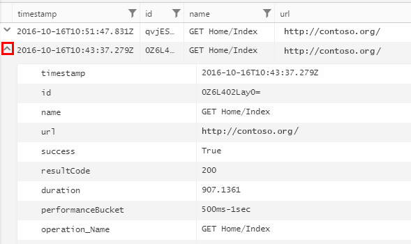

> [AZURE.NOTE] Click the head of a column to re-order the results available in the web browser. But be aware that for a large result set, the number of rows downloaded to the browser is limited. Be aware that sorting this way doesn't always show you the actual highest or lowest items. For that, you should use the `top` or `sort` operator. 

## [Top](app-insights-analytics-reference.md#top-operator) and [sort](app-insights-analytics-reference.md#sort-operator)

`take` is useful to get a quick sample of a result, but it shows rows from the table in no particular order. To get an ordered view, use `top` (for a sample) or `sort` (over the whole table).

Show me the first n rows, ordered by a particular column:

```AIQL

	requests | top 10 by timestamp desc 
```

* *Syntax:* Most operators have keyword parameters such as `by`.
* `desc` = descending order, `asc` = ascending.

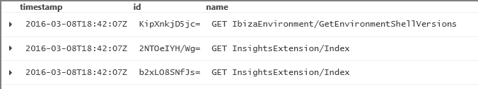

`top...` is a more performant way of saying `sort ... | take...`. We could have written:

```AIQL

	requests | sort by timestamp desc | take 10
```

The result would be the same, but it would run a bit more slowly. (You could also write `order`, which is an alias of `sort`.)

The column headers in the table view can also be used to sort the results on the screen. But of course, if you've used `take` or `top` to retrieve just part of a table, you'll only re-order the records you've retrieved.


## [Project](app-insights-analytics-reference.md#project-operator): select, rename and compute columns

Use [`project`](app-insights-analytics-reference.md#project-operator) to pick out just the columns you want:

```AIQL

    requests | top 10 by timestamp desc
             | project timestamp, name, resultCode
```

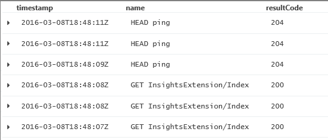


You can also rename columns and define new ones:

```AIQL

    requests 
    | top 10 by timestamp desc 
    | project  
            name, 
            response = resultCode,
            timestamp, 
            ['time of day'] = floor(timestamp % 1d, 1s)
```

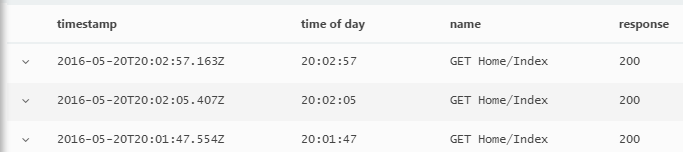

* [Column names](app-insights-analytics-reference.md#names) can include spaces or symbols if they are bracketed like this: `['...']` or `["..."]`
* `%` is the usual modulo operator. 
* `1d` (that's a digit one, then a 'd') is a timespan literal meaning one day. Here are some more timespan literals: `12h`, `30m`, `10s`, `0.01s`.
* `floor` (alias `bin`) rounds a value down to the nearest multiple of the base value you provide. So `floor(aTime, 1s)` rounds a time down to the nearest second.

[Expressions](app-insights-analytics-reference.md#scalars) can include all the usual operators (`+`, `-`, ...), and there's a range of useful functions.

    

## [Extend](app-insights-analytics-reference.md#extend-operator): compute columns

If you just want to add columns to the existing ones, use [`extend`](app-insights-analytics-reference.md#extend-operator):

```AIQL

    requests 
    | top 10 by timestamp desc
    | extend timeOfDay = floor(timestamp % 1d, 1s)
```

Using [`extend`](app-insights-analytics-reference.md#extend-operator) is less verbose than [`project`](app-insights-analytics-reference.md#project-operator) if you want to keep all the existing columns.


## Accessing nested objects

Nested objects can be accessed easily. For example, in the exceptions stream you'll see structured objects like this:

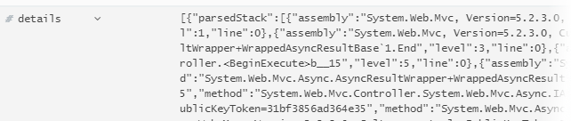

You can flatten it by choosing the properties you're interested in:

```AIQL

    exceptions | take 10
    | extend method1 = details[0].parsedStack[1].method
```

## Custom properties and measurements

If your application attaches [custom dimensions (properties) and custom measurements](app-insights-api-custom-events-metrics.md#properties) to events, then you will see them in the `customDimensions` and `customMeasurements` objects.


For example, if your app includes:

```C#

    var dimensions = new Dictionary<string, string> 
                     {{"p1", "v1"},{"p2", "v2"}};
    var measurements = new Dictionary<string, double>
                     {{"m1", 42.0}, {"m2", 43.2}};
	telemetryClient.TrackEvent("myEvent", dimensions, measurements);
```

To extract these values in Analytics:

```AIQL

    customEvents
    | extend p1 = customDimensions.p1, 
      m1 = todouble(customMeasurements.m1) // cast numerics

``` 

> [AZURE.NOTE] In [Metrics Explorer](app-insights-metrics-explorer.md), all custom measurements attached to any type of telemetry appear together in the metrics blade along with metrics sent using `TrackMetric()`. But in Analytics, custom measurements are still attached to whichever type of telemetry they were carried on, and metrics appear in their own `metrics` stream.


## [Summarize](app-insights-analytics-reference.md#summarize-operator): aggregate groups of rows

`Summarize` applies a specified *aggregation function* over groups of rows. 

For example, the time your web app takes to respond to a request is reported in the field `duration`. Let's see the average response time to all requests:

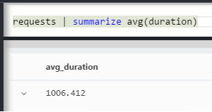

Or we could separate the result into requests of different names:


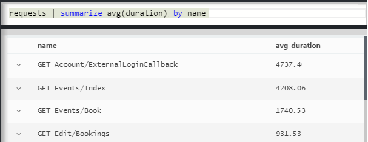

`Summarize` collects the data points in the stream into groups for which the `by` clause evaluates equally. Each value in the `by` expression - each operation name in the above example - results in a row in the result table. 

Or we could group results by time of day:

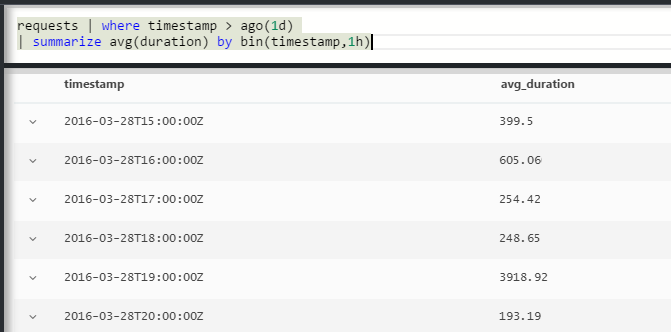

Notice how we're using the `bin` function (aka `floor`). If we just used `by timestamp`, every input row would end up in its own little group. For any continuous scalar like times or numbers, we have to break the continuous range into a manageable number of discrete values, and `bin` - which is really just the familiar rounding-down `floor` function - is the easiest way to do that.

We can use the same technique to reduce ranges of strings:


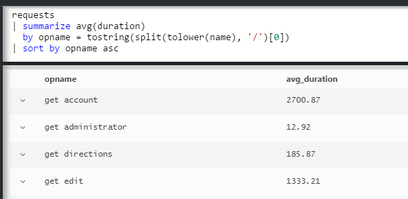

Notice that you can use `name=` to set the name of a result column, either in the aggregation expressions or the by-clause.

## Counting sampled data

`sum(itemCount)` is the recommended aggregation to count events. In many cases, itemCount==1, so the function simply counts up the number of rows in the group. But when [sampling](app-insights-sampling.md) is in operation, only a fraction of the original events will be retained as data points in Application Insights, so that for each data point you see, there are `itemCount` events. 

For example, if sampling discards 75% of the original events, then itemCount==4 in the retained records - that is, for every retained record, there were four original records. 

Adaptive sampling causes itemCount to be higher during periods when your application is being heavily used.

Summing up itemCount therefore gives a good estimate of the original number of events.


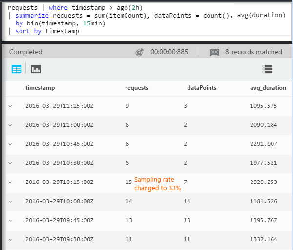

There's also a `count()` aggregation (and a count operation), for cases where you really do want to count the number of rows in a group.


There's a range of [aggregation functions](app-insights-analytics-reference.md#aggregations).


## Charting the results


```AIQL

    exceptions 
       | summarize count()  
         by bin(timestamp, 1d)
```

By default, results display as a table:

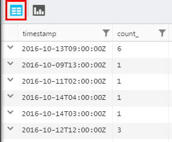


We can do better than the table view. Let's look at the results in the chart view with the vertical bar option:

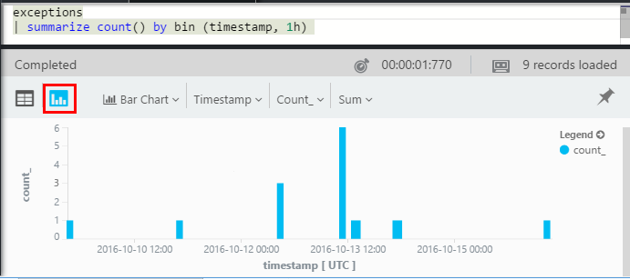

Notice that although we didn't sort the results by time (as you can see in the table display), the chart display always shows datetimes in correct order.


## [Where](app-insights-analytics-reference.md#where-operator): filtering on a condition

If you've set up Application Insights monitoring for both the [client](app-insights-javascript.md) and server sides of your app, some of the telemetry in the database comes from browsers.

Let's see just exceptions reported from browsers:

```AIQL

    exceptions 
    | where device_Id == "browser" 
    |  summarize count() 
       by device_BrowserVersion, outerExceptionMessage 
```

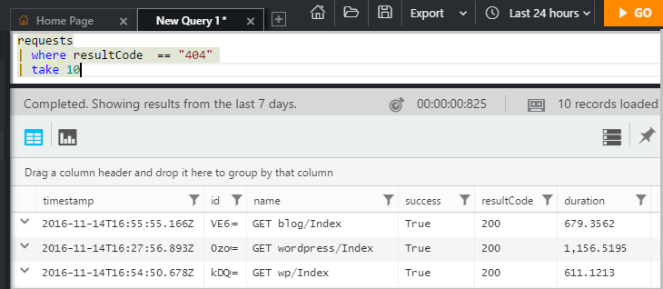

The `where` operator takes a Boolean expression. Here are some key points about them:

 * `and`, `or`: Boolean operators
 * `==`, `<>` : equal and not equal
 * `=~`, `!=` : case-insensitive string equal and not equal. There are lots more string comparison operators.

Read all about [scalar expressions](app-insights-analytics-reference.md#scalars).

### Filtering events

Find unsuccessful requests:

```AIQL

    requests 
    | where isnotempty(resultCode) and toint(resultCode) >= 400
```

`responseCode` has type string, so we must [cast it](app-insights-analytics-reference.md#casts) for a numeric comparison.

Summarize the different responses:

```AIQL

    requests
    | where isnotempty(resultCode) and toint(resultCode) >= 400
    | summarize count() 
      by resultCode
```

## Timecharts

Show how many events there are each day:

```AIQL

    requests
      | summarize event_count=count()
        by bin(timestamp, 1d)
```

Select the Chart display option:

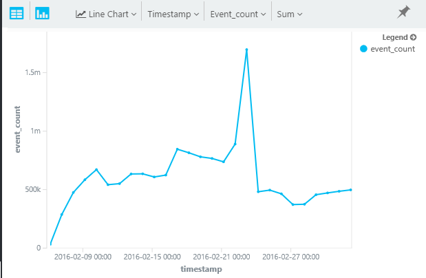

The x axis for line charts has to be of type DateTime. 

## Multiple series 

Use multiple values in a `summarize by` clause to create a separate row for each combination of values:

```AIQL

    requests 
      | summarize event_count=count()   
        by bin(timestamp, 1d), client_StateOrProvince
```

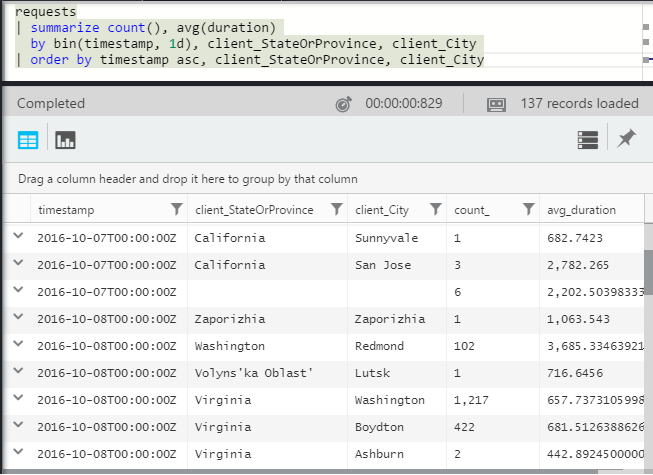

To display multiple lines on a chart, click **Split by** and choose a column.

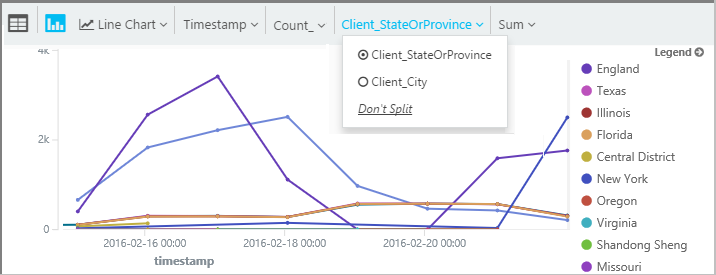


## Daily average cycle

How does usage vary over the average day?

Count requests by the time modulo one day, binned into hours:

```AIQL

    requests
    | extend hour = floor(timestamp % 1d , 1h) 
          + datetime("2016-01-01")
    | summarize event_count=count() by hour
```

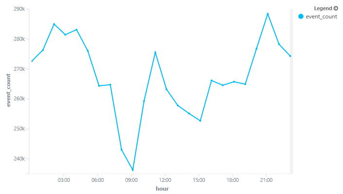

>[AZURE.NOTE] Notice we currently have to convert time durations to datetimes in order to display on the a chart.


## Compare multiple daily series

How does usage vary over the time of day in different states?

```AIQL
    requests
     | extend hour= floor( timestamp % 1d , 1h)
           + datetime("2001-01-01")
     | summarize event_count=count() 
       by hour, client_StateOrProvince
```

Split the chart by state:

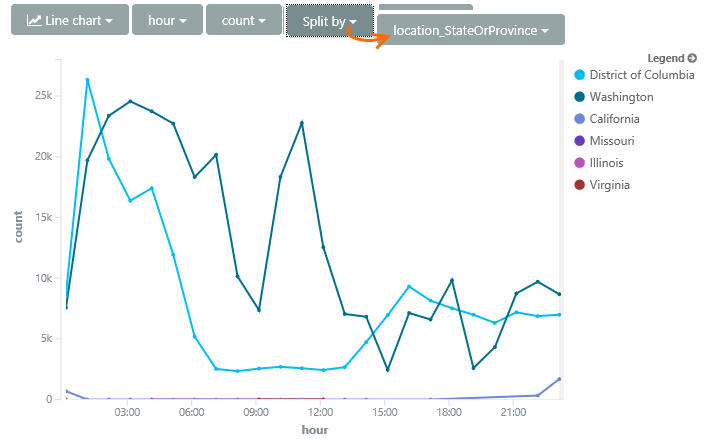


## Plot a distribution

How many sessions are there of different lengths?

```AIQL

    requests 
    | where isnotnull(session_Id) and isnotempty(session_Id) 
    | summarize min(timestamp), max(timestamp) 
      by session_Id 
    | extend sessionDuration = max_timestamp - min_timestamp 
    | where sessionDuration > 1s and sessionDuration < 3m 
    | summarize count() by floor(sessionDuration, 3s) 
    | project d = sessionDuration + datetime("2016-01-01"), count_
```

The last line is required to convert to datetime - currently the x axis of a line chart can only be a datetime.

The `where` clause excludes one-shot sessions (sessionDuration==0) and sets the length of the x-axis.


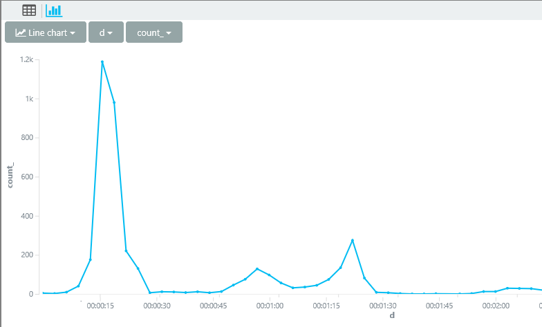


## [Percentiles](app-insights-analytics-reference.md#percentiles)

What ranges of durations cover different percentages of sessions?

Use the above query, but replace the last line:

```AIQL

    requests 
    | where isnotnull(session_Id) and isnotempty(session_Id) 
    | summarize min(timestamp), max(timestamp) 
      by session_Id 
    | extend sesh = max_timestamp - min_timestamp 
    | where sesh > 1s
    | summarize count() by floor(sesh, 3s) 
    | summarize percentiles(sesh, 5, 20, 50, 80, 95)
```

We also removed the upper limit in the where clause, so as to get correct figures including all sessions with more than one request:

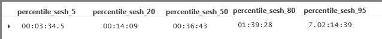

From which we can see that:

* 5% of sessions have a duration of less than 3 minutes 34s; 
* 50% of sessions last less than 36 minnutes;
* 5% of sessions last more than 7 days

To get a separate breakdown for each country, we just have to bring the client_CountryOrRegion column separately through both summarize operators:

```AIQL

    requests 
    | where isnotnull(session_Id) and isnotempty(session_Id) 
    | summarize min(timestamp), max(timestamp) 
      by session_Id, client_CountryOrRegion
    | extend sesh = max_timestamp - min_timestamp 
    | where sesh > 1s
    | summarize count() by floor(sesh, 3s), client_CountryOrRegion
    | summarize percentiles(sesh, 5, 20, 50, 80, 95)
	  by client_CountryOrRegion
```


## [Join](app-insights-analytics-reference.md#join)

We have access to several tables, including requests and exceptions.

To find the exceptions related to a request that returned a failure response, we can join the tables on `session_Id`:

```AIQL

    requests 
    | where toint(responseCode) >= 500 
    | join (exceptions) on operation_Id 
    | take 30
```


It's good practice to use `project` to select just the columns we need before performing the join.
In the same clauses, we rename the timestamp column.


## [Let](app-insights-analytics-reference.md#let-clause): Assign a result to a variable

Use [let](./app-insights-analytics-reference.md#let-statements) to separate out the parts of the previous expression. The results are unchanged:

```AIQL

    let bad_requests = 
      requests
        | where  toint(resultCode) >= 500  ;
    bad_requests
    | join (exceptions) on session_Id 
    | take 30
```

> Tip: In the Analytics client, don't put blank lines between the parts of this. Make sure to execute all of it.


[AZURE.INCLUDE [app-insights-analytics-footer](../../includes/app-insights-analytics-footer.md)]


