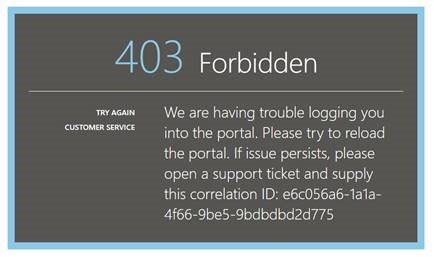
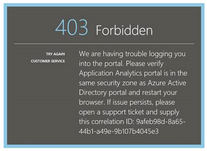
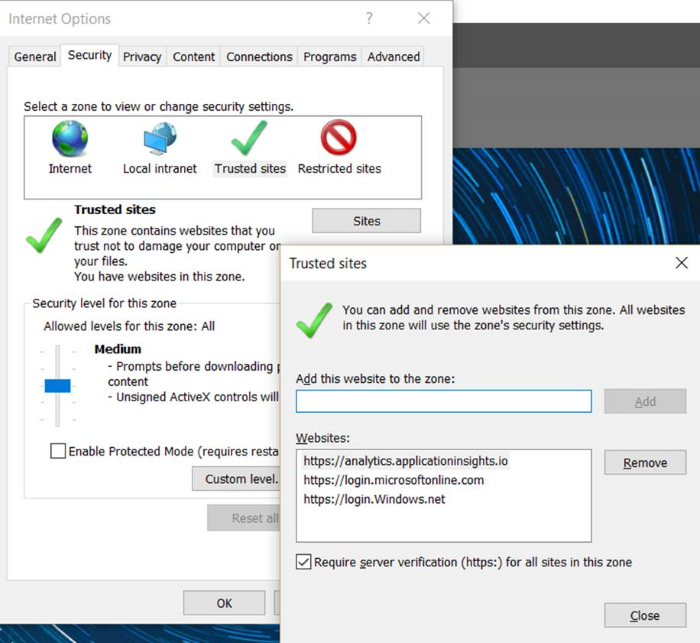
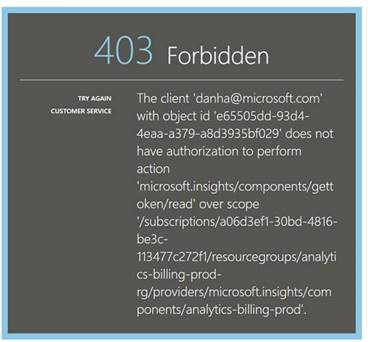
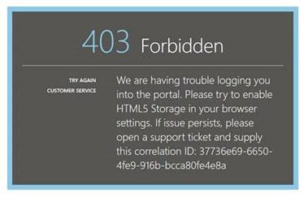

<properties 
	pageTitle="Troubleshooting Analytics - the powerful search tool of Application Insights | Microsoft Azure" 
	description="Problems with Application Insights analytics? Start here. " 
	services="application-insights" 
    documentationCenter=""
	authors="alancameronwills" 
	manager="douge"/>

<tags 
	ms.service="application-insights" 
	ms.workload="tbd" 
	ms.tgt_pltfrm="ibiza" 
	ms.devlang="na" 
	ms.topic="article" 
	ms.date="07/11/2016" 
	ms.author="awills"/>

# Troubleshoot Analytics in Application Insights

Problems with [Application Insights Analytics](app-insights-analytics.md)? Start here. Analytics is the powerful search tool of Visual Studio Application Insights.

## Limits

* At present, query results are limited to just over a week of past data.
* Browsers we test on: latest editions of Chrome, Edge, and Internet Explorer.

## Known incompatible browser extensions

* Ghostery

Disable the extension or use a different browser.

## "Unexpected error"

Internal error occurred during portal runtime – unhandled exception.

* Clean the browser's cache. 

## 403 ... please try to reload

An authentication related error occurred (during authentication or during access token generation). The portal may have no way to  recover without changing browser settings.

* Verify [third party cookies are enabled](#cookies) in the browser. 

## 403 ... verify security zone

An authentication related error occurred (during authentication or during access token generation). The portal may have no way to  recover without changing browser settings.

1. Verify [third party cookies are enabled](#cookies) in the browser. 

2. Did you use a favorite, bookmark or saved link to open the Analytics portal? Are you signed in with different credentials than you used when you saved the link?

2. Try using an in-private/incognito browser window (after closing all such windows). You'll have to provide your credentials. 

2. Open another (ordinary) browser window and go to [Azure](https://portal.azure.com). Sign out. Then open your link and sign in with the correct credentials.

2. Edge and Internet Explorer users can also get this error when trusted zone settings are not supported.

	Verify both [Analytics portal](https://analytics.applicationinsights.io) and [Azure Active Directory portal](https://portal.azure.com) are in the same security zone:

 * In Internet Explorer, open **Internet Options**, **Security**, **Trusted sites**, **Sites**:

    

    In the Websites list, if any of the following URLs are included, make sure that the others are included also:

    https://analytics.applicationinsights.io 
    https://login.microsoftonline.com 
    https://login.windows.net

## 404 ... Resource not found

Application resource was deleted from Application Insights and isn’t available anymore. This can happen if you saved the URL to the Analytics page.

## 403 ... No authorization

You don't have permission to open this application in Analytics.

* Did you get the link from someone else? Ask them to make sure you are in the [readers or contributors for this resource group](app-insights-resources-roles-access-control.md).
* Did you save the link using different credentials? Open the [Azure portal](https://portal.azure.com), sign out, and then try this link again, providing the correct credentials.

## 403 ... HTML5 Storage

Our portal uses HTML5 localStorage and sessionStorage.

* Chrome: Settings, privacy, content settings.
* Internet Explorer: Internet Options, Advanced tab, Security, Enable DOM Storage

## 404 ... Subscription not found

The URL is invalid. 

* Open the app resource in [Application Insights portal](https://portal.azure.com). Then use the Analytics button.

## 404 ... page doesn't exist

The URL is invalid.

* Open the app resource in [Application Insights portal](https://portal.azure.com). Then use the Analytics button.

## Enable third-party cookies

  See [how to disable third party cookies](http://www.digitalcitizen.life/how-disable-third-party-cookies-all-major-browsers), but notice we need to **enable** them.

## If all else fails    

[Contact us](app-insights-get-dev-support.md).
 
[AZURE.INCLUDE [app-insights-analytics-footer](../../includes/app-insights-analytics-footer.md)]

