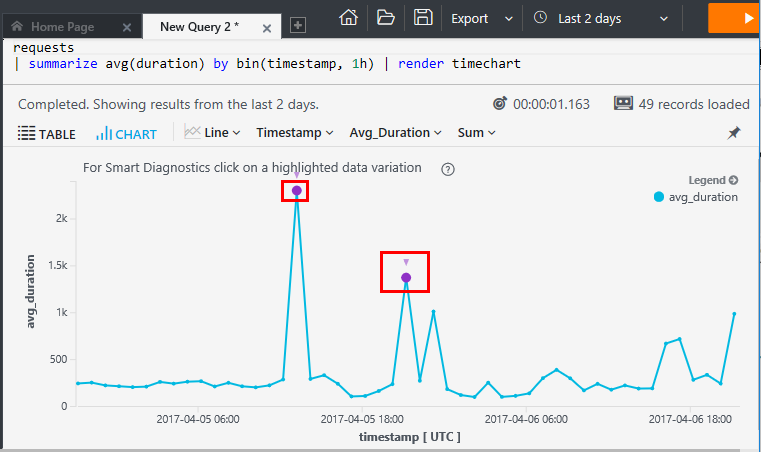

# Using Analytics in Application Insights
[Analytics](app-insights-analytics.md) is the powerful search feature of 
[Application Insights](app-insights-overview.md). These pages describe the
 Analytics query language.

* **[Watch the introductory video](https://applicationanalytics-media.azureedge.net/home_page_video.mp4)**.
* **[Test drive Analytics on our simulated data](https://analytics.applicationinsights.io/demo)** if your app isn't sending data to Application Insights yet.

## Open Analytics
From your app's home resource in Application Insights, click Analytics.


The inline tutorial gives you some ideas about what you can do.

There's a [more extensive tour here](app-insights-analytics-tour.md).

## Query your telemetry
### Write a query


Begin with the names of any of the tables listed on the left (or the [range](app-insights-analytics-reference.md#range-operator) or [union](app-insights-analytics-reference.md#union-operator) operators). Use `|` to create a pipeline of [operators](app-insights-analytics-reference.md#queries-and-operators). 

IntelliSense prompts you with the operators and the expression elements that you can use. Click the information icon (or press CTRL+Space) to get a longer description and examples of how to use each element.

See the [Analytics language tour](app-insights-analytics-tour.md) and [language reference](app-insights-analytics-reference.md).

### Run a query


1. You can use single line breaks in a query.
2. Put the cursor inside or at the end of the query you want to run.
3. Check the time range of your query. (You can change it, or override it by including your own [`where...timestamp...`](app-insights-analytics-tour.md#time-range) clause in your query.)
3. Click Go to run the query.
4. Don't put blank lines in your query. You can keep several separated queries in one query tab by separating them with blank lines. Only the query that has the cursor runs.

### Save a query


1. Save the current query file.
2. Open a saved query file.
3. Create a new query file.

## See the details
Expand any row in the results to see its complete list of properties. You can further expand any property that is a structured value - for example, custom dimensions, or the stack listing in an exception.


## Arrange the results
You can sort, filter, paginate, and group the results returned from your query.

> [!NOTE]
> Sorting, grouping, and filtering in the browser don't re-run your query. They only rearrange the results that were returned by your last query. 
> 
> To perform these tasks in the server before the results are returned, write your query with the [sort](app-insights-analytics-reference.md#sort-operator), [summarize](app-insights-analytics-reference.md#summarize-operator) and [where](app-insights-analytics-reference.md#where-operator) operators.
> 
> 

Pick the columns you'd like to see, drag column headers to rearrange them, and resize columns by dragging their borders.


### Sort and filter items
Sort your results by clicking the head of a column. Click again to sort the other way, and click a third time to revert to the original ordering returned by your query.

Use the filter icon to narrow your search.


### Group items
To sort by more than one column, use grouping. First enable it, and then drag column headers into the space above the table.


### Missing some results?

If you think you're not seeing all the results you expected, there are a couple of possible reasons.

* **Time range filter**. By default, you will only see results from the last 24 hours. There is an automatic filter that limits the range of results that are retrieved from the source tables. 

    However, you can change the time range filter by using the drop-down menu.

    Or you can override the automatic range by including your own [`where  ... timestamp ...` clause](app-insights-analytics-reference.md#where-operator) into your query. For example:

    `requests | where timestamp > ago('2d')`

* **Results limit**. There's a limit of about 10k rows on the results returned from the portal. A warning shows if you go over the limit. If that happens, sorting your results in the table won't always show you all the actual first or last results. 

    It's good practice to avoid hitting the limit. Use the time range filter, or use operators such as:

  * [top 100 by timestamp](app-insights-analytics-reference.md#top-operator) 
  * [take 100](app-insights-analytics-reference.md#take-operator)
  * [summarize ](app-insights-analytics-reference.md#summarize-operator) 
  * [where timestamp > ago(3d)](app-insights-analytics-reference.md#where-operator)

(Want more than 10k rows? Consider using [Continuous Export](app-insights-export-telemetry.md) instead. Analytics is designed for analysis, rather than retrieving raw data.)

## Diagrams
Select the type of diagram you'd like:


If you have several columns of the right types, you can choose the x and y axes, and a column of dimensions to split the results by.

By default, results are initially displayed as a table, and you select the diagram manually. But you can use the [render directive](app-insights-analytics-reference.md#render-directive) at the end of a query to select a diagram.

### Analytics diagnostics


On a timechart, if there is a sudden spike or step in your data, you may see a highlighted point on the line. This indicates that Analytics Diagnostics has identified a combination of properties that filter out the sudden change. Click the point to get more detail on the filter, and to see the filtered version. This may help you identify what caused the change. 

[Learn more about Analytics Diagnostics](app-insights-analytics-diagnostics.md)




## Pin to dashboard
You can pin a diagram or table to one of your [shared dashboards](app-insights-dashboards.md) - just click the pin. (You might need to [upgrade your app's pricing package](app-insights-pricing.md) to turn on this feature.) 


This means that, when you put together a dashboard to help you monitor the performance or usage of your web services, you can include quite complex analysis alongside the other metrics. 

You can pin a table to the dashboard, if it has four or fewer columns. Only the top seven rows are displayed.

### Dashboard refresh
The chart pinned to the dashboard is refreshed automatically by re-running the query approximately every hours. You can also click the Refresh button.

### Automatic simplifications

Certain simplifications are applied to a chart when you pin it to a dashboard.

**Time restriction:** Queries are automatically limited to the past 14 days. The effect is the same as if your query includes `where timestamp > ago(14d)`.

**Bin count restriction:** If you display a chart that has a lot of discrete bins (typically a bar chart), the less populated bins are automatically grouped into a single "others" bin. For example, this query:

    requests | summarize count_search = count() by client_CountryOrRegion

looks like this in Analytics:


but when you pin it to a dashboard, it looks like this:


## Export to Excel
After you've run a query, you can download a .csv file. Click **Export,  Excel**.

## Export to Power BI
Put the cursor in a query and choose **Export, Power BI**.


You run the query in Power BI. You can set it to refresh on a schedule.

With Power BI, you can create dashboards that bring together data from a wide variety of sources.

[Learn more about export to Power BI](app-insights-export-power-bi.md)

## Deep link

Get a link under **Export, Share link** that you can send to another user. Provided the user has [access to your resource group](app-insights-resources-roles-access-control.md), the query will open in the Analytics UI.

(In the link, the query text appears after "?q=", gzip compressed and base-64 encoded. You could write code to generate deep links that you provide to users. However, the recommended way to run Analytics from code is by using the [REST API](https://dev.applicationinsights.io/).)


## Automation

Use the  [Data Access REST API](https://dev.applicationinsights.io/) to run Analytics queries. [For example](https://dev.applicationinsights.io/apiexplorer/query?appId=DEMO_APP&apiKey=DEMO_KEY&query=requests%0A%7C%20where%20timestamp%20%3E%3D%20ago%2824h%29%0A%7C%20count) (using PowerShell):

```PS
curl "https://api.applicationinsights.io/beta/apps/DEMO_APP/query?query=requests%7C%20where%20timestamp%20%3E%3D%20ago(24h)%7C%20count" -H "x-api-key: DEMO_KEY"
```

Unlike the Analytics UI, the REST API does not automatically add any timestamp limitation to your queries. Remember to add your own where-clause, to avoid getting huge responses.


## Import data

You can import data from a CSV file. A typical usage is to import static data that you can join with tables from your telemetry. 

For example, if authenticated users are identified in your telemetry by an alias or obfuscated id, you could import a table that maps aliases to real names. By performing a join on the request telemetry, you can identify users by their real names in the Analytics reports.

### Define your data schema

1. Click **Settings** (at top left) and then **Data Sources**. 
2. Add a data source, following the instructions. You are asked to supply a sample of the data, which should include at least ten rows. You then correct the schema.

This defines a data source, which you can then use to import individual tables.

### Import a table

1. Open your data source definition from the list.
2. Click "Upload" and follow the instructions to upload the table. This involves a call to a REST API, and so it is easy to automate. 

Your table is now available for use in Analytics queries. It will appear in Analytics 

### Use the table

Let's suppose your data source definition is called `usermap`, and that it has two fields, `realName` and `user_AuthenticatedId`. The `requests` table also has a field named `user_AuthenticatedId`, so it's easy to join them:

```AIQL

    requests
    | where notempty(user_AuthenticatedId) | take 10
    | join kind=leftouter ( usermap ) on user_AuthenticatedId 
```
The resulting table of requests has an additional column, `realName`.

### Import from LogStash

If you use [LogStash](https://www.elastic.co/guide/en/logstash/current/getting-started-with-logstash.html), you can use Analytics to query your logs. Use the [plugin that pipes data into Analytics](https://github.com/Microsoft/logstash-output-application-insights). 

## Video

> [!VIDEO https://channel9.msdn.com/events/Connect/2016/123/player] 

[!INCLUDE [app-insights-analytics-footer](../../includes/app-insights-analytics-footer.md)]

