<properties 
	pageTitle="Using Analytics - the powerful search tool of Application Insights | Microsoft Azure" 
	description="Using the Analytics, 
	             the powerful diagnostic search tool of Application Insights. " 
	services="application-insights" 
    documentationCenter=""
	authors="danhadari" 
	manager="douge"/>

<tags 
	ms.service="application-insights" 
	ms.workload="tbd" 
	ms.tgt_pltfrm="ibiza" 
	ms.devlang="na" 
	ms.topic="article" 
	ms.date="07/26/2016" 
	ms.author="danha"/>

# Using Analytics in Application Insights

[Analytics](app-insights-analytics.md) is the powerful search feature of 
[Application Insights](app-insights-overview.md). These pages describe the
 Analytics query lanquage.

* **[Watch the introductory video](https://applicationanalytics-media.azureedge.net/home_page_video.mp4)**.
* **[Test drive Analytics on our simulated data](https://analytics.applicationinsights.io/demo)** if your app isn't sending data to Application Insights yet.

## Open Analytics

From your app's home resource in Application Insights, click Analytics.

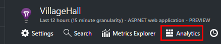

The inline tutorial will give you some ideas about what you can do.

There's a [more extensive tour here](app-insights-analytics-tour.md).

## Query your telemetry

### Write a query

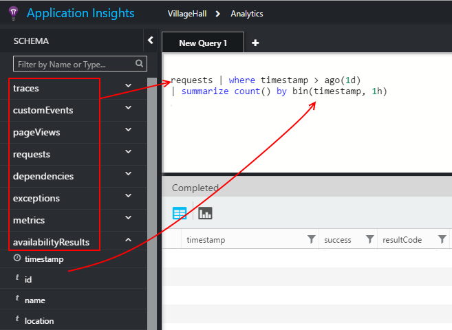

Begin with the names of any of the tables listed on the left (or the [range](app-insights-analytics-reference.md#range-operator) or [union](app-insights-analytics-reference.md#union-operator) operators). Use `|` to create a pipeline of [operators](app-insights-analytics-reference.md#queries-and-operators). IntelliSense will prompt you with the operators and some of the expression elements that you can use.

See the [Analytics language overview](app-insights-analytics-tour.md) and [language reference](app-insights-analytics-reference.md).

### Run a query

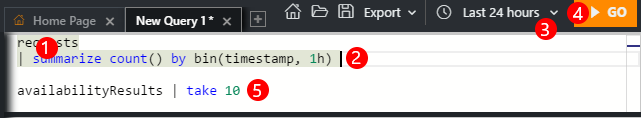

1. You can use single line breaks in a query.
2. Put the cursor inside or at the end of the query you want to run.
3. Click Go to run the query.
4. Don't put blank lines in your query. You can keep several separated queries in one query tab by separating them with blank lines. Only the one with the cursor will run.

### Save a query

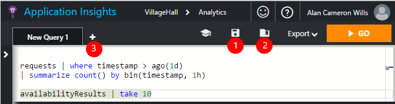

1. Save the current query file.
2. Open a saved query file.
3. Create a new query file.

## See the details

Expand any row in the results to see its complete list of properties. You can further expand any property which is a structured value - for example, custom dimensions, or the stack listing in an exception.

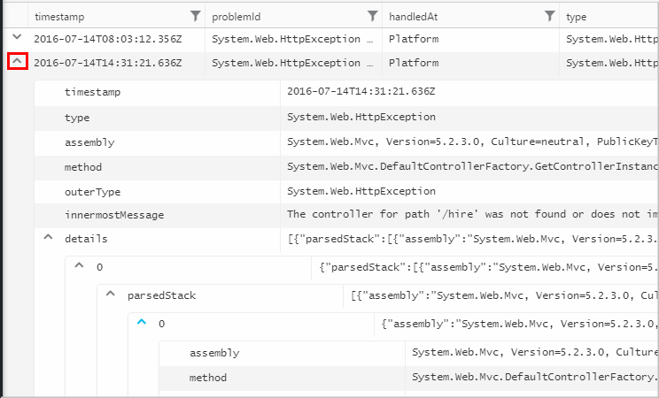

 

## Arrange the results

You can sort, filter, paginate and group the results returned from your query.

> [AZURE.NOTE] Sorting, grouping and filtering in the browser don't re-run your query. They only re-arrange the results that were returned by your last query. 
> 
> To perform these tasks in the server before the results are returned, write your query with the [sort](app-insights-analytics-reference.md#sort-operator), [summarize](app-insights-analytics-reference.md#summarize-operator) and [where](app-insights-analytics-reference.md#where-operator) operators.

Pick the columns you'd like to see, drag column headers to rearrange them, and resize columns by dragging their borders.

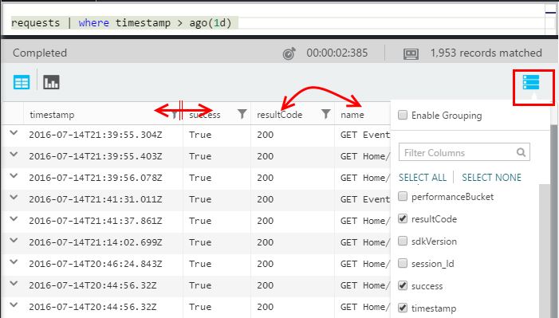

### Sort and filter items

Sort your results by clicking the head of a column. Click again to sort the other way, and click a third time to revert to the original ordering returned by your query.

Use the filter icon to narrow your search.

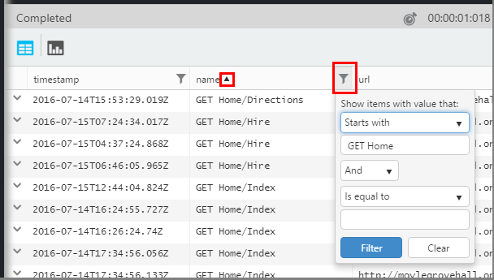

### Group items

To sort by more than one column, use grouping. First enable it, and then drag column headers into the space above the table.

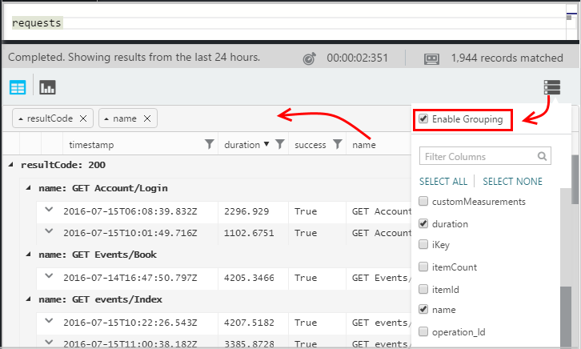

### Missing some results?

There's a limit of about 10k rows on the results returned from the portal. A warning will show if you go over the limit. If that happens, sorting your results in the table won't always show you all the actual first or last results. 

It's good practice to avoid hitting the limit. Use operators such as:

* [where timestamp > ago(3d)](app-insights-analytics-reference.md#where-operator)
* [top 100 by timestamp](app-insights-analytics-reference.md#top-operator) 
* [take 100](app-insights-analytics-reference.md#take-operator)
* [summarize ](app-insights-analytics-reference.md#summarize-operator) 

## Diagrams

Select the type of diagram you'd like:

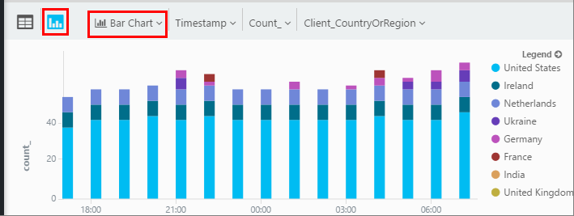

If you have several columns of the right types, you can choose the x and y axes, and a column of dimensions to split the results by.

By default, results are initially displayed as a table, and you select the diagram manually. But you can use the [render directive](app-insights-analytics-reference.md#render-directive) at the end of a query to select a diagram.

## Pin to dashboard

You can pin a diagram to one of your [shared dashboards](app-insights-dashboards.md) - just click the pin. (You might need to [upgrade your app's pricing package](app-insights-pricing.md) to turn on this feature.) 

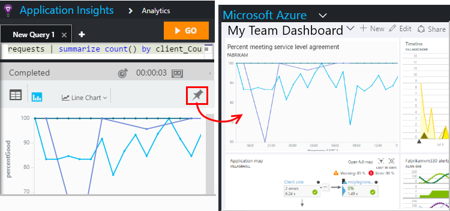

This means that, when you put together a dashboard to help you monitor the performance or usage of your web services, you can include quite complex analysis alongside the other metrics. 

#### Dashboard refresh

The chart pinned to the dashboard is refreshed automatically by re-running the query approximately every half hour.

#### Automatic simplifications

In some cases, certain simplifications are applied to a chart when you pin it to a dashboard.

When you pin a chart that displays a lot of discrete bins (typically a bar chart), the less populated bins are automatically grouped into a single "others" bin. For example, this query:

    requests | summarize count_search = count() by client_CountryOrRegion

looks like this in Analytics:

but when you pin it to a dashboard, it looks like this:

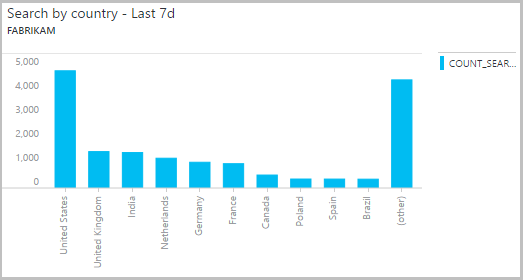

## Export to Excel

After you've run a query, you can download a .csv file. Click **Export, to Excel**.

## Export to Power BI

1. Put the cursor in a query and choose **Export to Power BI**.

    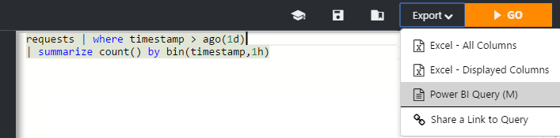

    This downloads an M script file.

3. Copy the M Language script into the Power BI Desktop advanced query editor.
 * Open the exported file.
 * In Power BI Desktop select: **Get Data, Blank Query, Advanced Editor** and paste the M Language script.

    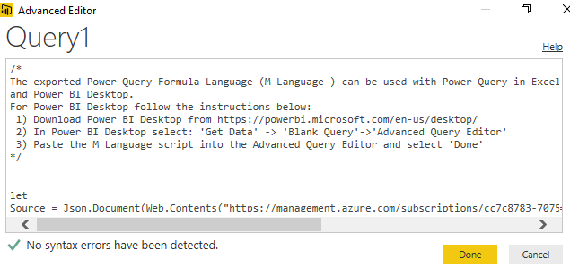

4. Edit credentials if needed and now you can build your report.

    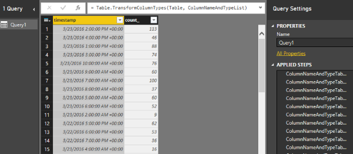

[AZURE.INCLUDE [app-insights-analytics-footer](../../includes/app-insights-analytics-footer.md)]

