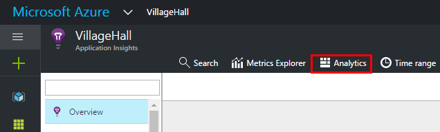
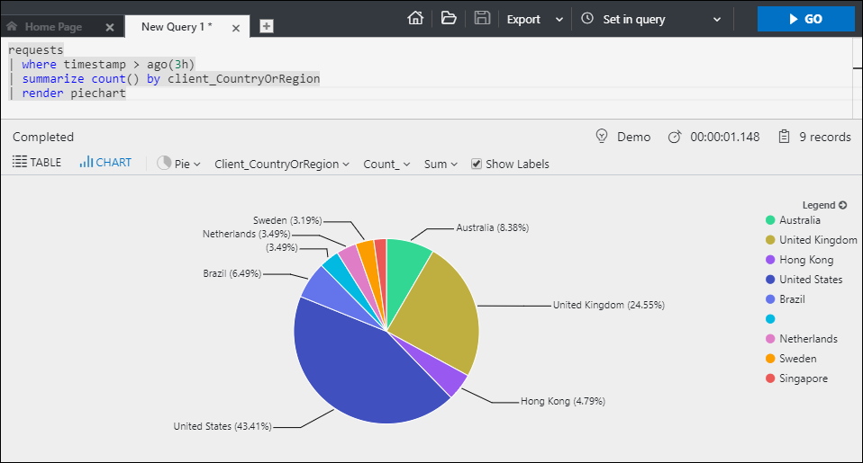

---
title: Analytics - the powerful search and query tool of Azure Application Insights | Microsoft Docs
description: 'Overview of Analytics, the powerful diagnostic search tool of Application Insights. '
services: application-insights
documentationcenter: ''
author: mrbullwinkle
manager: carmonm
ms.assetid: 0a2f6011-5bcf-47b7-8450-40f284274b24
ms.service: application-insights
ms.workload: tbd
ms.tgt_pltfrm: ibiza
ms.devlang: na
ms.topic: conceptual
ms.date: 02/08/2018
ms.author: mbullwin

---
# Analytics in Application Insights
Analytics is the powerful search and query tool of [Application Insights](app-insights-overview.md). Analytics is a web tool so no setup is required. 
If you've already configured Application Insights for one of your apps then you can  analyze your app's data by opening Analytics from your 
app's [overview blade](app-insights-dashboards.md).



You can also use the [Analytics playground](https://go.microsoft.com/fwlink/?linkid=859557) which is a free demo environment with a lot of sample data.
<br>
<br>
> [!VIDEO https://channel9.msdn.com/events/Connect/2016/123/player] 

## Query data in Analytics
A typical query starts with a table name followed by a series of *operators* separated by `|`.
For example, let's find out how many requests our app received from different countries, during the last 3 hours:
```AIQL
requests
| where timestamp > ago(3h)
| summarize count() by client_CountryOrRegion
| render piechart
```

We start with the table name *requests* and add piped elements as needed.  First we define a time filter to review only records from the last 3 hours.
We then count the number of records per country (that data is found in the column *client_CountryOrRegion*). Finally, we render the results in a pie chart.
<br>



The language has many attractive features:

* [Filter](/azure/kusto/query/whereoperator) your raw app telemetry by any fields, including your custom properties and metrics.
* [Join](/azure/kusto/query/joinoperator) multiple tables – correlate requests with page views, dependency calls, exceptions and log traces.
* Powerful statistical [aggregations](/azure/kusto/query/summarizeoperator).
* Immediate and powerful visualizations.
* [REST API](https://dev.applicationinsights.io/) that you can use to run queries programmatically, for example from PowerShell.

The [full language reference](https://go.microsoft.com/fwlink/?linkid=856079) details every command supported, and updates regularly.

## Next steps
* Get started with the [Analytics portal](https://go.microsoft.com/fwlink/?linkid=856587)
* Get started [writing queries](https://go.microsoft.com/fwlink/?linkid=856078)
* Review the [SQL-users' cheat sheet](https://aka.ms/sql-analytics) for translations of the most common idioms.
* Test drive Analytics on our [playground](https://analytics.applicationinsights.io/demo) if your app isn't sending data to Application Insights yet.
* Watch the [introductory video](https://applicationanalytics-media.azureedge.net/home_page_video.mp4).