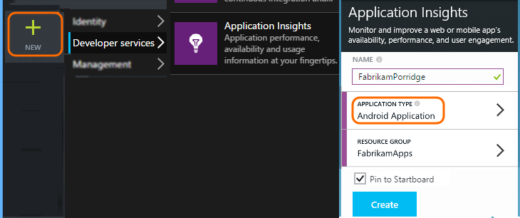

<properties
    pageTitle="Analytics for Android apps | Microsoft Azure"
    description="Analyze usage and performance of your Android app."
    services="application-insights"
    documentationCenter="android"
    authors="alancameronwills"
    manager="douge"/>

<tags
    ms.service="application-insights"
    ms.workload="mobile"
    ms.tgt_pltfrm="mobile-android"
    ms.devlang="na"
    ms.topic="get-started-article"
	ms.date="11/14/2015"
    ms.author="awills"/>

# Analytics for Android apps

Visual Studio Application Insights lets you monitor your mobile application for usage, events, and crashes.

> [AZURE.NOTE] We recommend [HockeyApp](http://support.hockeyapp.net/kb/client-integration-android/hockeyapp-for-android-sdk) to get crash reports, analytics, distribution and feedback management.

## Requirements

You'll need:

* A subscription with [Microsoft Azure](http://azure.com). You sign in with a Microsoft account, which you might have for Windows, XBox Live, or other Microsoft cloud services.
* Android Studio
* Android SDK Version 9 or later.

## Create an Application Insights resource

In the [Azure portal][portal], create a new Application Insights resource. Pick the Android option.



The blade that opens is the place where you'll see performance and usage data about your app. To get back to it next time you login to Azure, you should find a tile for it on the start screen. Alternatively click Browse to find it.

## Setup

Please follow the [setup guide](https://github.com/Microsoft/ApplicationInsights-Android#-3-setup).


## Use the SDK

Initialize the SDK and start tracking telemetry.

Add the following import to your app's root activity:

```java

     import com.microsoft.applicationinsights.library.ApplicationInsights;
```

And add the following to the activity's `onCreate` callback:

```java

    ApplicationInsights.setup(this.getApplicationContext(), this.getApplication());
    ApplicationInsights.start();
```

Once `ApplicationInsights.start()` is called, the SDK begins tracking android lifecycle activity and any unhandled exceptions.

> [AZURE.NOTE] Application lifecycle events are only collected in Android SDK version 15 and later (Ice Cream Sandwich+).

In addition to this, custom events, traces, metrics, and handled exceptions can be collected.
Use any of the [Application Insights API][api] to send telemetry.

* TrackEvent(eventName) for other user actions
* TrackTrace(logEvent) for [diagnostic logging][diagnostic]
* TrackHandledException(exception) in catch clauses
* TrackMetric(name, value) in a background task to send regular reports of metrics not attached to specific events

The following code is an example of initialization and manual telemetry collection:

```java

    public class MyActivity extends Activity {

      @Override
      protected void onCreate(Bundle savedInstanceState) {

        ApplicationInsights.setup(this);
        //... other initialization code ...//
        ApplicationInsights.start();

        // track telemetry data
        TelemetryClient client = TelemetryClient.getInstance();
        HashMap<String, String> properties = new HashMap<String, String>();
        properties.put("property1", "my custom property");
        client.trackEvent("sample event", properties);
        client.trackTrace("sample trace");
        client.trackMetric("sample metric", 3);
        client.trackHandledException(new Exception("sample exception"));
      }
    }
```

## <a name="run"></a> Run your project

Run your application (SHIFT+F10 in Windows, CTRL+R in OS X) to generate telemetry.

## View your data in Application Insights

Return to http://portal.azure.com and browse to your Application Insights resource.

Click **Search** to open [Diagnostic Search][diagnostic] - that's where the first events will appear. If you don't see anything, wait a minute or two and click **Refresh**.


As your app is used, data appears in the overview blade.


Click on any chart to get more detail. For example, crashes:


## <a name="usage"></a>Next Steps

[Track usage of your app][track]

[Diagnostic search][diagnostic]

[Metric Explorer][metrics]

[Troubleshooting][qna]


<!--Link references-->

[api]: app-insights-api-custom-events-metrics.md
[diagnostic]: app-insights-diagnostic-search.md
[metrics]: app-insights-metrics-explorer.md
[portal]: http://portal.azure.com/
[qna]: app-insights-troubleshoot-faq.md
[track]: app-insights-api-custom-events-metrics.md
