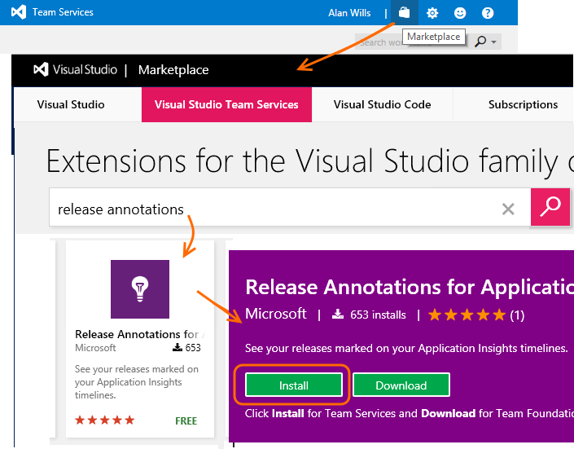
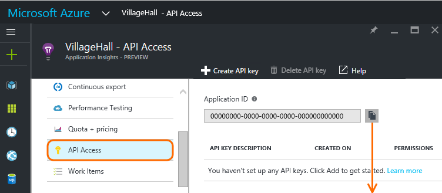
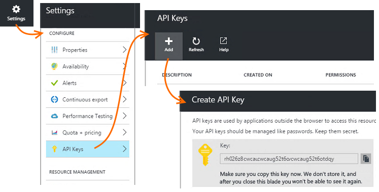
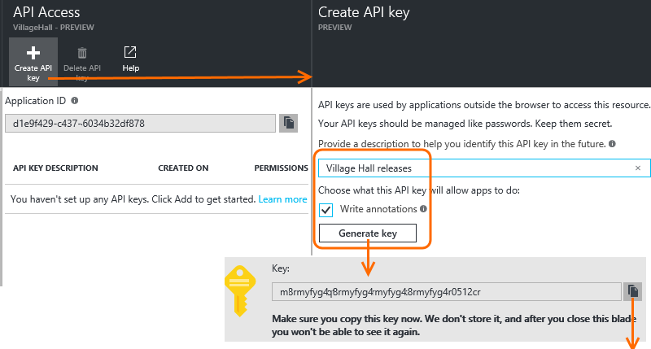
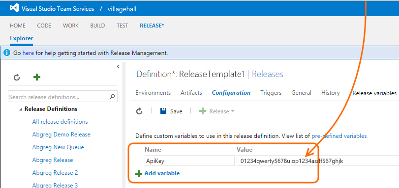
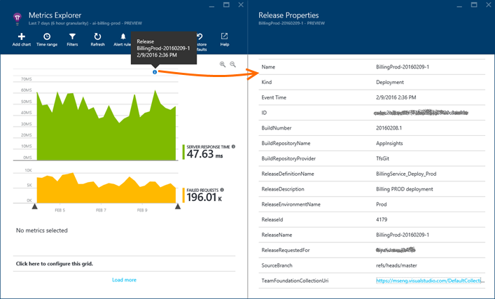

<properties
    pageTitle="Release annotations for Application Insights | Microsoft Azure"
    description="Add deployment or build markers to your metrics explorer charts in Application Insights."
    services="application-insights"
    documentationCenter=".net"
    authors="alancameronwills"
    manager="douge"/>

<tags
    ms.service="application-insights"
    ms.workload="tbd"
    ms.tgt_pltfrm="ibiza"
    ms.devlang="na"
    ms.topic="article"
	ms.date="06/28/2016"
    ms.author="awills"/>

# Release annotations in Application Insights

Release annotations on [Metrics Explorer](app-insights-metrics-explorer.md) charts show where you deployed a new build. They make it easy to see whether your changes had any effect on your application's performance. They can be automatically created by the [Visual Studio Team Services build system](https://www.visualstudio.com/en-us/get-started/build/build-your-app-vs), and you can also [create them from PowerShell](#create-annotations-from-powershell).

Release annotations are a feature of the cloud-based build and release service of Visual Studio Team Services. 

## Install the Annotations extension (one time)

To be able to create release annotations, you'll need to install one of the many Team Service extensions available in the Visual Studio Marketplace.

1. Sign in to your [Visual Studio Team Services](https://www.visualstudio.com/en-us/get-started/setup/sign-up-for-visual-studio-online) project.
2. In Visual Studio Marketplace, [get the Release Annotations extension](https://marketplace.visualstudio.com/items/ms-appinsights.appinsightsreleaseannotations), and add it to your Team Services account.

You only need to do this once for your Visual Studio Team Services account. Release annotations can now be configured for any project in your account. 

## Get an API key from Application Insights

You need to do this for each release template that you want to create release annotations.

1. Sign in to the [Microsoft Azure Portal](https://portal.azure.com) and open the Application Insights resource that monitors your application. (Or [create one now](app-insights-overview.md), if you haven't done so yet.)
2. Open **API Access**, and take a copy of **Application Insights Id**.

    

2. In a separate browser window, open (or create) the release template that manages your deployments from Visual Studio Team Services. 

    Add a task, and select the Application Insights Release Annotation task from the menu.

    Paste the **Application Id** that you copied from the API Access blade.

    

3. Set the **APIKey** field to a variable `$(ApiKey)`.

4. Back in the API Access blade, create a new API Key and take a copy of it.

    

4. Open the Configuration tab of the release template.

    Create a variable definition for `ApiKey`.

    Paste your API key to the ApiKey variable definition.

    

5. Finally, **Save** the release definition.

## Create annotations from PowerShell

You can also create annotations from any process you like (without using VS Team System). 

Get the [Powershell script from GitHub](https://github.com/Microsoft/ApplicationInsights-Home/blob/master/API/CreateReleaseAnnotation.ps1).

Use it like this:

    .\CreateReleaseAnnotation.ps1 `
      -applicationId "<applicationId>" `
      -apiKey "<apiKey>" `
      -releaseName "<myReleaseName>" `
      -releaseProperties @{
          "ReleaseDescription"="a description";
          "TriggerBy"="My Name" }

Get the `applicationId` and an `apiKey` from your Application Insights resource: Open Settings, API Access, and copy the Application ID. Then click Create API Key and copy the key. 

## Release annotations

Now, whenever you use the release template to deploy a new release, an annotation will be sent to Application Insights. The annotations will appear on charts in Metrics Explorer.

Click on any annotation marker to open details about the release, including requestor, source control branch, release definition, environment, and more.

