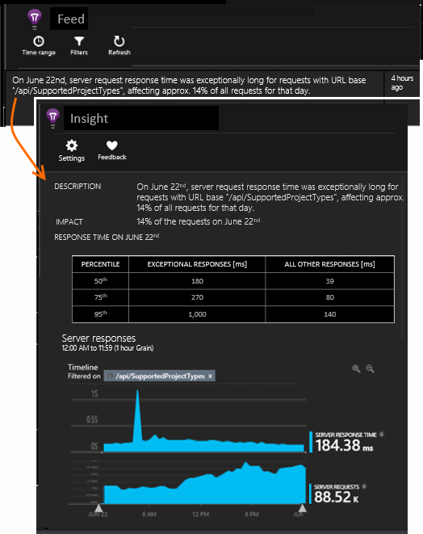

<properties 
	pageTitle="Application Insights: Proactive anomaly detection" 
	description="Application Insights performs deep analysis of your app telemetry and warns you of potential problems." 
	services="application-insights" 
    documentationCenter="windows"
	authors="alancameronwills" 
	manager="ronmart"/>

<tags 
	ms.service="application-insights" 
	ms.workload="tbd" 
	ms.tgt_pltfrm="ibiza" 
	ms.devlang="na" 
	ms.topic="article" 
	ms.date="08/18/2015" 
	ms.author="awills"/>

#  Application Insights: Proactive Anomaly Detection

*Application Insights is in preview.*

Application Insights performs deep analysis of your app telemetry, and can warn you about potential performance problems. You're probably reading this because you received one of our anomaly alerts by email.

## About the anomaly alert

* *Why have I received this alert?*
 * Application Insights periodically analyzes your data with pattern recognition rules. It looks for anomalies that might indicate performance issues in your application.
* *Does the notification mean I definitely have a problem?*
 * No. It's simply a suggestion about something you might want to look at more closely. 
* *What should I do?*
 * [Look at the data presented](#responding-to-an-alert) and consider whether it might represent a problem. If not, that's fine.
* *So, do you guys look at my data?*
 * No. The service is entirely automatic. Only you get the notifications. Your data is [private](app-insights-data-retention-privacy.md).

## The detection process

* *What kinds of anomalies are detected?*
 * Patterns that you would find it time-consuming to check for yourself. For example, poor performance in a specific combination of location, time of day and platform.
* *Can I create my own anomaly detection rules?*
 * Not for this kind of deep analysis. (But you can [set up alerts](app-insights-alerts.md) that tell you when a metric crosses a threshold.)
* *How often is the analysis performed?*
 * We don't perform analysis on an app resource that doesn't get much telemetry. You're unlikely to get warnings about your debugging sessions.

## Responding to an alert

Open the anomaly report either from the email or from the anomalies list.

Notice:

* The description
* The impact statement, which tells you how many or how often users are affected.

Click a chart to open a blade that has more detail.

Modify the time range and filters to explore the telemetry.

## Notification emails

* *Do I have to subscribe to this service in order to receive notifications?*
 * No. Our bot periodically surveys the data from all Application Insights users, and sends notifications if it detects problems.
* *Can I unsubscribe or get the notifications sent to my colleagues instead?*
 * Click the link in the alert or email. Open anomaly settings.
 
    

    Currently they're sent to those who have [write access to the Application Insights resource](app-insights-resources-roles-access-control.md).
* *I don't want to be flooded with these messages.*
 * They are limited to three per day. You won't get repeats of any message.
* *If I don't do anything, will I get a reminder?*
 * No, you get a message about each issue only once.
* *I lost the email. Where can I find the notifications in the portal?*
 * In the Application Insights overview of your app, click the **Anomalies** tile. 

 