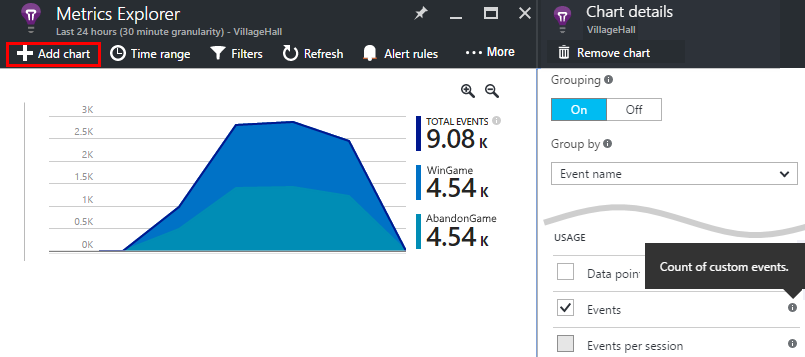
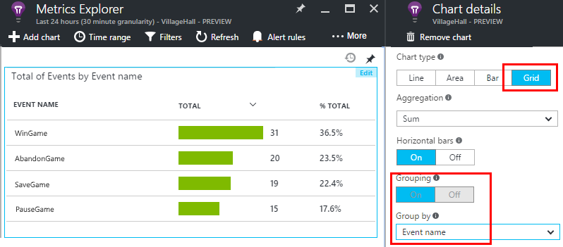
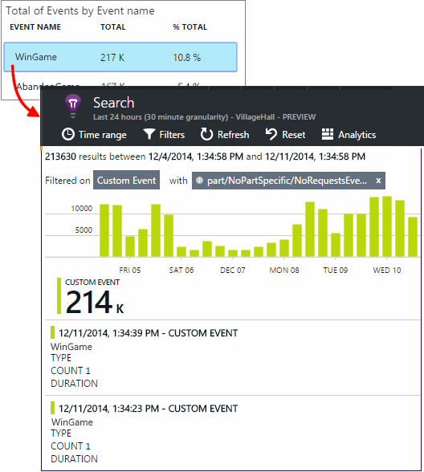
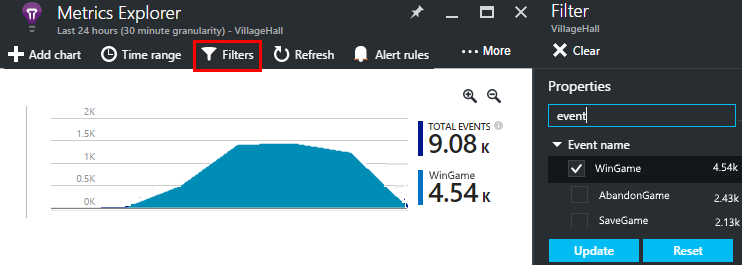
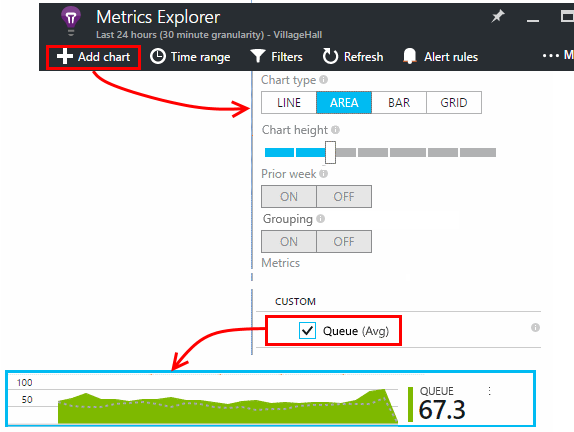
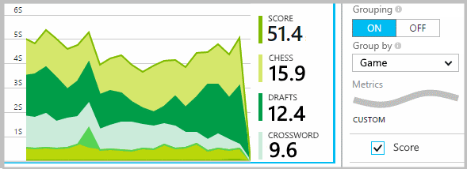
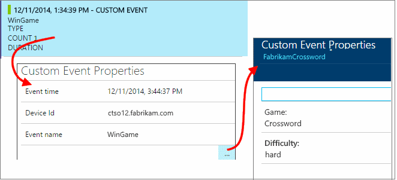
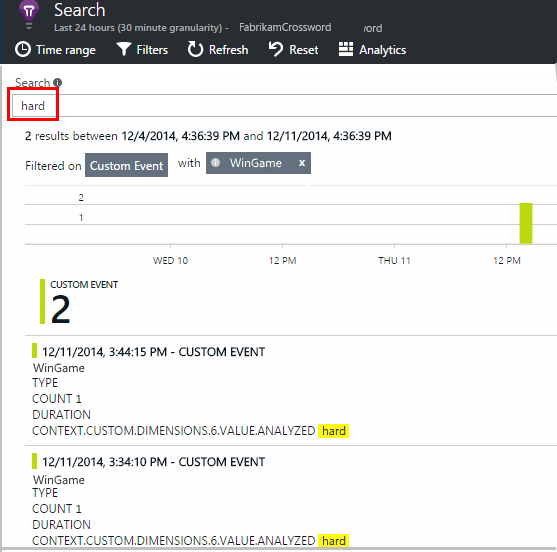
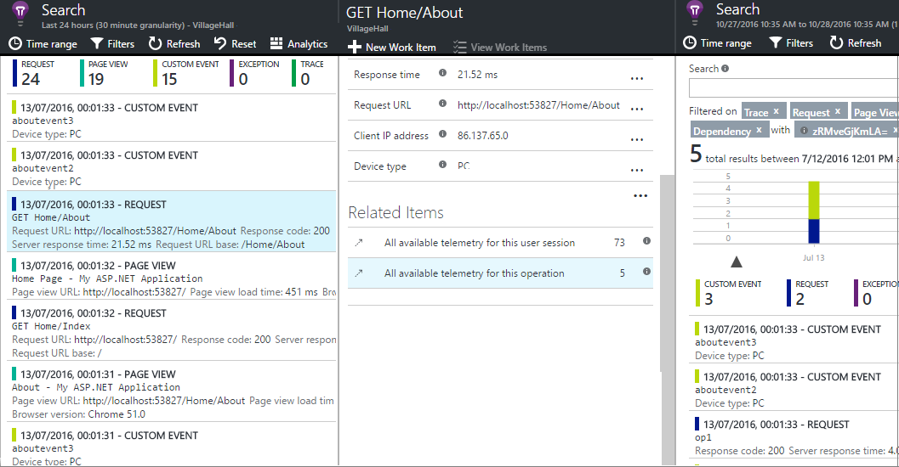

<properties 
	pageTitle="Application Insights API for custom events and metrics | Microsoft Azure" 
	description="Insert a few lines of code in your device or desktop app, web page or service, to track usage and diagnose issues." 
	services="application-insights"
    documentationCenter="" 
	authors="alancameronwills" 
	manager="douge"/>
 
<tags 
	ms.service="application-insights" 
	ms.workload="tbd" 
	ms.tgt_pltfrm="ibiza" 
	ms.devlang="multiple" 
	ms.topic="article" 
	ms.date="07/21/2016" 
	ms.author="awills"/>

# Application Insights API for custom events and metrics 

*Application Insights is in preview.*

Insert a few lines of code in your application to find out what users are doing with it, or to help diagnose issues. You can send telemetry from device and desktop apps, web clients, and web servers. 

The Application Insights data collectors use this API to send standard telemetry such as page views and exception reports, but you can also use it to send your own custom telemetry.

## API summary

The API is uniform across all platforms, apart from a few small variations.

Method | Used for
---|---
[`TrackPageView`](#page-views) | Pages, screens, blades or forms
[`TrackEvent`](#track-event) | User actions and other events. Used to track user behavior or to monitor performance.
[`TrackMetric`](#track-metric) | Performance measurements such as queue lengths not related to specific events
[`TrackException`](#track-exception)|Log exceptions for diagnosis. Trace where they occur in relation to other events and examine stack traces.
[`TrackRequest`](#track-request)| Log the frequency and duration of server requests for performance analysis.
[`TrackTrace`](#track-trace)|Diagnostic log messages. You can also capture 3rd-party logs.
[`TrackDependency`](#track-dependency)|Log the duration and frequency of calls to external components on which your app depends.

You can [attach properties and metrics](#properties) to most of these telemetry calls. 


## <a name="prep"></a>Before you start

If you haven't done these yet:

* Add the Application Insights SDK to your project:
 * [ASP.NET project][greenbrown]
 * [Windows project][windows]
 * [Java project][java] 
 * [JavaScript in each web page][client]   

* In your device or web server code, include:

    *C#:* `using Microsoft.ApplicationInsights;`

    *VB:* `Imports Microsoft.ApplicationInsights`

    *Java:* `import com.microsoft.applicationinsights.TelemetryClient;`

## Construct a TelemetryClient

Construct an instance of TelemetryClient (except in JavaScript in web pages):

*C#:* 

    private TelemetryClient telemetry = new TelemetryClient();

*VB:* 

    Private Dim telemetry As New TelemetryClient

*Java*

    private TelemetryClient telemetry = new TelemetryClient();

TelemetryClient is thread-safe.

We recommend you use an instance of `TelemetryClient` for each module of your app. For instance, you may have one `TelemetryClient` in your web service to report incoming http requests, and another in a middleware class to report business logic events. You can set properties such as `TelemetryClient.Context.User.Id` to track users and sessions, or `TelemetryClient.Context.Device.Id` to identify the machine. This information is attached to all events sent by the instance.


## Track Event

In Application Insights, a *custom event* is a data point that you can display both in in [Metrics Explorer][metrics] as an aggregated count, and also as individual occurrences in [Diagnostic Search][diagnostic]. (It isn't related to MVC or other framework "events.") 

Insert TrackEvent calls in your code to count how often users choose a particular feature, how often they achieve particular goals, or maybe make particular types of mistake. 

For example, in a game app, send an event whenever a user wins the game: 

*JavaScript*

    appInsights.trackEvent("WinGame");

*C#*
    
    telemetry.TrackEvent("WinGame");

*VB*


    telemetry.TrackEvent("WinGame")

*Java*

    telemetry.trackEvent("WinGame");

Here, "WinGame" is the name that appears in the Application Insights portal. 

To see a count of your events, open a [Metric Explorer](app-insights-metrics-explorer.md) blade, add a new chart, and select Events.  



To compare the counts of different events, set the chart type to Grid, and group by event name:




On the grid, click through an event name to see individual occurrences of that event.



Click any occurrence to see more detail.

To focus on specific events in either Search or Metric Explorer, set the blade's filter to the event names that you're interested in:



## Track Metric

Use TrackMetric to send metrics that are not attached to particular events. For example, you could monitor a queue length at regular intervals. 

Metrics are displayed as statistical charts in metric explorer, but unlike events, you can't search for individual occurrences in diagnostic search.

Metric values should be >= 0 to be correctly displayed.


*JavaScript*

    appInsights.trackMetric("Queue", queue.Length);

*C#*

    telemetry.TrackMetric("Queue", queue.Length);

*VB*

    telemetry.TrackMetric("Queue", queue.Length)

*Java*

    telemetry.trackMetric("Queue", queue.Length);

In fact, you might do this in a background thread:

*C#*

    private void Run() {
     var appInsights = new TelemetryClient();
     while (true) {
      Thread.Sleep(60000);
      appInsights.TrackMetric("Queue", queue.Length);
     }
    }


To see the results, open Metrics Explorer and add a new chart. Set it to display your metric.



There are some [limits on the number of metrics](#limits) you can use.

## Page views

In a device or web page app, page view telemetry is sent by default when each screen or page is loaded. But you can change that to track page views at additional or different times. For example, in an app that displays tabs or blades, you might want to track a "page" whenever the user opens a new blade. 


User and session data is sent as properties along with page views, so the user and session charts come alive when there is page view telemetry.

#### Custom page views

*JavaScript*

    appInsights.trackPageView("tab1");

*C#*

    telemetry.TrackPageView("GameReviewPage");

*VB*

    telemetry.TrackPageView("GameReviewPage")


If you have several tabs within different HTML pages, you can specify the URL too:

    appInsights.trackPageView("tab1", "http://fabrikam.com/page1.htm");

#### Timing page views

By default, the times reported as "Page view load time" are measured from when the browser sends the request, until the browser's page load event is called.

Instead, you can either:

* Set an explicit duration in the [trackPageView](https://github.com/Microsoft/ApplicationInsights-JS/blob/master/API-reference.md#trackpageview) call.
 * `appInsights.trackPageView("tab1", null, null, null, durationInMilliseconds);`
* Use the page view timing calls `startTrackPage` and `stopTrackPage`.

*JavaScript*

    // To start timing a page:
    appInsights.startTrackPage("Page1");

... 

    // To stop timing and log the page:
    appInsights.stopTrackPage("Page1", url, properties, measurements);

The name you use as the first parameter associates the start and stop calls. It defaults to the current page name. 

The resulting page load durations displayed in Metric Explorer are derived from the interval between the start and stop calls. It's up to you what interval you actually time.

## Track Request

Used by the server SDK to log HTTP requests. 

You can also call it yourself if you want to simulate requests in a context where you don't have the web service module running.

*C#*

    // At start of processing this request:

    // Operation Id and Name are attached to all telemetry and help you identify
    // telemetry associated with one request:
    telemetry.Context.Operation.Id = Guid.NewGuid().ToString();
    telemetry.Context.Operation.Name = requestName;
    
    var stopwatch = System.Diagnostics.Stopwatch.StartNew();

    // ... process the request ...

    stopwatch.Stop();
    telemetry.TrackRequest(requestName, DateTime.Now,
       stopwatch.Elapsed, 
       "200", true);  // Response code, success


## Track Exception

Send exceptions to Application Insights: to [count them][metrics], as an indication of the frequency of a problem; and to [examine individual occurrences][diagnostic]. The reports include the stack traces.

*C#*

    try
    {
        ...
    }
    catch (Exception ex)
    {
       telemetry.TrackException(ex);
    }

*JavaScript*

    try
    {
       ...
    }
    catch (ex)
    {
       appInsights.trackException(ex);
    }

The SDKs catch many exceptions automatically, so you don't always have to call TrackException explicitly.

* ASP.NET: [Write code to catch exceptions](app-insights-asp-net-exceptions.md)
* J2EE: [Exceptions are caught automatically](app-insights-java-get-started.md#exceptions-and-request-failures)
* Windows apps: [Crashes are caught automatically](app-insights-windows-crashes.md)
* JavaScript: Caught automatically. If you want to disable automatic collection, add a line into the code snippet that you insert in your web pages:

    ```
    ({
      instrumentationKey: "your key"
      , disableExceptionTracking: true
    })
    ```


## Track Trace 

Use this to help diagnose problems by sending a 'breadcrumb trail' to Application Insights. You can send chunks of diagnostic data, and inspect them in [Diagnostic search][diagnostic]. 

 

[Log adapters][trace] use this API to send third-party logs to the portal.


*C#*

    telemetry.TrackTrace(message, SeverityLevel.Warning, properties);

The size limit on `message` is much higher than limit on  properties. You can search on message content, but (unlike property values) you can't filter on it.

## Track Dependency

Use this call to track the response times and success rates of calls to an external piece of code. The results appear in the dependency charts in the portal. 

```C#

            var success = false;
            var startTime = DateTime.UtcNow;
            var timer = System.Diagnostics.Stopwatch.StartNew();
            try
            {
                success = dependency.Call();
            }
            finally
            {
                timer.Stop();
                telemetry.TrackDependency("myDependency", "myCall", startTime, timer.Elapsed, success);
            }
```

Remember that the server SDKs include a [dependency module](app-insights-dependencies.md) that discovers and tracks certain dependency calls automatically - for example to databases and REST APIs. You have to install an agent on your server to make the module work. You'd use this call if you want to track calls that aren't caught by the automated tracking, or if you don't want to install the agent.

To turn off the standard dependency tracking module, edit [ApplicationInsights.config](app-insights-configuration-with-applicationinsights-config.md) and delete the reference to `DependencyCollector.DependencyTrackingTelemetryModule`.


## Flushing data

Normally the SDK sends data at times chosen to minimize impact on the user. However, in some cases you might want to flush the buffer - for example, if you are using the SDK in an application that shuts down.

*C#*

    telemetry.Flush();

    // Allow some time for flushing before shutdown.
    System.Threading.Thread.Sleep(1000);

Note that the function is asynchronous for in-memory channels, but synchronous if you choose to use the [persistent channel](app-insights-windows-services.md#persistence-channel).


## Authenticated users

In a web app, users are by default identified by cookie. A user might be counted more than once if they access your app from a different machine or browser, or delete cookies. 

But if users sign in to your app, you can get a more accurate count by setting the authenticated user id in the browser code:

*JavaScript*

```JS
    // Called when my app has identified the user.
    function Authenticated(signInId) {
      var validatedId = signInId.replace(/[,;=| ]+/g, "_");
      appInsights.setAuthenticatedUserContext(validatedId);
      ...
    }
```

In an ASP.NET web MVC application, for example:

*Razor*

        @if (Request.IsAuthenticated)
        {
            <script>
                appInsights.setAuthenticatedUserContext("@User.Identity.Name
                   .Replace("\\", "\\\\")"
                   .replace(/[,;=| ]+/g, "_"));
            </script>
        }

It isn't necessary to use the user's actual sign-in name. It only has to be an id that is unique to that user. It must not include spaces, or any of the characters `,;=|`. 

The user id is also set in a session cookie and sent to the server. If the server SDK is installed, the authenticated user id will be sent as part of the context properties of both client and server telemetry, so that you can filter and search on it.

If your app groups users into accounts, you can also pass an identifier for the account (with the same character restrictions).


      appInsights.setAuthenticatedUserContext(validatedId, accountId);

In [metrics explorer](app-insights-metrics-explorer.md), you can create a chart that counts **Users, Authenticated** and **User accounts**. 

You can also [search][diagnostic] for client data points with specific user names and accounts.

## <a name="properties"></a>Filter, search and segment your data with properties

You can attach properties and measurements to your events (and also to metrics, page views, exceptions, and other telemetry data).

**Properties** are string values that you can use to filter your telemetry in the usage reports. For example if your app provides several games, you'll want to attach the name of the game to each event, so that you can see which games are more popular. 

There's a limit of about 1k on the string length. (If you want to send large chunks of data, use the message parameter of [TrackTrace](#track-trace).)

**Metrics** are numeric values that can be presented graphically. For example, you might want to see if there's a gradual increase in the scores your gamers achieve. The graphs can be segmented by the properties sent with the event, so that you could get separate or stacked graphs for different games.

Metric values should be >= 0 to be correctly displayed.


There are some [limits on the number of properties, property values, and metrics](#limits) that you can use.


*JavaScript*

    appInsights.trackEvent
      ("WinGame",
         // String properties:
         {Game: currentGame.name, Difficulty: currentGame.difficulty},
         // Numeric metrics:
         {Score: currentGame.score, Opponents: currentGame.opponentCount}
         );

    appInsights.trackPageView
        ("page name", "http://fabrikam.com/pageurl.html",
          // String properties:
         {Game: currentGame.name, Difficulty: currentGame.difficulty},
         // Numeric metrics:
         {Score: currentGame.score, Opponents: currentGame.opponentCount}
         );
          

*C#*

    // Set up some properties and metrics:
    var properties = new Dictionary <string, string> 
       {{"game", currentGame.Name}, {"difficulty", currentGame.Difficulty}};
    var metrics = new Dictionary <string, double>
       {{"Score", currentGame.Score}, {"Opponents", currentGame.OpponentCount}};

    // Send the event:
    telemetry.TrackEvent("WinGame", properties, metrics);


*VB*

    ' Set up some properties:
    Dim properties = New Dictionary (Of String, String)
    properties.Add("game", currentGame.Name)
    properties.Add("difficulty", currentGame.Difficulty)

    Dim metrics = New Dictionary (Of String, Double)
    metrics.Add("Score", currentGame.Score)
    metrics.Add("Opponents", currentGame.OpponentCount)

    ' Send the event:
    telemetry.TrackEvent("WinGame", properties, metrics)


*Java*
    
    Map<String, String> properties = new HashMap<String, String>();
    properties.put("game", currentGame.getName());
    properties.put("difficulty", currentGame.getDifficulty());
    
    Map<String, Double> metrics = new HashMap<String, Double>();
    metrics.put("Score", currentGame.getScore());
    metrics.put("Opponents", currentGame.getOpponentCount());
    
    telemetry.trackEvent("WinGame", properties, metrics);


> [AZURE.NOTE] Take care not to log personally identifiable information in properties.

**If you used metrics**, open Metric Explorer and select the metric from the Custom group:


*If your metric doesn't appear, or if the Custom heading isn't there, close the selection blade and try later. It can sometimes take an hour for metrics to be aggregated through the pipeline.*

**If you used properties and metrics**, segment the metric by the property:





**In Diagnostic Search**, you can view the properties and metrics of individual occurrences of an event.





Use the Search field to see event occurrences with a particular property value.




[Learn more about search expressions][diagnostic].

#### Alternative way to set properties and metrics

If it's more convenient, you can collect the parameters of an event in a separate object:

    var event = new EventTelemetry();

    event.Name = "WinGame";
    event.Metrics["processingTime"] = stopwatch.Elapsed.TotalMilliseconds;
    event.Properties["game"] = currentGame.Name;
    event.Properties["difficulty"] = currentGame.Difficulty;
    event.Metrics["Score"] = currentGame.Score;
    event.Metrics["Opponents"] = currentGame.Opponents.Length;

    telemetry.TrackEvent(event);

> [AZURE.WARNING] Don't reuse the same telemetry item instance (`event` in this example) to call Track*() multiple times. This may cause telemetry to be sent with incorrect configuration.

## Operation context

When your web app receives an HTTP request, the Application Insights request tracking module assigns an ID to the request, and sets the same value as the current Operation ID. The operation ID is cleared when the response to the request is sent. Any tracking calls made during the operation are assigned the same operation ID (provided they use the default TelemetryContext). This allows you to correlate the events related to a particular request when you inspect them in the portal.



If you are monitoring events not associated with an HTTP request, or if you aren't using the request tracking module - for example, if you are monitoring a backend process - then you can set your own operation context using this pattern:

    // Establish an operation context and associated telemetry item:
    using (var operation = telemetry.StartOperation<RequestTelemetry>("operationName"))
    {
        // Telemetry sent in here will use the same operation ID.
        ...
        telemetry.TrackEvent(...); // or other Track* calls
        ...
        // Set properties of containing telemetry item - for example:
        operation.Telemetry.ResponseCode = "200";
        
        // Optional: explicitly send telemetry item:
        telemetry.StopOperation(operation);

    } // When operation is disposed, telemetry item is sent.

As well as setting an operation context, `StartOperation` creates a telemetry item of the type you specify, and sends it when you dispose the operation, or if you explicitly call `StopOperation`. If you use `RequestTelemetry` as the telemetry type, then its Duration is set to the timed interval between start and stop.

Operation contexts can't be nested. If there is already an operation context, then its ID is associated with all the contained items, including the item created with StartOperation.


## <a name="timed"></a> Timing events

Sometimes you'd like to chart how long it takes to perform some action. For example, you might like to know how long users take to consider choices in a game. This is a useful example of uses of the measurement parameter.


*C#*

    var stopwatch = System.Diagnostics.Stopwatch.StartNew();

    // ... perform the timed action ...

    stopwatch.Stop();

    var metrics = new Dictionary <string, double>
       {{"processingTime", stopwatch.Elapsed.TotalMilliseconds}};

    // Set up some properties:
    var properties = new Dictionary <string, string> 
       {{"signalSource", currentSignalSource.Name}};

    // Send the event:
    telemetry.TrackEvent("SignalProcessed", properties, metrics);


## <a name="defaults"></a>Default properties for custom telemetry

If you want to set default property values for some of the custom events that you write, you can set them in a TelemetryClient. They are attached to every telemetry item sent from that client. 

*C#*

    using Microsoft.ApplicationInsights.DataContracts;

    var gameTelemetry = new TelemetryClient();
    gameTelemetry.Context.Properties["Game"] = currentGame.Name;
    // Now all telemetry will automatically be sent with the context property:
    gameTelemetry.TrackEvent("WinGame");
    
*VB*

    Dim gameTelemetry = New TelemetryClient()
    gameTelemetry.Context.Properties("Game") = currentGame.Name
    ' Now all telemetry will automatically be sent with the context property:
    gameTelemetry.TrackEvent("WinGame")

*Java*

    import com.microsoft.applicationinsights.TelemetryClient;
    import com.microsoft.applicationinsights.TelemetryContext;
    ...


    TelemetryClient gameTelemetry = new TelemetryClient();
    TelemetryContext context = gameTelemetry.getContext();
    context.getProperties().put("Game", currentGame.Name);
    
    gameTelemetry.TrackEvent("WinGame");


    
Individual telemetry calls can override the default values in their property dictionaries.

**For JavaScript web clients**, [use JavaScript telemetry initializers](#js-initializer).

**To add properties to all telemetry** including the data from standard collection modules, [implement `ITelemetryInitializer`](app-insights-api-filtering-sampling.md#add-properties).


## Sampling, filtering and processing telemetry 

You can write code to process your telemetry before it is sent from the SDK. The processing includes data sent from the standard telemetry modules such as HTTP request collection and dependency collection.

* [Add properties](app-insights-api-filtering-sampling.md#add-properties) to telemetry by implementing `ITelemetryInitializer` - for example, to add version numbers, or values calculated from other properties. 
* [Filtering](app-insights-api-filtering-sampling.md#filtering) can modify or discard telemetry before it is sent from the SDK by implementing `ITelemetryProcesor`. You control what is sent or discarded, but you have to take account of the effect on your metrics. Depending on how you discard items, you might lose the ability to navigate between related items.
* [Sampling](app-insights-api-filtering-sampling.md#sampling) is a packaged solution to reduce the volume of data sent from your app to the portal. It does so without affecting the displayed metrics, and without affecting your ability to diagnose problems by navigating between related items such as exceptions, requests and page views.

[Learn more](app-insights-api-filtering-sampling.md)


## Disabling telemetry

To **dynamically stop and start** the collection and transmission of telemetry:

*C#*

```C#

    using  Microsoft.ApplicationInsights.Extensibility;

    TelemetryConfiguration.Active.DisableTelemetry = true;
```

To **disable selected standard collectors** - for example, performance counters, HTTP requests, or dependencies - delete or comment out the relevant lines in [ApplicationInsights.config][config]. You could do this, for example, if you want to send your own TrackRequest data.

## <a name="debug"></a>Developer mode

During debugging, it's useful to have your telemetry expedited through the pipeline so that you can see results immediately. You also get additional messages that help you trace any problems with the telemetry. Switch it off in production, as it may slow down your app.


*C#*
    
    TelemetryConfiguration.Active.TelemetryChannel.DeveloperMode = true;

*VB*

    TelemetryConfiguration.Active.TelemetryChannel.DeveloperMode = True


## <a name="ikey"></a> Set the instrumentation key for selected custom telemetry

*C#*
    
    var telemetry = new TelemetryClient();
    telemetry.InstrumentationKey = "---my key---";
    // ...


## <a name="dynamic-ikey"></a> Dynamic instrumentation key

To avoid mixing up telemetry from development, test and production environments, you can [create separate Application Insights resources][create] and change their keys depending on the environment.

Instead of getting the instrumentation key from the configuration file, you can set it in your code. Set the key in an initialization method, such as global.aspx.cs in an ASP.NET service:

*C#*

    protected void Application_Start()
    {
      Microsoft.ApplicationInsights.Extensibility.
        TelemetryConfiguration.Active.InstrumentationKey = 
          // - for example -
          WebConfigurationManager.Settings["ikey"];
      ...

*JavaScript*

    appInsights.config.instrumentationKey = myKey; 


In web pages, you might want to set it from the web server's state, rather than coding it literally into the script. For example, in a web page generated in an ASP.NET app:

*JavaScript in Razor*

    <script type="text/javascript">
    // Standard Application Insights web page script:
    var appInsights = window.appInsights || function(config){ ...
    // Modify this part:
    }({instrumentationKey:  
      // Generate from server property:
      @Microsoft.ApplicationInsights.Extensibility.
         TelemetryConfiguration.Active.InstrumentationKey"
    }) // ...


## TelemetryContext

TelemetryClient has a Context property, which contains a number of values that are sent along with all telemetry data. They are normally set by the standard telemetry modules, but you can also set them yourself. For example:

    telemetry.Context.Operation.Name = "MyOperationName";

If you set any of these values yourself, consider removing the relevant line from [ApplicationInsights.config][config], so that your values and the standard values don't get confused.

* **Component** Identifies the app and its version
* **Device** Data about the device on which the app is running (in web apps, this is the server or client device from which the telemetry is sent)
* **InstrumentationKey** Identifies the Application Insights resource in Azure where the telemetry will appear. Usually picked up from ApplicationInsights.config
* **Location** Identifies the geographic location of the device.
* **Operation** In web apps, the current HTTP request. In other app types, you can set this to group events together.
 * **Id**: A generated value that correlates different events, so that when you inspect any event in Diagnostic Search, you can find "Related items"
 * **Name**: An identifier, usually the URL of the HTTP request. 
 * **SyntheticSource**: If not null or empty, this string indicates that the source of the request has been identified as a robot or web test. By default it will be excluded from calculations in Metrics Explorer.
* **Properties** Properties that are sent with all telemetry data. Can be overridden in individual Track* calls.
* **Session** Identifies the user's session. The Id is set to a generated value, which is changed when the user has not been active for a while.
* **User** User information. 

## Limits


[AZURE.INCLUDE [application-insights-limits](../../includes/application-insights-limits.md)]

*How can I avoid hitting the data rate limit?*

* Use [sampling](app-insights-sampling.md).

*How long is data kept?*

* See [Data retention and privacy][data].


## Reference docs

* [ASP.NET reference](https://msdn.microsoft.com/library/dn817570.aspx)
* [Java reference](http://dl.windowsazure.com/applicationinsights/javadoc/)
* [JavaScript reference](https://github.com/Microsoft/ApplicationInsights-JS/blob/master/API-reference.md)
* [Android SDK](https://github.com/Microsoft/ApplicationInsights-Android)
* [iOS SDK](https://github.com/Microsoft/ApplicationInsights-iOS)


## SDK Code

* [ASP.NET Core SDK](https://github.com/Microsoft/ApplicationInsights-dotnet)
* [ASP.NET 5](https://github.com/Microsoft/ApplicationInsights-aspnet5)
* [Android SDK](https://github.com/Microsoft/ApplicationInsights-Android)
* [Java SDK](https://github.com/Microsoft/ApplicationInsights-Java)
* [JavaScript SDK](https://github.com/Microsoft/ApplicationInsights-JS)
* [iOS SDK](https://github.com/Microsoft/ApplicationInsights-iOS)
* [All platforms](https://github.com/Microsoft?utf8=%E2%9C%93&query=applicationInsights)

## Questions

* *What exceptions might Track_() calls throw?*
    
    None. You don't need to wrap them in try-catch clauses. If the SDK encounters problems, it will log messages that you will see in the debug console output, and - if the messages get through - in diagnostic search.


* *Is there a REST API to get data from the portal?*

    Yes, coming soon. In the meantime, use [continuous export](app-insights-export-telemetry.md).

## <a name="next"></a>Next steps


[Search events and logs][diagnostic]

[Samples and walkthroughs](app-insights-code-samples.md)

[Troubleshooting][qna]


<!--Link references-->

[client]: app-insights-javascript.md
[config]: app-insights-configuration-with-applicationinsights-config.md
[create]: app-insights-create-new-resource.md
[data]: app-insights-data-retention-privacy.md
[diagnostic]: app-insights-diagnostic-search.md
[exceptions]: app-insights-asp-net-exceptions.md
[greenbrown]: app-insights-asp-net.md
[java]: app-insights-java-get-started.md
[metrics]: app-insights-metrics-explorer.md
[qna]: app-insights-troubleshoot-faq.md
[trace]: app-insights-search-diagnostic-logs.md
[windows]: app-insights-windows-get-started.md

 
