<properties 
	pageTitle="Application Map in Application Insights | Microsoft Azure" 
	description="A visual presentation of the dependencies between app components, labeled with KPIs and alerts." 
	services="application-insights" 
    documentationCenter=""
	authors="SoubhagyaDash" 
	manager="douge"/>

<tags 
	ms.service="application-insights" 
	ms.workload="tbd" 
	ms.tgt_pltfrm="ibiza" 
	ms.devlang="na" 
	ms.topic="article" 
	ms.date="06/15/2016" 
	ms.author="awills"/>
 
# Application Map in Application Insights

In [Visual Studio Application Insights](app-insights-overview.md), Application Map is a visual layout of the dependency relationships of your application components. Each component shows KPIs such as load, performance, failures, and alerts, to help you discover any component causing a performance issue or failure. You can click through from any component to more detailed diagnostics, both from Application Insights, and - if your app uses Azure services - Azure diagnostics, such as the SQL Database Advisor recommendations.

Like other charts, you can pin an application map to the Azure dashboard, where it is fully functional. 

## Open the application map

Open the map from the overview blade for your application:

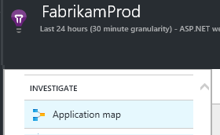

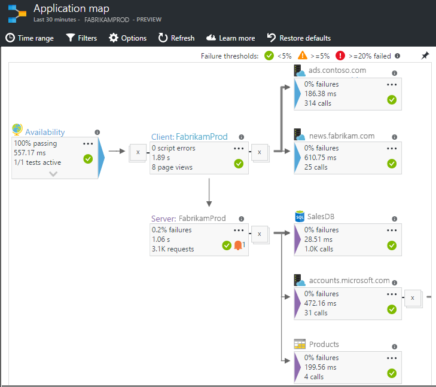

The map shows:

* Availability tests
* Client side component (monitored with the JavaScript SDK)
* Server side component
* Dependencies of the client and server components

You can expand and collapse dependency link groups:

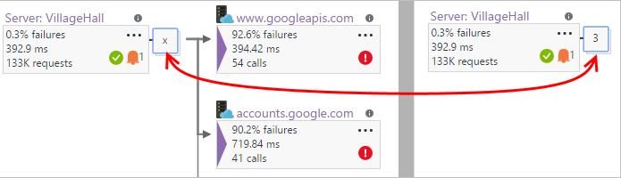
 
If you have a large number of dependencies of one type (SQL, HTTP etc.), they may appear grouped. 

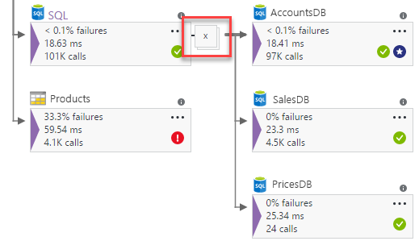
 
 
## Spot problems

Each node has relevant performance indicators, such as the load, performance and failure rates for that component. 

Warning icons highlight possible problems. An orange warning means there are failures in requests, page views or dependency calls. Red means a failure rate above 5%.

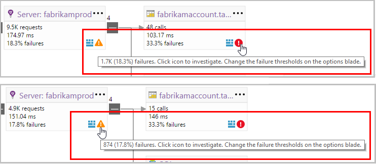

 
Active alerts also show up: 

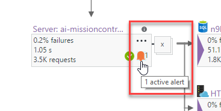
 
If you use SQL Azure, there's an icon that shows when there are recommendations on how you can improve performance. 

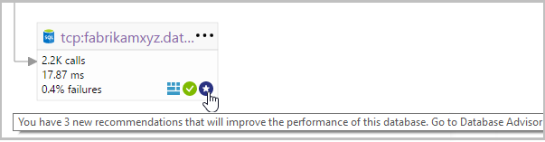

Click any icon to get more details:

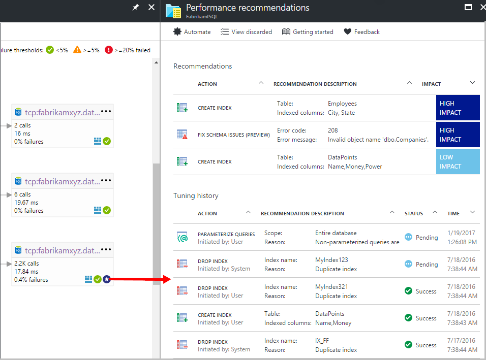
 
 
## Diagnostic click through

Each of the nodes on the map offers targeted click through for diagnostics. The options vary depending on the type of the node.

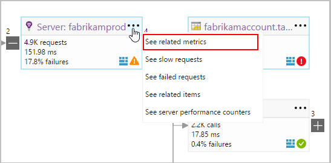

 
For components that are hosted in Azure, the options include direct links to them.

## Filters and time range

By default, the map summarizes all the data available for the chosen time range. But you can filter it to include only specific operation names or dependencies.

* Operation name: This includes both page views and server side request types. With this option, the map shows the KPI on the server/client side node for the selected operations only. It shows the dependencies called in the context of those specific operations.
* Dependency base name: This includes the AJAX browser side dependencies and server side dependencies. If you report custom dependency telemetry with the TrackDependency API, they will also show here. You can select the dependencies to show on the map. Please note that at this time, this will not filter the server side requests, or the client side page views.

 
 
## Save filters

To save the filters you have applied, pin the filtered view onto a [dashboard](app-insights-dashboards.md).

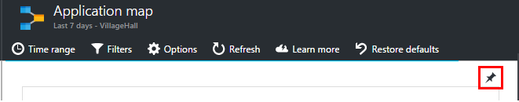
 

## Feedback

Please [provide feedback through the portal feedback option](app-insights-get-dev-support.md).

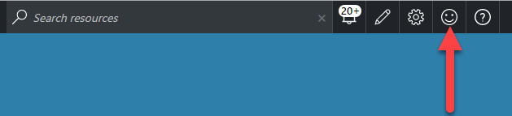

