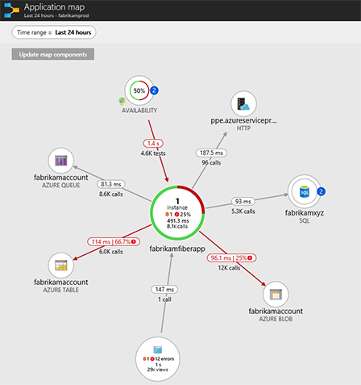
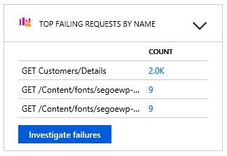
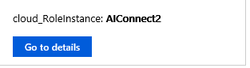

---
title: Application Map in Azure Application Insights | Microsoft Docs
description: Monitor complex application topologies with the application map
services: application-insights
documentationcenter: ''
author: mrbullwinkle
manager: carmonm

ms.assetid: 3bf37fe9-70d7-4229-98d6-4f624d256c36
ms.service: application-insights
ms.workload: tbd
ms.tgt_pltfrm: ibiza
ms.devlang: na
ms.topic: conceptual
ms.date: 06/14/2018
ms.reviewer: sdash
ms.author: mbullwin

---
# Application Map: Triage Distributed Applications

Application Map helps you spot performance bottlenecks or failure hotspots across all components of your distributed application. Each node on the map represents an application component or its dependencies; and has health KPI and alerts status. You can click through from any component to more detailed diagnostics, such as Application Insights events. If your app uses Azure services, you can also click through to Azure diagnostics, such as SQL Database Advisor recommendations.

## What is a Component?

Components are independently deployable parts of your distributed/microservices application. Developers and operations teams have code-level visibility or access to telemetry generated by these application components. 

* Components are different from "observed" external dependencies such as SQL, EventHub etc. which your team/organization may not have access to (code or telemetry).
* Components run on any number of server/role/container instances.
* Components can be separate Application Insights instrumentation keys (even if subscriptions are different) or different roles reporting to a single Application Insights instrumentation key. The preview map experience shows the components regardless of how they are set up.

## Composite Application Map

You can see the full application topology across multiple levels of related application components. Components could be different Application Insights resources, or different roles in a single resource. The app map finds components by following HTTP dependency calls made between servers with the Application Insights SDK installed. 

This experience starts with progressive discovery of the components. When you first load the application map, a set of queries are triggered to discover the components related to this component. A button at the top-left corner will update with the number of components in your application as they are discovered. 

On clicking "Update map components", the map is refreshed with all components discovered until that point.

If all of the components are roles within a single Application Insights resource, then this discovery step is not required. The initial load for such an application will have all its components.

One of the key objectives with this experience is to be able to visualize complex topologies with hundreds of components.

Click on any component to see related insights and go to the performance and failure triage experience for that component.

### Investigate failures

Select **investigate failures** to launch the failures pane.

### Investigate performance

To troubleshoot performance problems select **investigate performance**

### Go to details

Select **go to details** to explore the end-to-end transaction experience which can offer views done to the call stack level.

### View in Analytics

To query and investigate your applications data further click **view in analytics**.

### Alerts

To view active alerts and the underlying rules that cause the alerts to be tiggered, select **alerts**.

## Video

> [!VIDEO https://channel9.msdn.com/events/Connect/2016/112/player] 

## Feedback
Please provide feedback through the portal feedback option.

## Next steps

* [Azure portal](https://portal.azure.com)
