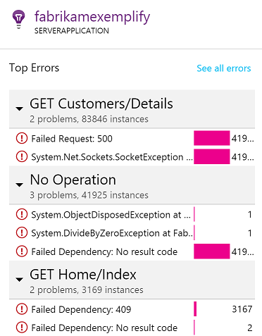
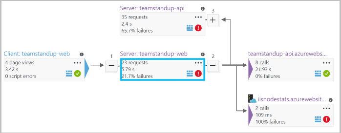

# Application Map in Application Insights
In [Azure Application Insights](app-insights-overview.md), Application Map is a visual layout of the dependency relationships of your application components. Each component shows KPIs such as load, performance, failures, and alerts, to help you discover any component causing a performance issue or failure. You can click through from any component to more detailed diagnostics, such as Application Insights events. If your app uses Azure services, you can also click through to Azure diagnostics, such as SQL Database Advisor recommendations.

Like other charts, you can pin an application map to the Azure dashboard, where it is fully functional. 

## Open the application map
Open the map from the overview blade for your application:

The map shows:

* Availability tests
* Client-side component (monitored with the JavaScript SDK)
* Server-side component
* Dependencies of the client and server components

You can expand and collapse dependency link groups:

If you have many dependencies of one type (SQL, HTTP etc.), they may appear grouped. 

## Spot problems
Each node has relevant performance indicators, such as the load, performance, and failure rates for that component. 

Warning icons highlight possible problems. An orange warning means there are failures in requests, page views or dependency calls. Red means a failure rate above 5%. If you want to adjust these thresholds, open Options.

Active alerts also show up: 

If you use SQL Azure, there's an icon that shows when there are recommendations on how you can improve performance. 

Click any icon to get more details:

## Diagnostic click through
Each of the nodes on the map offers targeted click through for diagnostics. The options vary depending on the type of the node.

For components that are hosted in Azure, the options include direct links to them.

## Filters and time range
By default, the map summarizes all the data available for the chosen time range. But you can filter it to include only specific operation names or dependencies.

* Operation name: This includes both page views and server-side request types. With this option, the map shows the KPI on the server/client-side node for the selected operations only. It shows the dependencies called in the context of those specific operations.
* Dependency base name: This includes the AJAX browser dependencies and server-side dependencies. If you report custom dependency telemetry with the TrackDependency API, they also appear here. You can select the dependencies to show on the map. Currently this selection does not filter the server-side requests, or the client-side page views.

## Save filters
To save the filters you have applied, pin the filtered view onto a [dashboard](app-insights-dashboards.md).

## Error pane
When you click a node in the map, an error pane is displayed on the right-hand side summarizing failures for that node. Failures are grouped first by operation ID and then grouped by problem ID.

Clicking on a failure takes you to the most recent instance of that failure.

## Resource health
For some resource types, resource health is displayed at the top of the error pane. For example, clicking a SQL node will show the database health and any alerts that have fired.

You can click the resource name to view standard overview metrics for that resource.

## End-to-end system app maps

*Requires SDK version 2.3 or higher*

If your application has several components - for example, a back-end service in addition to the web app - then you can show them all on one integrated app map.

The app map finds server nodes by following any HTTP dependency calls made between servers with the Application Insights SDK installed. Each Application Insights resource is assumed to contain one server.

### Multi-role app map (preview)

The preview multi-role app map feature allows you to use the app map with multiple servers sending data to the same Application Insights resource  / instrumentation key. Servers in the map are segmented by the cloud_RoleName property on telemetry items. Set *Multi-role Application Map* to *On* from the Previews blade to enable this configuration.

This approach may be desired in a micro-services application, or in other scenarios where you want to correlate events across multiple servers within a single Application Insights resource.

## Video

> [!VIDEO https://channel9.msdn.com/events/Connect/2016/112/player] 

## Feedback
Please provide feedback through the portal feedback option.

## Next steps

* [Azure portal](https://portal.azure.com)