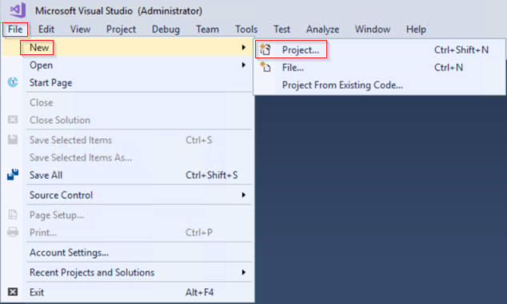
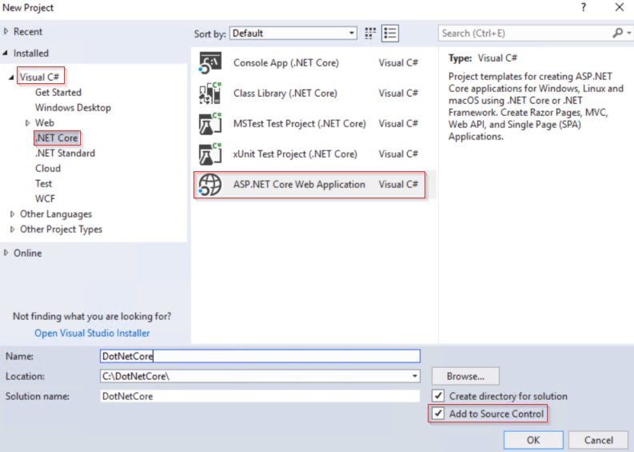
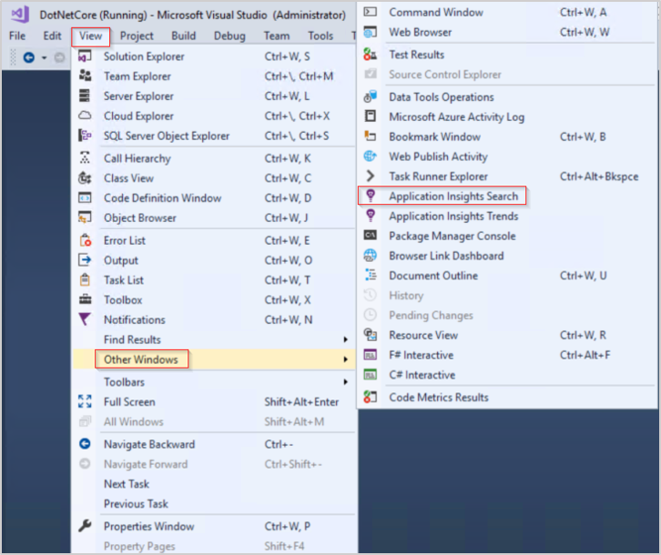
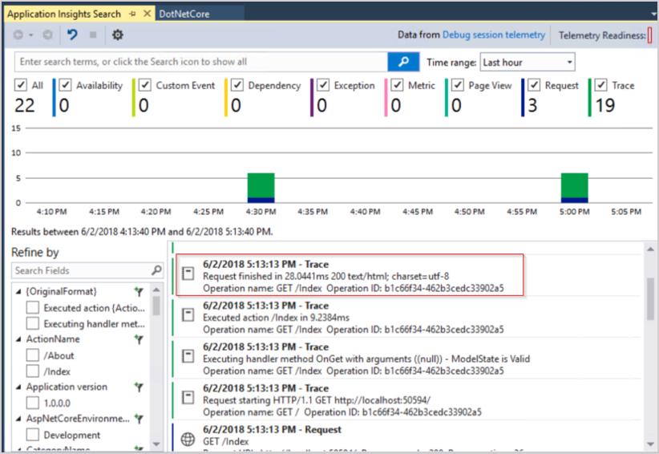
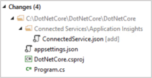
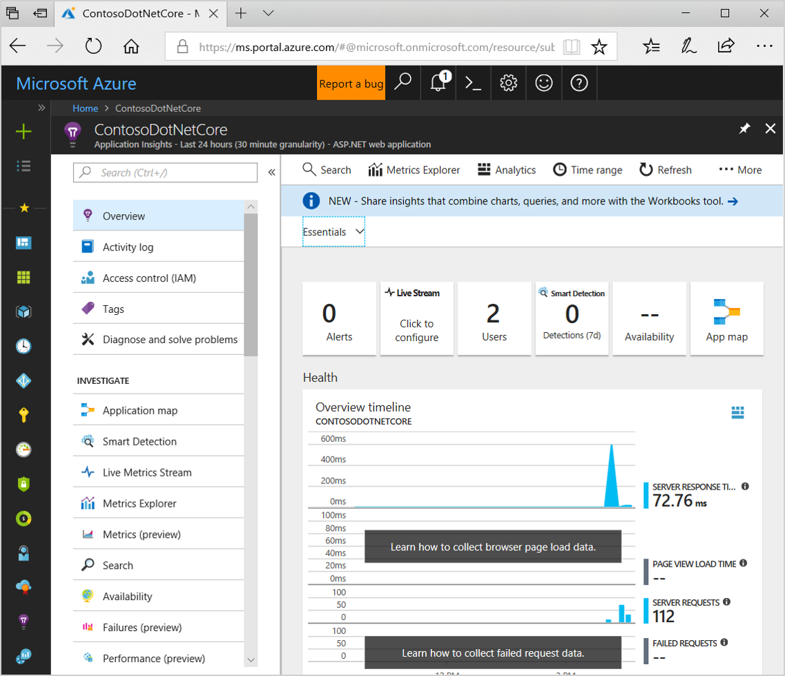
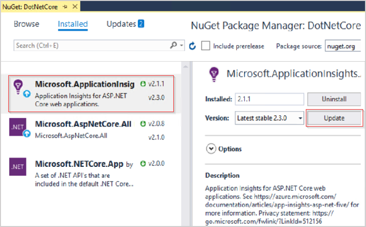
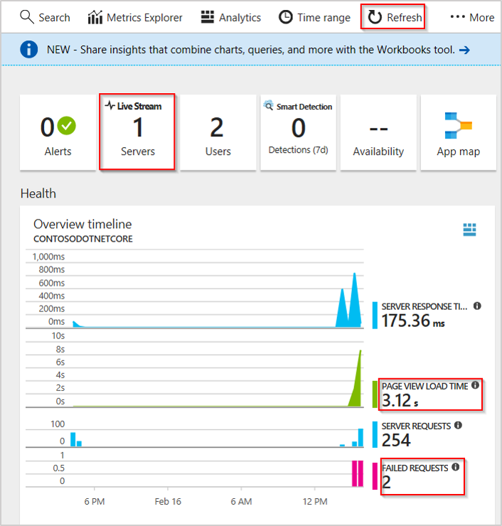
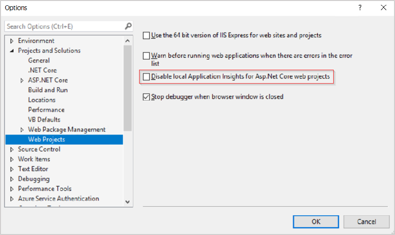

# Application Insights for ASP.NET Core

Azure Application Insights provides in-depth monitoring of your web application down to the code level. You can easily monitor your web application for availability, performance, and usage. You can also quickly identify and diagnose errors in your application without waiting for a user to report them.

This article walks you through the steps of creating a sample ASP.NET Core [Razor Pages](https://docs.microsoft.com/aspnet/core/mvc/razor-pages/?tabs=visual-studio) application in Visual Studio. It also shows you how to start monitoring by using Application Insights.

## Prerequisites

- .NET Core 2.0.0 SDK or later
- [Visual Studio 2017](https://www.visualstudio.com/downloads/) version 15.7.3 or later, with the ASP.NET and web development workload

## Create an ASP.NET Core project in Visual Studio

1. Right-click **Visual Studio 2017**, and then select **Run as administrator**.
2. Select **File** > **New** > **Project** (Ctrl+Shift+N).

   

3. Expand **Visual C#**. Select **.NET Core** > **ASP.NET Core Web Application**. Enter a project name and a solution name, and then select **Create new Git repository**.

   

4. Select **.NET Core** > **ASP.NET Core 2.0** **Web Application** > **OK**.

    

## Application Insights Search

In Visual Studio 2015 Update 2 or later with an ASP.NET Core 2+ based project, you can take advantage of [Application Insights Search](https://docs.microsoft.com/azure/application-insights/app-insights-visual-studio), even before you explicitly add Application Insights to your project.

To test this functionality:

1. Run your app. To run your app, select the **IIS Express** icon ().

2. Select **View** > **Other Windows** > **Application Insights Search**.

   

3. Currently, the debug session telemetry is available only for local analysis. To fully enable Application Insights, select **Telemetry Readiness** in the upper right corner, or complete the steps listed in the next section.

   

> [!NOTE]
> To learn more about how Visual Studio lights up features like [Application Insights Search](app-insights-visual-studio.md) and [CodeLens](app-insights-visual-studio-codelens.md) locally before you add Application Insights to your ASP.NET Core project, see [Application Insights Search continued](#application-insights-search-continued).

## Add Application Insights Telemetry

1. Select **Project** > **Add Application Insights Telemetry**. (Or, you can right-click **Connected Services**, and then select **Add Connected Service**.)

    

2. Select **Get Started**. (Depending on your version of Visual Studio, the text might vary slightly. Some earlier versions have a **Start Free** button instead.)

    

3. Select your subscription, then select **Resource** > **Register**.

## Changes made to your project

Application Insights is low overhead. To review the modifications made to your project by adding Application Insights telemetry:

Select **View** > **Team Explorer** (Ctrl+\, Ctrl+M) > **Project** > **Changes**

- Four total changes appear:

  

- One new file is created:

  -  _ConnectedService.json_

    ```json
    {
      "ProviderId": "Microsoft.ApplicationInsights.ConnectedService.ConnectedServiceProvider",
      "Version": "8.12.10405.1",
      "GettingStartedDocument": {
        "Uri": "https://go.microsoft.com/fwlink/?LinkID=798432"
      }
    }
    ```

- Three files are modified (additional comments added to highlight changes):

  - _appsettings.json_:

    ```json
    {
      "Logging": {
        "IncludeScopes": false,
        "LogLevel": {
          "Default": "Warning"
        }
      },
    // Changes to file post adding Application Insights Telemetry:
      "ApplicationInsights": {
        "InstrumentationKey": "10101010-1010-1010-1010-101010101010"
      }
    }
    //
    ```

  - _ContosoDotNetCore.csproj_:

    ```xml
    <Project Sdk="Microsoft.NET.Sdk.Web">
      <PropertyGroup>
        <TargetFramework>netcoreapp2.0</TargetFramework>
    <!--Changes to file post adding Application Insights Telemetry:-->
        <ApplicationInsightsResourceId>/subscriptions/2546c5a9-fa20-4de1-9f4a-62818b14b8aa/resourcegroups/Default-ApplicationInsights-EastUS/providers/microsoft.insights/components/DotNetCore</ApplicationInsightsResourceId>
        <ApplicationInsightsAnnotationResourceId>/subscriptions/2546c5a9-fa20-4de1-9f4a-62818b14b8aa/resourcegroups/Default-ApplicationInsights-EastUS/providers/microsoft.insights/components/DotNetCore</ApplicationInsightsAnnotationResourceId>
    <!---->
      </PropertyGroup>
      <ItemGroup>
    <!--Changes to file post adding Application Insights Telemetry:-->
        <PackageReference Include="Microsoft.ApplicationInsights.AspNetCore" Version="2.1.1" />
    <!---->
        <PackageReference Include="Microsoft.AspNetCore.All" Version="2.0.8" />
      </ItemGroup>
      <ItemGroup>
        <DotNetCliToolReference Include="Microsoft.VisualStudio.Web.CodeGeneration.Tools" Version="2.0.4" />
      </ItemGroup>
    <!--Changes to file post adding Application Insights Telemetry:-->
      <ItemGroup>
        <WCFMetadata Include="Connected Services" />
      </ItemGroup>
    <!---->
    </Project>
    ```

  -  _Program.cs_:

      ```csharp
      using System;
      using System.Collections.Generic;
      using System.IO;
      using System.Linq;
      using System.Threading.Tasks;
      using Microsoft.AspNetCore;
      using Microsoft.AspNetCore.Hosting;
      using Microsoft.Extensions.Configuration;
      using Microsoft.Extensions.Logging;

      namespace DotNetCore
      {
          public class Program
          {
              public static void Main(string[] args)
              {
                  BuildWebHost(args).Run();
              }

              public static IWebHost BuildWebHost(string[] args) =>
                  WebHost.CreateDefaultBuilder(args)
      // Change to file post adding Application Insights Telemetry:
                      .UseApplicationInsights()
      //
                      .UseStartup<Startup>()
                      .Build();
          }
      }
      ```

## Synthetic transactions with PowerShell

To automate requests to your app by using synthetic transactions:

1. To run your app, select the  icon.

2. Copy the URL from the browser address bar. The URL is in the format `http://localhost:<port number>`.

   

3. Run the following PowerShell loop to create 100 synthetic transactions by using your test app. Modify the port number after `localhost:` to match the URl that you copied in the preceding step. For example:

   ```PowerShell
   for ($i = 0 ; $i -lt 100; $i++)
   {
    Invoke-WebRequest -uri http://localhost:50984/
   }
   ```

## Open the Application Insights portal

After you run the PowerShell commands in the preceding section, open Application Insights to view the transactions and to confirm that data is being collected. 

In the Visual Studio menu, select **Project** > **Application Insights** > **Open Application Insights Portal**.

   

> [!NOTE]
> In the preceding example screenshot, **Live Stream**, **Page View Load Time**, and **Failed Requests** aren't collected. The next section walks you through the steps for adding each of these. If you're already collecting **Live Stream** and **Page View Load Time**, complete the steps only for **Failed Requests**.

## Collect Failed Requests, Live Stream, and Page View Load Time

### Failed Requests

Technically, failed requests are being collected, but no failed requests have occurred yet. To speed the process, you can add a custom exception to the existing project to simulate a real-world exception. If your app is still running in Visual Studio, before you proceed, select **Stop Debugging** (Shift+F5).

1. In **Solution Explorer**, expand **Pages** > **About.cshtml**, and then open *About.cshtml.cs*.

   

2. Add an exception under ``Message=``, and then save the change to the file.

    ```csharp
    using System;
    using System.Collections.Generic;
    using System.Linq;
    using System.Threading.Tasks;
    using Microsoft.AspNetCore.Mvc.RazorPages;

    namespace DotNetCore.Pages
    {
        public class AboutModel : PageModel
        {
            public string Message { get; set; }

            public void OnGet()
            {
                Message = "Your application description page.";
                throw new Exception("Test Exception");
            }
        }
    }
    ```

### Live Stream

To access the Live Stream functionality of Application Insights with ASP.NET Core, update the Microsoft.ApplicationInsights.AspNetCore 2.2.0 NuGet packages.

In Visual Studio, select **Project** > **Manage NuGet Packages** > **Microsoft.ApplicationInsights.AspNetCore** > (version) **2.2.0** > **Update**.

  

Multiple confirmation prompts appear. Read and accept if you agree with the changes.

### Page View Load Time

1. In Visual Studio, go to **Solution Explorer** > **Pages**. You must modify two files: *Layout.cshtml* and *ViewImports.cshtml*.

2. In *ViewImports.cshtml*, add this code:

   ```csharp
   @using Microsoft.ApplicationInsights.AspNetCore
   @inject JavaScriptSnippet snippet
   ```

3. In *Layout.cshtml*, add the following code before the ``</head>`` tag and before any other scripts:

    ```csharp
    @Html.Raw(snippet.FullScript)
    ```

### Test Failed Requests, Page View Load Time, and Live Stream

To test and confirm that everything is working:

1. Run your app. To run your app, select the  icon.

2. Go to the **About** page to trigger the test exception. (If you're in debug mode, in Visual Studio, select **Continue** for the exception to show up in Application Insights.)

3. Rerun the simulated PowerShell transaction script that you used earlier. (You might need to adjust the port number in the script.)

4. If the **Overview** page in Applications Insights still isn't open, in the Visual Studio menu, select **Project** > **Application Insights** > **Open Application Insights Portal**. 

   > [!TIP]
   > If you don't see your new traffic, check the value for **Time range**, and then select **Refresh**.

   

5. Select **Live Stream**.

   

   (If your PowerShell script is still running, you should see live metrics. If your PowerShell script has stopped running, run the script again with Live Stream open.)

## Application Insights SDK comparison

The Application Insights product group has been working hard to achieve feature parity between the [full .NET Framework SDK](https://github.com/Microsoft/ApplicationInsights-dotnet) and the .NET Core SDK. The 2.2.0 release of the [ASP.NET Core SDK](https://github.com/Microsoft/ApplicationInsights-aspnetcore) for Application Insights largely closes the feature gap.

The following table describes more of the differences and trade-offs between [.NET and .NET Core](https://docs.microsoft.com/dotnet/standard/choosing-core-framework-server):

   | SDK comparison | ASP.NET        | ASP.NET Core 2.1.0    | ASP.NET Core 2.2.0 |
  |:-- | :-------------: |:------------------------:|:----------------------:|
   | **Live metrics**      | **+** |**-** | **+** |
   | **Server telemetry channel** | **+** |**-** | **+**|
   |**Adaptive sampling**| **+** | **-** | **+**|
   | **SQL dependency calls**     | **+** |**-** | **+**|
   | **Performance counters*** | **+** | **-**| **-**|

Performance counters in this context refer to [server-side performance counters](https://docs.microsoft.com/azure/application-insights/app-insights-performance-counters) like processor, memory, and disk utilization.

## Open-source SDK
[Read and contribute to the code](https://github.com/Microsoft/ApplicationInsights-aspnetcore#recent-updates).

## Application Insights Search continued

This section can help you better understand how Application Insights Search works in Visual Studio for an ASP.NET Core 2 project. It works this way even when you haven't explicitly installed the Application Insights NuGet packages yet. It can also be helpful to examine the debug output.

If you search the output for the word _insight_, results similar to the following are highlighted:

```DebugOuput
'dotnet.exe' (CoreCLR: clrhost): Loaded 'C:\Program Files\dotnet\store\x64\netcoreapp2.0\microsoft.aspnetcore.applicationinsights.hostingstartup\2.0.3\lib\netcoreapp2.0\Microsoft.AspNetCore.ApplicationInsights.HostingStartup.dll'.
'dotnet.exe' (CoreCLR: clrhost): Loaded 'C:\Program Files\dotnet\store\x64\netcoreapp2.0\microsoft.applicationinsights.aspnetcore\2.1.1\lib\netstandard1.6\Microsoft.ApplicationInsights.AspNetCore.dll'.

Application Insights Telemetry (unconfigured): {"name":"Microsoft.ApplicationInsights.Dev.Message","time":"2018-06-03T17:32:38.2796801Z","tags":{"ai.location.ip":"127.0.0.1","ai.operation.name":"DEBUG /","ai.internal.sdkVersion":"aspnet5c:2.1.1","ai.application.ver":"1.0.0.0","ai.cloud.roleInstance":"CONTOSO-SERVER","ai.operation.id":"de85878e-4618b05bad11b5a6","ai.internal.nodeName":"CONTOSO-SERVER","ai.operation.parentId":"|de85878e-4618b05bad11b5a6."},"data":{"baseType":"MessageData","baseData":{"ver":2,"message":"Request starting HTTP/1.1 DEBUG http://localhost:53022/  0","severityLevel":"Information","properties":{"AspNetCoreEnvironment":"Development","Protocol":"HTTP/1.1","CategoryName":"Microsoft.AspNetCore.Hosting.Internal.WebHost","Host":"localhost:53022","Path":"/","Scheme":"http","ContentLength":"0","DeveloperMode":"true","Method":"DEBUG"}}}}
```

In the output, CoreCLR loads two assemblies: 

- _Microsoft.AspNetCore.ApplicationInsights.HostingStartup.dll_
- _Microsoft.ApplicationInsights.AspNetCore.dll_.

The _unconfigured_ reference in each instance of Application Insights telemetry indicates that this application isn't associated with an ikey. The data that's generated while your app is running isn't sent to Azure. The data is available only for local search and analysis.

The functionality is possible in part because the NuGet package _Microsoft.AspNetCore.All_ takes [_Microsoft.ASPNetCoreApplicationInsights.HostingStartup_](https://docs.microsoft.com/dotnet/api/microsoft.aspnetcore.applicationinsights.hostingstartup.applicationinsightshostingstartup?view=aspnetcore-2.1) as a dependency.


Outside of Visual Studio, if you were editing a ASP.NET Core project in VSCode or another editor, these assemblies wouldn't automatically load during debug if you haven't explicitly added Application Insights to your project.

However, in Visual Studio, this lighting up of local Application Insights features from external assemblies is accomplished by using the [IHostingStartup Interface](https://docs.microsoft.com/dotnet/api/microsoft.aspnetcore.hosting.ihostingstartup?view=aspnetcore-2.1). The interface dynamically adds Application Insights during debug.

Learn more about enhancing an app from an [external assembly in ASP.NET Core with IHostingStartup](https://docs.microsoft.com/aspnet/core/fundamentals/configuration/platform-specific-configuration?view=aspnetcore-2.1). 

### Disable Application Insights in Visual Studio .NET Core projects

Although the automatic light-up of Application Insights search functionality might be useful, seeing debug telemetry generated when you weren't expecting it might be confusing.

If just disabling telemetry generation is sufficient, you can add this code block to the **configure** method of your _Startup.cs_ file:

```csharp
  var configuration = app.ApplicationServices.GetService<Microsoft.ApplicationInsights.Extensibility.TelemetryConfiguration>();
            configuration.DisableTelemetry = true;
            if (env.IsDevelopment())
```

CoreCLR still loads _Microsoft.AspNetCore.ApplicationInsights.HostingStartup.dll_ and _Microsoft.ApplicationInsights.AspNetCore.dll_, but the files don't do anything.

If you want to completely disable Application Insights in your Visual Studio .NET Core project, the preferred method is to select **Tools** > **Options** > **Projects and Solutions** > **Web Projects**. Select the **Disable local Application Insights for ASP.NET Core web projects** check box. This functionality was added in Visual Studio 15.6.



If you're running an earlier version of Visual Studio and you want to completely remove all assemblies that were loaded via *IHostingStartup*, you have two options:

* Add `.UseSetting(WebHostDefaults.PreventHostingStartupKey, "true")` to _Program.cs_:

  ```csharp
  using System;
  using System.Collections.Generic;
  using System.IO;
  using System.Linq;
  using System.Threading.Tasks;
  using Microsoft.AspNetCore;
  using Microsoft.AspNetCore.Hosting;
  using Microsoft.Extensions.Configuration;
  using Microsoft.Extensions.Logging;

  namespace DotNetCore
  {
      public class Program
      {
          public static void Main(string[] args)
          {
              BuildWebHost(args).Run();
          }

          public static IWebHost BuildWebHost(string[] args) =>
              WebHost.CreateDefaultBuilder(args)
                  .UseSetting(WebHostDefaults.PreventHostingStartupKey, "true")
                  .UseStartup<Startup>()
                  .Build();
      }
  }
  ```

* Add ``"ASPNETCORE_preventHostingStartup": "True"`` to _launchSettings.json_ environment variables.

The issue with using either of these methods is that they don't disable only Application Insights. The methods also disable anything in Visual Studio that was using the *IHostingStartup* light-up functionality.

## Video

> [!VIDEO https://channel9.msdn.com/events/Connect/2016/100/player] 

## Next steps
* [Explore User Flows](app-insights-usage-flows.md) to understand how users navigate through your app.
* [Configure snapshot collection](https://docs.microsoft.com/azure/application-insights/app-insights-snapshot-debugger#configure-snapshot-collection-for-aspnet-core-20-applications) to see the state of source code and variables at the moment an exception is thrown.
* [Use the API](app-insights-api-custom-events-metrics.md) to send your own events and metrics for a more detailed view of your app's performance and usage.
* Use [availability tests](app-insights-monitor-web-app-availability.md) to check your app constantly from around the world.
