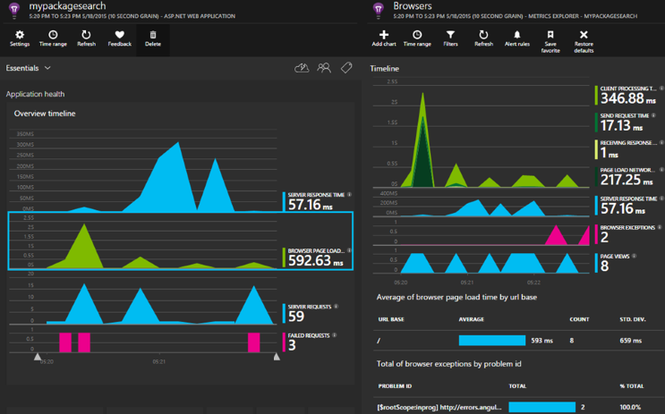

---
title: Azure Application Insights for ASP.NET Core | Microsoft Docs
description: Monitor web applications for availability, performance and usage.
services: application-insights
documentationcenter: .net
author: mrbullwinkle
manager: carmonm
ms.assetid: 3b722e47-38bd-4667-9ba4-65b7006c074c
ms.service: application-insights
ms.workload: tbd
ms.tgt_pltfrm: ibiza
ms.devlang: na
ms.topic: article
ms.date: 02/14/2018
ms.author: mbullwin
---

# Application Insights for ASP.NET Core

## Create an ASP.NET Core project in Visual Studio

1. Right-click and Launch **Visual Studio 2017** as administrator.
2. Select **File** > **New** > **Project** (Ctrl-Shift-N).
3. Expand **Visual C#** > Select **.NET Core** > **ASP.NET Core Web Application**.

   

4. Enter a **Name** > **Solution name** > Check **Create new Git repository**.

   

5. Select **.Net Core** > **ASP.NET Core 2.0** **Web Application** > **OK**.

    

## Add Application Insights Telemetry

1. Select **Project** > **Add Application Insights Telemetry...** (Alternatively you can right-click **Connected Services** > Add Connected Service.)

    

2. Select **Start Free**.

    

3. Select an appropriate **Subscription** > **Resource** > and whether or not you want allow collection over 1GB/Month > **Register**.

    

## Changes Made to your project

Application Insights is very low overhead. To review the modifications made to your project made by adding Application Insights telemetry:

Select **View** > **Team Explorer** (Ctrl+\,Ctrl+M) > **Project** > **Changes**

- Four changes total:

  

- One new file is created:

   **ConnectedService.json**

  

- Three files are modified:

  **appsettings.json**

   

  **ContosoDotNetCore.csproj**

   

   **Program.cs**

   

## Synthetic transactions with PowerShell

Launching your app, and then clicking around on links manually can be used to generate test traffic. However, it is often helpful to create a simple synthethic in PowerShell.

1. Run your app by clicking IIS Express 

2. Copy the url from the browser address bar. It will be in the format http://localhost:{random port number}

   

3. Run the following PowerShell loop to create 100 synthetic transactions against your test app. Modify the port number after **localhost:** to match the url you copied in the prvious step.

   ```PS
   for ($i = 0 ; $i -le 100; $i++)
   {
    Invoke-WebRequest -uri http://localhost:50984/
   }
   ```
## Open Application Insights Portal

Project > Application Insights > Open Application Insights Portal


[Application Insights](app-insights-overview.md) lets you monitor your web application for availability, performance and usage. With the feedback you get about the performance and effectiveness of your app in the wild, you can make informed choices about the direction of the design in each development lifecycle.



You'll need a subscription with [Microsoft Azure](http://azure.com). Sign in with a Microsoft account, which you might have for Windows, XBox Live, or other Microsoft cloud services. Your team might have an organizational subscription to Azure: ask the owner to add you to it using your Microsoft account.

## Getting started

* In Visual Studio Solution Explorer, right-click your project and select **Configure Application Insights**, or **Add > Application Insights**. [Learn more](app-insights-asp-net.md).
* If you don't see those menu commands, follow the [manual getting Started guide](https://github.com/Microsoft/ApplicationInsights-aspnetcore/wiki/Getting-Started). You may need to do this if your project was created with a version of Visual Studio before 2017.

## Using Application Insights
Sign into the [Microsoft Azure portal](https://portal.azure.com), select **All Resources** or **Application Insights**, and then select the resource you created to monitor your app.

In a separate browser window, use your app for a while. You'll see data appearing in the Application Insights charts. (You might have to click Refresh.) There will be only a small amount of data while you're developing, but these charts really come alive when you publish your app and have many users. 

The overview page shows key performance charts: server response time,  page load time, and counts of failed requests. Click any chart to see more charts and data.

Views in the portal fall into three main categories:

* [Metrics Explorer](app-insights-metrics-explorer.md) shows graphs and tables of metrics and counts, such as response times, failure rates, or metrics you create yourself with the [API](app-insights-api-custom-events-metrics.md). Filter and segment the data by property values to get a better understanding of your app and its users.
* [Search Explorer](app-insights-diagnostic-search.md) lists individual events, such as specific requests, exceptions, log traces, or events you created yourself with the [API](app-insights-api-custom-events-metrics.md). Filter and search in the events, and navigate among related events to investigate issues.
* [Analytics](app-insights-analytics.md) lets you run SQL-like queries over your telemetry, and is a powerful analytical and diagnostic tool.

## Alerts
* You automatically get [proactive diagnostic alerts](app-insights-proactive-diagnostics.md) that tell you about anomalous changes in failure rates and other metrics.
* Set up [availability tests](app-insights-monitor-web-app-availability.md) to test your website continually from locations worldwide, and get emails as soon as any test fails.
* Set up [metric alerts](app-insights-monitor-web-app-availability.md) to know if metrics such as response times or exception rates go outside acceptable limits.

## Video

> [!VIDEO https://channel9.msdn.com/events/Connect/2016/100/player] 

## Open source
[Read and contribute to the code](https://github.com/Microsoft/ApplicationInsights-aspnetcore#recent-updates)


## Next steps
* [Add telemetry to your web pages](app-insights-javascript.md) to monitor page usage and performance.
* [Monitor dependencies](app-insights-asp-net-dependencies.md) to see if REST, SQL or other external resources are slowing you down.
* [Use the API](app-insights-api-custom-events-metrics.md) to send your own events and metrics for a more detailed view of your app's performance and usage.
* [Availability tests](app-insights-monitor-web-app-availability.md) check your app constantly from around the world. 

