---
title: Azure Application Insights for ASP.NET Core | Microsoft Docs
description: Monitor web applications for availability, performance and usage.
services: application-insights
documentationcenter: .net
author: mrbullwinkle
manager: carmonm
ms.assetid: 3b722e47-38bd-4667-9ba4-65b7006c074c
ms.service: application-insights
ms.workload: tbd
ms.tgt_pltfrm: ibiza
ms.devlang: na
ms.topic: article
ms.date: 02/21/2018
ms.author: mbullwin
---

# Application Insights for ASP.NET Core

Azure Application Insights provides in-depth monitoring of your web application down to the code level. You can easily monitor your web application for availability, performance, and usage. You can also quickly identify and diagnose errors in your application without waiting for a user to report them.

This article walks you through creating a sample ASP.NET Core [Razor Pages](https://docs.microsoft.com/aspnet/core/mvc/razor-pages/?tabs=visual-studio) application in Visual Studio, and how to start monitoring with Azure Application Insights.

## Prerequisites

- NET Core 2.0.0 SDK or later.
- [Visual Studio 2017](https://www.visualstudio.com/downloads/) version 15.3 or later with the ASP.NET and web development workload.

## Create an ASP.NET Core project in Visual Studio

1. Right-click and Launch **Visual Studio 2017** as administrator.
2. Select **File** > **New** > **Project** (Ctrl-Shift-N).

   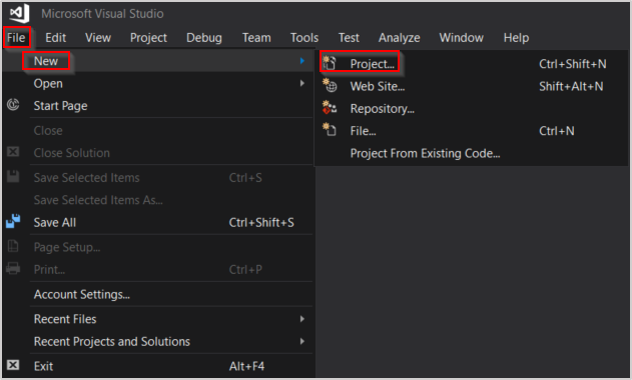

3. Expand **Visual C#** > Select **.NET Core** > **ASP.NET Core Web Application**. Enter a **Name** > **Solution name** > Check **Create new Git repository**.

   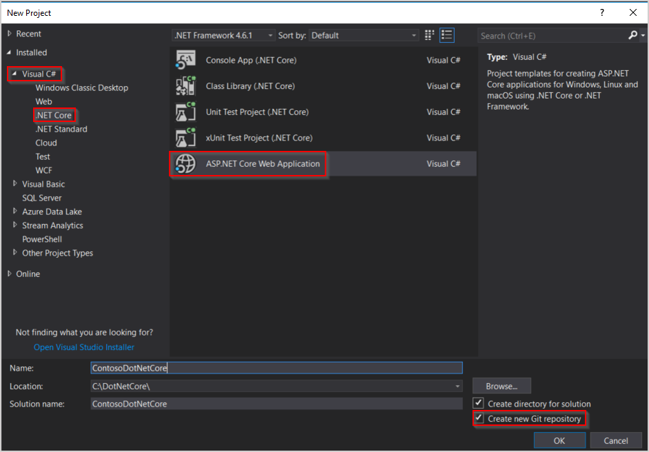

4. Select **.Net Core** > **ASP.NET Core 2.0** **Web Application** > **OK**.

    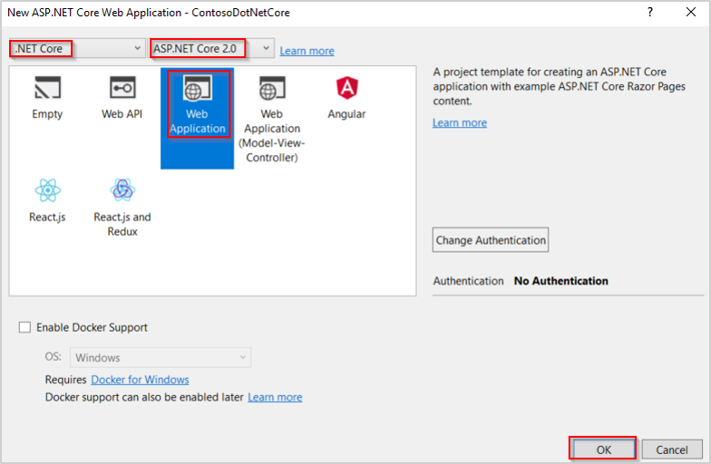

## Add Application Insights Telemetry

1. Select **Project** > **Add Application Insights Telemetry...** (Alternatively you can right-click **Connected Services** > Add Connected Service.)

    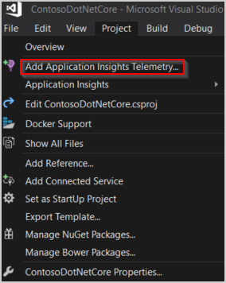

2. Select **Start Free**.

    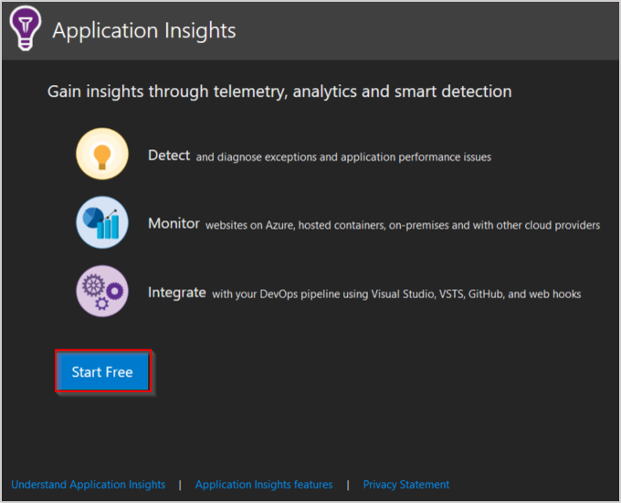

3. Select an appropriate **Subscription** > **Resource** > and whether or not to allow collection over 1 GB per Month > **Register**.

    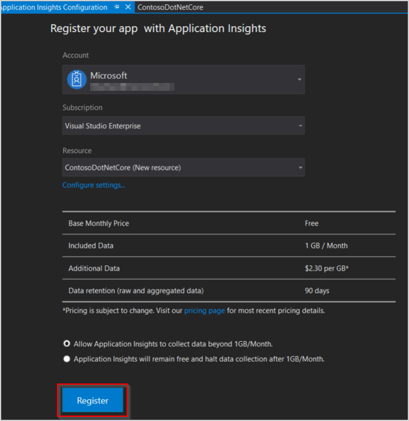

## Changes Made to your project

Application Insights is very low overhead. To review the modifications made to your project by adding Application Insights telemetry:

Select **View** > **Team Explorer** (Ctrl+\, Ctrl+M) > **Project** > **Changes**

- Four changes total:

  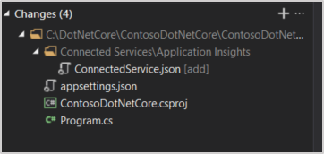

- One new file is created:

   **ConnectedService.json**

  

- Three files are modified:

  **appsettings.json**

   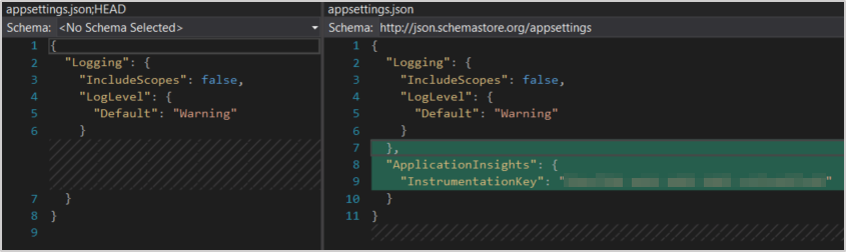

  **ContosoDotNetCore.csproj**

   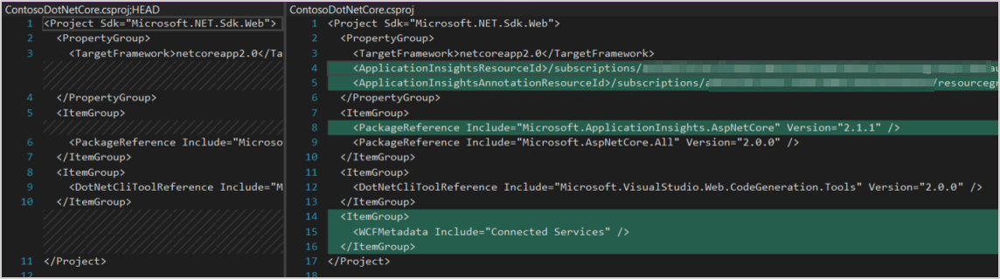

   **Program.cs**

   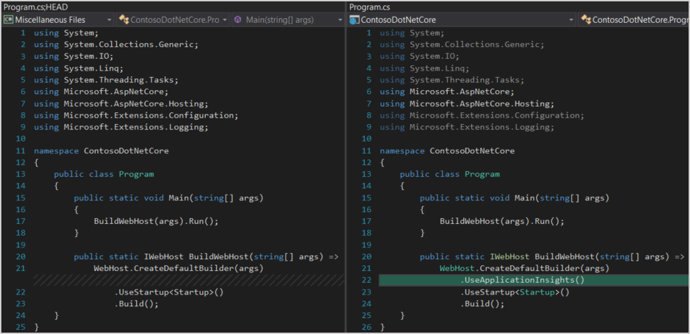

## Synthetic transactions with PowerShell

Launching your app, and then clicking around on links manually can be used to generate test traffic. However, it is often helpful to create a simple synthetic transaction in PowerShell.

1. Run your app by clicking IIS Express 

2. Copy the url from the browser address bar. It is in the format http://localhost:{random port number}

   

3. Run the following PowerShell loop to create 100 synthetic transactions against your test app. Modify the port number after **localhost:** to match the url you copied in the previous step.

   ```PS
   for ($i = 0 ; $i -lt 100; $i++)
   {
    Invoke-WebRequest -uri http://localhost:50984/
   }
   ```

## Open Application Insights Portal

After running the PowerShell from the previous section, launch Application Insights to view the transactions and confirm that data is being collected. 

From the Visual Studio menu, select **Project** > **Application Insights** > **Open Application Insights Portal**

   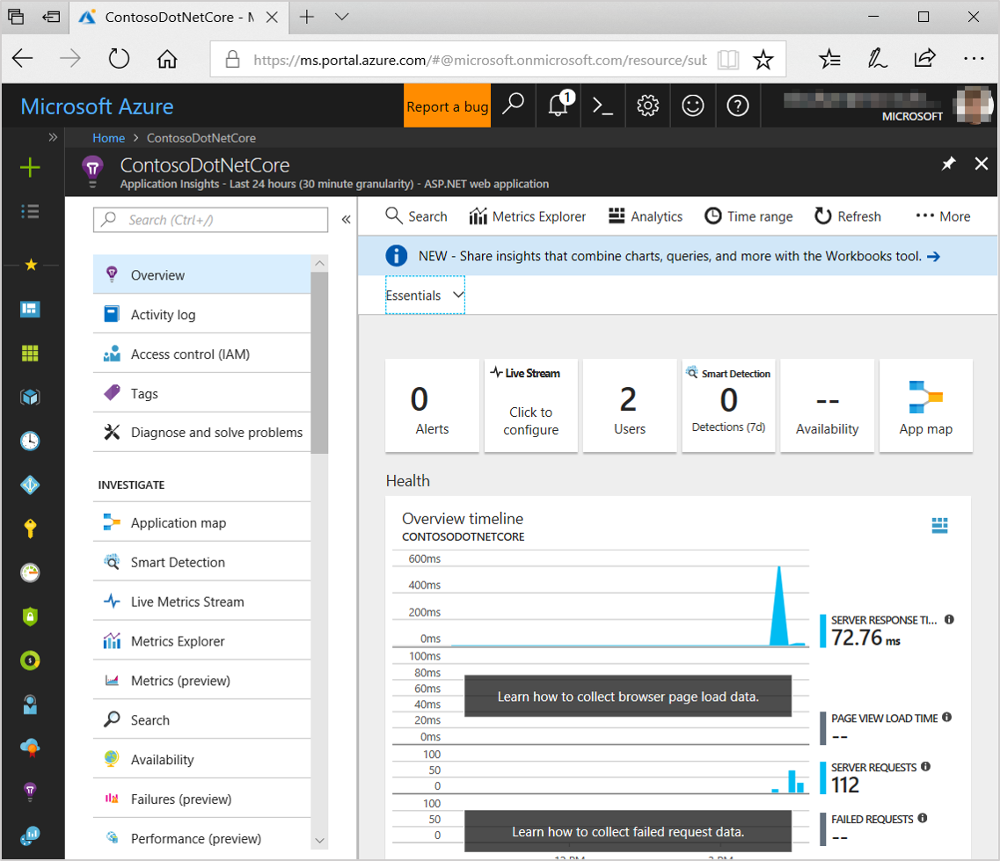

> [!NOTE]
> In the example screenshot above **Live Stream**, **Page View Load Time**, and **Failed Requests** are currently not collected. The next section will walk through adding each. If you are already collecting **Live Stream**, and **Page View Load Time**, then only follow the steps for **Failed Requests**.

## Collect Failed Requests, Live Stream, & Page View Load Time

### Failed Requests

Technically **Failed Requests** are being collected, but none have occurred yet. To speed the process along a custom exception can be added to the existing project to simulate a real-world exception. If your app is still running in Visual Studio before proceeding **Stop Debugging** (Shift+F5)

1. In **Solution Explorer** > expand **Pages** > **About.cshtml** > open **About.cshtml.cs**.

   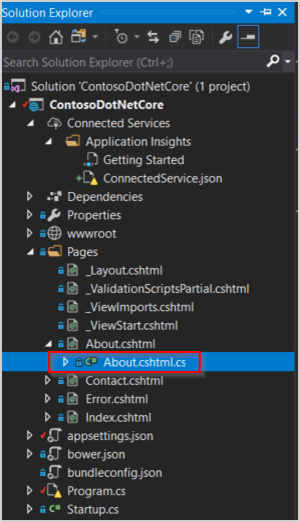

2. Add an Exception under ``Message=`` > save the change to the file.

   ```C#
   throw new Exception("Test Exception");
   ```

   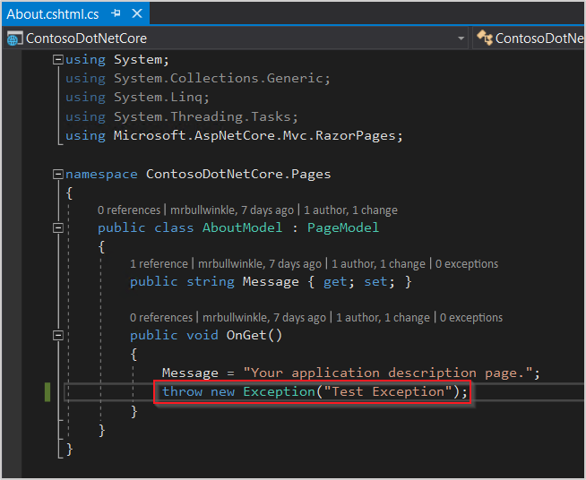

### Live Stream

To access the Live Stream functionality of Application Insights with ASP.NET Core update to the  **Microsoft.ApplicationInsights.AspNetCore 2.2.0** NuGet packages.

From Visual Studio, select **Project** > **Manage NuGet Packages** > **Microsoft.ApplicationInsights.AspNetCore** > Version **2.2.0** > **Update**.

  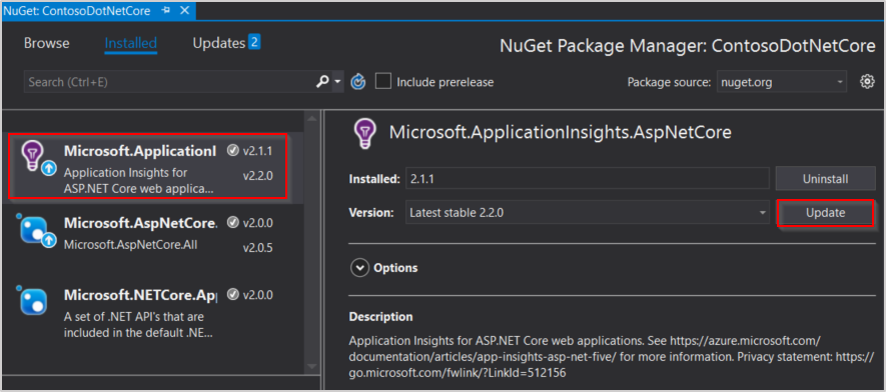

Multiple confirmation prompts will occur, read and accept if you agree with the changes.

### Page View Load Time

1. In Visual Studio navigate to **Solution Explorer** > **Pages** > two files will need to be modified: **_Layout.cshtml**, and **_ViewImports.cshtml**

2. In **_ViewImports.cshtml**, add:

   ```C#
   @using Microsoft.ApplicationInsights.AspNetCore
   @inject JavaScriptSnippet snippet
   ```
     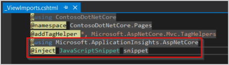

3. In **_Layout.cshtml** add the line below before the ``</head>`` tag, but prior to any other scripts.

    ```C#
    @Html.Raw(snippet.FullScript)
    ```
    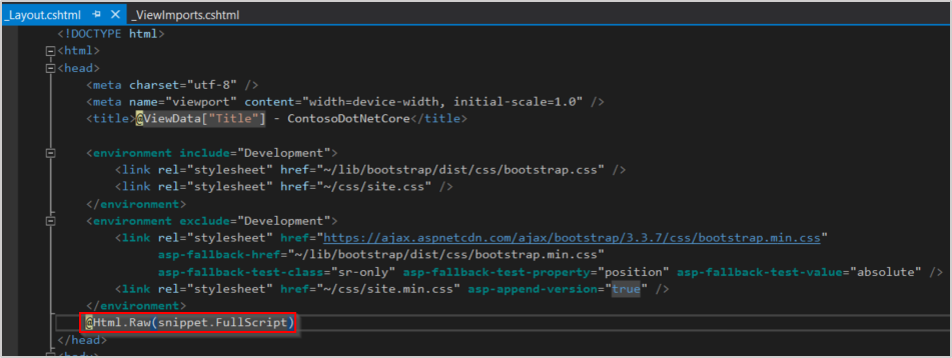

### Test Failed Requests, Page View Load Time, Live Stream

Now that you have completed the previous steps you can test out and confirm that everything is working.

1. Run your app by clicking IIS Express 

2. Navigate to the **About** page to trigger the test exception. (If you are running in Debug mode, you will need to click **Continue** in Visual Studio before the exception will be picked up by Application Insights.)

3. Re-run the simulated PowerShell transaction script from earlier (You may need to adjust the port number in the script.)

4. If the Applications Insights Overview is not still open, from Visual Studio menu select **Project** > **Application Insights** > **Open Application Insights Portal**. 

   > [!TIP]
   > If you aren't seeing your new traffic yet, check the **Time range** and click **Refresh**.

   

5. Select Live Stream

   

   (If your PowerShell script is still running you should see live metrics, if it has stopped run the script again with Live Stream open.)

## App Insights SDK Comparison

The Application Insights product group has been working hard to achieve as close to feature parity as possible between the [full .NET Framework SDK](https://github.com/Microsoft/ApplicationInsights-dotnet) and the .Net Core SDK. The 2.2.0 release of the [ASP.NET Core SDK](https://github.com/Microsoft/ApplicationInsights-aspnetcore) for Application Insights has largely closed the feature gap.

To understand more about the differences and tradeoffs between [.NET and .NET Core](https://docs.microsoft.com/dotnet/standard/choosing-core-framework-server).

   | SDK Comparison | ASP.NET        | ASP.NET Core 2.1.0    | ASP.NET Core 2.2.0 |
  |:-- | :-------------: |:------------------------:|:----------------------:|
   | **Live Metrics**      | **+** |**-** | **+** |
   | **Server Telemetry Channel** | **+** |**-** | **+**|
   |**Adaptive Sampling**| **+** | **-** | **+**|
   | **SQL Dependency Calls**     | **+** |**-** | **+**|
   | **Performance Counters*** | **+** | **-**| **-**|

_Performance Counters_ in this context refers to [server-side performance counters](https://docs.microsoft.com/azure/application-insights/app-insights-performance-counters) like processor, memory, and disk utilization.

## Open-source SDK
[Read and contribute to the code](https://github.com/Microsoft/ApplicationInsights-aspnetcore#recent-updates)

## Video

> [!VIDEO https://channel9.msdn.com/events/Connect/2016/100/player] 

## Next steps
* [Explore Users Flows](app-insights-usage-flows.md) to understand how users navigate through your app.
* [Configure Snapshot Collection](https://docs.microsoft.com/azure/application-insights/app-insights-snapshot-debugger#configure-snapshot-collection-for-aspnet-core-20-applications) to see the state of source code and variables at the moment an exception is thrown.
* [Use the API](app-insights-api-custom-events-metrics.md) to send your own events and metrics for a more detailed view of your app's performance and usage.
* [Availability tests](app-insights-monitor-web-app-availability.md) check your app constantly from around the world.
