<properties 
	pageTitle="Dependency Tracking in Application Insights" 
	description="Analyze usage, availability and performance of your on-premises or Microsoft Azure web application with Application Insights." 
	services="application-insights" 
    documentationCenter=".net"
	authors="alancameronwills" 
	manager="douge"/>

<tags 
	ms.service="application-insights" 
	ms.workload="tbd" 
	ms.tgt_pltfrm="ibiza" 
	ms.devlang="na" 
	ms.topic="article" 
	ms.date="04/13/2016" 
	ms.author="awills"/>


# Set up Application Insights: Dependency tracking


[AZURE.INCLUDE [app-insights-selector-get-started-dotnet](../../includes/app-insights-selector-get-started-dotnet.md)]


A *dependency* is an external component that is called by your app. It's typically a service called using HTTP, or a database, or a file system. In Visual Studio Application Insights, you can easily see how long your application waits for dependencies and how often a dependency call fails.


The out-of-the-box dependency monitor currently reports calls to these  types of dependencies:

* ASP.NET
 * SQL databases
 * ASP.NET web and WCF services that use HTTP-based bindings
 * Local or remote HTTP calls
 * Azure DocumentDb, table, blob storage, and queue
* Java
 * Calls to a database through a [JDBC](http://docs.oracle.com/javase/7/docs/technotes/guides/jdbc/) driver, such as MySQL, SQL Server, PostgreSQL or SQLite.
* JavaScript in web pages - the [web page SDK](app-insights-javascript.md) automatically logs Ajax calls as dependencies.

You can write your own SDK calls to monitor other dependencies using the [TrackDependency API](app-insights-api-custom-events-metrics.md#track-dependency).


## To set up dependency monitoring

You need a [Microsoft Azure](http://azure.com) subscription.

### If your app runs on your IIS server

If your web app runs on .NET 4.6 or later, you can either [install the Application Insights SDK](app-insights-asp-net.md) in your app, or install Application Insights Status Monitor. You don't need both.

Otherwise, install Application Insights Status Monitor on the server:

1. On your IIS web server, login with administrator credentials.
2. Download and run the [Status Monitor installer](http://go.microsoft.com/fwlink/?LinkId=506648).
4. In the installation wizard, sign in to Microsoft Azure.

    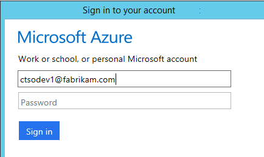

    *Connection errors? See [Troubleshooting](#troubleshooting).*

5. Pick the installed web application or website that you want to monitor, then configure the resource in which you want to see the results in the Application Insights portal.

    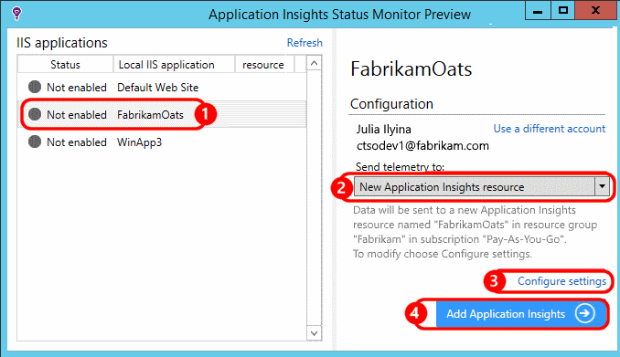

    Normally, you choose to configure a new resource and [resource group][roles].

    Otherwise, use an existing resource if you already set up [web tests][availability] for your site, or [web client monitoring][client].

6. Restart IIS.

    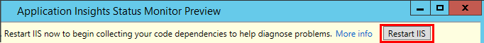

    Your web service will be interrupted for a short while.

6. Notice that ApplicationInsights.config has been inserted into the web apps that you want to monitor.

    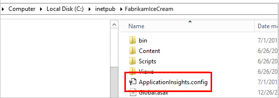

   There are also some changes to web.config.

#### Want to (re)configure later?

After you complete the wizard, you can re-configure the agent whenever you want. You can also use this if you installed the agent but there was some trouble with the initial setup.

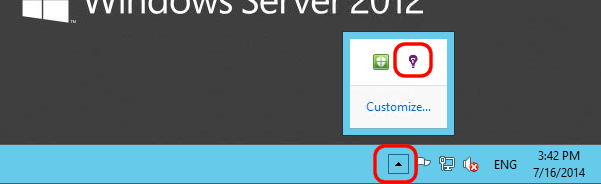


### If your app runs as an Azure Web App

In the control panel of your Azure Web App, add the Application Insights extension.

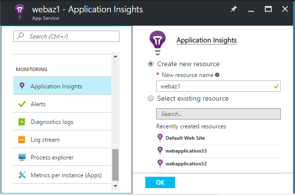


### If it's an Azure cloud services project

[Add scripts to web and worker roles](app-insights-cloudservices.md#dependencies). Or [install .NET framework 4.6 or later](../cloud-services/cloud-services-dotnet-install-dotnet.md).

## <a name="diagnosis"></a> Diagnosing dependency performance issues

To assess the performance of requests at your server, open the Performance blade and scroll down to look at the grid of requests:

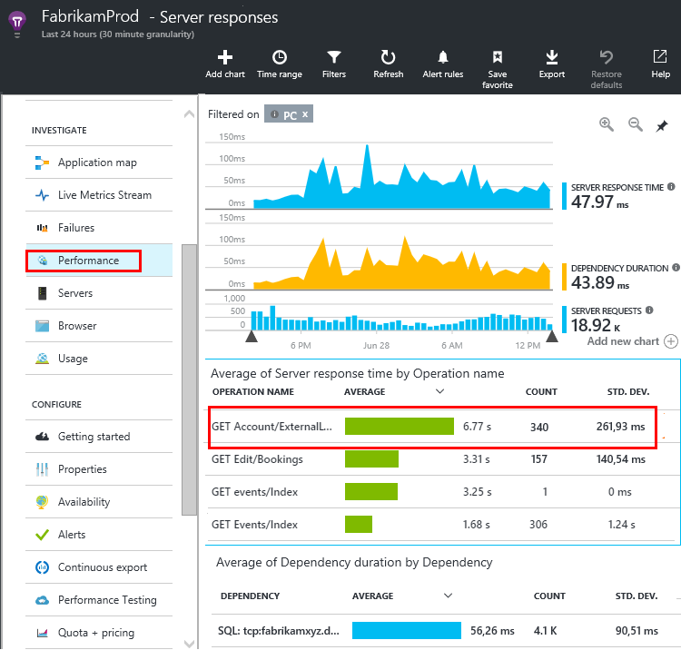

The top one is taking very long. Let's see if we can find out where the time is spent.

Click that row to see individual request events:


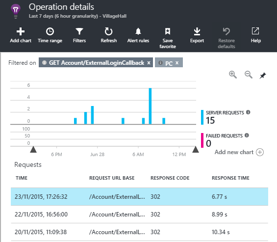

Click any long-running instance to inspect it further.

Scroll down to the remote dependency calls related to this request:

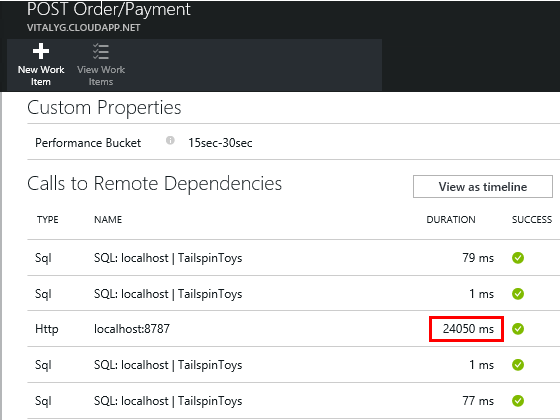

It looks like most of the time servicing this request was spent in a call to a local service. 


Select that row to get more information:

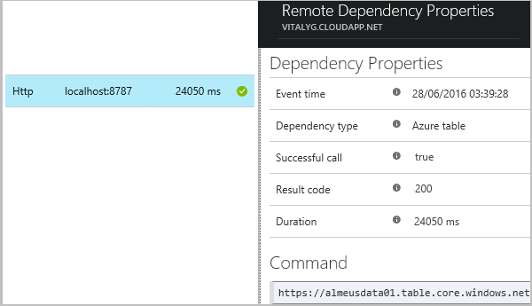

The detail includes sufficient information to diagnose the problem.


In a different case, no dependency call is long, but by switching to the timeline view, we can see where the delay occurred in our internal processing:


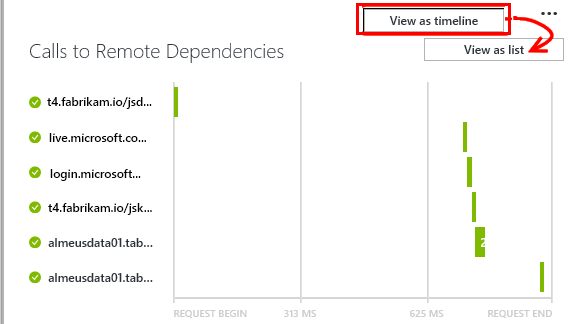


## Failures

If there are failed requests, click the chart.

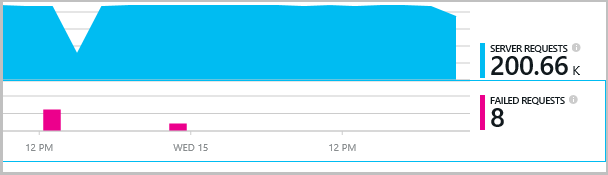

Click through a request type and request instance, to find a failed call to a remote dependency.


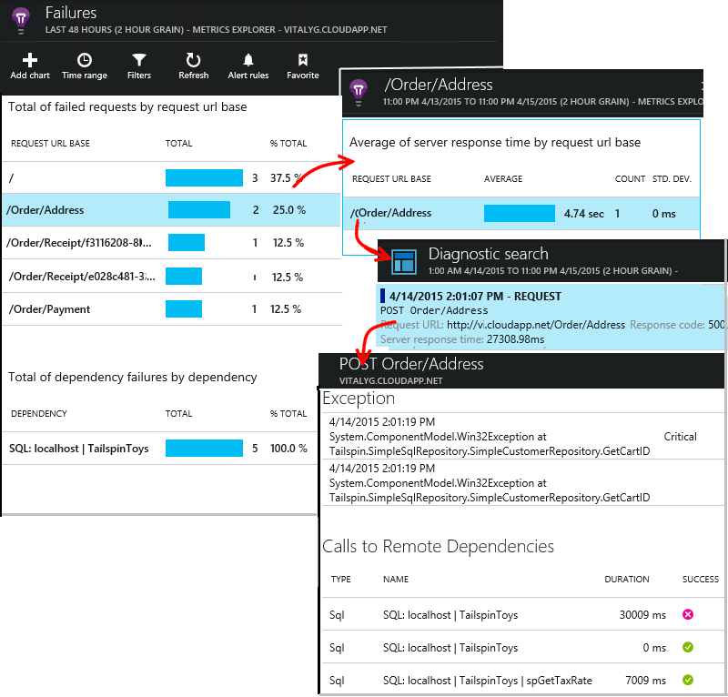


## Custom dependency tracking

The standard dependency-tracking module automatically discovers external dependencies such as databases and REST APIs. But you might want some additional components to be treated in the same way. 

You can write code that sends dependency information, using the same [TrackDependency API](app-insights-api-custom-events-metrics.md#track-dependency) that is used by the standard modules.

For example, if you build your code with an assembly that you didn't write yourself, you could time all the calls to it, to find out what contribution it makes to your response times. To have this data displayed in the dependency charts in Application Insights, send it using `TrackDependency`.

```C#

            var startTime = DateTime.UtcNow;
            var timer = System.Diagnostics.Stopwatch.StartNew();
            try
            {
                success = dependency.Call();
            }
            finally
            {
                timer.Stop();
                telemetry.TrackDependency("myDependency", "myCall", startTime, timer.Elapsed, success);
            }
```

If you want to switch off the standard dependency tracking module, remove the reference to DependencyTrackingTelemetryModule in [ApplicationInsights.config](app-insights-configuration-with-applicationinsights-config.md).

## Troubleshooting

*Dependency success flag always shows either true or false.*

* Upgrade to the latest version of the SDK. If your .NET version is less than 4.6, install [Status monitor](app-insights-monitor-performance-live-website-now.md).

## Next steps

- [Exceptions](app-insights-asp-net-exceptions.md)
- [User & page data][client]
- [Availability](app-insights-monitor-web-app-availability.md)


<!--Link references-->

[api]: app-insights-api-custom-events-metrics.md
[apikey]: app-insights-api-custom-events-metrics.md#ikey
[availability]: app-insights-monitor-web-app-availability.md
[azure]: ../insights-perf-analytics.md
[client]: app-insights-javascript.md
[diagnostic]: app-insights-diagnostic-search.md
[metrics]: app-insights-metrics-explorer.md
[netlogs]: app-insights-asp-net-trace-logs.md
[portal]: http://portal.azure.com/
[qna]: app-insights-troubleshoot-faq.md
[redfield]: app-insights-asp-net-dependencies.md
[roles]: app-insights-resources-roles-access-control.md

 
