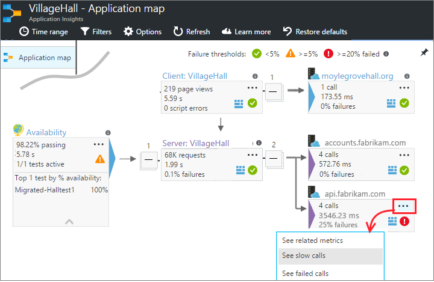

---
title: Dependency Tracking in Azure Application Insights | Microsoft Docs
description: Analyze usage, availability and performance of your on-premises or Microsoft Azure web application with Application Insights.
services: application-insights
documentationcenter: .net
author: mrbullwinkle
manager: carmonm

ms.assetid: d15c4ca8-4c1a-47ab-a03d-c322b4bb2a9e
ms.service: application-insights
ms.workload: tbd
ms.tgt_pltfrm: ibiza
ms.devlang: na
ms.topic: conceptual
ms.date: 06/08/2018
ms.author: mbullwin

---
# Set up Application Insights: Dependency tracking
A *dependency* is an external component that is called by your app. It's typically a service called using HTTP, or a database, or a file system. [Application Insights](app-insights-overview.md) measures how long your application waits for dependencies and how often a dependency call fails. You can investigate specific calls, and relate them to requests and exceptions.


The out-of-the-box dependency monitor currently reports calls to these  types of dependencies:

* Server
  * SQL databases
  * ASP.NET web and WCF services that use HTTP-based bindings
  * Local or remote HTTP calls
  * Azure Cosmos DB, table, blob storage, and queue
* Web pages
  * AJAX calls

Monitoring works by using [byte code instrumentation](https://msdn.microsoft.com/library/z9z62c29.aspx) around selected methods. Performance overhead is minimal.

You can also write your own SDK calls to monitor other dependencies, both in the client and server code, using the [TrackDependency API](app-insights-api-custom-events-metrics.md#trackdependency).

## Set up dependency monitoring
Partial dependency information is collected automatically by the [Application Insights SDK](app-insights-asp-net.md). To get complete data, install the appropriate agent for the host server.

| Platform | Install |
| --- | --- |
| IIS Server |Either [install Status Monitor on your server](app-insights-monitor-performance-live-website-now.md) or [Upgrade your application to .NET framework 4.6 or later](http://go.microsoft.com/fwlink/?LinkId=528259) and install the [Application Insights SDK](app-insights-asp-net.md)  in your app. |
| Azure Web App |In your web app control panel, [open the Application Insights blade in your web app control panel](app-insights-azure-web-apps.md) and choose Install if prompted. |
| Azure Cloud Service |[Use startup task](app-insights-cloudservices.md) or [Install .NET framework 4.6+](../cloud-services/cloud-services-dotnet-install-dotnet.md) |

## Where to find dependency data
* [Application Map](#application-map) visualizes dependencies between your app and neighboring components.
* [Performance, browser, and failure blades](#performance-and-blades) show server dependency data.
* [Browsers blade](#ajax-calls) shows AJAX calls from your users' browsers.
* [Click through from slow or failed requests](#diagnose-slow-requests) to check their dependency calls.
* [Analytics](#analytics) can be used to query dependency data.

## Application Map
Application Map acts as a visual aid to discovering dependencies between the components of your application. It is automatically generated from the telemetry from your app. This example shows AJAX calls from the browser scripts and REST calls from the server app to two external services.



* **Navigate from the boxes** to relevant dependency and other charts.
* **Pin the map** to the [dashboard](app-insights-dashboards.md), where it will be fully functional.

[Learn more](app-insights-app-map.md).

## Performance and failure blades
The performance blade shows the duration of dependency calls made by the server app. There's a summary chart and a table segmented by call.


Click through the summary charts or the table items to search raw occurrences of these calls.


**Failure counts** are shown on the **Failures** blade. A failure is any return code that is not in the range 200-399, or unknown.

> [!NOTE]
> **100% failures?** - This probably indicates that you are only getting partial dependency data. You need to [set up dependency monitoring appropriate to your platform](#set-up-dependency-monitoring).
>
>

## AJAX Calls
The Browsers blade shows the duration and failure rate of AJAX calls from [JavaScript in your web pages](app-insights-javascript.md). They are shown as Dependencies.

## <a name="diagnosis"></a> Diagnose slow requests
Each request event is associated with the dependency calls, exceptions and other events that are tracked while your app is processing the request. So if some requests are performing badly, you can find out whether it's due to slow responses from a dependency.

Let's walk through an example of that.

### Tracing from requests to dependencies
Open the Performance blade, and look at the grid of requests:


The top one is taking very long. Let's see if we can find out where the time is spent.

Click that row to see individual request events:


Click any long-running instance to inspect it further, and scroll down to the remote dependency calls related to this request:


It looks like most of the time servicing this request was spent in a call to a local service.

Select that row to get more information:


Looks like this is where the problem is. We've pinpointed the problem, so now we just need to find out why that call is taking so long.

### Request timeline
In a different case, there is no dependency call that is particularly long. But by switching to the timeline view, we can see where the delay occurred in our internal processing:


There seems to be a large gap after the first dependency call, so we should look at our code to see why that is.

### Profile your live site

No idea where the time goes? The [Application Insights profiler](app-insights-profiler.md) traces HTTP calls to your live site and shows you which functions in your code took the longest time.

## Failed requests
Failed requests might also be associated with failed calls to dependencies. Again, we can click through to track down the problem.


Click through to an occurrence of a failed request, and look at its associated events.


## Analytics
You can track dependencies in the [Log Analytics query language](https://aka.ms/LogAnalyticsLanguage). Here are some examples.

* Find any failed dependency calls:

```

    dependencies | where success != "True" | take 10
```

* Find AJAX calls:

```

    dependencies | where client_Type == "Browser" | take 10
```

* Find dependency calls associated with requests:

```

    dependencies
    | where timestamp > ago(1d) and  client_Type != "Browser"
    | join (requests | where timestamp > ago(1d))
      on operation_Id  
```


* Find AJAX calls associated with page views:

```

    dependencies
    | where timestamp > ago(1d) and  client_Type == "Browser"
    | join (browserTimings | where timestamp > ago(1d))
      on operation_Id
```


## Custom dependency tracking
The standard dependency-tracking module automatically discovers external dependencies such as databases and REST APIs. But you might want some additional components to be treated in the same way.

You can write code that sends dependency information, using the same [TrackDependency API](app-insights-api-custom-events-metrics.md#trackdependency) that is used by the standard modules.

For example, if you build your code with an assembly that you didn't write yourself, you could time all the calls to it, to find out what contribution it makes to your response times. To have this data displayed in the dependency charts in Application Insights, send it using `TrackDependency`.

```csharp

            var startTime = DateTime.UtcNow;
            var timer = System.Diagnostics.Stopwatch.StartNew();
            try
            {
                success = dependency.Call();
            }
            finally
            {
                timer.Stop();
                telemetry.TrackDependency("myDependency", "myCall", startTime, timer.Elapsed, success);
                // The call above has been made obsolete in the latest SDK. The updated call follows this format:
                // TrackDependency (string dependencyTypeName, string dependencyName, string data, DateTimeOffset startTime, TimeSpan duration, bool success);
            }
```

If you want to switch off the standard dependency tracking module, remove the reference to DependencyTrackingTelemetryModule in [ApplicationInsights.config](app-insights-configuration-with-applicationinsights-config.md).

## Troubleshooting
*Dependency success flag always shows either true or false.*

*SQL query not shown in full.*

Consult the table below and insure you have chosen the correct configuration to enable dependency monitoring for your application.

| Platform | Install |
| --- | --- |
| IIS Server |Either [install Status Monitor on your server](app-insights-monitor-performance-live-website-now.md). Or [Upgrade your application to .NET framework 4.6 or later](http://go.microsoft.com/fwlink/?LinkId=528259) and install the [Application Insights SDK](app-insights-asp-net.md)  in your app. |
| Azure Web App |In your web app control panel, [open the Application Insights blade in your web app control panel](app-insights-azure-web-apps.md) and choose Install if prompted. |
| Azure Cloud Service |[Use startup task](app-insights-cloudservices.md) or [Install .NET framework 4.6+](../cloud-services/cloud-services-dotnet-install-dotnet.md) |

## Video

> [!VIDEO https://channel9.msdn.com/events/Connect/2016/112/player]

## Next steps
* [Exceptions](app-insights-asp-net-exceptions.md)
* [User & page data](app-insights-javascript.md)
* [Availability](app-insights-monitor-web-app-availability.md)
