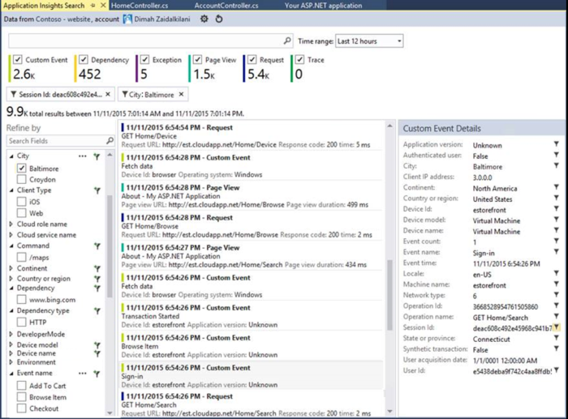
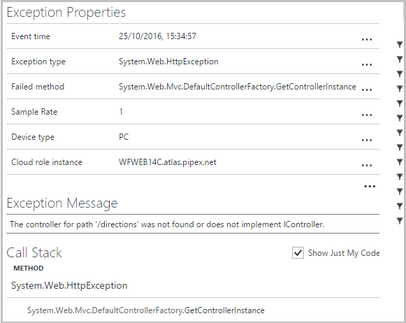
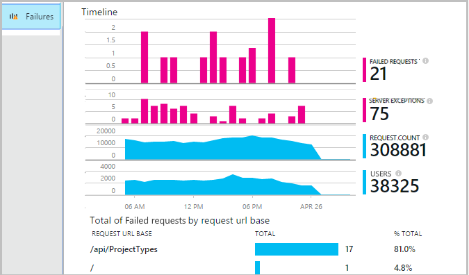
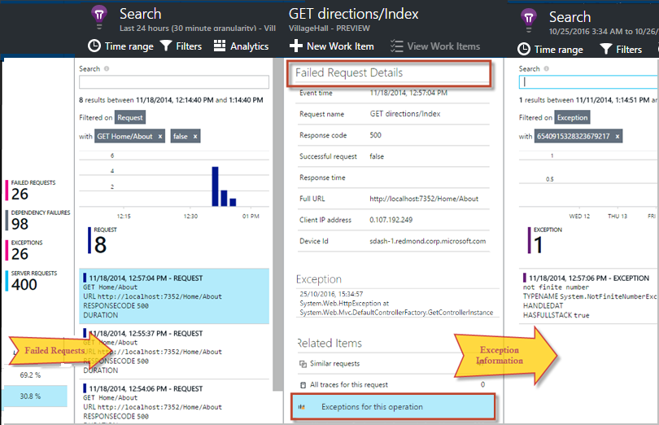
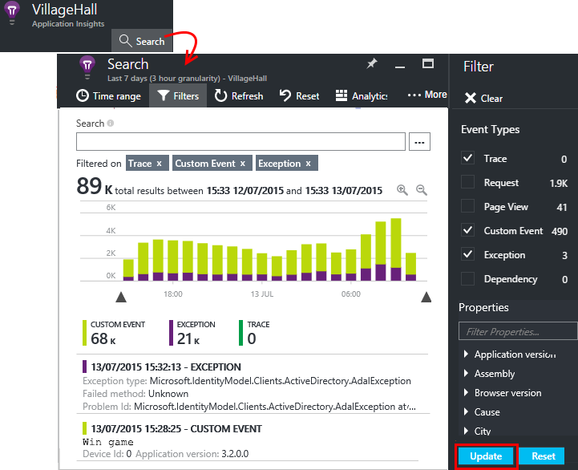
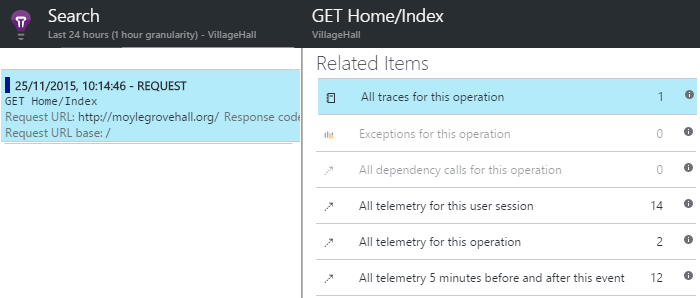

# Diagnose exceptions in your web apps with Application Insights
Exceptions in your live web app are reported by [Application Insights](app-insights-overview.md). You can correlate failed requests with exceptions and other events at both the client and server, so that you can quickly diagnose the causes.

## Set up exception reporting
* To have exceptions reported from your server app:
  * Install [Application Insights SDK](app-insights-asp-net.md) in your app code, or
  * IIS web servers: Run [Application Insights Agent](app-insights-monitor-performance-live-website-now.md); or
  * Azure web apps: Add the [Application Insights Extension](app-insights-azure-web-apps.md)
  * Java web apps: Install the [Java agent](app-insights-java-agent.md)
* Install the [JavaScript snippet](app-insights-javascript.md) in your web pages to catch browser exceptions.
* In some application frameworks or with some settings, you need to take some extra steps to catch more exceptions:
  * [Web forms](#web-forms)
  * [MVC](#mvc)
  * [Web API 1.*](#web-api-1)
  * [Web API 2.*](#web-api-2)
  * [WCF](#wcf)

## Diagnosing exceptions using Visual Studio
Open the app solution in Visual Studio to help with debugging.

Run the app, either on your server or on your development machine by using F5.

Open the Application Insights Search window in Visual Studio, and set it to display events from your app. While you're debugging, you can do this just by clicking the Application Insights button.



Notice that you can filter the report to show just exceptions.

*No exceptions showing? See [Capture exceptions](#exceptions).*

Click an exception report to show its stack trace.
Click a line reference in the stack trace, to open the relevant code file.  

In the code, notice that CodeLens shows data about the exceptions:



## Diagnosing failures using the Azure portal
From the Application Insights overview of your app, the Failures tile shows you charts of exceptions and failed HTTP requests, together with a list of the request URLs that cause the most frequent failures.



Click through one of the failed exception types in the list to get to individual occurrences of the exception, where you can see the details and stack trace:



**Alternatively,** you can start from the list of requests and find exceptions related to it.

*No exceptions showing? See [Capture exceptions](#exceptions).*


## Custom tracing and log data
To get diagnostic data specific to your app, you can insert code to send your own telemetry data. This displayed in diagnostic search alongside the request, page view and other automatically-collected data.

You have several options:

* [TrackEvent()](app-insights-api-custom-events-metrics.md#trackevent) is typically used for monitoring usage patterns, but the data it sends also appears under Custom Events in diagnostic search. Events are named, and can carry string properties and numeric metrics on which you can [filter your diagnostic searches](app-insights-diagnostic-search.md).
* [TrackTrace()](app-insights-api-custom-events-metrics.md#tracktrace) lets you send longer data such as POST information.
* [TrackException()](#exceptions) sends stack traces. [More about exceptions](#exceptions).
* If you already use a logging framework like Log4Net or NLog, you can [capture those logs](app-insights-asp-net-trace-logs.md) and see them in diagnostic search alongside request and exception data.

To see these events, open [Search](app-insights-diagnostic-search.md), open Filter, and then choose Custom Event, Trace, or Exception.



> [!NOTE]
> If your app generates a lot of telemetry, the adaptive sampling module will automatically reduce the volume that is sent to the portal by sending only a representative fraction of events. Events that are part of the same operation will be selected or deselected as a group, so that you can navigate between related events. [Learn about sampling.](app-insights-sampling.md)
>
>

### How to see request POST data
Request details don't include the data sent to your app in a POST call. To have this data reported:

* [Install the SDK](app-insights-asp-net.md) in your application project.
* Insert code in your application to call [Microsoft.ApplicationInsights.TrackTrace()](app-insights-api-custom-events-metrics.md#tracktrace). Send the POST data in the message parameter. There is a limit to the permitted size, so you should try to send just the essential data.
* When you investigate a failed request, find the associated traces.  



## <a name="exceptions"></a> Capturing exceptions and related diagnostic data
At first, you won't see in the portal all the exceptions that cause failures in your app. You'll see any browser exceptions (if you're using the [JavaScript SDK](app-insights-javascript.md) in your web pages). But most server exceptions are caught by IIS and you have to write a bit of code to see them.

You can:

* **Log exceptions explicitly** by inserting code in exception handlers to report the exceptions.
* **Capture exceptions automatically** by configuring your ASP.NET framework. The necessary additions are different for different types of framework.

## Reporting exceptions explicitly
The simplest way is to insert a call to TrackException() in an exception handler.

JavaScript

    try
    { ...
    }
    catch (ex)
    {
      appInsights.trackException(ex, "handler loc",
        {Game: currentGame.Name,
         State: currentGame.State.ToString()});
    }

C#

    var telemetry = new TelemetryClient();
    ...
    try
    { ...
    }
    catch (Exception ex)
    {
       // Set up some properties:
       var properties = new Dictionary <string, string>
         {{"Game", currentGame.Name}};

       var measurements = new Dictionary <string, double>
         {{"Users", currentGame.Users.Count}};

       // Send the exception telemetry:
       telemetry.TrackException(ex, properties, measurements);
    }

VB

    Dim telemetry = New TelemetryClient
    ...
    Try
      ...
    Catch ex as Exception
      ' Set up some properties:
      Dim properties = New Dictionary (Of String, String)
      properties.Add("Game", currentGame.Name)

      Dim measurements = New Dictionary (Of String, Double)
      measurements.Add("Users", currentGame.Users.Count)

      ' Send the exception telemetry:
      telemetry.TrackException(ex, properties, measurements)
    End Try

The properties and measurements parameters are optional, but are useful for [filtering and adding](app-insights-diagnostic-search.md) extra information. For example, if you have an app that can run several games, you could find all the exception reports related to a particular game. You can add as many items as you like to each dictionary.

## Browser exceptions
Most browser exceptions are reported.

If your web page includes script files from content delivery networks or other domains, ensure your script tag has the attribute ```crossorigin="anonymous"```,  and that the server sends [CORS headers](http://enable-cors.org/). This will allow you to get a stack trace and detail for unhandled JavaScript exceptions from these resources.

## Web forms
For web forms, the HTTP Module will be able to collect the exceptions when there are no redirects configured with CustomErrors.

But if you have active redirects, add the following lines to the Application_Error function in Global.asax.cs. (Add a Global.asax file if you don't already have one.)

*C#*

    void Application_Error(object sender, EventArgs e)
    {
      if (HttpContext.Current.IsCustomErrorEnabled && Server.GetLastError  () != null)
      {
         var ai = new TelemetryClient(); // or re-use an existing instance

         ai.TrackException(Server.GetLastError());
      }
    }


## MVC
If the [CustomErrors](https://msdn.microsoft.com/library/h0hfz6fc.aspx) configuration is `Off`, then exceptions will be available for the [HTTP Module](https://msdn.microsoft.com/library/ms178468.aspx) to collect. However, if it is `RemoteOnly` (default), or `On`, then the exception will be cleared and not available for Application Insights to automatically collect. You can fix that by overriding the [System.Web.Mvc.HandleErrorAttribute class](http://msdn.microsoft.com/library/system.web.mvc.handleerrorattribute.aspx), and applying the overridden class as shown for the different MVC versions below ([github source](https://github.com/AppInsightsSamples/Mvc2UnhandledExceptions/blob/master/MVC2App/Controllers/AiHandleErrorAttribute.cs)):

    using System;
    using System.Web.Mvc;
    using Microsoft.ApplicationInsights;

    namespace MVC2App.Controllers
    {
      [AttributeUsage(AttributeTargets.Class | AttributeTargets.Method, Inherited = true, AllowMultiple = true)]
      public class AiHandleErrorAttribute : HandleErrorAttribute
      {
        public override void OnException(ExceptionContext filterContext)
        {
            if (filterContext != null && filterContext.HttpContext != null && filterContext.Exception != null)
            {
                //If customError is Off, then AI HTTPModule will report the exception
                if (filterContext.HttpContext.IsCustomErrorEnabled)
                {   //or reuse instance (recommended!). see note above  
                    var ai = new TelemetryClient();
                    ai.TrackException(filterContext.Exception);
                }
            }
            base.OnException(filterContext);
        }
      }
    }

#### MVC 2
Replace the HandleError attribute with your new attribute in your controllers.

    namespace MVC2App.Controllers
    {
       [AiHandleError]
       public class HomeController : Controller
       {
    ...

[Sample](https://github.com/AppInsightsSamples/Mvc2UnhandledExceptions)

#### MVC 3
Register `AiHandleErrorAttribute` as a global filter in Global.asax.cs:

    public class MyMvcApplication : System.Web.HttpApplication
    {
      public static void RegisterGlobalFilters(GlobalFilterCollection filters)
      {
         filters.Add(new AiHandleErrorAttribute());
      }
     ...

[Sample](https://github.com/AppInsightsSamples/Mvc3UnhandledExceptionTelemetry)

#### MVC 4, MVC5
Register AiHandleErrorAttribute as a global filter in FilterConfig.cs:

    public class FilterConfig
    {
      public static void RegisterGlobalFilters(GlobalFilterCollection filters)
      {
        // Default replaced with the override to track unhandled exceptions
        filters.Add(new AiHandleErrorAttribute());
      }
    }

[Sample](https://github.com/AppInsightsSamples/Mvc5UnhandledExceptionTelemetry)

## Web API 1.x
Override System.Web.Http.Filters.ExceptionFilterAttribute:

    using System.Web.Http.Filters;
    using Microsoft.ApplicationInsights;

    namespace WebAPI.App_Start
    {
      public class AiExceptionFilterAttribute : ExceptionFilterAttribute
      {
        public override void OnException(HttpActionExecutedContext actionExecutedContext)
        {
            if (actionExecutedContext != null && actionExecutedContext.Exception != null)
            {  //or reuse instance (recommended!). see note above
                var ai = new TelemetryClient();
                ai.TrackException(actionExecutedContext.Exception);    
            }
            base.OnException(actionExecutedContext);
        }
      }
    }

You could add this overridden attribute to specific controllers, or add it to the global filter configuration in the WebApiConfig class:

    using System.Web.Http;
    using WebApi1.x.App_Start;

    namespace WebApi1.x
    {
      public static class WebApiConfig
      {
        public static void Register(HttpConfiguration config)
        {
            config.Routes.MapHttpRoute(name: "DefaultApi", routeTemplate: "api/{controller}/{id}",
                defaults: new { id = RouteParameter.Optional });
            ...
            config.EnableSystemDiagnosticsTracing();

            // Capture exceptions for Application Insights:
            config.Filters.Add(new AiExceptionFilterAttribute());
        }
      }
    }

[Sample](https://github.com/AppInsightsSamples/WebApi_1.x_UnhandledExceptions)

There are a number of cases that the exception filters cannot handle. For example:

* Exceptions thrown from controller constructors.
* Exceptions thrown from message handlers.
* Exceptions thrown during routing.
* Exceptions thrown during response content serialization.

## Web API 2.x
Add an implementation of IExceptionLogger:

    using System.Web.Http.ExceptionHandling;
    using Microsoft.ApplicationInsights;

    namespace ProductsAppPureWebAPI.App_Start
    {
      public class AiExceptionLogger : ExceptionLogger
      {
        public override void Log(ExceptionLoggerContext context)
        {
            if (context !=null && context.Exception != null)
            {//or reuse instance (recommended!). see note above
                var ai = new TelemetryClient();
                ai.TrackException(context.Exception);
            }
            base.Log(context);
        }
      }
    }

Add this to the services in WebApiConfig:

    using System.Web.Http;
    using System.Web.Http.ExceptionHandling;
    using ProductsAppPureWebAPI.App_Start;

    namespace WebApi2WithMVC
    {
      public static class WebApiConfig
      {
        public static void Register(HttpConfiguration config)
        {
            // Web API configuration and services

            // Web API routes
            config.MapHttpAttributeRoutes();

            config.Routes.MapHttpRoute(
                name: "DefaultApi",
                routeTemplate: "api/{controller}/{id}",
                defaults: new { id = RouteParameter.Optional }
            );
            config.Services.Add(typeof(IExceptionLogger), new AiExceptionLogger());
        }
      }
  }

[Sample](https://github.com/AppInsightsSamples/WebApi_2.x_UnhandledExceptions)

As alternatives, you could:

1. Replace the only ExceptionHandler with a custom implementation of IExceptionHandler. This is only called when the framework is still able to choose which response message to send (not when the connection is aborted for instance)
2. Exception Filters (as described in the section on Web API 1.x controllers above) - not called in all cases.

## WCF
Add a class that extends Attribute and implements IErrorHandler and IServiceBehavior.

    using System;
    using System.Collections.Generic;
    using System.Linq;
    using System.ServiceModel.Description;
    using System.ServiceModel.Dispatcher;
    using System.Web;
    using Microsoft.ApplicationInsights;

    namespace WcfService4.ErrorHandling
    {
      public class AiLogExceptionAttribute : Attribute, IErrorHandler, IServiceBehavior
      {
        public void AddBindingParameters(ServiceDescription serviceDescription,
            System.ServiceModel.ServiceHostBase serviceHostBase,
            System.Collections.ObjectModel.Collection<ServiceEndpoint> endpoints,
            System.ServiceModel.Channels.BindingParameterCollection bindingParameters)
        {
        }

        public void ApplyDispatchBehavior(ServiceDescription serviceDescription,
            System.ServiceModel.ServiceHostBase serviceHostBase)
        {
            foreach (ChannelDispatcher disp in serviceHostBase.ChannelDispatchers)
            {
                disp.ErrorHandlers.Add(this);
            }
        }

        public void Validate(ServiceDescription serviceDescription,
            System.ServiceModel.ServiceHostBase serviceHostBase)
        {
        }

        bool IErrorHandler.HandleError(Exception error)
        {//or reuse instance (recommended!). see note above
            var ai = new TelemetryClient();

            ai.TrackException(error);
            return false;
        }

        void IErrorHandler.ProvideFault(Exception error,
            System.ServiceModel.Channels.MessageVersion version,
            ref System.ServiceModel.Channels.Message fault)
        {
        }
      }
    }

Add the attribute to the service implementations:

    namespace WcfService4
    {
        [AiLogException]
        public class Service1 : IService1
        {
         ...

[Sample](https://github.com/AppInsightsSamples/WCFUnhandledExceptions)

## Exception performance counters
If you have [installed the Application Insights Agent](app-insights-monitor-performance-live-website-now.md) on your server, you can get a chart of the exceptions rate, measured by .NET. This includes both handled and unhandled .NET exceptions.

Open a Metric Explorer blade, add a new chart, and select **Exception rate**, listed under Performance Counters.

The .NET framework calculates the rate by counting the number of exceptions in an interval and dividing by the length of the interval.

Note that it will be different from the 'Exceptions' count calculated by the Application Insights portal by counting TrackException reports. The sampling intervals are different, and the SDK doesn't send TrackException reports for all handled and unhandled exceptions.

## Video

> [!VIDEO https://channel9.msdn.com/events/Connect/2016/112/player] 

## Next steps
* [Monitor REST, SQL and other calls to dependencies](app-insights-asp-net-dependencies.md)
* [Monitor page load times, browser exceptions, and AJAX calls](app-insights-javascript.md)
* [Monitor performance counters](app-insights-performance-counters.md)
