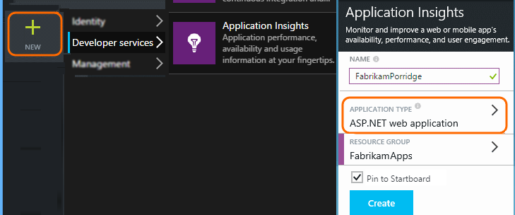

<properties 
	pageTitle="Application Insights for ASP.NET 5" 
	description="Monitor web applications for availability, performance and usage." 
	services="application-insights" 
    documentationCenter=".net"
	authors="alancameronwills" 
	manager="ronmart"/>

<tags 
	ms.service="application-insights" 
	ms.workload="tbd" 
	ms.tgt_pltfrm="ibiza" 
	ms.devlang="na" 
	ms.topic="article" 
	ms.date="05/27/2015" 
	ms.author="awills"/>

# Application Insights for ASP.NET 5

Visual Studio Application Insights lets you monitor your web application for availability, performance and usage. With the feedback you get about the performance and effectiveness of your app in the wild, you can make informed choices about the direction of the design in each development lifecycle.

You'll need a subscription with [Microsoft Azure](http://azure.com). Sign in with a Microsoft account, which you might have for Windows, XBox Live, or other Microsoft cloud services. 

## Create an ASP.NET 5 project

... if you haven't already done that. 

Use the standard ASP.NET 5 project template in Visual Studio 2015.

## Create an Application Insights resource

In the [Azure portal][portal], create a new Application Insights resource. Pick the ASP.NET option.

The [resource][roles] blade that opens is the place where you'll see performance and usage data about your app. To get back to it next time you login to Azure, you should find a tile for it on the start screen. Alternatively click Browse to find it.

The choice of application type sets the default content of the resource blades and the properties visible in [Metrics Explorer][metrics].

##  Configure your project with the Instrumentation Key.

Copy the key from your Application Insights resource:

In your ASP.NET 5 project, paste it into `config.json`:

    {
      "ApplicationInsights": {
        "InstrumentationKey": "11111111-2222-3333-4444-555555555555"
      }
    }

Or if you'd prefer the configuration to be dynamic, you can add this code to the application's Startup class:

    configuration.AddApplicationInsightsSettings(
      instrumentationKey: "11111111-2222-3333-4444-555555555555");

## Add Application Insights to your project

#### Reference the NuGet package

Find the [latest release number](https://github.com/Microsoft/ApplicationInsights-aspnet5/releases) of the NuGet package.

Open `project.json` and edit the `dependencies` section:

    {
      "dependencies": {
        // Replace 0.* with a specific version:
        "Microsoft.ApplicationInsights.AspNet": "0.*",

       // Add these if they aren't already there:
       "Microsoft.Framework.ConfigurationModel.Interfaces": "1.0.0-beta4",
       "Microsoft.Framework.ConfigurationModel.Json":  "1.0.0-beta4"
      }
    }

#### Parse the configuration file

In `startup.cs`:

    using Microsoft.ApplicationInsights.AspNet;

    public IConfiguration Configuration { get; set; }

In the `Startup` method:

    public Startup(IHostingEnvironment env, IApplicationEnvironment appEnv)
    {
    	// Setup configuration sources.
    	var builder = new ConfigurationBuilder(appEnv.ApplicationBasePath)
	   		.AddJsonFile("config.json")
	   		.AddJsonFile($"config.{env.EnvironmentName}.json", optional: true);
    	builder.AddEnvironmentVariables();

    	if (env.IsEnvironment("Development"))
    	{
	    	builder.AddApplicationInsightsSettings(developerMode: true);
    	}
    
    	Configuration = builder.build();
    }

In the `ConfigurationServices` method:

    services.AddApplicationInsightsTelemetry(Configuration);

In the `Configure` method:

    // Add Application Insights monitoring to the request pipeline as a very first middleware.
    app.UseApplicationInsightsRequestTelemetry();

    // Any other error handling middleware goes here.

    // Add Application Insights exceptions handling to the request pipeline.
    app.UseApplicationInsightsExceptionTelemetry();

## Add JavaScript client instrumentation

If you have a _Layout.cshtml file, insert the following code there. Otherwise, put the code in any page that you want to track.

Define injection in the very top of the file:

    @inject Microsoft.ApplicationInsights.Extensibility.TelemetryConfiguration TelemetryConfiguration

Insert the Html helper before the `</head>` tag, and before any other script. Any custom JavaScript telemetry you want to report from the page should be injected after this snippet:

    <head> 

      @Html.ApplicationInsightsJavaScript(TelemetryConfiguration) 

      <!-- other scripts -->
    </head>

## Run your app

Debug your application in Visual Studio, or publish it to your web server.

## View data about your app

Return to the [Azure portal][portal] and browse to your Application Insights resource. If there is no data in the Overview blade, wait a minute or two and click Refresh. 

* [Track usage of your app][usage]
* [Diagnose performance issues][detect]
* [Set up web tests to monitor availability][availability]

## Open source

[Read and contribute to the code](https://github.com/Microsoft/ApplicationInsights-aspnet5)

<!--Link references-->

[api]: app-insights-api-custom-events-metrics.md
[apikey]: app-insights-api-custom-events-metrics.md#ikey
[availability]: app-insights-monitor-web-app-availability.md
[azure]: ../insights-perf-analytics.md
[client]: app-insights-javascript.md
[detect]: app-insights-detect-triage-diagnose.md
[diagnostic]: app-insights-diagnostic-search.md
[knowUsers]: app-insights-overview-usage.md
[metrics]: app-insights-metrics-explorer.md
[netlogs]: app-insights-asp-net-trace-logs.md
[perf]: app-insights-web-monitor-performance.md
[portal]: http://portal.azure.com/
[qna]: app-insights-troubleshoot-faq.md
[roles]: app-insights-resources-roles-access-control.md
[start]: app-insights-overview.md
[usage]: app-insights-web-track-usage.md 
