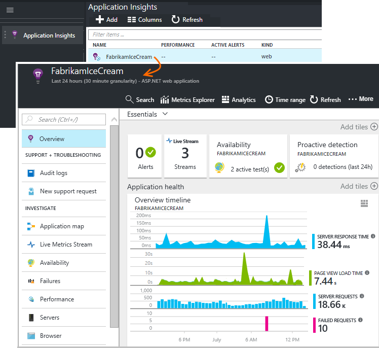
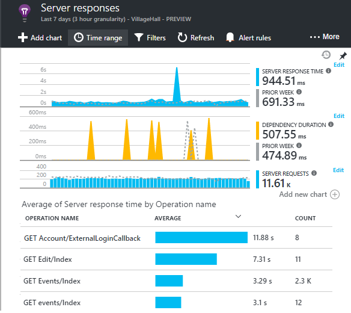
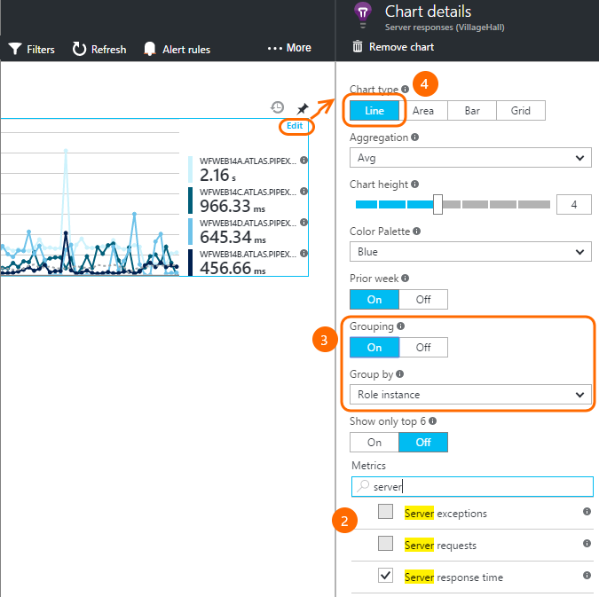
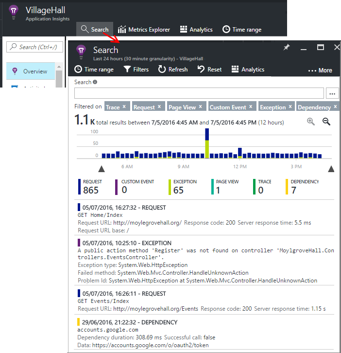
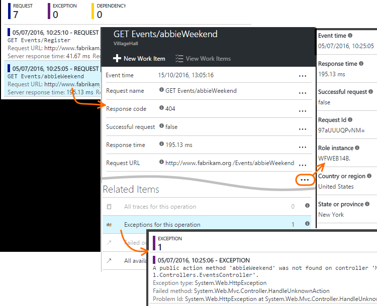
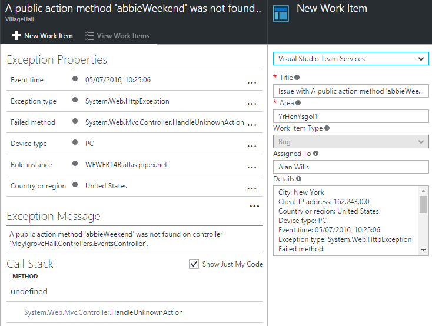
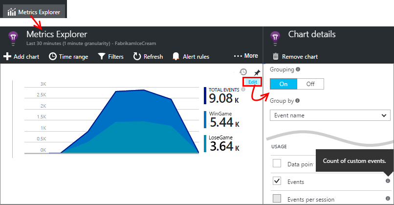
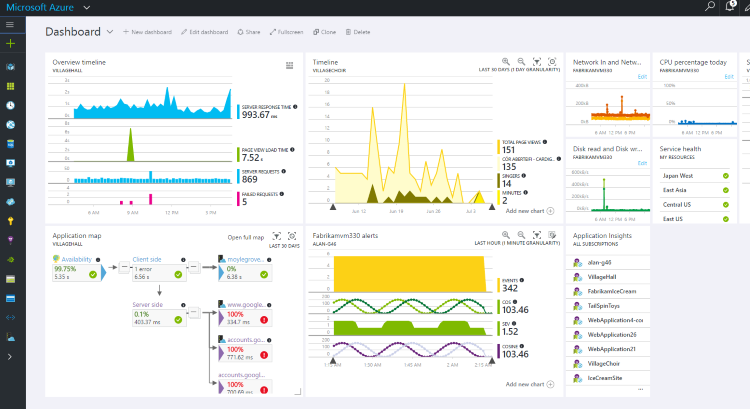
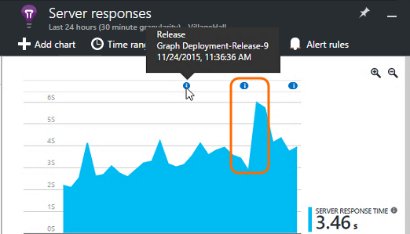
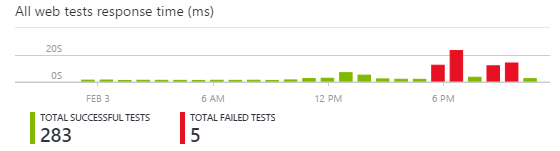

# More telemetry from Application Insights
After you have [added Application Insights to your ASP.NET code](app-insights-asp-net.md), there are a few things you can do to get even more telemetry. 

## If your app runs on your IIS server ...
If your app is hosted on IIS servers in your control, install the Application Insights Status Monitor on the servers. If it's already installed, you don't need to do anything.

1. On each IIS web server, sign in with administrator credentials.
2. Download and run the [Status Monitor installer](http://go.microsoft.com/fwlink/?LinkId=506648).
3. In the installation wizard, sign in to Microsoft Azure.

You don't need to do anything else, but you can confirm that monitoring is enabled for your app.


(You can also use Status Monitor to [enable monitoring at runtime](app-insights-monitor-performance-live-website-now.md), even if you didn't instrument your apps in Visual Studio.)

### What do you get?
If Status Monitor is installed on your server machines, you get some additional telemetry:

* Dependency telemetry (SQL calls and REST calls made by your app) for .NET 4.5 apps. (For later versions of .NET, Status Monitor is not required for dependency telemetry.) 
* Exception stack traces show more detail.
* Performance counters. In Application Insights, these counters appear in the Servers blade. 


To see more or fewer counters, [edit the charts](app-insights-metrics-explorer.md). If the performance counter you want isn't in the available set, you can [add it to the set collected by the performance counter module](app-insights-performance-counters.md).

## If it's an Azure web app ...
If your app runs as an Azure web app, go to the Azure control panel for the app or VM, and open the Application Insights blade. 

### What do you get?
* Exception stack traces show more detail.
* Dependency telemetry (SQL calls and REST calls made by your app) for .NET 4.5 apps. (For later versions of .NET, the extension is not required for dependency telemetry.) 


(You can also use this method to [enable performance monitoring at runtime](app-insights-monitor-performance-live-website-now.md), even if you didn't instrument your app in Visual Studio.)

## Client-side monitoring
You've installed the SDK that sends telemetry data from the server (back end) of your application. Now you can add client-side monitoring. This provides you with data on users, sessions, page views, and any exceptions or crashes that occur in the browser. You'll also be able to write your own code to track how your users work with your app, right down to the detailed level of clicks and keystrokes.

Add the Application Insights JavaScript snippet to each web page, to get telemetry from client browsers.

1. In Azure, open the Application Insights resource for your app.
2. Open Getting Started, Monitor and diagnose client side application, and copy the snippet.
3. Paste it so that it appears in the head of each web page - typically you can do this by pasting into the master layout page.


Notice that the code contains the instrumentation key that identifies your application resource.

### What do you get?
* You can write JavaScript to send [custom telemetry from your web pages](app-insights-api-custom-events-metrics.md), for example to track button clicks.
* In [Analytics](app-insights-analytics.md), data in `pageViews` and AJAX data in `dependencies`. 
* [Client performance and usage data](app-insights-javascript.md) in the Browsers blade.


[Learn more about web page tracking.](app-insights-web-track-usage.md)

## Track Application version
Make sure `buildinfo.config` is generated by your MSBuild process. In your .csproj file, add:  

```XML

    <PropertyGroup>
      <GenerateBuildInfoConfigFile>true</GenerateBuildInfoConfigFile>    <IncludeServerNameInBuildInfo>true</IncludeServerNameInBuildInfo>
    </PropertyGroup> 
```

When it has the build info, the Application Insights web module automatically adds **Application version** as a property to every item of telemetry. That allows you to filter by version when performing [diagnostic searches](app-insights-diagnostic-search.md) or when [exploring metrics](app-insights-metrics-explorer.md). 

However, notice that the build version number is generated only by MS Build, not by the developer build in Visual Studio.

## Availability web tests
Send your web app HTTP requests at regular intervals from around the world. We alert you if the response is slow or unreliable.

In the Application Insights resource for your app, click the Availability tile to add, edit, and view web tests.

You can add multiple tests running at multiple locations.


[Learn more](app-insights-monitor-web-app-availability.md)

## Custom telemetry and logging
The Application Insights packages that you added to your code provide an API that you can call from your application.

* [Generate your own events and metrics](app-insights-api-custom-events-metrics.md), for example to count business events or monitor performance.
* [Capture log traces](app-insights-asp-net-trace-logs.md) from Log4Net, NLog, or System.Diagnostics.Trace.
* [Filter, modify, or augment](app-insights-api-filtering-sampling.md) the standard telemetry sent from your app by writing Telemetry Processors. 

## Powerful analysis and presentation
There are plenty of ways to explore your data. If you've recently started with Application Insights, check out these articles:

|  |  |
| --- | --- |
| [**Diagnostic search for instance data**](app-insights-visual-studio.md)<br/>Search and filter events such as requests, exceptions, dependency calls, log traces, and page views. In Visual Studio, go to code from stack traces. | |
| [**Metrics Explorer for aggregated data**](app-insights-metrics-explorer.md)<br/>Explore, filter, and segment aggregated data such as rates of requests, failures, and exceptions; response times, page load times. | |
| [**Dashboards**](app-insights-dashboards.md#dashboards)<br/>Mash up data from multiple resources and share with others. Great for multi-component applications, and for continuous display in the team room. | |
| [**Live Metrics Stream**](app-insights-live-stream.md)<br/>When you deploy a new build, watch these near-real-time performance indicators to make sure everything works as expected. | |
| [**Analytics**](app-insights-analytics.md)<br/>Answer tough questions about your app's performance and usage by using this powerful query language. | |
| [**Automatic and manual alerts**](app-insights-alerts.md)<br/>Automatic alerts adapt to your app's normal patterns of telemetry and trigger when there's something outside the usual pattern. You can also set alerts on particular levels of custom or standard metrics. | |

## Data management
|  |  |
| --- | --- |
| [**Continuous Export**](app-insights-export-telemetry.md)<br/>Copy all your telemetry into storage so that you can analyze it your own way. | |
| [**Data access API**](https://dev.applicationinsights.io/) | |
| [**Sampling**](app-insights-sampling.md)<br/>Reduces the data rate and helps you stay within the limit of your pricing tier. | |


<!-- --------- -->

## Explore Metrics
Run your app - either in debug mode on your development machine, or by deploying it to a server - and use it for a while. Then sign in to the [Azure portal](https://portal.azure.com).

Navigate to your app's Application Insights overview blade:



The overview allows you to see immediately how your app is performing. You can compare load (in terms of rate of requests) with the time your app too to respond to the requests. If there's a disproportionate rise in response time when the load goes up, you might want to allocate more resources to your app. If it shows more failed responses right after you deployed a new build, then you might want to roll back.

#### Get more detail
Click through any chart to get a more detailed set of charts. For example, the Server Response Time chart leads to charts that show request rates, response times, and response times of dependencies (that is, services that your app calls).  



The dependencies chart is useful because it helps you see whether the databases and REST APIs that your app uses are responding well, or are causing delays.

#### Customize a chart
Try editing one of these charts. For example, if your web app runs on a collection of server instances, you can compare response times on the different server instances:



1. Hover over the chart and click Edit.
2. Choose a metric. Multiple metrics can be displayed on one chart, but only in certain combinations: you might have to deselect one metric before you select the one you want.
3. Use Group-By to segment a metric by a property. In this example, we display separate lines for different response times.

    Note that you have to select a valid property for the metric, or the chart will not show any data.
4. Select a chart type. Area and bar charts show a stacked display suitable when the aggregation type is 'Sum'.

[More about exploring metrics](app-insights-metrics-explorer.md).

## Search instance data
To investigate a problem, it's useful to inspect specific event instances.

Click through a metric chart to search through instance data with relevant filters and time range. For example, click through server request counts to see individual request reports.

Or you can get directly to instance data from Search on the overview page:



Use Filters to focus on particular types of event and on chosen property values:


Click "..." to see a full list of properties, or open other events associated with the same request. In this example, the failed request has an associated exception report:



Open an event - in this example, the related exception - and you can create a work item (if you use Visual Studio Team Services to track tasks).



## Analytics
[Analytics](app-insights-analytics.md) is an even more powerful search and analysis feature, in which you can write SQL-like queries over your telemetry data, either to look for specific issues or to compile statistical information.


Open the tutorial window to see and run examples of queries over your data, or read the longer [tutorial walkthrough](app-insights-analytics-tour.md). Intellisense prompts you with the queries that you can use, and there's a [full language reference](app-insights-analytics-reference.md).

Queries usually begin with the name of a telemetry stream such as requests, exceptions, or dependencies. Pop open the schema bar at the left to see a list of the available telemetry streams. The query is a pipeline of [query operations](app-insights-analytics-reference.md#queries-and-operators) such as `where` - a boolean filter - or `project` - which computes new properties. `summarize` aggregates instances, grouping them by functions you define, and then applying aggregation functions over the grouped data.

Results can be [rendered in tables or various types of chart](app-insights-analytics-tour.md#charting-the-results).

## Custom telemetry
The built-in telemetry that you get just by installing Application Insights lets you analyze counts, success rates, and response times both for web requests to your app, and dependencies - that is, calls from your app to SQL, REST APIs. You also get exception traces, and (with Status Monitor on your server) system performance  counters. If you add the client snippet to your web pages, you get page view counts and load times, client exceptions, and AJAX call success and response rates.

Analyzing all this telemetry can tell you a lot about your app's performance and usage. But sometimes that isn't enough. You might want to monitor the length of a queue so that you can tune performance; or count sales and segment them by location; or, on the client side, find out how often users click a particular button so that you can tune the user experience.

The [Application Insights API](app-insights-api-custom-events-metrics.md) provides calls `TrackEvent(name)` and `TrackMetric(name, value)` so that you can send your own custom events and metrics. There are equivalent calls for the client side.

For example, if your web page is a single-page game app, you might insert a lines in the appropriate places to log when the user wins or loses a game:

    appInsights.trackEvent("WinGame");
    ...
    appInsights.trackEvent("LoseGame");

Then we can chart custom event counts, segmenting them by event name:



### Log traces
For diagnostic purposes, there's a custom event `TrackTrace(message)` that you can use for execution traces. In the Search and Analytics features, you can search on the contents of the message, which can be longer than an event name.

If you already use a logging framework such as Log4Net, NLog, Log4J, or System.Diagnostic.Trace, then those trace calls can be captured by Application Insights, and will appear alongside the other telemetry. The Visual Studio tools automatically add the appropriate SDK module.

## Profiling your live site

No idea where the time goes? The Application Insights profiler will trace HTTP calls to your live site and show you which functions in your code took the longest time. The profiler is currently in limited preview - you can [sign up to try it](https://aka.ms/AIProfilerPreview).

## Dashboards
Many applications consist of several components such as a web service and one or more back end processors. Each component will be monitored by a separate Application Insights resource. If your system runs on Azure, you might be using - and monitoring - services such as event hubs and machine learning as well.

To monitor your whole system, you can select the most interesting charts from different apps and pin them to an Azure [dashboard](app-insights-dashboards.md), allowing you to keep an eye on the whole system continuously.



In fact, you can create multiple dashboards - for example, a team room dashboard for monitoring general system health; a design dashboard that focuses on the usage of different features; a separate dashboard for components under test; and so on.  

Dashboards, like resources, can be shared between team members.

## Development in Visual Studio
If you're using Visual Studio to develop your app, you'll find several Application Insights tools built in.

### Diagnostic search
The Search window shows events that have been logged. (If you signed in to Azure when you set up Application Insights, you'll be able to search the same events in the portal.)


The free text search works on any fields in the events. For example, search for part of the URL of a page; or the value of a property such as client city; or specific words in a trace log.

Click any event to see its detailed properties.

You can also open the Related Items tab to help diagnose failed requests or exceptions.


### Diagnostics hub
The Diagnostics Hub (in Visual Studio 2015 or later) shows the Application Insights server telemetry as it's generated. This works even if you opted only to install the SDK, without connecting it to a resource in the Azure portal.


### Exceptions
If you have [set up exception monitoring](app-insights-asp-net-exceptions.md), exception reports will show in the Search window.

Click an exception to get a stack trace. If the code of the app is open in Visual Studio, you can click through from the stack trace to the relevant line of the code.


In addition, in the Code Lens line above each method, you'll see a count of the exceptions logged by Application Insights in the past 24h.


### Local monitoring
(From Visual Studio 2015 Update 2) If you haven't configured the SDK to send telemetry to the Application Insights portal (so that there is no instrumentation key in ApplicationInsights.config) then the diagnostics window will display telemetry from your latest debugging session.

This is desirable if you have already published a previous version of your app. You don't want the telemetry from your debugging sessions to be mixed up with the telemetry on the Application Insights portal from the published app.

It's also useful if you have some [custom telemetry](app-insights-api-custom-events-metrics.md) that you want to debug before sending telemetry to the portal.

* *At first, I fully configured Application Insights to send telemetry to the portal. But now I'd like to see the telemetry only in Visual Studio.*

  * In the Search window's Settings, there's an option to search local diagnostics even if your app sends telemetry to the portal.
  * To stop telemetry being sent to the portal, comment out the line `<instrumentationkey>...` from ApplicationInsights.config. When you're ready to send telemetry to the portal again, uncomment it.

### Trends
Trends is a tool in Visual Studio for visualizing how your app behaves over time.

Choose **Explore Telemetry Trends** from the Application Insights toolbar button or Application Insights Search window. Choose one of five common queries to get started. You can analyze different datasets based on telemetry types, time ranges, and other properties.

To find anomalies in your data, choose one of the anomaly options under the "View Type" dropdown. The filtering options at the bottom of the window make it easy to hone in on specific subsets of your telemetry.


## Releasing a new build
### Live Metrics Stream
Live Metrics Stream shows you your application metrics right at this very moment, with a near real time latency of 1 second. This is extremely useful when you’re releasing a new build and want to make sure that everything is working as expected, or investigating an incident in real time.


Unlike Metrics Explorer, Live Metrics Stream displays a fixed set of metrics. The data persists only for as long as it's on the chart, and is then discarded.

### Annotations
[Release annotations](app-insights-annotations.md) on metrics charts show where you deployed a new build. They make it easy to see whether your changes had any effect on your application's performance. They can be automatically created by the [Visual Studio Team Services build system](https://www.visualstudio.com/en-us/get-started/build/build-your-app-vs) and by web deployments from Visual Studio. You can also [create them from PowerShell](#create-annotations-from-powershell).



Release annotations are a feature of the cloud-based build and release service of Visual Studio Team Services.


## Alerts
If something goes wrong with your app, you'll want to know about it immediately.

Application Insights offers three types of alert, which are delivered by email.

### Proactive diagnostics
[Proactive diagnostics](app-insights-proactive-failure-diagnostics.md) is automatically set up - you don't have to configure it. Provided your site has enough traffic, you'll get an email if there's a rise in failed requests that is unusual for the time of day or request rate. The alert contains diagnostic information.

Here's a sample alert.


A second type of proactive detection discovers correlations between failures and factors such as location, client OS, or browser type.

### Metric alerts
You can configure [metric alerts](app-insights-alerts.md) to tell you when any metric crosses a threshold value for some period - such as failure counts, memory, or page views.


### Availability
[Availability web tests](app-insights-monitor-web-app-availability.md) send requests to your site from our servers at various locations around the world. They tell you when your site is unavailable on the internet, or responding slowly.



## Export and API
There are several ways you can get your telemetry data out of the Application Insights portal:

* The [Data Access REST API](https://dev.applicationinsights.io/) can be used to search for and extract data, including running Analytics queries. 
* Export [Analytics queries to Power BI](app-insights-export-power-bi.md) dashboards and view the results in Power BI visualizations, which can be automatically refreshed.
* [Continuous Export](app-insights-export-telemetry.md) is ideal if you want to keep large parts of your telemetry for longer than the standard retention period.
* [Metrics](app-insights-metrics-explorer.md#export-to-excel)  tables, search results, and [Analytics](app-insights-analytics.md) results can all be exported to an Excel spreadsheet.


## Data management
There are limits on your usage of Application Insights, which depend to some extent on the pricing scheme that you choose. The main limits are on:

* Telemetry rate per minute
* Data point count per month
* Retention period for data

[Sampling](app-insights-sampling.md) is a mechanism for reducing cost and avoiding throttling. It discards a proportion of your telemetry, keeping a representative sample. Associated items (such as exceptions and the requests that caused them) are either retained or discarded together. For ASP.NET applications, sampling is automatic and is applied in the app; otherwise, you can set it to be applied on ingestion to the portal.