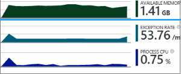

<properties 
	pageTitle="Get more out of Application Insights" 
	description="After getting started with Application Insights, here's a summary of the features you can explore." 
	services="application-insights" 
    documentationCenter=".net"
	authors="alancameronwills" 
	manager="douge"/>

<tags 
	ms.service="application-insights" 
	ms.workload="tbd" 
	ms.tgt_pltfrm="ibiza" 
	ms.devlang="na" 
	ms.topic="article" 
	ms.date="06/02/2016" 
	ms.author="awills"/>

# More telemetry from Application Insights

Here's a summary of features that you might not have tried in [Visual Studio Application Insights](app-insights-overview.md). We'll assume you already [got started](app-insights-asp-net.md). Application Insights lets you monitor your web application for availability, performance and usage. With the feedback you get about the performance and effectiveness of your app in the wild, you can make informed choices about the direction of the design in each development lifecycle.

## More telemetry

||
|---|---
|[**Availability tests**](app-insights-monitor-web-app-availability.md) Send your web app HTTP requests at regular intervals from around the world. We'll alert you if the response is slow or unreliable.| 
|[**Dependency calls**](app-insights-asp-net-dependencies.md) Monitor SQL queries, and calls to REST or other resources.|
|[**Exceptions**](app-insights-asp-net-exceptions.md) Count handled and unhandled exceptions, get stack traces, and click through to the code.|
|[**Web pages**](app-insights-javascript.md) Monitor page usage, performance and AJAX calls by instrumenting your web pages.
|**Host performance: [Azure diagnostics](app-insights-azure-diagnostics.md), [Windows performance counters](app-insights-web-monitor-performance.md)** See the CPU usage and other context metrics.  |
|[**SDK API - custom telemetry**](app-insights-api-custom-events-metrics.md) Send your own events and metrics for a more detailed view of your app's performance and usage, both in the server and client code.|
|[**Log integration**](app-insights-asp-net-trace-logs.md) If you use a logging framework such as Log4Net, NLog, or System.Diagnostics.Trace, there's an adapter that sends the traces to Application Insights along with other telemetry.|
|[**TelemetryProcessors**](app-insights-api-filtering-sampling.md) Filter, modify or augment the telemetry sent from the SDK in your app. |

## Powerful analysis and presentation

||
|---|---
|[**Diagnostic search for instance data**](app-insights-visual-studio.md) Search and filter events such as requests, exceptions, dependency calls, log traces and page views. In Visual Studio, go to code from stack traces.|
|[**Metrics Explorer for aggregated data**](app-insights-metrics-explorer.md) Explore, filter and segment aggregated data such as rates of requests, failures, and exceptions; response times, page load times.|
|[**Dashboards**](app-insights-dashboards.md#dashboards) Mashup data from multiple resources and share with others. Great for multi-component applications, and for continuous display in the team room.  |
|[**Live Metrics Stream**](app-insights-metrics-explorer.md#live-metrics-stream) When you deploy a new build, watch these near-real-time performance indicators to make sure everything works as expected.|
|[**Analytics**](app-insights-analytics.md) Answer tough questions about your app's performance and usage by using this powerful query language.|
|[**Automatic and manual alerts**](app-insights-alerts.md) Automatic alerts adapt to your app's normal patterns of telemetry and trigger when there's something outside the usual pattern. You can also set alerts on particular levels of custom or standard metrics.|

## Data management

|||
|---|---|
|[**Continuous Export**](app-insights-export-telemetry.md) Copy all your telemetry into storage so that you can analyze it your own way.|
|**Data access API** Coming soon.|
|[**Sampling**](app-insights-sampling.md) Reduces the data rate and helps you stay within the limit of your pricing tier.|