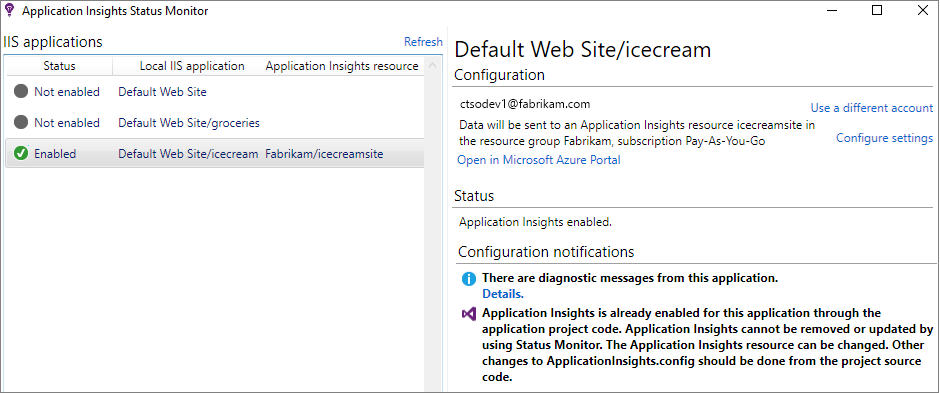
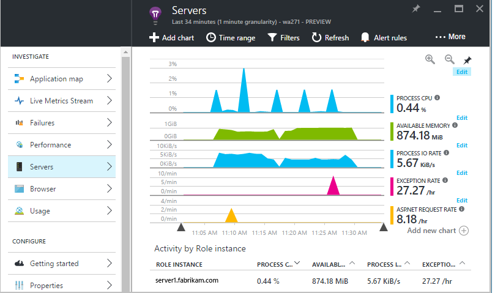
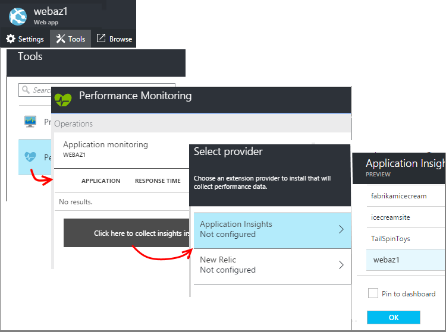
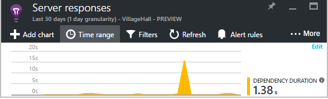
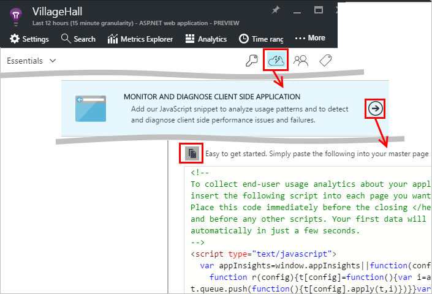
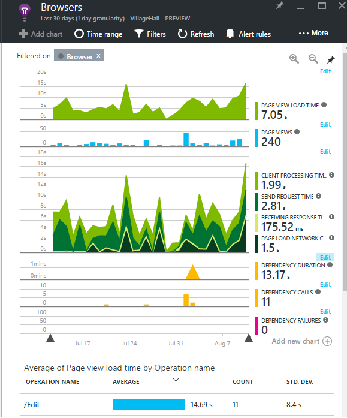
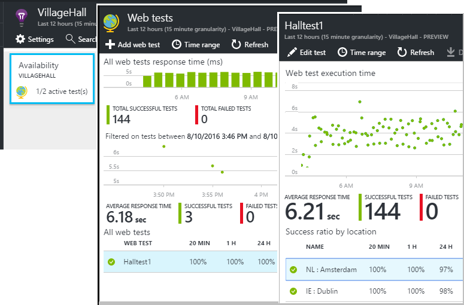
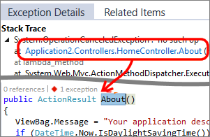
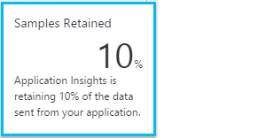

<properties 
	pageTitle="Get more out of Application Insights" 
	description="After getting started with Application Insights, here's a summary of the features you can explore." 
	services="application-insights" 
    documentationCenter=".net"
	authors="alancameronwills" 
	manager="douge"/>

<tags 
	ms.service="application-insights" 
	ms.workload="tbd" 
	ms.tgt_pltfrm="ibiza" 
	ms.devlang="na" 
	ms.topic="article" 
	ms.date="08/10/2016" 
	ms.author="awills"/>

# More telemetry from Application Insights

After you have already [added Application Insights to your ASP.NET code](app-insights-asp-net.md), there are a few more things you can do to get even more telemetry about the availability, performance and usage of your app. 

## If your app runs on your IIS server ...

If your app is hosted on IIS servers in your control, install the Application Insights Status Monitor on the servers. If it's already installed, you don't need to do anything.

1. On each IIS web server, sign in with administrator credentials.
2. Download and run the [Status Monitor installer](http://go.microsoft.com/fwlink/?LinkId=506648).
3. In the installation wizard, sign in to Microsoft Azure.

You don't need to do anything else, but you can confirm that monitoring is enabled for your app.

(You can also use Status Monitor to [enable monitoring at runtime](app-insights-monitor-performance-live-website-now.md), even if you didn't instrument your apps in Visual Studio.)

### What do you get?

If Status Monitor is installed on your server machines, you get some additional telemetry:

* Dependency telemetry  (SQL calls and REST calls made by your app) for .NET 4.5 apps. (For later versions of .NET, Status Monitor is not required for dependency telemetry.) 
* Exception stack traces show more detail.
* Performance counters. In Application Insights, you'll see these in the Servers blade.

## If it's an Azure web app ...

If your app runs as an Azure web app, go to the Azure control panel for the app or VM, and add the Application Insights extension. In **Tools**, open **Performance monitoring** and configure **Application Insights**. When prompted, choose the Application Insights resource you already created.

### What do you get?

* Exception stack traces show more detail.
* Dependency telemetry (SQL calls and REST calls made by your app) for .NET 4.5 apps. (For later versions of .NET, the extension is not required for dependency telemetry.) 

(You can also use this method to [enable performance monitoring at runtime](app-insights-monitor-performance-live-website-now.md), even if you didn't instrument your app in Visual Studio.)

## Browser performance

Add the Application Insights JavaScript snippet to your web pages, to get telemetry from client browsers.

1. In Azure, open the Application Insights resource for your app.
2. Open Quick Start, Monitor Client Side, and copy the snippet.
3. Paste it so that it appears in the head of each web page - typically you can do this by pasting into the master layout page.

### What do you get?

* You can write JavaScript to send [custom telemetry from your web pages](app-insights-api-custom-events-metrics.md), for example to track button clicks.
* In [Analytics](app-insights-analytics.md), data in `pageViews` and AJAX data in `dependencies`. 
* [Client performance and usage data](app-insights-javascript.md) in the Browsers blade.

## Availability web tests

Send your web app HTTP requests at regular intervals from around the world. We'll alert you if the response is slow or unreliable.

In the Application Insights resource for your app, click the Availability tile to add, edit and view web tests.

You can add multiple tests running at multiple locations.

[Learn more](app-insights-availability.md)

## Custom telemetry and logging

The Application Insights packages that you added to your code provide an API that you can call from your application.

* [Generate your own events and metrics](app-insights-api-custom-events-metrics.md), for example to count business events or monitor performance.
* [Capture log traces](app-insights-asp-net-trace-logs.md) from Log4Net, NLog, or System.Diagnostics.Trace.
* [Filter, modify or augment](app-insights-api-filtering-sampling.md) the standard telemetry sent from your app by writing Telemetry Processors. 

## Powerful analysis and presentation

There are plenty of ways to explore your data. If you've recently started with Application Insights, check out these:

||
|---|---
|[**Diagnostic search for instance data**](app-insights-visual-studio.md) Search and filter events such as requests, exceptions, dependency calls, log traces and page views. In Visual Studio, go to code from stack traces.|
|[**Metrics Explorer for aggregated data**](app-insights-metrics-explorer.md) Explore, filter and segment aggregated data such as rates of requests, failures, and exceptions; response times, page load times.|
|[**Dashboards**](app-insights-dashboards.md#dashboards) Mashup data from multiple resources and share with others. Great for multi-component applications, and for continuous display in the team room.  |
|[**Live Metrics Stream**](app-insights-metrics-explorer.md#live-metrics-stream) When you deploy a new build, watch these near-real-time performance indicators to make sure everything works as expected.|
|[**Analytics**](app-insights-analytics.md) Answer tough questions about your app's performance and usage by using this powerful query language.|
|[**Automatic and manual alerts**](app-insights-alerts.md) Automatic alerts adapt to your app's normal patterns of telemetry and trigger when there's something outside the usual pattern. You can also set alerts on particular levels of custom or standard metrics.|

## Data management

|||
|---|---|
|[**Continuous Export**](app-insights-export-telemetry.md) Copy all your telemetry into storage so that you can analyze it your own way.|
|**Data access API** Coming soon.|
|[**Sampling**](app-insights-sampling.md) Reduces the data rate and helps you stay within the limit of your pricing tier.|