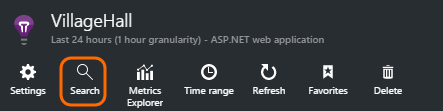
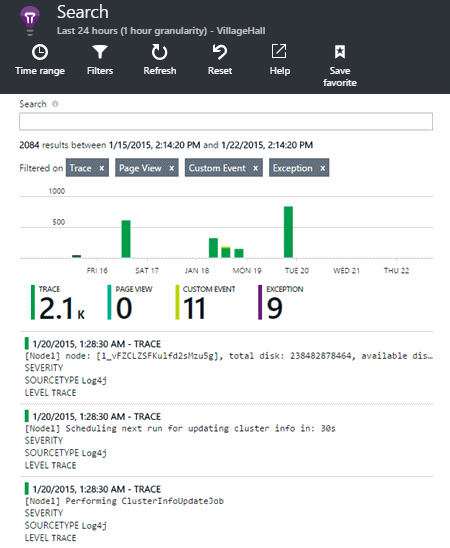

# Explore .NET trace logs in Application Insights
If you use NLog, log4Net or System.Diagnostics.Trace for diagnostic tracing in your ASP.NET application, you can have your logs sent to [Azure Application Insights][start], where you can explore and search them. Your logs will be merged with the other telemetry coming from your application, so that you can identify the traces associated with servicing each user request, and correlate them with other events and exception reports.

> [!NOTE]
> Do you need the log capture module? It's a useful adapter for 3rd-party loggers, but if you aren't already using NLog, log4Net or System.Diagnostics.Trace, consider just calling [Application Insights TrackTrace()](app-insights-api-custom-events-metrics.md#tracktrace) directly.
>
>

## Install logging on your app
Install your chosen logging framework in your project. This should result in an entry in app.config or web.config.

If you're using System.Diagnostics.Trace, you need to add an entry to web.config:

```XML

    <configuration>
     <system.diagnostics>
       <trace autoflush="false" indentsize="4">
         <listeners>
           <add name="myListener"
             type="System.Diagnostics.TextWriterTraceListener"
             initializeData="TextWriterOutput.log" />
           <remove name="Default" />
         </listeners>
       </trace>
     </system.diagnostics>
   </configuration>
```
## Configure Application Insights to collect logs
**[Add Application Insights to your project](app-insights-asp-net.md)** if you haven't done that yet. You'll see an option to include the log collector.

Or **Configure Application Insights** by right-clicking your project in Solution Explorer. Select the option to **Configure trace collection**.

*No Application Insights menu or log collector option?* Try [Troubleshooting](#troubleshooting).

## Manual installation
Use this method if your project type isn't supported by the Application Insights installer (for example a Windows desktop project).

1. If you plan to use log4Net or NLog, install it in your project.
2. In Solution Explorer, right-click your project and choose **Manage NuGet Packages**.
3. Search for "Application Insights"
4. Select the appropriate package - one of:

   * Microsoft.ApplicationInsights.TraceListener (to capture System.Diagnostics.Trace calls)
   * Microsoft.ApplicationInsights.EventSourceListener (to capture EventSource events)
   * Microsoft.ApplicationInsights.EtwListener (to capture ETW events)
   * Microsoft.ApplicationInsights.NLogTarget
   * Microsoft.ApplicationInsights.Log4NetAppender

The NuGet package installs the necessary assemblies, and also modifies web.config or app.config.

## Insert diagnostic log calls
If you use System.Diagnostics.Trace, a typical call would be:

    System.Diagnostics.Trace.TraceWarning("Slow response - database01");

If you prefer log4net or NLog:

    logger.Warn("Slow response - database01");

## Using EventSource events
You can configure [System.Diagnostics.Tracing.EventSource](https://msdn.microsoft.com/library/system.diagnostics.tracing.eventsource.aspx) events to be sent to Application Insights as traces. First, install the `Microsoft.ApplicationInsights.EventSourceListener` NuGet package. Then edit `TelemetryModules` section of the [ApplicationInsights.config](app-insights-configuration-with-applicationinsights-config.md) file.

```xml
    <Add Type="Microsoft.ApplicationInsights.EventSourceListener.EventSourceTelemetryModule, Microsoft.ApplicationInsights.EventSourceListener">
      <Sources>
        <Add Name="MyCompany" Level="Verbose" />
      </Sources>
    </Add>
```

For each source, you can set the following parameters:
 * `Name` specifies the name of the EventSource to collect.
 * `Level` specifies the logging level to collect. Can be one of `Critical`, `Error`, `Informational`, `LogAlways`, `Verbose`, `Warning`.
 * `Keywords` (Optional) specifies the integer value of keywords combinations to use.

## Using DiagnosticSource events
You can configure [System.Diagnostics.DiagnosticSource](https://github.com/dotnet/corefx/blob/master/src/System.Diagnostics.DiagnosticSource/src/DiagnosticSourceUsersGuide.md) events to be sent to Application Insights as traces. First, install the [`Microsoft.ApplicationInsights.DiagnosticSourceListener`](https://www.nuget.org/packages/Microsoft.ApplicationInsights.DiagnosticSourceListener) NuGet package. Then edit the `TelemetryModules` section of the [ApplicationInsights.config](app-insights-configuration-with-applicationinsights-config.md) file.

```xml
    <Add Type="Microsoft.ApplicationInsights.DiagnsoticSourceListener.DiagnosticSourceTelemetryModule, Microsoft.ApplicationInsights.DiagnosticSourceListener">
      <Sources>
        <Add Name="MyDiagnosticSourceName" />
      </Sources>
    </Add>
```

For each DiagnosticSource you want to trace, add an entry with the `Name` attribute  set to the name of your DiagnosticSource.

## Using ETW events
You can configure ETW events to be sent to Application Insights as traces. First, install the `Microsoft.ApplicationInsights.EtwCollector` NuGet package. Then edit `TelemetryModules` section of the [ApplicationInsights.config](app-insights-configuration-with-applicationinsights-config.md) file.

> [!NOTE] 
> ETW events can only be collected if the process hosting the SDK is running under an identity that is a member of "Performance Log Users" or Administrators.

```xml
    <Add Type="Microsoft.ApplicationInsights.EtwCollector.EtwCollectorTelemetryModule, Microsoft.ApplicationInsights.EtwCollector">
      <Sources>
        <Add ProviderName="MyCompanyEventSourceName" Level="Verbose" />
      </Sources>
    </Add>
```

For each source, you can set the following parameters:
 * `ProviderName` is the name of the ETW provider to collect.
 * `ProviderGuid` specifies the GUID of the ETW provider to collect, can be used instead of `ProviderName`.
 * `Level` sets the logging level to collect. Can be one of `Critical`, `Error`, `Informational`, `LogAlways`, `Verbose`, `Warning`.
 * `Keywords` (Optional) sets the integer value of keyword combinations to use.

## Using the Trace API directly
You can call the Application Insights trace API directly. The logging adapters use this API.

For example:

    var telemetry = new Microsoft.ApplicationInsights.TelemetryClient();
    telemetry.TrackTrace("Slow response - database01");

An advantage of TrackTrace is that you can put relatively long data in the message. For example, you could encode POST data there.

In addition, you can add a severity level to your message. And, like other telemetry, you can add property values that you can use to help filter or search for different sets of traces. For example:

    var telemetry = new Microsoft.ApplicationInsights.TelemetryClient();
    telemetry.TrackTrace("Slow database response",
                   SeverityLevel.Warning,
                   new Dictionary<string,string> { {"database", db.ID} });

This would enable you, in [Search][diagnostic], to easily filter out all the messages of a particular severity level relating to a particular database.

## Explore your logs
Run your app, either in debug mode or deploy it live.

In your app's overview blade in [the Application Insights portal][portal], choose [Search][diagnostic].





You can, for example:

* Filter on log traces, or on items with specific properties
* Inspect a specific item in detail.
* Find other telemetry relating to the same user request (that is, with the same OperationId)
* Save the configuration of this page as a Favorite

> [!NOTE]
> **Sampling.** If your application sends a lot of data and you are using the Application Insights SDK for ASP.NET version 2.0.0-beta3 or later, the adaptive sampling feature may operate and send only a percentage of your telemetry. [Learn more about sampling.](app-insights-sampling.md)
>
>

## Next steps
[Diagnose failures and exceptions in ASP.NET][exceptions]

[Learn more about Search][diagnostic].

## Troubleshooting
### How do I do this for Java?
Use the [Java log adapters](app-insights-java-trace-logs.md).

### There's no Application Insights option on the project context menu
* Check Application Insights tools is installed on this development machine. In Visual Studio menu Tools, Extensions and Updates, look for Application Insights Tools. If it isn't in the Installed tab, open the Online tab and install it.
* This might be a type of project not supported by Application Insights tools. Use [manual installation](#manual-installation).

### No log adapter option in the configuration tool
* You need to install the logging framework first.
* If you're using System.Diagnostics.Trace, make sure you [configured it in `web.config`](https://msdn.microsoft.com/library/system.diagnostics.eventlogtracelistener.aspx).
* Have you got the latest version of Application Insights? In Visual Studio **Tools** menu, choose **Extensions and Updates**, and open the **Updates** tab. If Developer Analytics tools is there, click to update it.

### <a name="emptykey"></a>I get an error "Instrumentation key cannot be empty"
Looks like you installed the logging adapter Nuget package without installing Application Insights.

In Solution Explorer, right-click `ApplicationInsights.config` and choose **Update Application Insights**. You'll get a dialog that invites you to sign in to Azure and either create an Application Insights resource, or re-use an existing one. That should fix it.

### I can see traces in diagnostic search, but not the other events
It can sometimes take a while for all the events and requests to get through the pipeline.

### <a name="limits"></a>How much data is retained?
Up to 500 events per second from each application. Events are retained for seven days.

### I'm not seeing some of the log entries that I expect
If your application sends a lot of data and you are using the Application Insights SDK for ASP.NET version 2.0.0-beta3 or later, the adaptive sampling feature may operate and send only a percentage of your telemetry. [Learn more about sampling.](app-insights-sampling.md)

## <a name="add"></a>Next steps
* [Set up availability and responsiveness tests][availability]
* [Troubleshooting][qna]

<!--Link references-->

[availability]: app-insights-monitor-web-app-availability.md
[diagnostic]: app-insights-diagnostic-search.md
[exceptions]: app-insights-asp-net-exceptions.md
[portal]: https://portal.azure.com/
[qna]: app-insights-troubleshoot-faq.md
[start]: app-insights-overview.md
