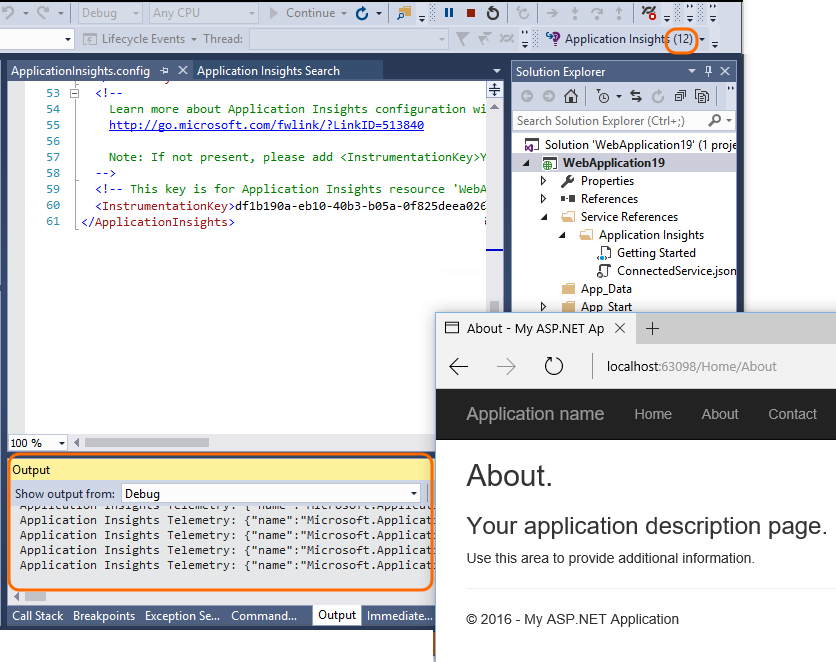

<properties 
	pageTitle="Troubleshooting no data - Application Insights for .NET" 
	description="Not seeing data in Visual Studio Application Insights? Try here." 
	services="application-insights" 
    documentationCenter=".net"
	authors="alancameronwills" 
	manager="douge"/>

<tags 
	ms.service="application-insights" 
	ms.workload="mobile" 
	ms.tgt_pltfrm="ibiza" 
	ms.devlang="na" 
	ms.topic="article" 
	ms.date="05/27/2016" 
	ms.author="awills"/>
 
# Troubleshooting no data - Application Insights for .NET

## Some of my telemetry is missing

*In Application Insights, I only see a fraction of the events that are being generated by my app.*

* If you are consistently seeing the same fraction, it's probably due to adaptive [sampling](app-insights-sampling.md). To confirm this, open Search (from the overview blade) and look at an instance of a Request or other event. At the bottom of the properties section click "..." to get full property details. If Request Count > 1, then sampling is in operation. 
* Otherwise, it's possible that you're hitting a [data rate limit](app-insights-pricing.md#limits-summary) for your pricing plan. These limits are applied per minute.

## Status Monitor problems

*I [installed Status Monitor](app-insights-monitor-performance-live-website-now.md) on my web server to monitor existing apps. I don't see any results.*

See [Troubleshooting Status Monitor](app-insights-monitor-performance-live-website-now.md#troubleshooting). Firewall ports are the most common issue.

## No 'Add Application Insights' option in Visual Studio

*When I create a new project in Visual Studio, or when I right-click an existing project in Solution Explorer, I don't see any Application Insights options.*

+ Not all types of .NET project are supported by the tools. Web and WCF projects are supported. For other project types such as desktop or service applications, you can still [add an Application Insights SDK to your project manually](app-insights-windows-desktop.md).
+ Make sure you have [Visual Studio 2013 Update 3 or later](http://go.microsoft.com/fwlink/?LinkId=397827). It comes pre-installed with Application Insights Tools.
+ Select **Tools**, **Extensions and Updates** and check that **Application Insights Tools** is installed and enabled. If so, click **Updates** to see if there's an update available.
+ Open the New Project dialog and choose ASP.NET Web application. If you see the Application Insights option there, then the tools are installed. If not, try uninstalling and then re-installing the Application Insights Tools.

## Adding Application Insights failed

*When I create a new web project, or when I try to add Application Insights to an existing project, I see an error message.*

Likely causes:

* Communication with the Application Insights portal failed; or
* There is some problem with your Azure account;
* You only have [read access to the subscription or group where you were trying to create the new resource](app-insights-resources-roles-access-control.md).

Fix:

+ Check that you provided sign-in credentials for the right Azure account. 
+ In your browser, check that you have access to the [Azure portal](https://portal.azure.com). Open Settings and see if there is any restriction.
+ [Add Application Insights to your existing project](app-insights-asp-net.md): In Solution Explorer, right click your project and choose "Add Application Insights."
+ If it still isn't working, follow the [manual procedure](app-insights-asp-net-manual.md) to add a resource in the portal and then add the SDK to your project. 

## I get an error "Instrumentation key cannot be empty"

Looks like something went wrong while you were installing Application Insights or maybe a logging adapter.

In Solution Explorer, right-click `ApplicationInsights.config` and choose **Configure Application Insights**. You'll get a dialog that invites you to sign in to Azure and either create an Application Insights resource, or re-use an existing one.

## "NuGet package(s) are missing" on my build server

*Everything builds OK when I'm debugging on my development machine, but I get a NuGet error on the build server.*

Please see [NuGet Package Restore](http://docs.nuget.org/Consume/Package-Restore)
and [Automatic Package Restore](http://docs.nuget.org/Consume/package-restore/migrating-to-automatic-package-restore).

## Missing menu command to open Application Insights from Visual Studio

*When I right-click my project Solution Explorer, I don't see any Application Insights commands, or I don't see an Open Application Insights command.*

Likely causes:

* If you created the Application Insights resource manually, or if the project is of a type that isn't supported by the Application Insights tools.
* The Application Insights tools are disabled in your Visual Studio.
* Your Visual Studio is older than 2013 Update 3.

Fix:

* Make sure your Visual Studio version is 2013 update 3 or later.
* Select **Tools**, **Extensions and Updates** and check that **Application Insights Tools** is installed and enabled. If so, click **Updates** to see if there's an update available.
* Right-click your project in Solution Explorer. If you see the command **Configure Application Insights**, use it to connect your project to the resource in the Application Insights service.

Otherwise, your project type isn't directly supported by the Application Insights tools. To see your telemetry, sign in to the [Azure portal](https://portal.azure.com), choose Application Insights on the left navigation bar, and select your application.

## 'Access denied' on opening Application Insights from Visual Studio

*The 'Open Application Insights' menu command takes me to the Azure portal, but I get an 'access denied' error.*

The Microsoft sign-in that you last used on your default browser doesn't have access to [the resource that was created when Application Insights was added to this app](app-insights-asp-net.md). There are two likely reasons: 

* You have more than one Microsoft account - maybe a work and a personal Microsoft account? The sign-in that you last used on your default browser was for a different account than the one that has access to [add Application Insights to the project](app-insights-asp-net.md). 

 * Fix: Click your name at top right of the browser window, and sign out. Then sign in with the account that has access. Then on the left navigation bar, click Application Insights and select your app.

* Someone else added Application Insights to the project, and they forgot to give you [access to the resource group](app-insights-resources-roles-access-control.md) in which it was created. 

 * Fix: If they used an organizational account, they can add you to the team; or they can grant you individual access to the resource group.

## 'Asset not found' on opening Application Insights from Visual Studio

*The 'Open Application Insights' menu command takes me to the Azure portal, but I get an 'asset not found' error.*

Likely causes:

* The Application Insights resource for your application has been deleted; or
* The instrumentation key was set or changed in ApplicationInsights.config by editing it directly, without updating the project file. 

The instrumentation key in ApplicationInsights.config controls where the telemetry is sent. A line in the project file controls which resource is opened when you use the command in Visual Studio. 

Fix:

* In Solution Explorer, right-click the project and choose Application Insights, Configure Application Insights. In the dialog, you can either choose to send telemetry to an existing resource, or create a new one. Or:
* Open the resource directly. Sign in to [the Azure portal](https://portal.azure.com), click Application Insights on the left navigation bar, and then select your app.

## Where do I find my telemetry?

*I signed in to the [Microsoft Azure portal](https://portal.azure.com), and I'm looking at the Azure home dashboard. So where do I find my Application Insights data?*

* On the left navigation bar, click Application Insights, then your app name. If you don't have any projects there, you need to [add or configure Application Insights in your web project](app-insights-asp-net.md).

    There you'll see some summary charts. You can click through them to see more detail.

* In Visual Studio, while you're debugging your app, click the Application Insights button.

##  No server data (or no data at all)

*I ran my app and then opened the Application Insights service in Microsoft Azure, but all the charts show 'Learn how to collect...' or 'Not configured.'* Or, *only Page View and user data, but no server data.*

+ Run your application in debug mode in Visual Studio (F5). Use the application so as to generate some telemetry. Check that you can see events logged in the Visual Studio output window. 

    

+ In the Application Insights portal, open [Diagnostic Search](app-insights-diagnostic-search.md). Data usually appears here first.
+ Click the Refresh button. The blade refreshes itself periodically, but you can also do it manually. The refresh interval is longer for larger time ranges.
+ Check the instrumentation keys match. On the main blade for your app in the Application Insights portal, in the **Essentials** drop-down, look at **Instrumentation key**. Then, in your project in Visual Studio, open ApplicationInsights.config and find the `<instrumentationkey>`. Check that the two keys are equal. If not:
 + In the portal, click Application Insights and look for the app resource with the right key; or
 + In Visual Studio Solution Explorer, right-click the project and choose Application Insights, Configure. Reset the app to send telemetry to the right resource.
 + If you can't find the matching keys, check that you are using the same sign-in credentials in Visual Studio as in to the portal.

    
    
+ In the [Microsoft Azure home dashboard](https://portal.azure.com), look at the Service Health map. If there are some alert indications, wait until they have returned to OK and then close and re-open your Application Insights application blade.
+ Check also [our status blog](http://blogs.msdn.com/b/applicationinsights-status/).
+ Did you write any code for the [server-side SDK](app-insights-api-custom-events-metrics.md) that might change the instrumentation key in `TelemetryClient` instances or in `TelemetryContext`? Or did you write a [filter or sampling configuration](app-insights-api-filtering-sampling.md) that might be filtering out too much?
+ If you edited ApplicationInsights.config, carefully check the configuration of [TelemetryInitializers and TelemetryProcessors](app-insights-api-filtering-sampling.md). An incorrectly-named type or parameter can cause the SDK to send no data.

## No data on Page Views, Browsers, Usage

*I see data in Server Response Time and Server Requests charts, but no data in Page View Load time, or in the Browser or Usage blades.*

The data comes from scripts in the web pages. 

+ If you added Application Insights to an existing web project, [you have to add the scripts by hand](app-insights-javascript.md).
+ Make sure Internet Explorer isn't displaying your site in Compatibility mode.
+ Use the browser's debug feature (F12 on some browsers, then choose Network) to verify that data is being sent to `dc.services.visualstudio.com`.

## No dependency or exception data

See [dependency telemetry](app-insights-asp-net-dependencies.md) and [exception telemetry](app-insights-asp-net-exceptions.md).

## No performance data

Performance data (CPU, IO rate, and so on) is available for [Java web services](app-insights-java-collectd.md), [Windows desktop apps](app-insights-windows-desktop.md), [IIS web apps and services if you install status monitor](app-insights-monitor-performance-live-website-now.md), and [Azure Cloud Services](app-insights-azure.md). you'll find it under Settings, Servers.

It isn't available for Azure websites.

## No (server) data since I published the app to my server

+ Check that you actually copied all the Microsoft. ApplicationInsights DLLs to the server, together with Microsoft.Diagnostics.Instrumentation.Extensions.Intercept.dll
+ In your firewall, you might have to open TCP ports 80 and 443 for outgoing traffic to dc.services.visualstudio.com and f5.services.visualstudio.com.
+ If you have to use a proxy to send out of your corporate network, set [defaultProxy](https://msdn.microsoft.com/library/aa903360.aspx) in Web.config
+ Windows Server 2008: Make sure you have installed the following updates: [KB2468871](https://support.microsoft.com/kb/2468871), [KB2533523](https://support.microsoft.com/kb/2533523), [KB2600217](https://support.microsoft.com/kb/2600217).

## I used to see data, but it has stopped

* Check the [status blog](http://blogs.msdn.com/b/applicationinsights-status/).
* Have you hit your monthly quota of data points? Open the Settings/Quota and Pricing to find out. If so, you can upgrade your plan, or pay for additional capacity. See the [pricing scheme](https://azure.microsoft.com/pricing/details/application-insights/).

## I don't see all the data I'm expecting

If your application sends a lot of data and you are using the Application Insights SDK for ASP.NET version 2.0.0-beta3 or later, the [adaptive sampling](app-insights-sampling.md) feature may operate and send only a percentage of your telemetry. 

You can disable it, but this is not recommended. Sampling is designed so that related telemetry is correctly transmitted, for diagnostic purposes. 

## Wrong geographical data in user telemetry

The city, region, and country dimensions are derived from IP addresses and aren't always accurate.

## Exception "method not found" on running in Azure Cloud Services

Did you build for .NET 4.6? 4.6 is not automatically supported in Azure Cloud Services roles. [Install 4.6 on each role](../cloud-services/cloud-services-dotnet-install-dotnet.md) before running your app.

## Still not working...

* [Application Insights forum](https://social.msdn.microsoft.com/Forums/vstudio/en-US/home?forum=ApplicationInsights)

