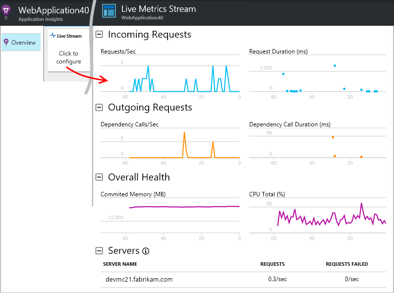
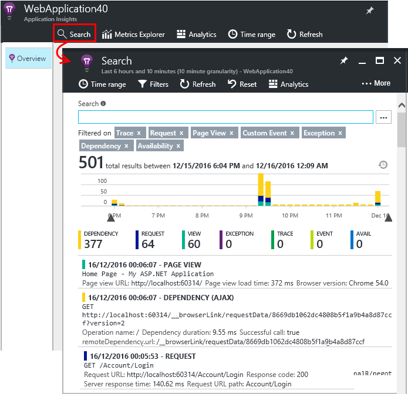
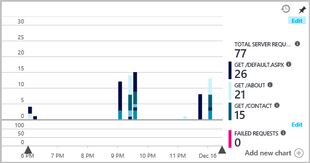

# Set up Application Insights for your ASP.NET website
[Azure Application Insights](app-insights-overview.md) monitors your live application to help you [detect and diagnose performance issues and exceptions](app-insights-detect-triage-diagnose.md). It also helps you [discover how your app is used](app-insights-overview-usage.md). It works for the Web Apps feature of Azure App Service, as well as apps that are hosted on your own on-premises IIS servers, or on cloud VMs.

## Before you start
You need:

* Visual Studio 2013 update 3 or later. Later is better.
* A subscription to [Microsoft Azure](http://azure.com). If your team or organization has an Azure subscription, the owner can add you to it, by using your [Microsoft account](http://live.com).

There are alternative topics to look at if you are interested in:

* [Instrumenting a web app at runtime](app-insights-monitor-performance-live-website-now.md)
* [Azure Cloud Services](app-insights-cloudservices.md)

## <a name="ide"></a> Step 1: Add the Application Insights SDK
If it's a new project, make sure Application Insights is selected when you create a new project in Visual Studio.


If it's an existing project, right-click the project in Solution Explorer, and choose **Add Application Insights Telemetry...** or **Configure Application Insights**.


> [!NOTE]
> If you're working with an ASP.NET Core project, [follow these instructions to fix a few lines of code](https://github.com/Microsoft/ApplicationInsights-aspnetcore/wiki/Getting-Started#add-application-insights-instrumentation-code-to-startupcs).

## <a name="run"></a> Step 2: Run your app
Run your app with F5. Open different pages to generate some telemetry.

In Visual Studio, you see a count of the events that have been logged.


## Step 3: See your telemetry in Visual Studio or Application Insights
You can see your telemetry either in Visual Studio or in the Application Insights web portal.

**In Visual Studio**, open the Application Insights window. Either click the **Application Insights** button, or right-click your project in Solution Explorer, select **Application Insights**, and then click **Search Live Telemetry**.

In the Visual Studio Application Insights Search window, see the **Data from Debug session** view for telemetry generated in the server side of your app. Experiment with the filters, and click any event to see more detail.


> [!NOTE]
> If you don't see any data, make sure the time range is correct, and click the Search icon.

[Learn more about Application Insights tools in Visual Studio](app-insights-visual-studio.md).

<a name="monitor"></a>
### The Application Insights web portal
You can also see telemetry **in the Application Insights web portal**, unless you chose to install only the SDK. The portal has more charts, analytic tools, and dashboards than Visual Studio does.

Open your Application Insights resource. Either sign in to the [Azure portal](https://portal.azure.com/) and find it there, or right-click the project in Visual Studio, and let it take you there.


> [!NOTE]
> If you receive an access error, you might have more than one set of Microsoft credentials, and you might be signed in with the wrong set. In the portal, sign out and sign in again.

The portal opens on a view of the telemetry from your app.


Click any tile or chart to see more detail.

### More details in the Application Insights web portal
Here are some examples of how the portal provides more details for you.

* [**Live Metrics Stream**](app-insights-live-stream.md) displays telemetry almost instantly.

    

    Open Live Metrics Stream at the same time as your app is running, to allow them to connect.

    Live Metrics Stream only shows telemetry for a minute after it is sent. For more historical investigations, use Search, Metrics Explorer, and Analytics. Data may take a few minutes to appear in these places.

* [**Search**](app-insights-diagnostic-search.md) shows individual events, such as requests, exceptions, and page views. You can filter by event type, term match, and property values. Click any event to see its properties and related events.

    

 * In development mode, you may see a lot of dependency (AJAX) events. These are synchronizations between the browser and the server emulator. To hide them, click the **Dependency** filter.
* [**Aggregated metrics**](app-insights-metrics-explorer.md) such as request and failure rates appear in the charts. Click any chart to open a blade with more detail. Click the **Edit** tag of any chart to set filters and size.

    

[Learn more about using Application Insights in the Azure portal](app-insights-dashboards.md).

## Step 4: Publish your app
Publish your app to your IIS server or to Azure. Watch [Live Metrics Stream](app-insights-metrics-explorer.md#live-metrics-stream) to make sure everything is running smoothly.

Your telemetry builds up in the Application Insights portal, where you can monitor metrics, search your telemetry, and set up [dashboards](app-insights-dashboards.md). You can also use the powerful [Analytics query language](app-insights-analytics.md) to analyze usage and performance, or to find specific events.

You can also continue to analyze your telemetry in [Visual Studio](app-insights-visual-studio.md), with tools such as diagnostic search and [trends](app-insights-visual-studio-trends.md).

> [!NOTE]
> If your app sends enough telemetry to approach the [throttling limits](app-insights-pricing.md#limits-summary), automatic [sampling](app-insights-sampling.md) switches on. Sampling reduces the quantity of telemetry sent from your app, while preserving correlated data for diagnostic purposes.
>
>

## <a name="land"></a> What does the Add Application Insights command do?
Application Insights sends telemetry from your app to the Application Insights portal (which is hosted in Azure).


So the command does three things:

1. Adds the Application Insights Web SDK NuGet package to your project. To see it in Visual Studio, right-click your project, and choose **Manage NuGet Packages**.
2. Creates an Application Insights resource in [the Azure portal](https://portal.azure.com/). This is where you see your data. It retrieves the *instrumentation key*, which identifies the resource.
3. Inserts the instrumentation key in `ApplicationInsights.config`, so that the SDK can send telemetry to the portal.

If you want, you can do these steps manually for [ASP.NET 4](app-insights-windows-services.md) or [ASP.NET Core](https://github.com/Microsoft/ApplicationInsights-aspnetcore/wiki/Getting-Started).

### Upgrade to future SDK versions
To upgrade to a [new release of the SDK](https://github.com/Microsoft/ApplicationInsights-dotnet-server/releases), open the **NuGet package manager** again, and filter on installed packages. Select **Microsoft.ApplicationInsights.Web**, and choose **Upgrade**.

If you made any customizations to ApplicationInsights.config, save a copy of it before you upgrade. Then, merge your changes into the new version.

## Add more telemetry
The following are other types of telemetry you can add.
### Dependencies, exceptions, and performance counters

[Install status monitor](http://go.microsoft.com/fwlink/?LinkId=506648) on each IIS server machine, to get additional telemetry about your web apps. If it is already installed, you don't need to do anything. (You might have used status monitor already, to start monitoring an app at runtime.)

By using status monitor in addition to the build-time SDK, you get a more complete set of telemetry that includes:

* [Performance counters](app-insights-performance-counters.md):
  CPU, memory, disk, and other performance counters relating to your app.
* [Exceptions](app-insights-asp-net-exceptions.md): More detailed telemetry for some exceptions.
* [Dependencies](app-insights-asp-net-dependencies.md): Including return values.

### Webpages and single-page apps
1. [Add the JavaScript snippet](app-insights-javascript.md) to your webpages to show data about page views, load times, browser exceptions, AJAX call performance, and user and session counts. These appear in the Browser and Usage blades.
2. [Code custom events](app-insights-api-custom-events-metrics.md) to count, time, or measure user actions.


### Diagnostic code
Got a problem? If you want to insert code in your app to help diagnose it, you have several options:

* [Capture log traces](app-insights-asp-net-trace-logs.md): If you're already using Log4N, NLog, or System.Diagnostics.Trace to log trace events, the output can be sent to Application Insights. You can correlate this output with requests, search through it, and analyze it.
* [Custom events and metrics](app-insights-api-custom-events-metrics.md): Use TrackEvent() and TrackMetric() in either server or webpage code.
* [Tag telemetry with additional properties](app-insights-api-filtering-sampling.md#add-properties).

Use [Search](app-insights-diagnostic-search.md) to find and correlate specific events, and [Analytics](app-insights-analytics.md) to perform more powerful queries.

## Alerts
Be the first to know if your app has problems.

* [Availability tests](app-insights-monitor-web-app-availability.md): Create tests to make sure your site is visible on the web.
* [Smart diagnostics](app-insights-proactive-diagnostics.md): These tests run automatically, so you don't have to do anything to set them up. They tell you if your app has an unusual rate of failed requests.
* [Metric alerts](app-insights-alerts.md): Set these to warn you if a metric crosses a threshold. You can set them on custom metrics that you code into your app.

By default, alert notifications are sent to the owner of the Azure subscription.


## Version and release tracking
To track the application version, make sure `buildinfo.config` is generated by your Microsoft Build Engine process. In your .csproj file, add:  

```XML

    <PropertyGroup>
      <GenerateBuildInfoConfigFile>true</GenerateBuildInfoConfigFile>    <IncludeServerNameInBuildInfo>true</IncludeServerNameInBuildInfo>
    </PropertyGroup>
```

When it has the build info, the Application Insights web module automatically adds **Application version** as a property to every item of telemetry. That allows you to filter by version when you perform [diagnostic searches](app-insights-diagnostic-search.md), or when you [explore metrics](app-insights-metrics-explorer.md).

However, notice that the build version number is generated only by the Microsoft Build Engine, not by the developer build in Visual Studio.

### Release annotations
If you use Visual Studio Team Services, you can [get an annotation marker](app-insights-annotations.md) added to your charts whenever you release a new version. The following image shows how this marker appears.


## Next steps
**[Working with Application Insights in Visual Studio](app-insights-visual-studio.md)**<br/>Includes information about debugging with telemetry, diagnostic search, and drill through to code.

**[Working with the Application Insights portal](app-insights-dashboards.md)**<br/> Includes information about dashboards, powerful diagnostic and analytic tools, alerts, a live dependency map of your application, and telemetry export.
